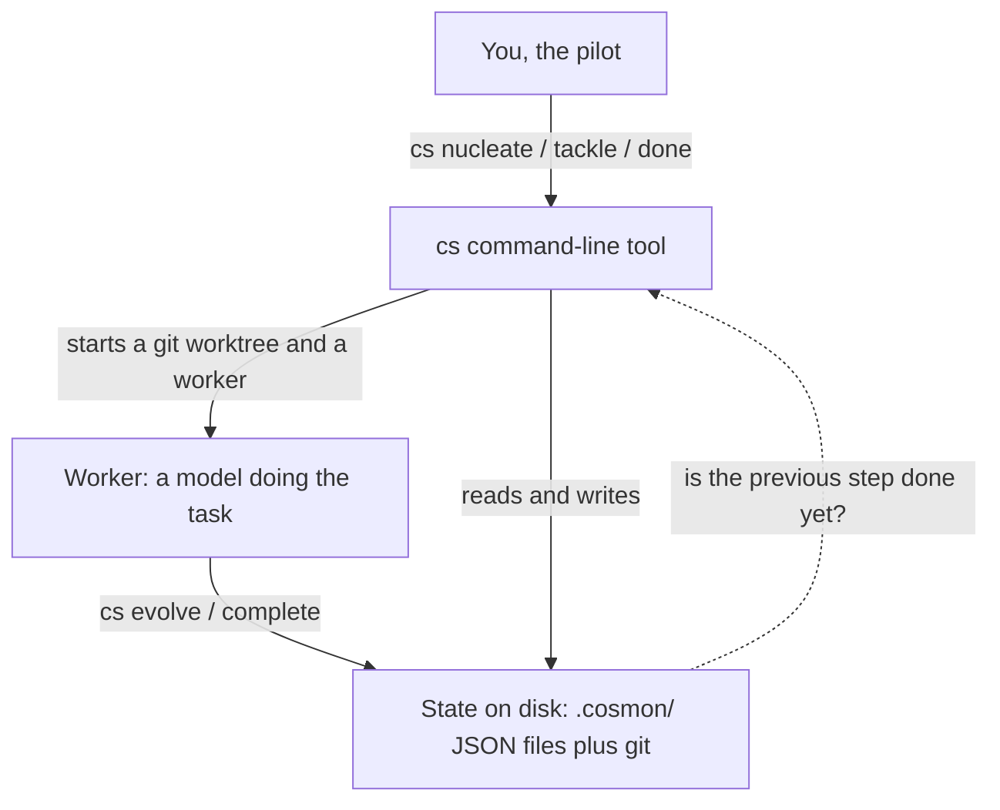

# cosmon

> **Noogram is an open, federated system for running long AI-agent missions
> inside your own perimeter — every step kept as plain files you own.** Its
> kernel, **cosmon**, is a stateless CLI that gives each agent an identity, a
> lifecycle, and crash-recovery.

[**noogram.org**](https://noogram.org) — home · [**docs.noogram.org**](https://docs.noogram.org) — documentation

Cosmon is the open-source kernel distributed with Noogram. Its command-line
tool, `cs`, runs multi-step work across several agents and models while keeping
the operational state and history in files on disk. You can also adopt cosmon
on its own to run several agents on one codebase.

## What it looks like

`cs peek` is the observation portal — a full-screen view of the fleet where
`j/k` moves between workers, `p` drops into a worker's live terminal, and
`b/l/e/s` show its briefing, log, events, and result. Its non-interactive
sibling, `cs ensemble`, prints the same state as plain text:

```text
Ensemble: 4 workers, 6 molecules (1 pending, 0 queued, 3 running)

  NAME                     ROLE             LIVE     INPUT   OUTPUT      COST   MOLECULE
  ────────────────────────────────────────────────────────────────────────────────────
  intro-writer-a3f2        implementation   idle      2.3M      30K    $10.55   task-...a3f2
  codec-section-8d2d       implementation   idle     29.2M     170K    $63.41   task-...8d2d
  citations-review-25a2    implementation   idle      7.6M      44K    $18.83   task-...25a2
  promotion-gate-e39f      implementation   unknown      -        -         -   task-...e39f
                                                     ─────────────────────────
                                        fleet total   39.1M     244K    $92.79

  Molecules: 1 pending, 0 queued, 3 running, 2 completed
```

<!-- TODO launch: replace this text capture with a recorded `cs peek` asciinema/PNG hero
     once an assets path is agreed; the capture above is real `cs ensemble` output, trimmed
     to an illustrative four-worker fleet. -->

**Crash recovery, concretely.** A worker dies, or you reboot the machine
mid-run. Its state is already on disk, so `cs tackle` puts a fresh worker back on
the same molecule and it resumes from the last recorded step — nothing re-run
from scratch, no lost thread. That is the one behaviour to keep in mind while
reading the rest.

Cosmon is one command-line tool, `cs`. Each command runs, writes to files on
disk, and exits. The local workflow has no database server or scheduler to
operate. That lets a small team — three to ten agents — add it to an existing
repository without standing up new infrastructure. By default `cs` drives a
local model over an OpenAI-compatible endpoint such as
[Ollama](https://ollama.com); it can also hand a task to Claude Code, Codex,
Aider, hosted APIs (Anthropic, OpenAI, Google Gemini, Mistral AI, Qwen,
DeepSeek, GLM, or Kimi), or local models through llama.cpp or Ollama. It is written in
Rust and installs as a single binary.

## Contents

- [Why cosmon](#why-cosmon)
- [Install](#install)
- [Prerequisites](#prerequisites-a-model-backend)
- [First contact: `cs demo`](#first-contact-cs-demo)
- [The lifecycle verbs](#the-lifecycle-verbs)
- [How it works](#how-it-works)
- [Local, remote, and federation](#local-remote-and-federation)
- [A real session](#a-real-session)
- [CLI reference](#cli-reference)
- [Vocabulary](#vocabulary)
- [Project structure](#project-structure)
- [Contributing](#contributing)
- [License](#license)

## Why cosmon

- **Runs inside your perimeter.** With the local workflow, the agents operate on
  your corpus and write their documents and full execution trace to a disk you
  control. A configured hosted model can receive context: network egress is
  *advisory-only* on macOS unless you set `COSMON_EGRESS_REQUIRE_NETNS=1`
  (enforced via a network namespace, Linux only), and the filesystem is never
  confined. Cosmon does not sandbox what an adapter can read or send.
- **Every claim points to its source — and you can refuse it.** Outputs retain
  their source links, mark unknowns, and require human sign-off before adoption:
  they are drafts to verify, not verdicts to trust. Each recorded step is
  BLAKE3-sealed on disk as a **tamper-evident** trace; `cs verify` flags silent
  edits. This catches a careless edit, not a determined forger: anyone who can
  rewrite both the files and their fingerprints can make them match again.
- **Crash-recovery by construction.** State and history live in `.cosmon/` JSON
  files and git, not in a worker process. Kill a worker, reboot the machine, or
  return later: a fresh worker resumes from the last recorded step.
- **Drives the agents and models you already run.** Claude Code, Codex, Aider;
  hosted APIs from Anthropic, OpenAI, Google Gemini, Mistral AI, Qwen, DeepSeek,
  GLM, or Kimi;
  and local models through llama.cpp or Ollama plug in through
  adapters. Cosmon also tracks input/output tokens and cost per worker while a
  fleet runs.

Cosmon is early-stage but functional: the core types, the `cs` CLI, state
persistence, tmux transport, and the DAG engine all ship today. The backlog is
tracked as [GitHub Issues](https://github.com/noogram/cosmon/issues) — and
issues filed there are read by people, not only by machines.

## Install

Cosmon ships a single binary, `cs`. On **Linux (glibc)** the build links the
Secret Service keyring backend through `libdbus`, so install the system
headers first (macOS and Windows need nothing extra):

```bash
sudo apt-get install -y libdbus-1-dev pkg-config   # Debian/Ubuntu
# Fedora: sudo dnf install dbus-devel pkgconf-pkg-config
```

The one-line install builds `cs` straight
from the repository (this command is exercised in CI by
`.github/workflows/front-door.yml`):

```bash
cargo install --git https://github.com/noogram/cosmon.git --locked cosmon-cli
# installs `cs` into ~/.cargo/bin
```

Or from a local clone, which is also the command CI uses:

```bash
git clone https://github.com/noogram/cosmon.git cosmon
cd cosmon
cargo install --path crates/cosmon-cli --locked
```

To build a release binary without installing it:

```bash
cargo build --release --locked
install target/release/cs ~/.local/bin/cs   # or anywhere on your PATH
```

To hack on cosmon itself, `cargo run --bin cs` and `cargo test --workspace` work
from the cloned tree.

## Prerequisites: a model backend

`cs` is a single Rust binary (build it with the toolchain above; MSRV **1.88**).
To dispatch a worker you also need a **model backend**, and cosmon supports two
shapes:

- **A local model — the default.** With no adapter configured, `cs tackle` drives
  the agent loop itself against a local OpenAI-compatible endpoint, for example
  [Ollama](https://ollama.com) on `localhost:11434`. Start that endpoint (run
  `ollama serve`, or set `[adapters.default]` in `.cosmon/config.toml`) **before
  the first dispatch**. If nothing is listening, the worker has nothing to talk
  to and will stall.
- **An external coding-agent CLI.** Pass `--adapter claude` (Claude Code),
  `aider`, or `codex` to run that tool in its own `tmux` session. These need the
  tool installed **and authenticated** on your `PATH`; a logged-out `claude` is
  the classic silent stall.

Both paths need **`git`**: every molecule runs in its own worktree. `cs doctor`
gives a fuller environment check.

## First contact: `cs demo`

Once `cs` is installed and a model backend is reachable, first contact is two
runnable lines:

```bash
cs init             # scaffold .cosmon/ in your repo (once)
cs demo             # needs a running model endpoint (default: local Ollama, `ollama serve`)
# ›  What are the tradeoffs between a monorepo and many small repos?
```

`cs demo` asks for a prompt, picks a formula, runs the whole
nucleate → tackle → wait → done cycle, prints the result in your terminal, then
tears down. It dispatches a **real** worker, not a canned reply — which is the
point, and also why it inherits your backend's prerequisites. With the default
local adapter it needs a reachable local model endpoint; with
`cs demo --adapter claude` it needs an authenticated Claude Code on your `PATH`
plus `tmux`. A missing tool fails fast with one actionable line; a model endpoint
that isn't listening will stall, so start it first.

Cosmon never auto-installs and **never spends on a hosted model on its own**: the
default adapter is the local `local` loop, and a paid backend runs *only* when
you explicitly opt in — `--adapter claude`/`openai`, `$COSMON_DEFAULT_ADAPTER`,
or an `[adapters.default]` in your config. See
[docs/cs-demo-design.md](docs/cs-demo-design.md) for the design.

## The lifecycle verbs

Cosmon names its commands after physics, but each verb maps to a plain action.
The full cycle is always **nucleate → tackle → wait → done**:

| Verb | What it does, in plain English |
|------|--------------------------------|
| **nucleate** | Create a unit of work (a "molecule") from a workflow template. Nothing runs yet; it just exists, pending. |
| **tackle** | Put a worker on that molecule: spin up a git worktree, a session, and the agent process, then hand it the prompt. Work starts here. |
| **evolve** | Advance the molecule one step through its workflow. A worker calls this on itself; you rarely call it by hand. |
| **wait** | Block until a molecule reaches a terminal state, so you are notified instead of polling by hand. |
| **done** | Close the loop: merge the worker's branch back to `main`, kill its session, and remove the worktree. |

The full verb table is in the [CLI reference](#cli-reference) below.

## How it works

Cosmon separates **transport** (spawning, routing, persisting, monitoring) from
**cognition** (the model). The framework never reasons; it dispatches. The agent
never manages its own lifecycle; it trusts the framework.



Read the diagram as three facts. Cosmon starts workers and moves their state
around, but the thinking is done by the model, never by the framework. The state
lives in files, not in memory, which is why a crashed worker can be picked back
up. The dotted arrow carries one thing only: whether an earlier step has
finished, so the next one can start.

### Local, remote, and federation

- **Local (default).** `cs`, the working files, `.cosmon/`, and a local model can
  all run on your machine. If you select a hosted model, the model call crosses
  the perimeter even though cosmon's state remains local.
- **Remote (available).** `cosmon-remote` is a thin client that connects over
  HTTP(S) to the `cosmon-rpp-adapter` service on another host. This mode has a
  server: the service accepts requests, runs the remote cosmon workflow, and
  returns artifacts through its API.
- **Peer-to-peer federation (roadmap).** Direct file sharing between peer cosmon
  instances without a central service is planned; it is not part of the current
  remote implementation.

## A real session

The product is the CLI, so the smallest honest example is a real `cs` session.
This is the full loop a pilot runs by hand for a single unit of work:

```bash
cs nucleate task-work --var topic="Write the intro section"   # create the molecule
cs tackle <mol-id>                                            # put a worker on it
cs wait <mol-id> &                                            # background: notified on completion
# ...once the wait returns (or `cs peek` shows the molecule completed), then:
cs done <mol-id>                                              # merge to main + tear down
```

For a fleet, one script fans several workers out in parallel. The Wikipedia
example turns a folder of PDFs into a cited, reviewed article: five agents write
in parallel, gated by one promotion step. It needs a reachable model backend
(default: local Ollama on `localhost:11434`) — see
[Prerequisites](#prerequisites-a-model-backend); the script warns you at
preflight if nothing is listening, since a missing backend otherwise stalls
silently at `cs tackle`.

```bash
scripts/quickstart-wikipedia.sh ~/work/neural-codecs \
    "Neural audio codecs" \
    ~/papers/soundstream.pdf ~/papers/encodec.pdf
cd ~/work/neural-codecs
cs wait cs-<mission-id> &   # background wait; the shell stays free
cs peek                     # watch the fleet: j/k navigates, p enters a pane
cs done cs-<mission-id>     # once peek shows completed, merge and tear down
```

`cs wait` blocks by design, which is why it is backgrounded with `&`. Do not poll
with `watch cs observe` — you burn CPU and miss transitions. And `cs peek` is a
viewer, not a teardown; you still call `cs done` to merge the branch. The
templates, roles, and gates live in
[`templates/wikipedia-production/`](templates/wikipedia-production/).

## CLI Reference

Flagship verbs only; the full surface is `cs help` (grouped) or `cs <verb>
--help`. Every row below is checked against the live clap subcommand tree by
`crates/cosmon-cli/tests/readme_cli_table.rs`, so the table cannot advertise a
verb that does not exist or drift from the binary.

| Command | Description | Physics name |
|---------|------------|-------------|
| `cs init` | Bootstrap a project-local `.cosmon/` directory | Nucleosynthesis |
| `cs nucleate` | Instantiate a Formula into a Molecule | State preparation |
| `cs tackle` | Spawn one Worker on a Molecule (worktree + session) | Pair production |
| `cs evolve` | Move a Molecule to its next step | Operator application |
| `cs complete` | Mark a Molecule done (worker-callable, idempotent) | Decay to ground state |
| `cs wait` | Block until a Molecule reaches a terminal status | Measurement at the boundary |
| `cs done` | Terminal teardown: merge + cleanup (human-callable) | Annihilation |
| `cs collapse` | Terminate a Molecule with a recorded final state | Wave-function collapse |
| `cs stuck` | Freeze a Molecule and record the blocker | Metastable trap |
| `cs run` | Walk a Molecule DAG via the resident runtime | Time evolution |
| `cs ensemble` | Show fleet state with live token usage per worker | Ensemble statistics |
| `cs peek` | Fleet observation portal (TUI) | Observation sweep |
| `cs observe` | Inspect a single Molecule's state and history | Measurement |
| `cs status` | Quick DAG overview, like `git status` | Coarse-grained state |
| `cs patrol` | Run a health-monitoring cycle over the fleet | Observation sweep |
| `cs whisper` | Inject an advisory perturbation into a live Worker | Virtual particle exchange |
| `cs prime` | Load `.cosmon/config.toml` and self-check gates | CMB injection |
| `cs demo` | One-command end-to-end first-contact surface | First light |
| `cs doctor` | Diagnostic probes (whisper channel, and more) | Spectroscopy |

## Vocabulary

Cosmon borrows its vocabulary from physics, because the intuitions transfer. The
few terms you meet early:

| Term | What it means |
|------|---------------|
| **Molecule** | One unit of tracked work: a running instance of a Formula. |
| **Formula** | A workflow template: the steps, variables, and exit criteria a molecule follows. |
| **Worker** | A running agent bound to a molecule and a session. |
| **Ensemble** | The fleet: all active workers and their aggregate statistics. |
| **Dispatch** | Assigning a molecule to a worker (`cs tackle`). |
| **Decoherence** | Context loss at a session boundary — the enemy of agent continuity. |
| **Prime** | Context compiled and injected at session start, to fight decoherence. |
| **Patrol** | A health-monitoring cycle: mechanical checks plus optional cognitive analysis. |

The full vocabulary — Polymer, Spore, Temperature, Entropy, and the rest — is
explained in [`docs/book/src/explanation/physics-vocabulary.md`](docs/book/src/explanation/physics-vocabulary.md),
the concise canonical page. [THESIS.md](THESIS.md) is an optional deep-dive with
the reasoning underneath — you do not need it to use cosmon.

<!-- TODO launch: link the vocabulary to docs.noogram.org/explanation once that site
     returns a public 200; today the canonical copy is in-repo (path above). -->

## Project structure

```
cosmon/
├── crates/
│   ├── cosmon-core/       # Pure domain types, state machines, traits (I/O-free)
│   ├── cosmon-cli/        # CLI binary `cs` (clap)
│   ├── cosmon-state/      # State store trait + fleet/molecule persistence
│   ├── cosmon-filestore/  # JSON file backend for the state store
│   ├── cosmon-transport/  # tmux transport for agent processes
│   ├── cosmon-graph/      # Topological sort, DAG operations
│   └── ...                # more crates behind the CLI; see explanation/architecture.md
├── Cargo.toml             # Workspace
├── THESIS.md              # Founding thesis (optional deep-dive; start with the book)
└── README.md
```

All dependency arrows point inward toward `cosmon-core`: pure center, adapters at
the edge (hexagonal architecture). The full crate map lives in
`docs/book/src/explanation/architecture.md`.

### Cosmon is a kernel, not a bundle

The `cs` binary is the whole product. It includes three small vendored crates,
named after particles, as internal components rather than separate installs:

| Crate | Role |
|-------|------|
| [`crates/claudion`](crates/claudion/) | Measures a Claude Code session's energy (tokens, cost, context). |
| `crates/neurion-core` | Reads a registry of your environment (services, mounts, tools). |
| `crates/topon-core` | Maps a Rust codebase's structure, surfaced as `cs topology`. |

You do not `install` or `cargo add` these as products; they ship inside `cs`.

## Contributing

The API is still moving, so expect breaking changes before 1.0. Start with
**[CONTRIBUTING.md](CONTRIBUTING.md)** (front door) and
**[docs/CONTRIBUTING.md](docs/CONTRIBUTING.md)** (full guide). In short:

1. Pick available work from the
   [GitHub Issues](https://github.com/noogram/cosmon/issues), where cosmon
   tracks its backlog — look for a "good first issue" label to start.
2. Follow the existing conventions: newtypes, typestate, pure core.
3. All four gates must pass: `cargo check`, `cargo test`,
   `cargo clippy --workspace -- -D warnings`, and `cargo fmt --all -- --check`.

For the deep design rationale, read [THESIS.md](THESIS.md) — a long essay on the
physics behind cosmon. To get started you do not need it; come to it when you want
the full reasoning.

## License

Cosmon is open-core, split across two licenses by a single question: does a piece
of code reach the cosmon core over the network, or by linking into the same
binary?

- **The kernel is AGPL-3.0.** The `cs` runtime, the agent engine, the cockpit and
  UX, and the multi-tenant server are copyleft. If you modify a networked cosmon
  service and offer it to other people, you have to offer them your source too.
  Running it internally, self-hosting, and contributing back are all fine.
- **The network SDK is Apache-2.0.** The small crates that communicate with a
  cosmon instance only over the wire are permissive: `cosmon-client`, the
  internal `cosmon-thin-cli` route/verb engine used by `cosmon-remote`, and
  `cosmon-thin-macro`. They are libraries, not alternative tenant-facing CLI
  products, and can be used in closed-source software. Vendored third-party code
  keeps its own upstream license.

The rule that decides a crate's license: it may stay Apache-2.0 only if nothing
in its dependencies is AGPL — that is, it reaches the core over the network
(HTTP or IPC), never by code-linking. A permissive crate that code-links the
AGPL core would be a contradiction and flips to AGPL.

Full text: [LICENSE](LICENSE) points to [LICENSE-AGPL](LICENSE-AGPL) and
[LICENSE-APACHE](LICENSE-APACHE); the per-crate map and rationale are in
[ADR-092](docs/adr/092-license-bascule-mpl-to-agpl.md). Contributions are
accepted under these same terms.
