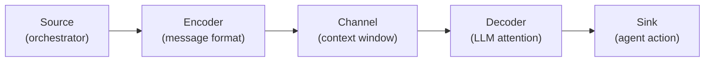
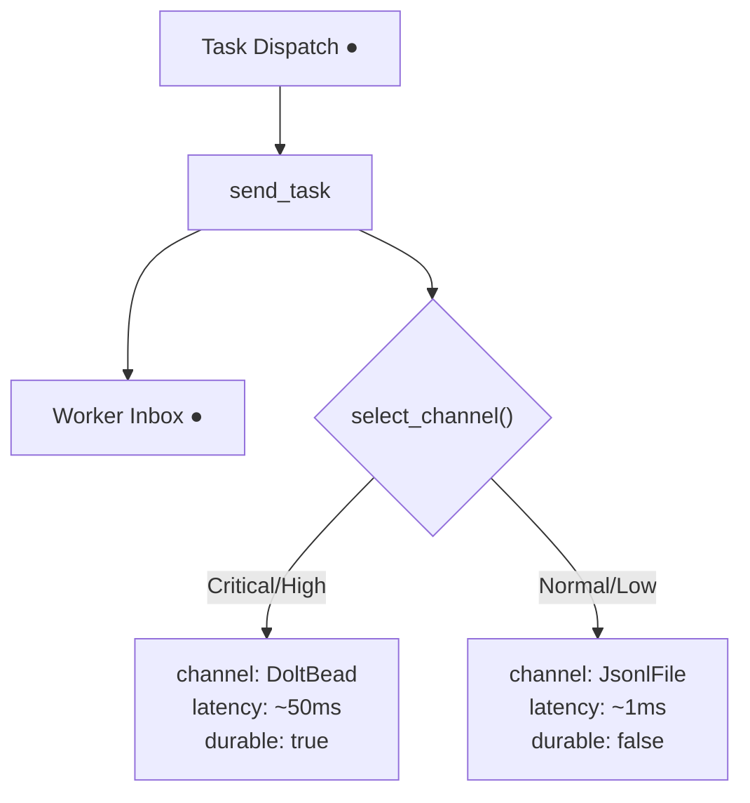

# ADR-COS-003: Multi-Channel Nervous Tissue

## Status
Superseded by ADR-015

> **Note**: ADR-015 adds the Signal Bus (SQLite WAL) as a third active channel,
> updating the routing table from 2-way (Dolt/JSONL) to 3-way
> (Dolt/SignalBus/JSONL). The Shannon analysis, Petri net model, and light
> cone reasoning in this ADR remain valid and are referenced by ADR-015.

## Context

Agent orchestration requires inter-agent communication with conflicting
requirements: heartbeats and progress signals need sub-millisecond latency
with minimal overhead, while task assignments and lifecycle commands need
crash-safe durability and full auditability. A single transport channel
forces a false choice between speed and safety.

Gas Town's operational history demonstrates the cost of this trade-off.
Dolt (versioned SQL) provides excellent durability and observability but
at ~50ms per commit — too expensive for high-frequency coordination.
JSONL append logs provide ~1ms writes but no versioning, no SQL queries,
and no cross-session visibility. Neither channel alone serves all needs.

The biological nervous system solves the same routing problem: autonomic
signals (heartbeat, respiration) flow through fast, low-overhead pathways
while conscious decisions flow through slower, higher-fidelity pathways.
The orchestrator's job is channel selection, not channel implementation.

## Decision

### Two-channel v0.1 architecture

Cosmon v0.1 implements exactly two transport channels, selected at
dispatch time by message priority:

| Priority | Channel | Rationale |
|----------|---------|-----------|
| Critical | Dolt Bead | Must survive crashes, auditable, versioned |
| High | Dolt Bead | Durable tracking, cross-session visibility |
| Normal | JSONL File | Fast append, sufficient for routine coordination |
| Low | JSONL File | Ephemeral coordination, minimal overhead |

### Core types: `MessagePriority` and `Channel`

Two enums in `cosmon-core::message` form the nervous tissue vocabulary:

```rust
#[derive(Debug, Clone, Copy, PartialEq, Eq, PartialOrd, Ord, Serialize, Deserialize)]
pub enum MessagePriority {
    Low,       // Routine, deferrable (telemetry, optional reports)
    Normal,    // Default for most inter-agent communication
    High,      // Time-sensitive, processed promptly
    Critical,  // Lifecycle-critical (heartbeats, kill commands). Never dropped.
}

#[derive(Debug, Clone, Copy, PartialEq, Eq, Serialize, Deserialize)]
pub enum Channel {
    IpcDirect,  // Unix socket/pipe — lowest latency (reserved for future use)
    JsonlFile,  // Append-only log — medium latency, crash-safe writes
    DoltBead,   // Versioned SQL — highest durability, full audit trail
}
```

`MessagePriority` derives `Ord` with variant order encoding the natural
ordering: `Low < Normal < High < Critical`. This enables `max()` on
priority collections to yield the most urgent message.

### The `select_channel` function

Channel selection is a pure function — a match statement, not a trait:

```rust
pub fn select_channel(priority: MessagePriority) -> Channel {
    match priority {
        MessagePriority::Critical | MessagePriority::High => Channel::DoltBead,
        MessagePriority::Normal | MessagePriority::Low => Channel::JsonlFile,
    }
}
```

No `ChannelSelector` trait. No configuration. Extract a trait when the
fourth channel appears and selection logic becomes non-trivial.

### Channel characteristics

| Channel | Latency | Durability | Observability | Use case |
|---------|---------|------------|---------------|----------|
| IPC Direct | ~0.1ms | None (process death = loss) | None | Future: critical-path streaming |
| JSONL File | ~1ms write | High (survives crash) | Medium (tail, grep) | Event log, heartbeats, progress |
| Dolt Bead | ~50ms | Highest (cell-level versioning) | Highest (full SQL, diff, blame) | Task tracking, audit trail |

### Shannon channel coding applied

The context window of an LLM agent is a noisy channel with finite
capacity. Shannon's 1948 framework applies directly:



- **Channel capacity** = context window size in tokens (hard limit).
- **Noise** = irrelevant context, stale info, compaction artifacts.
- **Signal** = task description, relevant history, critical constraints.

The design principle follows: **match the channel to the message entropy.**
A 1-bit heartbeat uses the cheapest channel (JSONL append). A 10,000-bit
architecture decision uses the most durable channel (Dolt bead). High-entropy
messages over ephemeral channels risk information loss. Low-entropy messages
over expensive channels waste the energy budget.

Critical instructions are repeated across multiple injection points
(CLAUDE.md, formula, hooks, nudges) — this is Shannon-optimal error
correction for a channel with high compaction-induced error rates.

### Petri net model

The message flow follows a colored Petri net where token color encodes
channel metadata:



A token entering a worker's inbox via Dolt carries
`{ channel: DoltBead, durable: true }`. A token via JSONL carries
`{ channel: JsonlFile, durable: false }`. Transition firing rules
can require specific token colors — task dispatch requires a durable
token, heartbeat checks require only an event-log token.

This is structurally isomorphic to OxyMake's data materialization:
both systems route typed artifacts between processing nodes through
heterogeneous transport, with guarantees varying by medium.

### The light cone: causality in agent networks

An agent can only react to messages it has received. Channel latency
is the speed of light in the agent network:

| Channel | Propagation delay | Light cone radius |
|---------|-------------------|-------------------|
| IPC Direct | ~0.1ms | Near-real-time |
| JSONL | ~1ms + poll interval | Stale by poll period (5–10s) |
| Dolt | ~50ms + commit overhead | Stale by seconds |

**The mayor's view of the fleet is always stale by one channel-latency.**
This is physics, not a bug. The consistency model follows directly:
eventual consistency between agents, strong consistency only within a
single agent's internal state.

### When to add channels

| Channel | Trigger for adoption |
|---------|---------------------|
| SQLite | JSONL polling becomes too slow (>1000 events/minute) |
| IPC Direct | Sub-agent coordination needs <1ms latency |
| Redis/NATS | Cross-machine fleet (probably never for v0.1) |

## Consequences

### Positive
- Messages are logical, channels are physical — no coupling between
  message semantics and transport
- Priority-based routing is a pure function, trivially testable
- Two channels cover all v0.1 operational needs without infrastructure
  complexity
- Shannon-informed design prevents both under-investing in durability
  (dropping critical signals) and over-investing in overhead (Dolt for
  heartbeats)
- Petri net model unifies reasoning about message flow with OxyMake's
  data materialization model

### Negative
- `IpcDirect` variant exists in the enum but is not yet routed to by
  `select_channel` — it occupies type space speculatively
- Two channels means some messages at the boundary (Normal priority
  that arguably deserve durability) get routed to the cheaper channel
- No dynamic channel adaptation — a consistently slow JSONL consumer
  cannot be automatically upgraded to IPC

### Risks
- Dolt latency under load may make Critical/High dispatch a bottleneck.
  Mitigation: the trait-first design (ADR-COS-001) allows swapping the
  durable backend without touching routing logic.
- JSONL polling intervals create coordination lag for Normal-priority
  messages. Mitigation: if operational data shows this matters, promote
  the message to High or add IPC as a third active channel.

## References
- THESIS.md Part XIV — The Nervous Tissue: Communication as Multi-Channel Fabric
- THESIS.md Part XI — Energy: Token Budget and Cost Accounting
- ADR-COS-001 — State Storage: JSON First (trait-first design principle)
- Shannon, C.E. (1948) — A Mathematical Theory of Communication
- `cosmon-core::message` — `MessagePriority`, `Channel`, `select_channel`
- `cosmon-transport::dispatch` — `send_task`, channel-based routing
