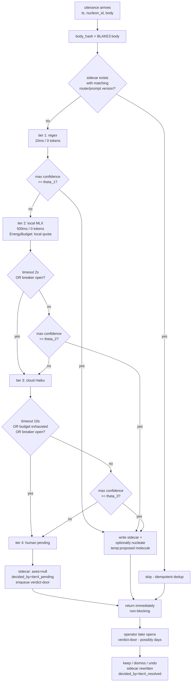

# ADR-078 — Session-route for utterances (ADR-072 lifted to input)

**Status:** Proposed (2026-04-26)
**Decider:** Noogram, on operator convergence in `delib-20260424-5819`
**Parent deliberation:** `delib-20260424-5819` (UX multiplex polymerisation — panel: jobs · jr · karpathy · wheeler · feynman)
**Authoring task:** `task-20260424-eaa3`
**Successor of:** [ADR-072](072-session-route-formula-and-sidecar-invariants.md) (output: notes → sidecar). This ADR mirrors that cascade for **input**.

**Sibling molecules (out of scope here):**
- `task-20260424-a912` — *Utterance as Event kind* (ADR-073-style, formalises the `kind: Utterance` schema atop ADR-047 — strategic, parallel)
- `task-20260424-59fd` — 11-note benchmark, threshold calibration (θ₁, θ₂, θ₃)
- Future: voice-MLX adapter implementation (referenced by §6 but specified in a follow-up task)

**Related ADRs:**
- [ADR-047](047-event-log-protocol-v0.md) — `Event` primitive (the bit Wheeler points at)
- [ADR-066](066-ux-v2-substrate.md) — wheat-paste Surface substrate (egress side)
- [ADR-068](068-ux-cli-equivalence.md) — UX ↔ CLI parity (every new verb gets a Surface counterpart)
- [ADR-072](072-session-route-formula-and-sidecar-invariants.md) — output cascade, sidecar schema, four formal invariants (I1–I4)

**Architectural invariants:** `docs/architectural-invariants.md` §8b (seal-as-trace), §8f (data-plane discipline), §8j (ingress bindings — extended here for the voice Adapter), §8k/§8k' (wheat-paste — preserved by construction), §8l/§8m (UX ↔ CLI parity).

---

## 1. Context

### 1.1 The framing was wrong

The framing document `docs/delib-prep/2026-04-24-ux-multiplex-polymerisation.md` named the problem *"UX multiplex"* and described it as five overlapping architectures (voice / Lottie particles / Xbox / cloud-vs-local cognition / human verdict). The panel converged unanimously on the opposite reading:

- **karpathy:** *"multiplex implies N parallel streams being combined; what we have is a **speculative cascade** with revisable decisions"*.
- **wheeler:** *"session-route applied to an `Event` of `kind: Utterance`. ADR-072 already answered this. Six nouns survive: Event, Utterance, Spark, Port+Adapter, Tier, Surface. Retire multiplex, fan-out, aggregator."*
- **feynman:** *"the framing recognises the cascade at hypothesis 5 and reverts to fan-out at hypothesis 1 — contradiction unresolved; session-route wins by first principle."*
- **jobs:** *"a single button-pressed event **is** an utterance — endpoints are downstream of the cascade."*
- **jr:** the Lottie particles are not a primitive, they are an egress overlay strict to a glyph already in the wheat-paste raster (§8k preservation).

The decision implied by the panel: this ADR does **not** introduce a new paradigm. It lifts ADR-072's output cascade to the input direction. **Zero new primitives.** The existing `Event` primitive (ADR-047) absorbs every signal — voice transcripts, controller button presses, Matrix whispers, text typed into a Surface. They differ only in `source`, `shape`, and `rate`.

### 1.2 The latency that motivates this ADR

The three parent sparks (`spark-20260424-6017`, `spark-20260424-3d11`, `spark-20260424-90ae`) were written **in mobility**, on a phone, without a laptop. They describe the same operational pain: the time between a thought and a `cs nucleate` is bounded below by *"reach the laptop, find a terminal, type the verb"*. Every additional second is a thought lost to flow.

The operational answer is a voice ingress port that produces an `Event { kind: Utterance, body, ts, nucleon_id }` and a cascade that decides what to do with it — without blocking on a human, without auto-promoting low-confidence guesses, and without contaminating the cosmon transactional core. ADR-072's four formal invariants (I1 body-primacy, I2 idempotent reclassification, I3 append-only, I4 carnet untouched) carry over verbatim — the cascade is the same machine, fed by a new ingress.

### 1.3 What is load-bearing in this ADR

Six nouns, used verbatim, no synonyms:

| Noun | Role | First defined in |
|------|------|------------------|
| **Event** | The append-only bit. Every input and every transformation emits one. | ADR-047 |
| **Utterance** | The event subset that carries human linguistic intent (`kind: Utterance`). | This ADR |
| **Spark** | The event subset that carries a semantic germ of a molecule (`kind: Spark`). | ADR-047 / cosmon vocabulary |
| **Port** + **Adapter** | The hexagonal boundary between cosmon and the outside. *Adapter* is the concrete impl of an *ingress* / *egress* / *duplex* port. | Hexagonal, §8j |
| **Tier** | A transformation stage in the cascade — same trait, four implementations, different `EnergyBudget` and latency. | ADR-072 §5 |
| **Surface** | The wheat-paste viewport over `cs peek --snapshot` bytes. Egress only. | ADR-066 §8k |

**Words explicitly retired** (forbidden in code, ADRs, formula names, CLI verbs, conversation conventions from this ADR onward — reviewers file beads on regression):

> *multiplex, fan-out* (except as the §5 extension point name *tie-breaker second-order*), *aggregator, canal, endpoint, shell, cognition* (as a noun in architecture — keep as literary flourish for *"tier-4 cognition biologique"*), *modèle, étage, particule* (as a primitive — surviving only as an egress rendering detail under §8k discipline).

This is the rule *"propose mechanisms of verification, do not impose them"* (`docs/architectural-invariants.md` §8b) applied to vocabulary: the rule is a trace, not a lock; reviewers honour it because they read it.

---

## 2. Decision

### 2.1 The lift in one sentence

> Lift ADR-072's `session-route` cascade from `(carnet note → sidecar)` to `(Utterance event → sidecar)`. The cascade is the same: regex → local model → cloud model → human, with `max(confidence) ≥ θᵢ` early termination and a non-blocking tier 4. The four formal invariants (I1–I4 of ADR-072) hold without change because the cascade is pure: same `(body, router_version, prompt_version)` in, same sidecar out.

### 2.2 The `CognitiveResolver` trait — one trait, four implementations

The architectural mass of this ADR sits in a single Rust trait, identical across tiers. Each tier is a *Tier* (Wheeler's verbatim noun), distinguished only by **EnergyBudget**, **expected_latency**, and **confidence_floor θᵢ**:

```rust
/// A Tier in the speculative cascade.
///
/// Each implementation reads the same `(Utterance, Context)` and returns a
/// resolution shaped identically across tiers. The cascade caller is agnostic
/// to which tier handled an utterance — it inspects only the output.
///
/// Tiers differ in three knobs:
/// - `budget()`: EnergyBudget unit (free / local quota / token cost / operator
///   attention).
/// - `expected_latency()`: order-of-magnitude wall time. Used by the cascade
///   for timeout multipliers and for surfacing in the verdict-door.
/// - `confidence_floor()`: θᵢ — escalation threshold. A tier escalates when
///   `out.max_confidence() < confidence_floor()`.
pub trait CognitiveResolver {
    /// Resolve an utterance into an axis triple + per-axis confidences.
    ///
    /// Tier 4 (HumanResolver) returns immediately with `axes = None,
    /// decided_by = "tier4_pending"` — it never blocks.
    fn resolve(&self, utterance: &Utterance, ctx: &Context) -> ResolverOutput;

    fn budget(&self) -> EnergyBudget;
    fn expected_latency(&self) -> Duration;
    fn confidence_floor(&self) -> f32;
    fn name(&self) -> &'static str; // "tier1_regex" | "tier2_local" | …
}

pub struct ResolverOutput {
    pub axes: Option<AxisTriple>,    // None only at tier4_pending
    pub confidences: AxisConfidences,
    pub decided_by: TierLabel,       // tier1 | tier2_local | tier3_cloud | tier4_pending | tier4_resolved
}
```

The four tier implementations:

| Impl | Mechanism | Tier label | Notes |
|------|-----------|------------|-------|
| `RegexResolver` | Deterministic patterns over `body` (`!spark `, `\?$`, `se renseigner`, …). | `tier1_regex` | Inherits the tier-1 ruleset from ADR-072 §5. The `!spark ` prefix is one rule among many. |
| `LocalModelResolver` | Apple Foundation Models (MLX) **or** `llama.cpp` + small local model. Backend choice is out of scope here (separate ADR — see §7). | `tier2_local` | Runs on the laptop's GPU. Battery-bounded. Stateless prompt: `(body, last 3 utterances, typology doc)`. |
| `CloudModelResolver` | `cs ask haiku` (Claude Haiku 4.5) over the same stateless prompt. | `tier3_cloud` | ~$0.001 per call. Token budget per session. |
| `HumanResolver` | Verdict-door (markdown review file + SwiftUI Surface). | `tier4_pending` → `tier4_resolved` | **Never blocks `resolve()`.** Writes pending sidecar, enqueues operator review, returns. |

Each impl lives in a new crate `cosmon-route` (proposed name; final name decided at impl time). The crate depends on `cosmon-core`; **`cosmon-core` does not depend on `cosmon-route`** — the cascade is a peripheral tier, not a transactional-core concept.

### 2.3 The cascade — a hundred-line `for` loop

Karpathy's brief gives the canonical pseudo-code (`responses/karpathy.md` §4). It is reproduced here verbatim because it is the load-bearing artifact: the cascade is **a `for` loop**, not a DAG, not a thread pool, not an actor graph. Reviewers should reject any implementation that introduces concurrency primitives in the hot path.

```rust
pub fn route(utterance: &Utterance, ctx: &Context) -> RouteOutcome {
    let body_hash = blake3(utterance.body);
    if let Some(prior) = sidecar_lookup(&body_hash, ctx.router_version, ctx.prompt_version) {
        return RouteOutcome::Skipped(prior); // I2 — idempotent dedup
    }

    let tiers: &[&dyn CognitiveResolver] = &[
        &ctx.tier1_regex,
        &ctx.tier2_local,
        &ctx.tier3_cloud,
        // tier 4 is handled specially below — not a normal iteration
    ];

    for tier in tiers {
        // Per-tier circuit breaker: failure rate > θ_break in last N calls = open.
        if ctx.breaker.is_open(tier.name()) {
            continue;
        }
        // Budget check: tier refuses if the current session has exhausted its quota.
        if !ctx.budget.has_room(tier.budget()) {
            continue;
        }

        // Bounded wait. Timeout is per-tier, not global.
        let out = match with_timeout(tier.expected_latency() * 4, tier.resolve(utterance, ctx)) {
            Ok(out) => out,
            Err(Timeout) => { ctx.breaker.record_failure(tier.name()); continue; }
            Err(ResolverError::Transient) => { ctx.breaker.record_failure(tier.name()); continue; }
        };
        ctx.budget.charge(tier.actual_cost());

        if out.max_confidence() >= tier.confidence_floor() {
            return stage_and_return(out, utterance); // writes sidecar + optional staged molecule
        }
        // else: fall through to next tier
    }

    // Tier 4: the human. Never blocks. Writes pending sidecar.
    let pending = Sidecar {
        axes: None,
        decided_by: TierLabel::Tier4Pending,
        body_hash,
        // …
    };
    write_sidecar(&pending);                  // I1 — body-primacy
    enqueue_verdict_door(utterance, &pending); // operator surfaces it later
    RouteOutcome::Pending(pending)             // returns immediately, hot path unblocked
}
```

The Mermaid control flow (also reproduced verbatim from `responses/karpathy.md`):



### 2.4 Speculative commit for tier 4

> **`HumanResolver::resolve()` MUST NOT block.**

This is the load-bearing rule of the cascade. The human is the last Tier — same trait, same shape — but its `resolve()` enqueues, persists pending state, and returns immediately. The hot path is freed in microseconds.

Concrete contract:

1. The function writes a sidecar with `axes: null, decided_by: "tier4_pending"`.
2. It pushes the utterance reference onto the verdict-door queue (a file under `.cosmon/state/sessions/.route/<sid>/_pending.jsonl` — append-only single-writer per ADR-047 §3).
3. It returns `RouteOutcome::Pending(sidecar)` to the caller.
4. Any downstream molecule that depended on this utterance's classification must tolerate **reclassification**: when the operator later resolves the verdict, the sidecar is rewritten with `decided_by: "tier4_resolved"` and `axes: <triple>`. ADR-072 invariant **I2** (idempotent pure reclassification) makes this safe — reclassification is a pure recompute, not a destructive overwrite. Downstream molecules re-read the sidecar; the system converges.

Mental model: a CPU branch predictor. The cascade speculates forward on the best-available evidence; the human commits or invalidates the speculation later. If tiers 1–3 cover ≥90% of utterances at high confidence, rollback is rare and speculative execution is a free lunch. If tiers 1–3 are degraded (circuit breaker open, network down), tier 4 carries the load and the verdict-door digestion counter (ADR-072 §7, amendment A3) surfaces the backlog so the operator sees it.

### 2.5 Extension point — fan-out as *tie-breaker second-order*

The panel converged (D2) that genuine parallel resolution is legitimate for **~5–10% of utterances** that are structurally ambiguous (confidence in a narrow band near θ, or axes that disagree — `salience: hot` but `addressee: ⊥`). For those, the next tier is invoked with the prior tier's answer attached as context — *the next tier is the aggregator* — and that is the cascade's normal escalation. No new primitive.

A second-order specialisation is named here as an **extension point of the `CognitiveResolver` trait, not implemented in v0**:

```rust
/// Optional trait extension. Not in v0. Reviewers reject any code that adds
/// this trait outside an explicit measurement-driven follow-up ADR.
pub trait CognitiveResolverWithFanout: CognitiveResolver {
    /// Invoked only when the cascade marks the utterance as
    /// `axes_disagreement` or `confidence_band_narrow`. Spawns ≤ 2 sibling
    /// resolvers in parallel and returns the first to clear the floor.
    fn resolve_with_tie_break(
        &self,
        utterance: &Utterance,
        ctx: &Context,
        peers: &[&dyn CognitiveResolver],
    ) -> ResolverOutput;
}
```

**Default fan-out is OFFLINE.** The legitimate place for parallel resolution is **threshold calibration**: running the same 11-note corpus through tiers 1, 2, and 3 in parallel, measuring disagreement, and proposing calibrated θᵢ. That is `task-20260424-59fd`'s scope — not the production hot path. Reviewers must reject any v0 PR that introduces parallel resolver invocation in `route()`.

The tie-breaker case is **named but not built**. Justification for activation must come from a measurement (e.g. a benchmark showing that ≥5% of operator-overrides cluster in a confidence band where two tiers disagree) — not from intuition. The name exists in the ADR so future readers know where the seam lives.

### 2.6 §8j ingress bindings — the voice Adapter

The voice Adapter is a **new ingress Port** under §8j discipline. The Adapter takes microphone PCM bytes through a local ASR (whisper.cpp or equivalent), produces an `Event { kind: Utterance, body: <transcript>, ts, nucleon_id, source: "voice-mlx" }`, and feeds it into the cascade.

§8j's four clauses bind verbatim. This ADR **lists** them; their concrete instantiation lives in the voice-Adapter implementation task (forthcoming child of `task-20260424-a912`).

#### §8j-voice clause (a) — Identity

The voice Adapter resolves the local microphone source to a sealed `NucleonId` via a file under `.cosmon/state/nucleons/<nucleon_id>/voice-identity.toml`. The mapping file is briefing-sealed (ADR-058 model); a hash in `state.json` detects retroactive edits. **Unmapped voice sources are dropped** — the Adapter never defaults to the operator's NucleonId, never auto-admits, never uses the device's serial as a NucleonId. *Implements §8g at the voice ingress port.*

The expected v0 mapping is one-to-one: the operator's MacBook microphone resolves to the operator's NucleonId. Multi-user voice (a guest, a co-worker) requires an explicit ratification molecule — same pattern as Matrix peer-Nucleon (`docs/architectural-invariants.md` §8j (a)).

#### §8j-voice clause (b) — Causal closure

Each transcribed utterance is materialised on disk **before** any `state.json` or `events.jsonl` write. Path: `.cosmon/state/sessions/.utterances/<sid>/<event_id>.md`. The materialised file carries the raw transcript bytes, the `nucleon_id`, the `ts`, and the `source: voice-mlx` provenance. The cascade reads it back; it never operates on the in-memory transcript directly. *Implements §8e-extended at the voice ingress port — every causal voice input is observable from `.cosmon/` before it perturbs the DAG.*

This guarantees ADR-072 invariant **I1** (body-primacy) at the voice boundary: if the cascade drops the utterance silently, the bytes still exist on disk and `cs verify --route` flags the sidecar absence.

#### §8j-voice clause (c) — Pre-admission rate limit

A per-NucleonId leaky bucket at the Adapter level rejects bursts before any cascade invocation. State persists across launchd ticks (one-shot processes re-load the bucket from disk). v0 placeholder: 60 utterances/minute per NucleonId. *Implements §8h at the voice ingress port — DoS filter at the substrate socket, not a replacement for cascade-level budget checks.*

The bucket parameter is an engineering constant, not a product knob (consistent with ADR-072 C5 — confidence numbers never surface in UI). Tuned by measurement, not by user setting.

#### §8j-voice clause (d) — One-way topology

Cosmon never speaks back into the microphone Port. Voice is **ingress-only**. A voice egress Port (text-to-speech, "cosmon répond à voix haute") is a **separate Adapter on a separate Port**, with its own §8j clauses, and is **out of scope for v0** (consistent with the panel's D3 arbitrage — endpoint specialisation is `temp:cold`).

If a future ADR proposes voice egress, the rule of `SparkedBy` attribution applies: any spoken response carries `SparkedBy: <pilot-session>`, never `SparkedBy: <prior-worker-molecule>`. This forbids the non-DAG feedback circuit that would otherwise blur Pilot and Worker — verbatim from §8j (d). *Implements §8i semantic extension at the voice egress port (when it eventually lands).*

#### Reference signature — voice Adapter admission

Inheriting the `matrix_event_to_spark` shape from `crates/cosmon-matrix-tick/src/admission.rs`, the v0 voice Adapter exposes:

```rust
/// Admission boundary: voice transcript → cosmon Utterance.
///
/// Returns `Ok(Utterance)` only if §8j-voice clauses (a)-(d) all pass.
/// Reviewers: this function is **the totality** of voice-to-cosmon trust.
pub fn voice_transcript_to_utterance(
    transcript: &Transcript,                      // ASR output, bytes + ts + source-id
    nucleon_map: &VoiceNucleonMap,                // sealed §8j-voice (a) extension table
    rate_limiter: &mut LeakyBucket,               // §8j-voice (c)
    inbox_dir: &Path,                             // §8j-voice (b) materialisation root
    // §8j-voice (d) is structural — voice egress does not exist in v0
) -> Result<Utterance, AdmissionError> {
    // (a) Identity — resolve source-id → NucleonId or reject.
    // (b) Causal closure — write inbox file BEFORE state.json mutation.
    // (c) Rate limit — debit bucket per NucleonId, reject on overflow.
    // Then, and only then, the Utterance is admitted to the cascade.
}
```

The canonical implementation lives in a new crate `cosmon-voice-tick` (proposed name, mirrors `cosmon-matrix-tick`). The cascade is downstream: `route(utterance, ctx)` is the next call site.

### 2.7 EnergyBudget and timeouts — concrete v0 numbers

The numbers below are v0 placeholders. Calibration follows `task-20260424-59fd` (the 11-note benchmark + operator blind-labelling). Reviewers may not introduce a UI knob for any of these — they are engineering constants (ADR-072 C5).

| Tier | Timeout | Cost per utterance | Session budget | Breaker trip condition |
|------|---------|---------------------|------------------|--------------------------|
| 1 `tier1_regex` | 100 ms | 0 (free) | unlimited | N/A — deterministic |
| 2 `tier2_local` | 2 s | ~0 (local GPU cycles, battery) | ~200 utterances/day default | > 20% timeout rate in last 20 calls |
| 3 `tier3_cloud` | 10 s | ~$0.001 / ~500 tokens | `EnergyBudget: 200 utterances/day default` | HTTP 5xx rate > 30% in last 10 calls, OR 3 consecutive timeouts |
| 4 `tier4_human` | none (async) | operator attention | `stale_threshold: 1h` (alert), no hard cap | "the operator going on vacation is the breaker" |

**Confidence floors (placeholders).** v0 ships θ₁ = θ₂ = θ₃ = 0.75. `task-20260424-59fd` will measure operator self-agreement on the 11-note corpus and propose calibrated values in a successor measurement ADR — not in this one. Bumping θᵢ does **not** require bumping `router_version` (the cascade behaviour changes under the same router identity), but it MUST be recorded in `events.jsonl` as a `RouterThresholdsBumped` event so retrospective audits can correlate sidecar verdicts with the threshold regime in force.

**Circuit breakers matter** (karpathy §4). If Anthropic's API is flapping, `tier3_cloud` trips open and the cascade falls straight to tier 4 for every uncertain utterance. The verdict-door fills up. The operator sees the digestion counter climbing and knows something is wrong upstream. This is honest backpressure — the system does not silently lie about its routing quality when a tier is degraded.

### 2.8 CLI surface and UX ↔ CLI parity

Two new verbs (per ADR-068, both gain SwiftUI counterparts on mac-pilot / ios-pilot via the ADR-066 wheat-paste substrate):

| Verb | Role | Counterpart Surface |
|------|------|----------------------|
| `cs listen` | Open the voice Port. Microphone → ASR → Utterance event → cascade. Bounded recording window (default 15 s, operator-overridable via env var). Stateless one-shot. | mac-pilot menubar mic button; ios-pilot push-to-talk widget. |
| `cs utterance route <sid>` | Re-route every utterance in a session (idempotent under I2; bumps `router_version` if the operator passed `--rerun`). Chore verb; complements the existing `cs session route` for notes. | None — chore verb, CLI-only. |

The user-facing review verb remains `cs session review` (ADR-072 §7). Both note-sidecars and utterance-sidecars surface in the same verdict-door — the operator does not need to know whether a body came from a typed note or a spoken utterance; the cascade unifies them.

**§8m parity audit.** When this ADR lands, `docs/guides/ux-cli-parity-audit.md` MUST be updated in the same PR. `cs utterance route` is worker/chore — out of UX parity scope (consistent with the existing rule for `cs evolve`, `cs complete`).

---

## 3. Formal invariants — inherited unchanged from ADR-072

This ADR adds **no new formal invariants**. ADR-072's I1–I4 hold without modification; the cascade is the same machine, fed by a new `Event` kind:

- **I1 — Body-primacy.** Every sidecar carries `body_hash = BLAKE3(body)`. The original utterance bytes are retrievable from the materialised inbox file (§2.6 clause b). Lost body is unrecoverable; mis-labelled body is recoverable by grep + rehash + reclassify.
- **I2 — Idempotent pure reclassification.** `(body, router_version, prompt_version) → sidecar` is pure. Re-runs produce byte-identical outputs. This is what makes speculative-commit + tier-4 reclassification (§2.4) safe.
- **I3 — Append-only.** A `router_version` bump writes a new sidecar; previous sidecars are never overwritten by the router. Sidecar history is itself a trace, mirroring §8b discipline.
- **I4 — Carnet untouched.** The session carnet (`session-*.md`) is never opened for write by the cascade. The voice inbox files (`.cosmon/state/sessions/.utterances/<sid>/<event_id>.md`) inherit the same rule — once written by the voice Adapter at admission time, they are never mutated by the cascade.

`cs verify --route` (scope of the impl task, not this ADR) walks every sidecar and asserts all four. The verifier is the same binary regardless of the upstream `Event` kind — it does not care whether a body came from a note or an utterance.

---

## 4. Risks and mitigants (operator note 9 — explicit)

The operator's note 9 from `delib-20260424-5819` framing requires every extension to name its risk and mitigant explicitly. Per panel arbitrage:

| Extension | Risk | Mitigant |
|-----------|------|----------|
| `HumanResolver::resolve()` async | Risk: a downstream molecule reads a `tier4_pending` sidecar and acts on `axes: null`. | **Speculative-commit pattern.** Downstream code must tolerate `axes: null` (treated as *not yet classified*) and must be re-runnable under I2 once the operator resolves the verdict. No new state lives in the transactional core; the verdict-door surface already exists (ADR-072 §7). |
| `CognitiveResolver` trait | Risk: a future tier addition (e.g. `tier2.5`) silently changes routing semantics across `router_version`. | The trait lives in a peripheral crate (`cosmon-route`); `cosmon-core` does not depend on it. Any new tier bumps `router_version` at the impl layer; sidecars under the new version are written alongside old ones (I3). Audit reads the `router_version` field. |
| Voice Adapter (§8j-voice) | Risk: ambient microphone capture admits unintended utterances (overheard conversations, TV audio). | **Push-to-talk by default**, never always-on. The `cs listen` verb opens the Port for a bounded window (default 15 s) and closes it. The §8j-voice (a) identity clause rejects any source that is not the operator's mapped microphone. Continuous capture would require a separate ADR with explicit consent + retention discipline; v0 forbids it by construction. |
| Local model backend (`tier2_local`) | Risk: vendor lock to Apple MLX / `llama.cpp` choice creeping into core. | The trait is backend-agnostic. `Tier2Resolver` is one impl among many; swapping MLX for `llama.cpp` does not require bumping `router_version` unless the **prompt** changes (in which case `prompt_version` bumps and `--rerun` is offered, per ADR-072 §3). The choice is deferred to a separate ADR, informed by privacy / battery / latency measurements. |
| Cloud model cost (`tier3_cloud`) | Risk: a chatty session burns tokens silently. | Per-session `EnergyBudget` (§2.7) caps tier-3 invocations. The breaker trips on cost overrun the same way it trips on 5xx errors. Operator sees the budget counter in `cs peek`. |
| Extension point fan-out | Risk: someone implements `CognitiveResolverWithFanout` in v0 to "future-proof" the cascade. | Reviewers reject. The trait is named for clarity, not for use. Activation requires a measurement-driven successor ADR. Reverting fan-out introduction is an O(1) revert — no migration. |
| Vocabulary regression | Risk: PRs reintroduce *multiplex / fan-out / aggregator / canal / endpoint / shell* in load-bearing code or docs. | Reviewers file beads on regression. The forbidden-words list (§1.3) is the rule; this ADR is the trace. *Propose mechanisms of verification, do not impose them* (§8b discipline). |
| `cs listen` verb on non-mac platforms | Risk: ios-pilot / mac-pilot parity broken because the iOS microphone pipeline differs from MLX. | The Port is the same `Event { kind: Utterance }` regardless of Adapter; the iOS pilot ships its own ASR Adapter with its own §8j-voice mapping. ADR-068 parity audit tracks the verb's coverage per Surface. |

---

## 5. Consequences

### 5.1 What this ADR adds

- A new Rust trait `CognitiveResolver` (peripheral crate `cosmon-route`).
- Four trait implementations: `RegexResolver`, `LocalModelResolver`, `CloudModelResolver`, `HumanResolver`.
- A new `route()` cascade function, ~100 lines, no concurrency primitives.
- A new ingress Port: voice. §8j-voice clauses (a)-(d) bind verbatim.
- A new CLI verb `cs listen` (and a chore verb `cs utterance route`).
- A new event kind on `events.jsonl`: `Utterance` (formalised in `task-20260424-a912`'s ADR — this ADR uses it but does not specify the schema beyond `kind: Utterance`).
- An extension-point name: `CognitiveResolverWithFanout` (reserved, not implemented).

### 5.2 What this ADR preserves

- **§8b** (seal-as-trace) — invariants I1 and I4 carry across; the cascade never mutates the inbox.
- **§8f** (data-plane discipline) — sidecars and inbox files live on the data plane; the DAG carries 1-bit done/not-done between cascade steps (when the cascade is a formula, which a future ADR may consolidate).
- **§8j** — the voice Adapter binds clauses (a)-(d) at the ingress Port, exactly as Matrix does.
- **§8k / §8k'** — the cascade is **backend**. Surfaces still consume only `cs peek --snapshot` bytes; the verdict-door is a wheat-paste viewport.
- **§8l / §8m** — `cs listen` ships with a SwiftUI counterpart in mac-pilot (and ios-pilot when the iOS Adapter lands). Parity audit updated in the same PR.
- **ADR-061** (`nucleon_id` propagation) — every utterance and every staged molecule inherits `nucleon_id` from the §8j-voice (a) identity mapping.
- **ADR-066** — egress Surface unchanged.
- **ADR-068** — UX ↔ CLI parity preserved by adding both halves in one stroke.

### 5.3 What this ADR does NOT decide

The following are deliberately **out of scope** and handled by sibling molecules or future ADRs:

- **`Event { kind: Utterance }` schema** — `task-20260424-a912` (ADR-073-style). This ADR uses the kind but does not define its fields beyond `(ts, nucleon_id, body, source)`.
- **Tier-2 backend choice** — Apple MLX / Foundation Models vs `llama.cpp` + small model vs another local stack. Separate ADR.
- **Tier-3 prompt contents** — the few-shot template for Haiku. Lives in the impl task; bumping it bumps `prompt_version`.
- **Threshold values θ₁, θ₂, θ₃** — placeholder 0.75 in v0; calibrated values follow `task-20260424-59fd` in a successor measurement ADR.
- **Voice ASR backend** — whisper.cpp / Apple Speech / cloud ASR. Adapter implementation detail.
- **Voice egress** — out of v0 by construction (§8j-voice (d) one-way topology).
- **Continuous (always-on) microphone capture** — explicitly forbidden in v0; would require a separate ADR with consent + retention discipline.
- **Fan-out implementation** — named extension point, not built. Activation requires measurement.
- **Xbox / controller ingress** — `temp:cold` per panel arbitrage D3. The cascade is agnostic to source; an Xbox button-press is `Event { kind: Utterance, body: "button:A", source: "xbox-controller" }` in principle, but no Adapter is built in v0.

### 5.4 What this ADR forbids

- Any concurrency primitive in the cascade hot path (fan-out, thread pool, actor graph). The `for` loop is the law.
- `HumanResolver::resolve()` blocking the caller. Tier 4 always returns immediately with `tier4_pending`.
- Voice egress in v0 (no text-to-speech, no "cosmon parle"). Future ADR required.
- Continuous microphone capture. `cs listen` is bounded-window only.
- Vendor lock at the trait level: `cosmon-core` MUST NOT depend on `cosmon-route` or any tier-impl crate. The cascade is peripheral.
- Reintroduction of *multiplex / fan-out / aggregator / canal / endpoint / shell* in load-bearing surfaces (§1.3). Forbidden vocabulary; reviewers file beads on regression.
- Implementation of `CognitiveResolverWithFanout` without a successor ADR justified by measurement.
- A confidence-slider, model-picker, or threshold-knob in any UI Surface. Per ADR-072 C5 — engineering constants do not become product knobs.

### 5.5 Founding-thesis impact

None. The founding thesis (`docs/founding/`) does not name utterances, voice, or cascades. The ubiquitous language gains **two terms** — `Utterance` (event kind) and `CognitiveResolver` (trait) — but no new domain type at the founding-thesis level. The expansion lives in `cosmon-route`, peripheral by construction.

---

## 6. Relationship to ADR-072

This ADR is a **strict extension** of ADR-072's cascade machinery. Three rewrites apply:

1. **Input lift, no semantic change.** ADR-072 routed `(carnet note → sidecar)`. This ADR routes `(Utterance event → sidecar)`. Same cascade, same sidecar schema, same invariants. The only structural addition is the §8j-voice ingress Adapter that materialises the utterance before admission.
2. **Vocabulary stabilisation.** ADR-072 already used *cascade*, *Tier*, *sidecar* correctly. This ADR formalises the panel's **six-noun discipline** (§1.3) and explicitly retires the words the framing document had introduced.
3. **Speculative-commit pattern named.** ADR-072's tier-4 was already non-blocking (§7, A1 amendment). This ADR names the pattern (*speculative commit*) and ties it explicitly to ADR-072 invariant I2, so future readers don't reinvent the discipline.

A small cross-reference edit lands on ADR-072's header (`Successor ADR: ADR-078 — input lift`) in the same commit as this ADR, so the ADR graph is self-consistent.

---

## 7. Implementation roadmap (informational, not load-bearing)

This ADR specifies; it does not schedule. Order suggested by panel D4 / I1 (feynman):

1. **`task-20260424-a912`** — *Utterance as Event kind* (parallel ADR formalising the schema). Non-blocking; the trait shape in this ADR uses `(ts, nucleon_id, body, source)` which ADR-073-style will refine.
2. **Voice Adapter prototype (`cs listen` v0)** — minimal whisper.cpp ASR + §8j-voice clauses + `Event { kind: Utterance }` emission. One evening, validates the underlying problem (the latency from thought to `cs nucleate` in mobility).
3. **Cascade impl (`cosmon-route` crate)** — trait + four resolvers + `route()` for-loop. Reuses ADR-072's sidecar writer.
4. **Threshold calibration (`task-20260424-59fd`)** — 11-note benchmark, operator blind labelling, propose θᵢ values in a successor measurement ADR.
5. **Verdict-door SwiftUI counterpart** — extends ADR-072's verdict-door view to surface utterance-sidecars alongside note-sidecars (one screen, one queue).
6. **iOS pilot voice Adapter** — second §8j-voice instantiation; same clauses, different ASR backend.

Steps 1 and 2 unblock everything else. Step 4 produces the calibration ADR but does not block v0 cascade ship — placeholder thresholds are explicit (§2.7).

---

## 8. Exit criteria

- [x] ADR file at `docs/adr/078-session-route-for-utterances.md` (next unused NNN after 077).
- [x] `docs/adr/INDEX.md` updated (entry added in same commit).
- [x] ADR-072 header annotated with `Successor ADR: ADR-078`.
- [x] Wheeler's six-noun vocabulary cited verbatim (§1.3) and used throughout.
- [x] Karpathy's pseudo-code and Mermaid reproduced verbatim (§2.3).
- [x] §8j-voice clauses (a)-(d) listed with reference signature (§2.6).
- [x] EnergyBudget table with concrete v0 numbers (§2.7).
- [x] Risks and mitigants table (§4) — operator note-9 discipline.
- [x] Parent deliberation `delib-20260424-5819` cited explicitly.
- [ ] `cargo check --workspace` — verified in step 2 (this ADR is docs-only; no code changes).
- [ ] Commit on worker branch; merge via `cs done`.
