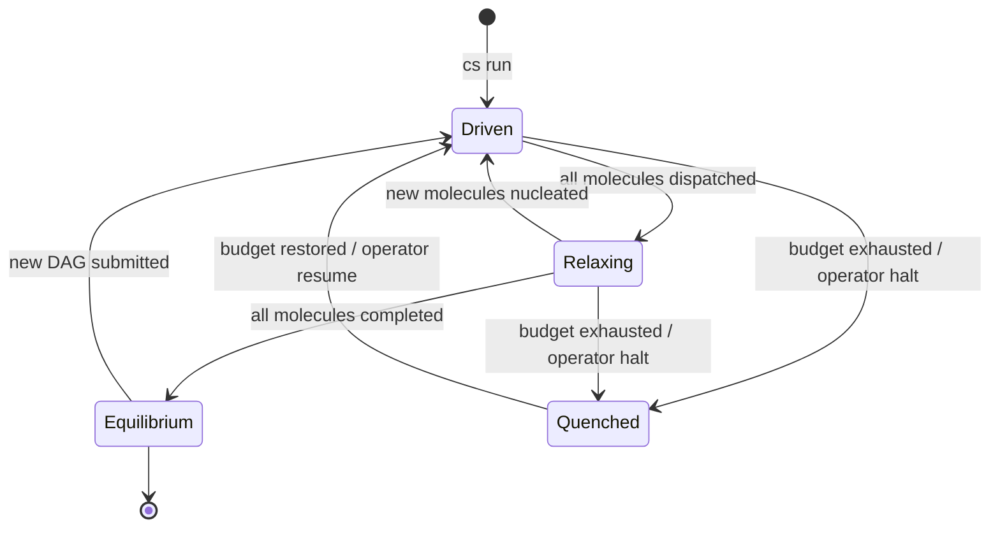
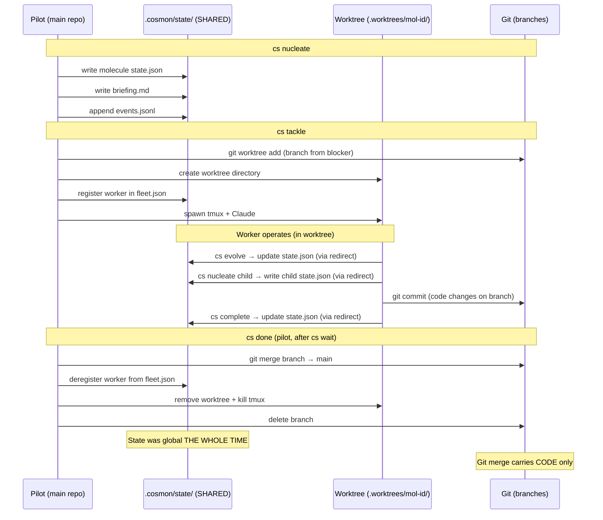

# Architectural Invariants — Do Not Break

Cosmon has structural mechanisms that shape what the system **can** do, not
just how it does it today. Breaking them silently kills future capabilities
and turns a well-composed substrate into a pile of ad-hoc features. Before
adding a new command, renaming a verb, expanding a command's scope, or
"improving" a flow, read this document and run the coherence checklist
(§5 below).

This document is a companion to [ADR-016](adr/016-autonomy-regimes-and-resident-runtime.md),
which is the governing architectural decision record. If this document
conflicts with ADR-016, the ADR wins. If a proposal conflicts with both,
the proposal loses.

---

## Status legend — ratified vs proposed (read this first)

This document mixes two classes of section, and the distinction is
load-bearing for anyone auditing what cosmon *actually enforces* versus
what it has *drafted for forward reference*:

- **Ratified §§** are enforced by the code, the tests, and the CI gates
  today. Breaking one is a regression.
- **Proposed §§** are drafted *here* so that downstream PRs and ADRs can
  cite a stable section number before the implementation lands. A
  proposed section is honest scaffolding, not a lie: it carries no test,
  no CI gate, and is explicitly marked. Citing one is a promise, not a
  guarantee.

**The rule is mechanical: a section is ratified unless its header
carries a `*(proposed — …)*` tag.** Every proposed section also repeats
its status in a trailing `### Status` block. There is no third state.

**Ratified top-level sections:** §1, §2, §3, §3b–§3g, §4, §5, §6, §7,
§7b–§7g, §8 (incl. its ratified subsections §8a–§8f), §8b–§8d (the
top-level fleet-split / briefing-seal / events-source sections), §9,
§10, §11. (§1bis is *proposed* — see the list below.)

**Proposed top-level sections:** §1bis, §8e (causal closure), §8j
(ingress bindings), §8k′ (cross-surface wheat-paste), §8l, §8m, §8n,
§8o, §8p, §8q, §8r, §8s, §8t (bounded-Δ surface coherence), §12, §13,
§14. Each is tagged in its header and re-states `Proposed` in its
`### Status` block.

**Two numbering quirks an auditor should expect — neither is a bug:**

1. *Layered letters under §8.* The §8 "Two-Plane Model" has its own
   `### 8a`–`### 8f` subsections (all ratified); separately, several
   `## 8x` *top-level* sections reuse letters from that range (e.g.
   top-level §8b "Briefing seals" is distinct from subsection §8b "Data
   Plane"). Resolve any §8-letter citation by reading whether it is a
   `##` top-level section or a `###` subsection of the Two-Plane Model.
2. *Forward-cited proposed invariants.* The proposed §8j (ingress
   bindings) cites §8g/§8h/§8i — three *proposed* invariants from the
   phase-2 ADR drafted in `idea-20260422-8ec9` (delegation chain,
   budgeted nucleation, dispatch acyclicity). Those citations are
   intra-draft cross-references *between proposed sections*, not a
   ratified rule depending on something unbuilt. They become enforceable
   only when the phase-2 ADR lands. Until then, read "§8g–§8i" the way
   you read a `TODO(ADR-XXX)` marker in source: a reserved name, not a
   live guarantee. §8f is **not** part of that reserved range — it is the
   ratified two-plane rules (subsection `### 8f`).

---

## 1. The two-layer model

Cosmon is organized as two cooperating layers sharing **one** state store.

### Layer A — Transactional Core (today)

- Stateless CLI, git-like. Every `cs` invocation is discrete: read state,
  mutate, write, exit. No daemon. No lingering process.
- State lives on disk as JSON files in `.cosmon/state/`.
- Composable with any scheduler: cron, launchd, shell loop, human at a
  terminal, or a future resident runtime.
- This is what you can touch today. Every feature added here must remain
  runnable in a one-shot invocation.

### Layer B — Resident Runtime (ADR-016 Phase 3+, ratified under [ADR-095](adr/095-resident-runtime-ifbdd-path.md))

- One long-lived process with an event loop.
- Owns a **pluggable policy** (`DagPolicy`, `DynamicDagPolicy`, or an
  external LLM-backed policy that speaks via MCP).
- Shares the state store with the transactional core. A human can still
  `cs observe` or `cs freeze` a molecule while the runtime is working on
  it. They are clients of the same file-based truth.
- **Does not replace Layer A.** It is a *client* of it, emitting
  `cs evolve` / `cs nucleate` / `cs done` calls under the hood.
- **Constrained by five named structural invariants** (ADR-095 §2):
  RR-1 *client of the transactional core, never substrate-beneath*;
  RR-2 *owns no state*; RR-3 *deletable as a single Cargo target
  without touching cosmon-core*; RR-4 *JSON-on-disk remains the
  authoritative source of truth*; RR-5 *failure-mode observability
  hooks baked in from day one (the operator's IFBDD requirement)*.
  Any PR that weakens any one of them is a structural breach.
- **Bedrock test:** every Layer B PR must pass §14 (*you can `cat`
  cosmon's state*). The Resident Runtime is admitted into the
  architecture *because* RR-2 and RR-4 preserve that invariant by
  construction.
- **Falsification window (ADR-095 §4):** 90 days from the first PR
  that wires RR-1 through RR-5 into a green CI; if the build is
  falsified, RR-3 makes the excision a single PR and a fresh ADR
  ratifies the retirement on forensic evidence.

### Layer B is bounded-ephemeral — config-honoring dispatch (delib-20260531-c761)

**The invariant (Q2b).** Layer B (the Resident Runtime) **re-derives
binary + config + env at each spawn boundary; it never reloads config in
place.** A long-lived L3 process MUST NOT trust its launch-time RAM
snapshot over the authoritative on-disk state.

Concretely, the runtime carries a *witness obligation*:

1. **Seal at launch.** `H = BLAKE3(resolved_config ⊕ binary-image-id)` —
   the same seal-as-trace BLAKE3 primitive as `prompt_seal` /
   `briefing_seals` (§8b), not a new mechanism.
2. **Re-check before every dispatch.** Recompute `H'` from current on-disk
   config + binary. `H' == H` → the runtime has witnessed its own freshness
   for this act → dispatch. `H' != H` → **halt fail-closed**: refuse the
   dispatch, emit `EventV2::ConfigDriftDetected`, exit non-zero
   (`exit(75)`) so a supervisor relaunches a fresh process.
3. **Never self-repair.** No in-place reload/merge. The only sound move on
   drift is to *stop* and let a fresh launch re-derive from disk.

**What this forbids.**

- A SIGHUP / `notify`-driven config reload inside the running runtime. That
  reintroduces a stateful config-cache with every failure mode statelessness
  abolishes — it can half-apply, race its own reload, and cannot hot-swap
  `argv[0]` into a redeployed binary image anyway.
- Dispatching a worker on a launch-time engine/key/model snapshot after the
  on-disk `[adapters.default]` (or the `cs` binary) has changed. This was
  the silent wrong-oracle billing root defect.

**Why this binds Layer B specifically.** The runtime *performs dispatch*
(same engine-resolution path, same key) — "an L1 actor wearing an L3
lifetime", so the `config-fresh` axiom (§7c Markov property, applied to
config not just molecule state) binds it. Cosmon is a `substrate`-tier
galaxy under the ADR-082 Gödel substrate-galaxy obligation: a substrate that
violates its own exported `config-fresh` rule is unsound as an axiom source.
Stratification would be legitimate only if L3 were a *pure scheduler*
shelling a fresh `cs tackle` per dispatch (which re-derives config in the
child); internalising an L1 act and freezing it is the defect this invariant
closes. Governing ADR: [ADR-016](adr/016-autonomy-regimes-and-resident-runtime.md)
Amendment 2026-05-31. Defense-in-depth backstop (ranked *below* this fix):
egress fail-closed / netns in `delib-20260530-0877`.

### Inviolable layering rules

- **Never introduce a daemon in Layer A.** Any core CLI command must remain
  runnable in a one-shot invocation.
- **Never let Layer B become the only path to a feature.** Every capability
  must be reachable from Layer A too (human-driven).
- **Never couple Layer A to Layer B.** The CLI must not require the
  runtime to exist to function. The runtime is purely additive.
- **LLM-based planners (L4) are not built in.** External tenants
  (claude-code, etc.) can implement them via MCP. Cosmon exposes primitives;
  it does not host the planner.

---

## 1bis. Federation tiers (proposed 2026-05-04, delib-20260504-6eb3)

Every noogram galaxy carries exactly one **`federation_tier`** value,
declared in its `CLAUDE.md` frontmatter and mirrored in neurion
`repos`:

- **`substrate`** — ships the federation-wide architectural baseline
  (e.g. cosmon). Imposes invariants on dependents.
- **`engine`** — produces a reusable primitive, agnostic of who consumes
  it (e.g. playhouse, lumen).
- **`vertical`** — assembles engines and substrate at the service of a
  *named singular human cognition* (e.g. lea, addl).

`mission` is **not** a tier — it is an internal attribute of a vertical.

**Citation asymmetry** governs syzygie verdicts:

- A vertical cites its substrate and engines (verdicts apply downward).
- An engine **never** cites a vertical — otherwise it becomes coupled
  to its consumer and loses reusability.
- The three syzygie verdicts (`inherit / adapt / refuse`) remain
  sufficient; the tier changes *who must verdict whom by default*.

Long-form rationale: an internal chronicle,
§ *Federation tiers*.

---

## 2. The three regimes

Every molecule-and-observer relationship sits in exactly one regime. Each
command operates on one or more regimes. Know which.

| Regime | Clock locus | Trajectory | Who observes | When is it active |
|--------|-------------|------------|--------------|-------------------|
| **Inert** | External (human) | N/A — no motion | Human via CLI | Pending molecules, completed shells |
| **Propelled** | External + fuel | Fixed at nucleation (formula steps) | Human + patrol watchdog | Tackle worker actively running |
| **Autonomous** | Internal (resident runtime) | Computed at runtime (DAG or goal) | Runtime policy | Future: `cs run <dag>` execution |

### What each regime guarantees

- **Inert** molecules have state but no clock. They evolve only when
  something external invokes a cosmon command against them. A `pending`
  molecule with no `cs tackle` yet is inert. A `completed` molecule is
  inert post-mortem (dead but its shell remains for observation).
- **Propelled** molecules carry momentum: a tackle or a resume has given
  them forward motion along a predetermined trajectory. They progress
  until fuel is exhausted (steps complete) or the motion dies (stall).
  `cs patrol --propel` is literally the watchdog that re-applies force
  to stalled Propelled molecules.
- **Autonomous** molecules live inside the resident runtime. Their next
  step is computed by a policy (DAG scheduler, dynamic DAG with
  decay-aware re-planning, or an external LLM planner). The regime does
  not exist yet in code — it is the north star.

### Liveness is not a property; it is a delegation

"Is the system alive?" is the wrong question. Ask instead: **who holds
the right to perform the next observation?**

- `cs tackle` delegates the next observation to the worker in the tmux
  session.
- `cs patrol --propel` delegates to the external scheduler (cron,
  launchd).
- `cs run <dag>` (future) delegates to the resident runtime's policy.
- An external claude-code session delegates to itself via MCP.

Breaking this framing causes people to invent "alive/semi-alive/dead"
terminology that does not survive the first edge case.

---

## 3. Command perimeters

Each command has **one role**. Do not expand a command's role to cover
another's territory. Do not create a new command that duplicates an
existing role. If a proposal looks like "let's make `cs X` also do Y",
stop and ask whether Y already has its own command.

| Command | Regime transition | Caller | Role | Notes |
|---------|-------------------|--------|------|-------|
| `cs nucleate` | Ø → Inert | Human / MCP | Create molecule record | Pure state creation. Nothing runs. |
| `cs observe` | — (read) | Human / MCP | Inspect molecule state | Pure read. Never mutates. |
| `cs ensemble` | — (read) | Human | Show fleet overview | Pure read. |
| `cs tackle` | Inert → Propelled | Human | Create worktree + tmux + fleet worker + inject prompt | The sole entry point into Propelled for L1. |
| `cs patrol` | diagnosis (read) | Human / external scheduler | Scan fleet, detect drift | `--respawn` for dead workers, `--propel` for stale molecules. |
| `cs patrol --propel` | maintains Propelled | External scheduler | Detect stale progress, send nudge via transport | Transport-layer safety net for Propelled regime. |
| `cs patrol --heal` | maintains Propelled (the Deacon) | External scheduler / human | Detect → §5-guard → remediate the **safe** anomaly classes (A1/A4/A5/A6/A8) | ADR-137 P3. Control-plane-keyed only (never a pane glyph); collapse/integrity classes (A3/A7/A9) reported not mutated. `--dry-run` previews. |
| `cs resume` | maintains Propelled | Human | Manual worker nudge | Human-triggered equivalent of `--propel`. |
| `cs evolve` | advances within Propelled | Worker (in worktree) | Advance one formula step, record evidence | Worker-callable. Auto-completes on last step. |
| `cs complete` | Active → Completed | Worker (in worktree) | Mark molecule completed, idempotent on Completed | Worker-callable. Does NOT touch infra (tmux/worktree/branch). |
| `cs stuck` | Active → Frozen | Worker / human | Pause with blocker reason | Freeze with a human-readable cause. |
| `cs done` | Propelled → Inert | Not-the-worker (human, scheduler, transport watchdog) | Teardown: merge branch, kill tmux, remove worktree, purge fleet, delete branch | **Not worker-internal.** Legitimate callers: humans, external schedulers (cron/launchd), and transport watchdogs (tmux `pane-died` hook via `cs harvest`). Symmetric to `cs tackle`. |
| `cs harvest` | Propelled → Inert (bridge) | Transport watchdog / scheduler / human | Check state; exec `cs done` when the molecule is `Completed` with `merged_at = None`; silent no-op otherwise | Hook-friendly bridge that closes the worker-exit → `cs done` gap without violating the "workers cannot self-destroy" spirit: the hook runs in a sibling shell, not inside the worktree. |
| `cs collapse` | Active → Collapsed | Human | Mark as permanently failed | Terminal, records reason, cannot be reverted by `cs complete`. |
| `cs freeze` / `cs thaw` | Propelled ↔ Paused | Human | Suspend/resume worker session | Preserves state across preemption. |
| `cs kill` / `cs purge` | infrastructure-only | Human | Terminate worker, remove from fleet | Infrastructure teardown. Does not touch molecule state. |
| `cs reconcile` | pure projection | Any | Project state onto surfaces | Idempotent by construction (enforced by tests). |

### Two boundaries this table encodes

1. **Worker-callable vs not-worker-callable.** A worker runs inside its
   own worktree. It **cannot self-destroy**: it cannot kill its own tmux
   session, remove the worktree it is running in, or merge its branch
   into main (no access). So worker-callable commands (`cs evolve`,
   `cs complete`, `cs stuck`) are pure state transitions. Not-worker
   commands (`cs tackle`, `cs done`, `cs kill`, `cs purge`, `cs harvest`)
   handle the infrastructure. The not-worker set is broader than
   "biological human": it covers any caller that runs in a **sibling
   shell**, with no cwd inheritance from the worker's worktree —
   humans, external schedulers (cron/launchd), and transport watchdogs
   (tmux `pane-died` hooks) all qualify. The governing invariant is the
   sibling boundary, not the carbon substrate of the caller. The
   worker-exit → `cs done` bridge (delib-20260418-8166) is the
   motivating example: a tmux hook exec's `cs harvest` from outside
   the worktree, which in turn exec's `cs done` — zero worker cwd,
   full not-worker authority.
2. **State transition vs infrastructure teardown.** `cs complete`
   transitions a molecule to Completed — nothing more. `cs done` assumes
   the molecule is already Completed and dismantles the L1 Propelled
   infrastructure around it. These are distinct commands with distinct
   perimeters. Do not merge them.

---

## 3b. The Write-Read Asymmetry

The deepest structural invariant in cosmon is not a command perimeter but a
causal asymmetry: **`cs evolve` writes state; `cs wait` reads state; one tick
separates them.** This asymmetry is the reason the feedback loop has temporal
direction and the reason the Anti-Psychosis Principle (THESIS Part XIV) is
structurally enforced rather than policy-enforced.

- `cs evolve` mutates `.cosmon/state/` (write). It is the only verb that
  advances a molecule's step counter.
- `cs wait` reads `.cosmon/state/` and returns metrics (read). It is
  **mechanically read-only** — it cannot advance the state machine.
- The observer sees the state *after* the write, and the next write is
  *constrained* by what the read surfaced.

This one-tick lag between write and read is the Quantum Zeno safety margin:
the state machine cannot be advanced *inside* a wait. Two thesis sections
(Part XIV Observer Regulation and Part XVIII Coupling Principle) converge on
this constraint from regulation and projection respectively.

**Inviolable rule:** no command may simultaneously write molecule state and
return a coupling report. Write and read are always distinct invocations.

---

## 3c. DAG-Aligned Git Branching

`cs tackle` branches from the **blocker's branch**, not from `main`. This
means the git DAG mirrors the cosmon dependency DAG:

```
main ─── blocker-branch ─── dependent-branch
              │                    │
         blocker mol          dependent mol
         (completed)          (in progress)
```

The dependent worker's worktree contains the blocker's committed output in
its git history. Content flows via the filesystem (git branch lineage), not
via inter-agent messages. This eliminates the need for mailboxes or explicit
content-passing between molecules in a DAG.

### What this means for commands

- **`cs tackle`** resolves the molecule's blockers, finds the most recent
  completed blocker's branch, and creates the new worktree branching from it.
  If there are multiple **live** blocker branches, it branches from the one
  with the most recent tip commit (highest committer timestamp) — *not* the
  first in link-insertion order (the C6-2 drift, decided in
  `task-20260712-2686`). A git worktree has a single parent, so it can inherit
  only one sibling's output; `cs tackle` warns when ≥2 live blocker branches
  are present and the operator should prefer `cs run` for true multi-blocker
  convergence. Under the normal `cs run` path this case does not arise:
  merge-before-dispatch (§3d) merges and deletes each blocker branch first, so
  `base = main` already holds every merged output.
- **`cs done`** merges the branch back. The merge-before-dispatch rule
  (§3d below) ensures this happens before dependents are dispatched.
- **`cs run <dag>`** (future) will use the same branching strategy.

### DAG as Communication Protocol

The DAG topology **is** the inter-agent communication protocol:

- **Control channel:** each DAG edge carries exactly **1 bit** of information
  per molecule: done or not-done. This is the minimum signal needed to
  unblock a dependent. Shannon would approve — the control channel has
  capacity 1 bit per edge per tick, and that is exactly the capacity used.
- **Data channel:** content flows via the **filesystem** (git branch lineage).
  The dependent worker sees the predecessor's output because it is in the
  git history of its own branch. No serialization, no message format, no
  envelope — just files on disk.

This separation is load-bearing. The control channel is managed by cosmon
(state transitions). The data channel is managed by git (branch lineage).
Neither system needs to understand the other's internals.

---

## 3d. Merge-Before-Dispatch

When a molecule completes in a DAG context, the `on_complete` handler calls
`cs done` for the completed molecule **before** dispatching its dependents
via `cs tackle`. This ordering is an invariant, not an optimization:

1. Worker completes → calls `cs complete` (pure state transition)
2. Orchestrator detects completion → calls `cs done` (merge branch, teardown)
3. Branch is now merged → dependent's `cs tackle` branches from merged state
4. Dependent worker starts → sees predecessor's output in its worktree

**Breaking this ordering** means the dependent branches from stale state and
cannot see the predecessor's output. The git DAG would diverge from the
cosmon DAG, violating §3c.

---

## 3e. CLI Over MCP for Workers

Workers use the `cs` CLI for all cosmon operations, **not** the MCP
`cosmon_*` tools. This is a boundary rule, not a preference:

- The CLI uses **walk-up discovery** from the worker's current directory.
  A worker in `.worktrees/task-xyz/` naturally resolves to the correct
  `.cosmon/` directory.
- The MCP server may be running a **stale binary** if cosmon was rebuilt
  during the session.
- The CLI is **symmetric with git**: workers interact with the state store
  the same way humans do. Same binary, same flags, same output format.

The MCP server exists for **external orchestrators and callers** (the human
using Claude Code, the MCP-connected planner). It is not for workers inside
their own worktree.

---

## 3f. Celestial Mechanics — Runtime Control Model

The runtime (future resident runtime, or the external orchestrator driving
`cs run <dag>`) operates as a control system with four states, drawn from
celestial mechanics:



| State | Meaning | Energy flow | Observable |
|-------|---------|-------------|------------|
| **Driven** | Active dispatch: molecules being tackled, workers running | Tokens flowing out (high burn rate) | `count(running) > 0 AND pending_dispatch > 0` |
| **Relaxing** | All dispatched, waiting for completion | Tokens flowing (workers active) but no new dispatch | `pending_dispatch == 0 AND count(running) > 0` |
| **Equilibrium** | All work complete, system at rest | Zero token flow | `count(alive) == 0` |
| **Quenched** | Externally halted (budget, operator, error) | Frozen mid-flight | `halted == true` |

### Why these states matter

- **Driven → Relaxing** is automatic: when the last pending molecule is
  dispatched, the system transitions. No command needed.
- **Relaxing → Equilibrium** is automatic: when the last running molecule
  completes (and `cs done` + merge-before-dispatch finishes), the system
  reaches equilibrium.
- **Quenched** is the only externally-forced transition. It can happen from
  Driven or Relaxing. The system preserves all state for later resumption.
- **Equilibrium → Driven** requires new input (a new DAG, a new molecule).
  The system does not spontaneously restart.

These states map to the existing three regimes:

| Regime | Control states |
|--------|---------------|
| Inert | Equilibrium (post-completion) |
| Propelled | Driven + Relaxing (tackle-based) |
| Autonomous | Driven + Relaxing (runtime-based, future) |

Quenched is orthogonal — it can interrupt any regime.

---

## 3g. Mission-Plan Formula

The highest-level formula pattern in cosmon is the **mission-plan**: a goal
combined with a fleet template produces a DAG.

```
mission(goal, fleet_template) → DAG of molecules
```

This is the mechanism by which innovation happens through **formulas, not
infrastructure**. A new kind of work does not require new commands, new
molecule kinds, or new state transitions — it requires a new formula that
decomposes the goal into steps and selects the right worker roles.

The mission-plan pattern composes with the existing system:

- `cs nucleate` creates the root molecule from the mission formula
- The formula's `[[steps]]` define the DAG structure
- `cs tackle` dispatches each molecule to a worker matching the fleet template
- DAG-aligned branching (§3c) ensures content flows between steps
- Merge-before-dispatch (§3d) ensures ordering

**No new verbs, no new kinds, no new types.** The formula is the innovation
surface. The infrastructure is fixed.

---

## 4. Composition with the future Resident Runtime

When Layer B (the resident runtime, ADR-016 Phase 3) ships, it will execute
DAGs of molecules via a `DagPolicy`. Every existing command must still make
sense in that world.

### Test for runtime compatibility

Before adding or modifying a command, ask: **will this command still
make sense when a resident runtime owns the molecule?**

- `cs evolve` → yes, the runtime will emit it as its main verb.
- `cs complete` → yes, the runtime will emit it on success.
- `cs done` → specifically the L1 teardown. The runtime will **not**
  emit it because L3 Autonomous molecules do not have per-molecule
  worktrees or tmux sessions. This is fine — `cs done` is declared L1
  Propelled-only by its docs. No breakage.
- `cs tackle` → human-only entry to L1. The runtime creates Autonomous
  molecules via `cs nucleate` + its internal dispatch, not via tackle.
- Hypothetical `cs convoy` → would be a batch wrapper that duplicates
  what the runtime's policy already does. **Refused** (ADR-016). Skip
  the stepping stone.

### What breaks composition

- **Hidden state in a command's process memory.** If `cs X` caches
  anything between runs, the runtime (which calls `cs X` from its loop)
  may see stale data. All state on disk.
- **Assuming only L1 exists.** If `cs X` hardcodes "worker is in
  `.worktrees/{mol_id}`" in non-teardown code paths, autonomous
  molecules will trip over it.
- **Asymmetric creation.** If `cs X` creates something (files,
  branches, sessions) but there is no matching `cs Y` to undo it,
  the runtime's error-recovery path cannot clean up.

---

## 5. The coherence checklist

Run these questions **explicitly** before proposing a new command, a
significant change to an existing command, or a cross-cutting refactor.
Write the answers in the commit message for anything non-trivial.

1. **Stateless?** Can this command be invoked once, do its work, and
   exit? No background loop? No lingering process? If the answer is no,
   the command does not belong in Layer A.

2. **Idempotent?** Running it twice should produce the same result as
   running it once. If not, document why and gate re-runs behind explicit
   flags. (Counterexample: `cs complete` had to be made idempotent on
   Completed because the propulsion prompt's terminal protocol issues
   it unconditionally after `cs evolve`.)

3. **Regime-aware?** Which regime does this command operate on? Does it
   respect that regime's invariants? Does it interact safely with
   molecules in other regimes? Do not implicitly assume L1 Propelled.

4. **Single perimeter?** Is this command's role already covered by
   another command? If yes, **extend the existing one** instead of
   creating a parallel path. (Counterexample avoided: we almost built
   `cs convoy` as a shell loop wrapper; ADR-016 rejects it.)

5. **Symmetric undo?** If this command creates state (files, sessions,
   branches), is there a symmetric command that undoes it cleanly?
   `cs tackle` ↔ `cs done`, `cs nucleate` ↔ `cs complete`/`cs collapse`,
   `cs freeze` ↔ `cs thaw`. If the symmetric counterpart does not exist,
   create it or explicitly declare why the asymmetry is intentional.

6. **Runtime-compatible?** Will this command still make sense when the
   resident runtime (ADR-016) takes over L3 execution? Does it assume
   L1 Propelled exclusively? If yes, say so explicitly in the command's
   doc comment so the runtime path is not broken later.

7. **Worker/human boundary respected?** Worker-callable commands run
   inside a worktree and cannot self-destroy. Human-callable commands
   assume the worker is already done. A command cannot be both.
   Decide and document.

8. **Write-read asymmetry preserved?** Does the command write state and
   return a coupling report in the same invocation? If yes, split it.
   Write and read must be distinct invocations (§3b).

9. **Merge-before-dispatch respected?** If the command dispatches work
   to a dependent, does it first ensure the predecessor's branch is
   merged? (§3d).

10. **CLI-first for workers?** If a worker calls this command, does it
    work via walk-up discovery from the worktree? Workers must not
    depend on the MCP server (§3e).

11. **Scope-bounded?** Does this command's state traversal stay within
    the intended subgraph? Can it reach historical, completed, or
    unrelated molecules? If yes, add an explicit scope boundary.

12. **Self-similar?** Does the capability compose at adjacent levels
    (single molecule, polymer, fleet)? If it works at one level but
    breaks or is meaningless at the level above or below, it is a
    local patch — reconsider.

13. **Alphabet-Closure Axiom (AC).** If this PR adds a persisted field,
    a mutating action, or a read-coupling on molecule state not named
    in `docs/specs/CosmonRun.tla`'s `vars` (line 44) or `Next` (lines
    152–155), the spec edit must land in the same commit. Reviewer
    signature discharges the axiom. TLC and proptest quantify over
    `Σ_TLA`; G★ (Alphabet-Closure Divergence) lives outside their
    alphabets by construction. See an internal note
    and `docs/adr/052-one-ledger-one-writer-one-witness.md` §I9.

---

## 6. When a proposal conflicts with these invariants

1. **Stop.** Do not "work around" the invariant in code.
2. **Read ADR-016 in full.** Many conflicts dissolve once the original
   motivation is reloaded into context.
3. **Write out why the invariant is worth breaking.** If the answer is
   "convenience" or "it would be nice", the answer is no.
4. **If the invariant genuinely no longer serves**, propose a successor
   ADR that supersedes the relevant parts of ADR-016. Do not backdoor a
   change through a single command. Architectural decisions happen in
   ADRs, not in PR diffs.

---

## 7. What "breaking coherence" looks like in practice

These are real anti-patterns to recognize:

- **Expanding `cs complete` to also kill tmux.** Rejected: `cs done`
  exists for that. `cs complete` must stay a pure state transition so
  workers can call it from inside their worktree.
- **Adding a daemon mode to `cs patrol`.** Rejected: Layer A is
  stateless. A cron/launchd/shell loop is the right composition. The
  resident runtime (Layer B) is the only place a loop belongs.
- **Hardcoding "all workers have a tmux session" in patrol.** Rejected:
  autonomous molecules (future L3) will not have per-molecule tmux
  sessions. Patrol must remain transport-agnostic where possible.
- **Creating a `cs plan "do X"` command.** Rejected (ADR-016): that is
  claude-code's job. Expose primitives via MCP and let external planners
  be tenants.
- **Merging `cs evolve` and `cs complete` into a single verb.** Rejected:
  `cs evolve` has formula-aware semantics (step advancement, exit
  criteria, evidence). `cs complete` is a shortcut that bypasses the
  ceremony for terminal cases. They serve different perimeters.
- **Adding "just one more field" to the Molecule domain type for a
  specific use case.** Rejected: the domain type is the intersection of
  every future regime. If a field is specific to one regime, it lives
  in that regime's metadata, not in `MoleculeData`.

---

## 7b. Deliberations compose via decay

The `🧠 deliberation` molecule kind captures the structured multi-perspective
panel pattern (frame → dispatch → synthesize → outcomes). It does not
introduce a new command or a new lifecycle — it is a standard molecule with
a dedicated formula (`deep-think`). It composes with the rest of the system
through the existing interactions:

- **Decay** — the `outcomes` step decays the deliberation into N child
  task/idea molecules via `cosmon_decay`. The synthesis becomes actionable
  work, and the deliberation itself completes. This is the preferred exit
  when the panel produces follow-up work.
- **Transform** — a deliberation can transform into a `decision` when the
  synthesis is itself the final answer (see `MoleculeKind::valid_transforms`).
- **Surface** — alive deliberations project onto `DELIBERATIONS.md` via
  the `project.deliberations` referent, symmetric to `IDEAS.md`.

No new command perimeter is required: `cs nucleate`, `cs tackle`, `cs evolve`,
`cs complete`, `cs done` all apply unchanged. The worker inside the
deliberation worktree is responsible for invoking the panel (via its
available Claude Code subagents) during the `dispatch` step. From the
runtime's perspective, a deliberation is just another molecule that
happens to produce a synthesis document and decay products.

---

## 7c. The Markov Property (the real invariant on disk)

The thesis historically appealed to a physics metaphor — "frame-independence" —
to explain why the runtime can be stopped and restarted without information
loss. The metaphor is poetic but misleading: Lorentz frame-independence
preserves the *form of the laws* across observers; it does not say an observer
can leave and re-enter the system without consequence. The genuine invariant
Cosmon relies on is the **Markov property**:

> All state needed to resume lives on disk. The runtime is a pure function of
> disk state. The future of the system depends only on the present contents of
> `.cosmon/state/`, never on a history held in a process's memory.

### What this forbids

- **No in-memory-only state.** If a command, a policy, or the resident runtime
  computes something it needs later, it writes it to `.cosmon/state/` before
  exiting. In-memory frontiers, caches, and derived plans are acceptable as
  performance optimizations *only* if they are recoverable from disk at any
  time by a fresh process.
- **No reliance on process identity.** A second `cs` invocation, or a
  restarted resident runtime, must be indistinguishable from the first with
  respect to the molecule state machine. Transition rules are what is
  genuinely frame-independent; observations are not.
- **No hidden link-fidelity assumptions.** Policies that derive a frontier
  from `Blocks` / `BlockedBy` links implicitly depend on executors writing
  those links correctly. If a link is missing on disk, the resumed runtime
  will reach a different state than the interrupted one. Link fidelity is
  part of the Markov state; treat it as such.

### The restart-fidelity test (mandatory for any new policy or runtime code)

Every policy, scheduler, or runtime component that maintains derived state
must be covered by a **restart-fidelity test**: run a non-trivial workload
partway, tear the process down, rebuild the component from the store alone,
and assert that the resumed trajectory produces identical outcomes to the
uninterrupted one. Without this test, the Markov claim is aspirational.
With it, it is a theorem the type system cannot produce on its own.

This is the discipline behind the "Ctrl-C / `cs run`" story. Call it what
it is — the Markov property, not frame-independence — and test it.

### Cultural enforcement against paradigm drift

Two complementary CI gates protect the Markov property against silent
drift toward a neurion-coupled bootstrap (Universe D, per
`delib-20260418-8166` §3/§10 and `delib-20260418-1f29` Child C). Both
are **blocking** in `.github/workflows/ci.yml`.

- **`restart-fidelity-without-neurion`** (dedicated workflow job)
  — `crates/cosmon-cli/tests/restart_fidelity_no_neurion.rs` boots
  cosmon under a sandboxed `HOME` with no neurion service reachable,
  no LaunchAgent loaded, and no external scheduler, runs a
  multi-molecule DAG trajectory, snapshots mid-flight state, restores
  it in a fresh process, and asserts that the resumed trajectory
  converges on the same on-disk state as an uninterrupted one. Proves
  that cosmon *runs* correctly without neurion.

- **`cosmon-without-neurion`** (mandatory job, runs after
  `cargo test --workspace`, mirrors `just test-without-neurion`) —
  `crates/cosmon-cli/tests/bootstrap_monotonicity.rs` scans the repo's
  substrate templates (and, locally, the installed files under
  `~/Library/LaunchAgents/com.cosmon.*` and `~/.config/cosmon/`) and
  fails on any `$(neurion …)` substring. Proves that cosmon *does not
  call* neurion at cold boot. Wrapped in a `PATH`-stripped recipe so
  any future test added to the gate cannot quietly depend on neurion
  being reachable.

Run the second gate locally with `just test-without-neurion`; see
`docs/CONTRIBUTING.md` for the governing discipline. If either gate
ever becomes infeasible to keep green, cosmon has drifted away from
its Markov-property foundation — raise a successor ADR *before*
merging the change that caused it to fail.

---

## 7d. Cascade failure semantics (collapse must propagate)

A molecule collapse today fires `MoleculeCollapsed`, but nothing propagates
to downstream dependents. Node B, blocked by collapsed Node A, sits in limbo
forever: never ready, never running, never done, invisible to `is_drained()`,
consuming an attention slot. For a 50-node DAG whose root collapses, you get
49 zombie molecules — a plan that looks alive but is structurally dead.

This is a **boundary condition**, not a convenience feature. Silent zombie
accumulation is the cosmon equivalent of an information paradox: molecule
state is preserved, but the information that the plan is irrecoverable has
been lost at the collapse boundary.

### The invariant

> A terminal failure on an upstream molecule must reach every downstream
> dependent as a definite, observable state. No molecule may sit indefinitely
> in a "waiting for a dependency that will never arrive" limbo.

### Command perimeter impact

Cascade propagation is not a new primitive in the molecule / formula / link
sense — it is a **new state transition** on the `Plan` reducer that must be
reflected in the command perimeters:

- `cs collapse` (and any internal terminal-failure path) is declared to
  propagate: every downstream molecule reachable through `BlockedBy` /
  `Blocks` edges is transitioned via a `mark_failed` (auto-cascaded) or
  `mark_poisoned` (surfaced for human decision) transition, depending on
  policy.
- The `Plan` reducer gains a `failed` set as the symmetric counterpart of
  its existing `done` / `skipped` sets. `is_drained()` must account for it.
- Propagation is **idempotent**: collapsing an already-collapsed subtree is
  a no-op. The coherence checklist's idempotency question (§5.2) applies.
- Propagation respects the Markov property (§7c): the `failed` set is
  persisted to `.cosmon/state/`, not held in the scheduler's memory. A
  restarted runtime must see the same poisoned frontier.

### What this forbids

- **Silent limbo.** No command may leave a dependent in an unreachable
  state without either cascading the failure or marking it explicitly as
  requiring human triage.
- **Attention-budget leaks.** Poisoned molecules must release whatever
  resource accounting (attention slots, fleet capacity, energy budget)
  they were holding, or be transitioned to a terminal state that does so.
- **Collapse-as-local-event.** Treating collapse as "just an event, let
  hooks handle it" is rejected. Propagation is part of the transition, not
  an optional reaction.

This is the single most urgent gap flagged by the Hawking panel; treat any
proposal that defers it as a proposal to keep the information paradox open.

---

## 7e. Control channel vs data channel (DAG is ordering, not content)

A DAG edge (`BlockedBy` / `Blocks`) carries **exactly one bit per molecule
lifetime**: the upstream molecule reached a terminal state. It carries
*zero* bits of the upstream molecule's actual output. This is not a defect
to be fixed — it is a deliberate separation of concerns.

| Plane | Medium | Carries | Bandwidth |
|-------|--------|---------|-----------|
| **Control** | DAG edges (`BlockedBy` / `Blocks`) | Ordering: "X is done, Y may start" | 1 bit per molecule lifetime |
| **Data** | Filesystem (git worktrees, `.cosmon/state/`, shared disk), `variables` set at nucleation | Actual content: outputs, artifacts, evidence, documents | Unbounded, async, durable |

### The invariant

> The DAG is the control plane. The filesystem is the data plane. Never
> conflate them. Never try to push content through a DAG edge, and never
> try to use filesystem state to enforce ordering.

### What this forbids

- **Content on edges.** Do not add output payloads, result blobs, or
  summary strings to `BlockedBy` / `Blocks` links. Edges remain pure
  synchronization signals. If two molecules need to share content,
  they share it through the filesystem (a worktree path, a state file,
  a `variables` entry written by a parent at nucleation).
- **Ordering on the filesystem.** Do not rely on file mtimes, directory
  scans, or lock files to express dependency ordering. The DAG is the
  single authority on "what comes after what".
- **Mailbox reinvention.** The thesis deliberately eliminated mailboxes
  in favor of DAG edges precisely because conflating control and data
  produced an unbounded-bandwidth async channel that nothing in the
  system could reason about. Do not reintroduce mailboxes under another
  name.
- **Mixed-plane commands.** A command may read or write the control
  plane, or the data plane, but should not silently do both without
  making the distinction explicit in its doc comment. Agents reading
  the CLI must be able to predict which plane a command touches.

### Why this matters for composition with Layer B

The resident runtime's policy is a *control-plane* component: it reads
the `Plan` reducer's view of done/ready/skipped/failed and decides what
to dispatch. It does not — and must not — inspect the contents of
worktrees or evidence files to make scheduling decisions. Keeping the
control channel at 1 bit per edge is what allows the policy to stay
pure, testable, and replaceable (DagPolicy, DynamicDagPolicy, external
LLM planner over MCP). Fatten the control channel and the policy
becomes an application, not a scheduler.

---

## 7f. Fleet-scoped tmux socket isolation

Two cosmon fleets on one host **must not see each other's tmux sessions**.
Before 2026-04-14 the transport backend fell back to a shared `"cosmon"`
socket name whenever the project id was unset — meaning every legacy
project's workers landed on the default tmux server and `tmux ls` mixed
them freely. This broke cross-fleet isolation and made `cs peek --all`
ambiguous between projects.

### The invariant

> The tmux socket name is **derived from the project** and never shared
> across projects. When `project_id` is unset in `.cosmon/config.toml`,
> the socket name is derived from the absolute project root path via
> `ProjectId::generate(project_root)` so distinct repositories produce
> distinct sockets.

Single source of truth:
[`cosmon_filestore::resolve_tmux_socket_name`](../crates/cosmon-filestore/src/lib.rs).
The CLI helper `tmux_socket_name`, cockpit-http's
`resolve_project_socket`, and the MCP `cosmon_nudge` fallback all route
through it — no caller mints a socket name directly.

### Consequences

- **`tmux ls` on the default server is empty after `cs tackle`.** If it
  isn't, a caller is bypassing `resolve_tmux_socket_name` — that's a
  bug, not a feature.
- **`cs peek --all` scans every `.cosmon/` it finds**, opens each
  project's unique socket, and aggregates. A worker from project A
  never shows up under project B.
- **Debugging multi-galaxy setups.** `tmux -L <socket> ls` requires the
  *derived* socket name, not `cosmon`. Get it from
  `cs ensemble --json | jq -r .project.tmux_socket` or from the MCP
  `list_services` tool. Never guess.

### What this forbids

- Hardcoded socket literals (`"cosmon"`, `"default"`) anywhere in the
  transport stack.
- `cs peek` resolving the socket from `$TMUX` or `tmux ls` output —
  resolution is path-derived and deterministic, never discovered.
- MCP tools writing to the default tmux server "for convenience".
  Workers, patrols, and nudges MUST all target the project-derived
  socket.

See [`docs/tmux-paste-buffer.md`](tmux-paste-buffer.md) for the
complementary buffer-name uniqueness invariant on a given socket.

---

## 7g. Runtime drives Running molecules (native/gate tail)

`cs run` polls the DAG and dispatches work. A naive policy — "emit
`Evolve` for every `Pending` molecule" — stalls mixed formulas (e.g.
`claude → native → claude` or `claude → gate`) as soon as a worker
exits at a step boundary: the molecule is `Running`, no worker is
attached, but `Pending`-only scheduling never re-enters. Exposed by
`task-2199` (native-cascade fix): `cs tackle` drains the native tail
correctly, but `cs run` had no equivalent.

### The invariant

> The scheduling unit is **(molecule, next step)**, not the molecule
> alone. On every tick, the runtime inspects every `Running` molecule's
> current step and drains it if no worker owns progress.

Implemented in
[`Executor::drain_native_tail`](../crates/cosmon-runtime/src/lib.rs).
The subprocess executor loads the molecule's formula, inspects the
current step, and:

- **Native or shell-gate step** → `cs tackle` (cascades in-process
  through all consecutive native/gate steps).
- **Claude step with no assigned worker** → `cs tackle` (spawns the
  worker).
- **Claude step with a worker** → skip (the worker owns progress).

Since the verb-unification of delib-20260426-1bcd #2, `cs tackle` is
*always* a leaf dispatch (no auto-detect, no `--leaf` flag) — the
runtime simply calls `cs tackle <id>` for every ready node, and the
historical `--leaf` flag is a silent no-op kept only for muscle-memory
scripts during a one-month grace window.

`Runtime::run` invokes `drain_native_tail` for every `Running` molecule
each tick. The DAG drains end-to-end without manual tackles between
mode switches. Regression test:
`test_run_drains_running_molecule_with_native_tail`.

### What this forbids

- Scheduling by molecule status only. `Running` is not "someone else's
  problem" — it is a signal to probe the next step.
- Tackling a Claude step that already has a worker. That duplicates
  work and races on the worktree.
- Running a native step outside `cs tackle` from the runtime. The
  cascade logic lives in `cs tackle`, not in the runtime.

---

## 8. The Two-Plane Model

Cosmon separates concerns into two distinct planes: a **control plane** for
state coordination and a **data plane** for content delivery. This separation
is load-bearing — it is what allows stateless CLI commands, crash recovery,
and real-time fleet visibility to coexist.

### 8a. Control Plane — Shared State (`.cosmon/state/`)

The control plane is the shared state directory at `.cosmon/state/` in the
**main repo**. Every molecule's `state.json`, `events.jsonl`, `fleet.json`,
and lifecycle metadata lives here. All `cs` commands — from any worktree,
any tmux session, any shell — read and write this single state store.

**The worktree redirect is the architectural hinge.** When a worker runs
`cs evolve` from `.worktrees/task-xyz/`, the `resolve_worktree_main_cosmon`
function in `cosmon-filestore/src/resolve.rs` detects that the working
directory is a git worktree (`.git` is a file, not a directory), follows the
`gitdir:` pointer back to the main repo root, and returns the main repo's
`.cosmon/` path. The worker never touches a local `.cosmon/` — there is none.

This redirect is not a convenience; it is a **structural requirement**:

- `cs wait` polls `state.json` for terminal status. If each worktree had its
  own state, the pilot would need to know which worktree to poll — breaking
  the stateless CLI model.
- `cs peek` reads `fleet.json` and all molecule states for its TUI. Global
  state makes this a single directory read.
- `cs run` (the DAG runtime) dispatches based on the `done` set in the shared
  `Plan` reducer. Per-worktree state would require cross-worktree aggregation
  — a distributed consistency problem that files on disk cannot solve.
- `cs ensemble` computes fleet-wide metrics (temperature, entropy) from a
  single snapshot. Distributed state would make these metrics stale or
  inconsistent.

### 8b. Data Plane — Git Branches (Worktrees)

The data plane is the git branch lineage. Each worker operates in its own
worktree (`/.worktrees/<mol-id>/`) on its own branch. Code changes, artifacts,
and outputs are committed to the branch. Content flows between molecules via
DAG-aligned branching (§3c): a dependent's branch is created from its
blocker's branch, so the dependent sees the blocker's output in its git
history.

The data plane carries **unbounded content** (source files, documents,
test results) at **git's pace** (commit → merge). The control plane carries
**1-bit signals** (done/not-done) at **filesystem speed** (JSON write →
JSON read). Neither plane should carry the other's traffic.

### 8c. The Lifecycle Sequence

The two planes interact through a well-defined sequence at each lifecycle
stage:



### 8d. Hybrid Artifacts — Durable Markdown in State

Some `.cosmon/state/` files occupy **both planes simultaneously**. The
selective `.cosmon/.gitignore` ignores volatile state (`state.json`, locks,
PIDs, logs) but does NOT ignore durable narrative artifacts:

| File | Plane | Gitignored? | Purpose |
|------|-------|-------------|---------|
| `state.json` | Control only | Yes | Volatile molecule state machine |
| `fleet.json` | Control only | Yes | Volatile worker registry |
| `*.lock` / `*.pid` | Control only | Yes | Process coordination |
| `briefing.md` | Hybrid | **No** | Durable context for workers |
| `synthesis.md` | Hybrid | **No** | Durable deliberation output |
| `responses/` | Hybrid | **No** | Durable panel responses |
| `events.jsonl` | Hybrid | **No** | Durable audit trail |

These hybrid artifacts are globally writable (any worker can append to
`events.jsonl` via the shared state redirect) AND version-controlled through
git (they survive branch merges and are visible in `git log`). This dual
nature is intentional — it means the audit trail of what was attempted
persists in the repository even after molecules complete or collapse.

### 8e. State Durability Independent of Branch Fate

State mutations persist **regardless of branch fate**. When a worker running
in `.worktrees/task-xyz/` calls `cs evolve`, the state change is written to
the main repo's `.cosmon/state/` — not to the worktree's branch. If the
branch is later abandoned (never merged), the molecule's state record still
exists. If the worktree is deleted, the state record still exists.

This is Gödel's property of the system: the state store remembers what was
attempted even when the attempt failed. A molecule created by a crashed
worker persists in `state.json` as an orphan. The system cannot distinguish
merged from abandoned origin by inspecting `state.json` alone.

This is a **feature, not a bug**:

- It means crash recovery works: a crashed worker's progress (completed
  steps, collected evidence, nucleated children) survives the crash.
- It means forensic investigation works: you can always reconstruct what
  happened by reading the state store, even after infrastructure teardown.
- The cleanup mechanism is the `temp-review` formula and `cs collapse` —
  explicit curation, not implicit filesystem rollback.

### 8f. Inviolable two-plane rules

- **Never store content on control-plane edges.** DAG links (`BlockedBy`,
  `Blocks`) carry ordering (1 bit per molecule lifetime), not payloads.
  Content flows via the data plane (git branch lineage, shared files). See
  §7e for the full control-vs-data channel invariant.
- **Never enforce ordering via the data plane.** Do not rely on file
  modification times, directory scans, or lock files to express dependency
  ordering. The DAG is the single authority on sequencing.
- **Never bypass the worktree redirect.** A worker that writes directly to
  a local `.cosmon/` directory (if one existed) would create a split-brain
  state invisible to the orchestrator. The redirect ensures one truth.
- **Never assume state and branch are coupled.** State mutations are
  immediate and global; branch merges are deferred and local. A molecule
  can be `Completed` in `state.json` while its branch has not yet been
  merged (the `cs done` gap). Design for this asymmetry.

---

## 8b. Briefing seals — soft contract for retrospective verification

Operator intent (`prompt.md`) and per-step contracts (`briefing.md`) are
the cognitive boundary between the pilot and the worker. Until
2026-04-17 nothing stopped a worker — human or LLM — from editing those
files *after* the lifecycle moment that produced them, silently reshaping
the contract. `cs evolve` can regenerate `briefing.md`; an LLM reviewing
its own instructions can rewrite them. The result is a **shadow
contract**: the worker executes under a different brief than the one the
pilot approved, and there is no trail.

Briefing seals are the minimum-viable trail. Every `cs nucleate` stamps
a BLAKE3 hash of `prompt.md` onto `MoleculeData::prompt_seal`; every
`cs evolve` appends a hash of the freshly regenerated `briefing.md` to
`MoleculeData::briefing_seals`. Both writes are **defensive** — an I/O or
hash failure is logged and swallowed; the hot path never blocks on seal
emission. The companion events (`PromptSealed`, `BriefingSealed`) land on
`events.jsonl` for chain-walk tools.

**What the seal is.** A trace. `cs verify` (optionally with `--step N`)
recomputes the hash and reports PASS / FAIL / SKIP. A FAIL flags a
shadow contract. A SKIP means "no seal on record" — legacy molecule,
inconclusive — and the command exits 2 to distinguish it from a clean
PASS (exit 0) or a mismatch (exit 1).

**What the seal is NOT.**

- Not a lock. No `chmod`, no filesystem enforcement — those would break
  `git clone`, `rsync`, and Docker volumes.
- Not a block. Workers execute unchanged; verification is opt-in and
  runs at the operator's request.
- Not a signature. No PKI, no keys. Anyone with filesystem access can
  rewrite `briefing.md` *and* `state.json` to match. The seal catches
  the lazy shadow contract (an LLM silently editing the file), not a
  motivated adversary.
- Not a migration event. Legacy molecules without seals load fine;
  `cs verify` treats the absence as inconclusive, not as a failure.

**Governing principle:** *propose mechanisms of verification, do not
impose them*. The seal is the smoke alarm — `cs verify` is where the
alarm is read. This mirrors the git model: the working tree may diverge
from the last commit, but `git status` tells you.

See the Chronicles entry for the 2026-04-17 shadow-contract near-miss
that motivated this design.

**Generalization — the living-audit-subject primitive ([ADR-135](adr/135-living-audit-subject-primitive.md)).**
Briefing seals are the *molecule-layer instance* of a federation-wide pattern:
**any audit of a mutable subject auto-falsifies while in flight** — the verdict
judges a revision the live subject has already left behind. The doctrine
generalizes the seal: every audit verdict over a living subject must carry the
content-address of the exact revision it judged (`verdict @ snapshot`, never
`verdict` unqualified), and a live-vs-sealed mismatch means **stale** (re-audit),
not **wrong** — the same FAIL-vs-SKIP distinction one layer up. Galaxies that
audit live subjects (dave, sandbox, mailroom, lumen) reuse
this seal-as-trace primitive; they do **not** re-derive a freeze mechanism
per-galaxy. ADR-135 adds no command, daemon, or store — it names the primitive
and points at the seal that already exists here.

---

## 8c. Fleet state split — durable vs runtime (`fleet.json` / `fleet.runtime.json`)

The fleet snapshot is persisted in **two** files, classified by whether
each worker field can survive a cross-host or cross-process boundary:

- `state/fleet.json` — durable intent: worker ids, roles, clearances,
  `worker_role`, `desired`, `status`, `current_molecule`, freeze/thaw
  markers. This is the half an operator could ship to another machine
  or encrypt at rest without losing meaning.
- `state/fleet.runtime.json` — live pointers: worker `repo` (worktree
  path — host-specific) and `restart_count` (patrol respawn counter).
  Never crosses a residence boundary. Gitignored by default.

Load merges the overlay on top of the durable half; save splits them
again. A legacy monolithic `fleet.json` with the runtime fields inlined
still loads (serde defaults preserve the fields on `WorkerData`) — the
next save writes both files. An orphan `fleet.runtime.json` without a
durable counterpart is silently ignored; a corrupt overlay falls back
to durable-only values and is overwritten on the next save. See
[delib-20260420-0469 §R5](../.cosmon/state/archive/2026/04/delib-20260420-0469/synthesis.md).

---

## 8d. `events.jsonl` is source-of-truth; `state.json` is a derivable cache

Two files live next to every molecule, and they are **not** of equal
stature:

- **`events.jsonl`** is the append-only narration of what happened —
  every nucleation, every status change, every seal, every merge.
  It carries BLAKE3 seals (§8b), causal parents, and strict per-file
  and per-molecule sequence numbers. Tracked in git, authoritative,
  the *record*.
- **`state.json`** is the live hot cache the CLI reads on every
  invocation — the materialized projection of events. Gitignored,
  rebuildable, the *view*.

The distinction matters most at residence boundaries: an agent
crossing a boundary must carry only the log, and the receiving side
rebuilds its cache. Shipping the cache across creates a two-clock
paradox — Hawking's chronology protection — where the log and the
cache will eventually disagree and there is no principled way to
reconcile them. Shipping only the log preserves every seal and every
causal edge; the cache is re-derived on the far side with zero
information loss.

`cs reconcile` uses [`cosmon_state::rebuild`] to rebuild `state.json`
when it is missing, corrupt, or absent on a fresh checkout. The
rebuild is deterministic (same log ⇒ same bytes) and idempotent
(running it twice on a healthy galaxy is a no-op). A corrupt
`state.json` is archived to `state.json.broken` before a fresh cache
is written — the operator never silently loses forensic data.

**Fields the log can project**: `formula_id`, `status`,
`current_step`, `total_steps`, `completed_steps`, `prompt_seal`,
`briefing_seals`, `merged_at`, `collapse_reason`, `typed_links`
(parent, blocks, decay products), `created_at`, `updated_at`.

**Fields the log cannot project** (because no event carries them):
`variables`, `kind`, `tags`, `session_name`, `assigned_worker`,
`assigned_role`, `originating_branch`, `expires_at`, `project_id`.
These materialize to serde defaults on rebuild — the primitive is a
disaster-recovery path, not a perfect clone. Operators who need the
full cache keep the synchronous `cs evolve` write path untouched.

The classifier in `.cosmon/.gitignore` encodes the distinction:
`state/**/state.json` is ignored (cache); `events.jsonl` is tracked
(narration). A file's extension is not its residence class — its
semantic role is.

Governed by delib-20260420-0469 (R4). The narration channel is the
*proof*, the cache is the *view*.

---

## 8e. Causal closure of the pilot-cognition *(proposed — [ADR-061](adr/061-pilot-session-and-causal-closure.md))*

Any cognition that causes a molecule — decides it should exist, decides
when it is dispatched, decides what its briefing should say — must be
observable from the same referential as the molecule itself, i.e. the
`.cosmon/` filesystem. If a reboot of the operator between two molecules
produces a different system trajectory, the system is only stateless in
appearance; causal state is leaking into an external process memory (a
Claude Code session, a tmux buffer, a human's short-term memory). The
substrate-level remedy is the `pilot-session` molecule kind (ADR-061):
the cockpit becomes a molecule; the journal becomes durable; the
`SparkedBy` typed link binds a dispatched molecule back to the cognition
that dispatched it.

### The justifying thought experiment (Einstein, verbatim)

> *Imagine the operator is rebooted between two molecules — the last 47
> minutes of memory are erased, then the operator is asked to tackle the
> next molecule on the backlog. It is done correctly:
> `cs ensemble --tag temp:hot`, choose, `cs tackle`. The molecules
> survive; their state is on disk. But the **next molecule the operator
> would have nucleated** — the one connecting mol-A to mol-B through an
> intuition formed at 14:03 reading the two syntheses side-by-side —
> will never exist. The spark died with the memory. If cosmon were truly
> stateless + fair + typed, this reboot would be indifferent: a different
> operator would resume from the same referential and produce equivalent
> molecules. The fact that this is not the case proves that causal state
> lives outside `.cosmon/`. Session compaction is not an ergonomic
> inconvenience — it is a partial unspecified reboot, and it violates
> closure.*

### What this forbids

- **Implicit cockpits.** An operator running a pilot-session without
  nucleating a `MoleculeKind::PilotSession` molecule is a closure
  violation-in-waiting. Once the implementation ships, cosmon tooling
  (the CLI, the cockpit portal) must make cockpit-open the *typed*
  state, not the *mental* state.
- **Dispatch without provenance.** Once `SparkedBy` exists, a molecule
  nucleated inside an open session MUST carry the symmetric
  `SparkedBy`/`Sparked` edge. Silent omission would re-open the hole.
- **Auto-LLM summarisation of the journal.** The deliberation synthesis
  (`delib-20260422-f6d6` §Convergences 3) explicitly rejects treating
  the session journal as an LLM-summarised artifact: the pilot notes
  what *the human decides to note*, because that is what causal state
  actually consists of. A synthesis layer on top of a journal is fine
  (see sibling `constellation`), but the journal itself must remain
  a discipline.

### Status

**Proposed.** The invariant is drafted here so that downstream PRs can
already cite it, but it is not yet enforced by tests or CI. Enforcement
arrives when the implementation siblings of ADR-061 land
(`task-20260422-b146` and companions). Until then, treat §8e as a
contract commit-signature honours, not as a compile-time rule.

---

## 8t. Bounded-Δ surface coherence *(proposed — [ADR-066](adr/066-ux-v2-substrate.md))*

> **Naming-slot collision — resolved 2026-06-23 (doc-hygiene pass,
> `task-20260622-e3c0`).** This invariant was originally drafted as a
> second `## 8f`, colliding with the ratified two-plane rules at
> subsection `### 8f` and with the `§8j` rider's reservation of
> `§8f–§8i` for the phase-2 ADR (`idea-20260422-8ec9`). The collision
> is now resolved by fiat of this pass:
>
> - **§8f is permanently the ratified "Inviolable two-plane rules"**
>   (subsection `### 8f` under §8). It is not a proposed slot and is
>   not available for reservation.
> - **This bounded-Δ invariant is renumbered §8t** — the next free
>   top-level slot after §8s — with **no semantic change**. ADR-066
>   should cite it as §8t.
> - **The phase-2 ADR's reserved range is narrowed to §8g–§8i**
>   (delegation chain, budgeted nucleation, dispatch acyclicity). Its
>   fourth tentative invariant, "tackle exclusivity," is already
>   ratified prose (`cs tackle` is always one node — §3 perimeters and
>   CLAUDE.md), so it claims no new §8 slot.
>
> Both prior claimants vacate §8f; the ratified two-plane rules keep it.

For any two surfaces S₁, S₂ observing the same molecule `m` whose
authoritative state is the file
`<galaxy>/.cosmon/state/.../molecules/<m>/state.json` on host H, a
write committed at S₁ at time t' is visible to a read at S₂ at time
t iff **(t − t') ≥ Δ(S₁, S₂)**, where Δ is the sum of:

- (a) S₁'s flush-to-disk latency on H,
- (b) the network round-trip if S₂ ≠ H,
- (c) S₂'s polling cadence (0 if S₂ is a one-shot read).

**No surface may cache `state.json` content beyond Δ without an
explicit invalidation event.** The system makes no claim of strong
consistency, simultaneity, or notification — only of **bounded,
observable, falsifiable staleness**, where the bound is declared by
the surface and verifiable by `cs verify --surface <name>`.

### What this forbids

- **Live push transports** — WebSocket, SSE, push broker,
  notification service, or any mechanism that would require a
  resident daemon on the Transactional Core. Live push contradicts
  ADR-016; it does not close the staleness gap, it *moves the lie to
  a different layer* (Einstein §VIII, verbatim below).
- **Direct `.cosmon/` filesystem reads from surfaces.** A surface
  reads via `cs --json observe` (shell-out on same-host, `cs-api`
  GET on remote); never by opening `state.json` directly. One read
  path = one Δ to verify.
- **Implicit Δ contracts.** A surface that does not declare its Δ in
  a `coherence.toml` manifest is not admitted to the UX v2 substrate.
  Silent absence of a declaration is a bug.

### The `coherence.toml` manifest

Each surface ships a sidecar at `apps/<surface>/coherence.toml` (or
`crates/<surface-backed-crate>/coherence.toml`) with the shape:

```toml
[surface]
name             = "mac-pilot"
read_path        = "cs --json observe"   # never direct .cosmon/ read
poll_cadence_ms  = 5000
flush_budget_ms  = 150
rtt_budget_ms    = 50                     # 0 for same-host surface
delta_max_ms     = 6200                   # flush + rtt + 2×cadence
```

`cs verify --surface <name>` reads the manifest, exercises the
declared read path once, and asserts that a write-then-read cycle
observes the state within `delta_max_ms`. Mismatch exits non-zero.

### The justifying thought experiment (Einstein, verbatim)

> *Pretend Tailscale RTT is 8s (operator on a sailboat, satellite
> link). What still works: every typed link in the DAG, every
> `cs nucleate`, every `cs done` — because each is a one-shot atomic
> CLI call against the local filesystem on H, propagated to the
> remote surface lazily. What breaks: anything that assumes "I
> clicked, therefore the other surface saw it." WebSocket push
> doesn't help — it just moves the lie to a different layer. What
> emerges as the fundamental invariant: the only consistent
> multi-observer view of cosmon is the filesystem at H, and every
> other surface is a delayed, possibly-stale window onto it;
> surfaces must declare and verify their Δ, not pretend Δ=0.*

### Canonical Δ budget (LAN/Tailscale, 2026-04)

- poll_cadence ≤ 5s
- RTT ≤ 50ms
- flush ≤ 150ms
- ⇒ worst-tolerated stale-read ≈ 6s

A surface showing stale data > 15s after a confirmed landed write is
a bug, not a tradeoff.

### Status

**Proposed** (ADR-066). The invariant is drafted here so downstream
PRs can already cite it, but it is not yet enforced by tests or CI.
Enforcement arrives when the implementation siblings of ADR-066 land
(surface `coherence.toml` manifests + `cs verify --surface` command).

---

## 8k'. Cross-surface wheat-paste *(proposed — [ADR-066](adr/066-ux-v2-substrate.md))*

**§8k' is a projection of §8k onto the multi-surface axis** — not a
new primitive. §8k (ADR-064 §C4, *postman's uniform stays outside
the house*) forbids filesystem-to-UI vocabulary drift for a single
surface. §8k' applies the same invariant when multiple surfaces
observe the same cosmon state.

### The rule

> **§8k'. Cross-surface wheat-paste.** Every cosmon-facing surface
> — TUI (`cs peek`), menubar popover, full-window macOS app, iPad,
> iPhone, Souffleur (apfel chatbot panel), future Vision / Apple TV /
> e-ink / web mirror — is a **viewport over the canonical raster
> emitted by `cs peek --snapshot`**. A viewport MAY:
>
> - clip, scroll, or scale glyphs uniformly (Retina, accessibility);
> - tint for dark / light;
> - translate touch gestures into the keystroke vocabulary the TUI
>   already consumes (`j/k`, `b/e/s/l/n`, `+/-/=`).
>
> A viewport MUST NOT:
>
> - re-render the same state in a different visual vocabulary
>   (rich-text bubbles, force-directed graphs, native list cells,
>   rounded badges, system icons substituted for ASCII glyphs);
> - introduce per-surface affordances (segmented controls,
>   swipe-to-action, contextual menus, SF Symbols replacing glyphs);
> - cache or summarise `cs peek --snapshot` output through an LLM,
>   a Markdown renderer, a syntax highlighter, or any "nicifier".

### Test of legitimacy

A screenshot of surface A and a screenshot of the same molecule on
surface B overlay glyph-for-glyph, modulo crop and tint. If they do
not, the canon is broken — file a bead, do not patch the surface.

### Enforcement

- **`WheatPasteView(snapshot:)`** is the only Swift primitive
  authorised to display cosmon state. Location:
  `apps/CosmonKit/Sources/WheatPasteView.swift`.
- **CI golden-snapshot test** pins the byte-identical raster across
  surfaces (`tests/cross_surface_canon.rs` at the Rust workspace
  level, since the canon is emitted by the Rust CLI).
- **CI grep lint** (future Followup) forbids any SwiftUI primitive
  (`TabView`, `RoundedRectangle`, `Label(systemImage:)`, `Text(...)`
  outside the adapter) anywhere under `apps/`.

### Grandfather clause

New surfaces (Souffleur, Skylight, iOS parity) comply day one. The
existing SwiftUI apps (`apps/mac-pilot/mac-pilot/PilotView.swift`,
`apps/ios-pilot/ios-pilot/ContentView.swift`) are **in structural
breach** (JR's §I verdict: `TabView` + `Label(systemImage:)` +
`RoundedRectangle` are second renderings, not wheat-pastings). A
Followup bead converts them; target horizon 2026-07 review (mirrors
ADR-064 three-month seuil cadence).

### Status

**Proposed** (ADR-066). Until ratified, the rule applies to new
surfaces only; existing surfaces are grandfathered.

---

## 8j. Ingress bindings — applies to any non-CLI spark source *(proposed — rider to the phase-2 ratification ADR of §8g–§8i, drafted in `idea-20260422-8ec9`)*

**Derived rule, not a new primitive.** Any spark admitted to the cosmon
DAG from a non-CLI source (Matrix, SSH webhook, email, future ports)
must pass through an admission boundary that enforces four clauses,
each a reduction of an existing §8-series invariant to an ingress port.
§8j does not add a new invariant class: it states the **composition** of
§8e-extended + §8g + §8h + §8i at a foreign substrate boundary. Future
ingress ports rewrite §8j for their own substrate; no §8k / §8l / ...
is admitted. The invariant surface remains finite by construction.

The governing deliberation is `delib-20260422-c4a6` (Matrix-as-transport
go/no-go, Von Neumann's §8j game-theoretic audit). Von Neumann's
`matrix_event_to_spark` skeleton is reproduced below as the **reference
signature** for the Matrix instantiation; the canonical type lives in
`crates/cosmon-matrix-tick/src/admission.rs`.

### The rule

> **§8j. Ingress bindings.** Any spark admitted to the cosmon DAG from
> a non-CLI source must pass through an admission boundary that
> enforces:
>
> (a) **Identity mapping** — the source's sender identifier (e.g.
>     Matrix MXID `@tenant_auditor:homeserver`) resolves to a sealed NucleonId
>     via a file under
>     `.cosmon/state/nucleons/<nucleon_id>/<substrate>-identity.toml`
>     (for Matrix: `matrix-identity.toml`). The mapping file is
>     briefing-sealed (ADR-058 model); a hash in `state.json` detects
>     retroactive edits. Unmapped senders are dropped — the bridge
>     never defaults, never auto-admits, never uses the raw source
>     identifier as a NucleonId. Peer-Nucleon status (unbounded scope)
>     requires a separately ratified molecule; foreign-homeserver
>     senders default to subordinate scope. *Implements §8g at the
>     ingress port.*
>
> (b) **Causal closure** — the event is materialized on disk (for
>     Matrix: `.cosmon/whispers/inbox/<room>/<event_id>.md`; other
>     substrates use equivalent inbox paths) **before** any
>     `state.json` or `events.jsonl` write. The materialized file is
>     the authoritative source; the `cs nucleate` invocation that
>     follows reads it back. *Implements §8e-extended at the ingress
>     port — every causal input is observable from the `.cosmon/`
>     referential before it perturbs the DAG.*
>
> (c) **Pre-admission rate limit** — a per-sender-id persistent
>     leaky bucket at the bridge level rejects bursts **before** any
>     budget debit. State persists across launchd/cron ticks
>     (stateless one-shot invocations re-load the bucket from disk).
>     This is a DoS filter at the substrate socket, analogous to a
>     Unix `accept()` backlog — not a replacement for §8h's main
>     budget check (which still fires at `cs nucleate` time).
>     *Implements §8h at the ingress port.*
>
> (d) **One-way topology** — cosmon never posts an agent's output
>     back into a channel that a cognition-capable agent reads from.
>     Bidirectional bridges require a **separate** "cosmon-speaks"
>     channel that the source identity cannot reply into, and any
>     return message must carry `SparkedBy: <pilot-session>`
>     attribution (never `SparkedBy: <prior-worker-molecule>`).
>     Bidirectional bridges are out-of-scope for v0. *Implements §8i
>     semantic extension — forbids the non-DAG feedback circuit that
>     would otherwise blur pilot and worker.*
>
> Failure at any clause rejects the event with a typed `RejectReason`.
> The reference implementation for Matrix lives in
> `crates/cosmon-matrix-tick/src/admission.rs`.

### Rust reference signature

Reproduced from Von Neumann's audit (`delib-20260422-c4a6/responses/von-neumann.md`,
§"§8j — new invariant proposal"). This is the **Matrix instantiation**;
the canonical type and body live in the bridge crate. Each comment marker
names the §8j clause the step enforces.

```rust
/// Admission boundary: Matrix event → cosmon spark.
///
/// Returns `Ok(Spark)` only if §8j's four clauses all pass.
/// The function is **the totality** of Matrix-to-cosmon trust: if it is
/// sealed and audited, §8g–§8i hold at the ingress port; if it is
/// bypassed, the full cosmon trust model collapses.
pub fn matrix_event_to_spark(
    event: &ruma::events::AnyTimelineEvent,
    room_id: &ruma::RoomId,
    nucleon_map: &NucleonMap,              // sealed §8g extension table
    rate_limiter: &mut IngressRateLimiter, // §8h pre-admission filter
    bridge_policy: &BridgePolicy,          // §8i one-way enforcement
    clock: &dyn Clock,
) -> Result<Spark, RejectReason> {
    // Shape checks (§8j clause b — only semantic message events spark).
    // ... NotAMessageEvent / EmptyBody / NotAWhisperPrefix ...

    // Sender resolution (§8j clause a — §8g mapping).
    // ... UnknownSender / UntrustedHomeserverForPeerScope / MappingSealBroken ...

    // Rate limit (§8j clause c — §8h pre-admission).
    // ... RateLimited ...

    // One-way policy (§8j clause d — §8i).
    // ... CosmonSpeaksRoomIngressForbidden ...

    // Budget fast-fail (§8j clause c — redundant-with-cs-nucleate, cheap).
    // ... BudgetExhausted ...

    // Materialize BEFORE returning (§8j clause b — §8e-extended).
    // ... MaterializationFailed ...

    // Replay defense (§8j clauses c+d).
    // ... ClockSkew ...

    // Commit rate-limiter consumption ONLY after materialization succeeded.
    // Ok(Spark { nucleon_id, inbox_path, event_id, room_id, admitted_at, scope })
    unimplemented!("see crates/cosmon-matrix-tick/src/admission.rs")
}

/// Ordered so match-arms document the §8j clause sequence.
pub enum RejectReason {
    // Shape (§8j clause b — §8e-extended)
    NotAMessageEvent,
    EmptyBody,
    NotAWhisperPrefix,
    // Identity (§8j clause a — §8g)
    UnknownSender(OwnedMxid),
    UntrustedHomeserverForPeerScope,
    MappingSealBroken(NucleonId),
    // Rate (§8j clause c — §8h)
    RateLimited { nucleon: NucleonId, retry_after: Duration },
    BudgetExhausted(NucleonId),
    // Topology (§8j clause d — §8i)
    CosmonSpeaksRoomIngressForbidden,
    // Substrate (§8j clause b — §8e-extended)
    MaterializationFailed(std::io::Error),
    // Replay (§8j clauses c+d)
    ClockSkew(Duration),
}
```

### RejectReasons enumerated

Eleven reasons, four clauses, four invariants. Each reason is a pure
function of the event plus sealed state; no reason depends on cosmon's
mutable state outside the mapping table and the rate-limiter. This keeps
`matrix_event_to_spark` property-testable with a fixture event and a
fixed `clock.now()`.

| #  | `RejectReason`                     | §8j clause | Invariant enforced                                                 |
|----|------------------------------------|------------|--------------------------------------------------------------------|
| 1  | `NotAMessageEvent`                 | (b)        | §8e-extended — only semantic message events can spark              |
| 2  | `EmptyBody`                        | (b)        | §8e-extended — empty body carries no cognition to materialize      |
| 3  | `NotAWhisperPrefix`                | (b)+(c)    | §8e-extended + §8h — explicit opt-in reduces ingress surface       |
| 4  | `UnknownSender`                    | (a)        | §8g — delegation chain, no unmapped NucleonId                      |
| 5  | `UntrustedHomeserverForPeerScope`  | (a)        | §8g — peer status requires a ratified homeserver                   |
| 6  | `MappingSealBroken`                | (a)        | §8g — the mapping file's briefing seal must verify at resolve-time |
| 7  | `RateLimited`                      | (c)        | §8h — pre-admission DoS filter                                     |
| 8  | `BudgetExhausted`                  | (c)        | §8h — budget check, redundant with `cs nucleate` but cheap         |
| 9  | `CosmonSpeaksRoomIngressForbidden` | (d)        | §8i — one-way bridge, no semantic feedback loop                    |
| 10 | `MaterializationFailed`            | (b)        | §8e-extended — file-on-disk before DAG write is non-negotiable     |
| 11 | `ClockSkew`                        | (c)+(d)    | §8h + §8i — replay defense against homeserver drift                |

### §8j HTTPS+JWT instantiation — Remote Pilot Port *(proposed — [ADR-080](adr/080-remote-pilot-port-https-oidc.md))*

The **second instantiation** of §8j, after Matrix. The four clauses
(a)–(d) of §8j apply directly to HTTPS+JWT with substrate-specific
substitutions:

| §8j clause | Matrix substrate | HTTPS+JWT substrate (Remote Pilot Port) |
|------------|------------------|------------------------------------------|
| (a) Identity mapping | Matrix MXID `@tenant_auditor:homeserver` → sealed `nucleon_id` via `matrix-identity.toml` | JWT `sub` claim → sealed `nucleon_id` via `oidc-identity.toml` |
| (b) Causal closure | Materialise to `.cosmon/whispers/inbox/<room>/<event_id>.md` before any state write | Materialise to `.cosmon/whispers/inbox/api/<request_id>.json` before any `cs` invocation |
| (c) Pre-admission rate limit | Per-Matrix-sender leaky bucket persisted to disk | Per-JWT-`claim.sub` leaky bucket persisted to disk; per-`noyau` budget overlay |
| (d) One-way topology | No reflexive echo into a room cosmon-cognition reads from | Request → response only; no server-initiated callback into a worker-readable channel |

A **fifth clause (e) — subprocess envelope** is required for HTTPS+JWT
because the adapter invokes `cs` synchronously inside the request
lifecycle (Matrix terminates by writing inbox files that `cs` later
picks up; HTTPS does not have that asynchrony):

> (e) **Subprocess envelope.** Every admitted HTTPS+JWT request
>     materialises as a `cs` subprocess invocation with the
>     non-negotiable envelope `COSMON_API_REQUEST=1` (which forces the
>     CLI to refuse operator-only verbs at parse time, emit `--json`,
>     treat its stdin/stdout as non-TTY, and tag every emitted event
>     with `request_id` + `claim.sub`),
>     `COSMON_API_REQUEST_ID=<request_id>`,
>     `COSMON_API_NUCLEON=<nucleon_id>`,
>     a tenant-rooted `cwd` (`/srv/cosmon/<noyau>/`),
>     and an operator-tunable subprocess timeout. The adapter MUST NOT
>     write `.cosmon/state/*` directly; the `cs` subprocess is the only
>     legitimate writer.

Operator-only verbs (`cs done`, `cs evolve`, `cs complete`,
`cs security activate`, `cs run`, `cs kill`, `cs purge`, `cs reconcile`,
`cs verify`, `cs whisper --to-session`, `cs drop`) are refused at the
subprocess envelope (clause (e)). The list is closed; extending it
requires a successor ADR (see ADR-080 §5.2).

This rider is consistent with §8j's *"no §8k / §8l / ... admitted"*
meta-rule (next sub-section): it does **not** create a new §8 invariant
letter. The HTTPS+JWT instantiation is an annotated instance of §8j
with one substrate-specific extension clause. The reference
implementation lives in `crates/cosmon-rpp-adapter/`. Governing ADR:
[ADR-080](adr/080-remote-pilot-port-https-oidc.md).

**Purpose (ADR-117).** The Remote Pilot Port is not a client-specific
adapter — it is cosmon's **central, audited secure-delivery door**: the
§8j boundary through which a remote pilot reaches a cosmon instance
running on a hardware-encrypted VM. It *fronts* a tenant's
hardware-encryption stack (the encryption belongs to the deployment
context — an AWS VM provisioned with the tenant's HW-encryption
solution); the five-clause admission boundary is what makes *access* to
that context cyber-secured. **Honesty constraint:** the RPP performs no
cryptography of its own today beyond TLS termination and JWT signature
verification — no payload envelope-encryption, no enclave attestation,
no KMS-sealed audit log. The framing here is purpose, never an unbacked
encryption feature (ADR-117 §2b). See
[ADR-117](adr/117-rpp-central-security-capability.md).

### Operational-class routes are exempt from clause (c) — edge-throttled by design *(recorded decision — `task-20260710-4364`, review df19 F3)*

Clause (c)'s per-JWT-`claim.sub` leaky bucket
([`IngressRateLimiter`](../crates/cosmon-rpp-adapter/src/rate_limit.rs))
governs the **admission boundary**: requests that carry a validated JWT and
turn into a `cs` subprocess (clause (e)). The bucket is keyed on the
authenticated subject and — by construction — **no-ops when no JWT is
present** (`quota::rate_limit_headers_layer` is a header injector that skips
un-authenticated requests).

The **operational class** — `/healthz`, `/`, `/install.sh`, `/dist/*`,
`/metrics`, `/diagnostics`, `/.well-known/cosmon-oauth-clients`, and the
`/mcp` discovery doc — sits *outside* the admission boundary: these routes
never spark a molecule, never invoke `cs`, never mutate `.cosmon/state/*`.
They are read-only projections of on-disk state. Consequently they carry
**no application-layer throttle**, and this is the **recorded, deliberate
call**, not an oversight:

- **The app cannot see the client.** The adapter binds
  `127.0.0.1:8443` behind a TLS terminator / reverse proxy on the tenant
  tailnet (ADR-080 Q2; OIDC *derrière Tailscale*). Every operational
  request arrives from the proxy's loopback/tailnet address — a per-IP
  bucket keyed on the observed peer collapses all callers into one bucket
  unless the app trusts a spoofable `X-Forwarded-For`, which would import
  a new trust surface the §8j boundary deliberately does not own.
- **A per-IP limiter is itself a DoS amplifier.** Keyed on disk (mirroring
  the sub-hash bucket) it is one file per source IP → disk-exhaustion via
  IP rotation; keyed in RAM it is an unbounded map → memory-exhaustion via
  IP rotation. The throttle would become the cheaper attack.
- **A global bucket is shared-fate starvation.** One flooder would drain a
  process-wide budget and lock out the allocation-free Tailscale `/healthz`
  probe — trading a cheap, page-cached read amplification for a
  liveness-probe outage, a strictly worse failure mode.
- **DoS for the unauthenticated class belongs at the edge.** The reverse
  proxy / tailnet ACL is where connection-rate and per-source limits are
  applied, because that layer *does* see the real peer and already owns the
  TLS/transport trust boundary. Pushing throttle into the thin read
  projection duplicates a control the deployment substrate already carries.

The residual amplification is a tiny, OS-page-cached filesystem read per
hit; the sibling fix `task-20260710-a575` (F2) removes the `exists()`
pre-check so `/.well-known/cosmon-oauth-clients` reaches exact parity with
`/healthz`. **No app-layer code change is warranted; the decision is to
accept parity and delegate operational-class DoS control to the network
edge.** Reopening this requires a successor decision that first grounds a
trusted client-IP source (proxy-signed `Forwarded`), because without it any
app-layer per-source limiter is either inert or self-harming.

### Why this is not a new §8-primitive

Admitting a new invariant class per ingress port (Matrix, Slack,
webhook, email, ...) would degenerate §8 into an unbounded enumeration
— the invariant surface would cease to be finite. §8j states the
**reduction** instead: each ingress port is governed by the same four
clauses, instantiated for its substrate. The Matrix
`matrix_event_to_spark` above is the first instance; the **Remote
Pilot Port** (HTTPS+JWT, ADR-080) is the second instance — adding one
substrate-specific extension clause (subprocess envelope), not a new
top-level §8 letter. An SSH-webhook bridge, if ever admitted, provides
its own `webhook_event_to_spark` mirroring the four clauses (and
possibly a sixth substrate-specific extension), still **not a new
invariant**.

This is Von Neumann's argument in `delib-20260422-c4a6` (D5): if
§8g–§8i are correct, §8j falls out of them by specialization; if
§8g–§8i are wrong, §8j exposes the wrongness at the ingress port —
which is exactly where we want to see it.

### Status

**Proposed.** §8g–§8i (delegation chain, budgeted nucleation, dispatch
acyclicity) are pending ratification via the phase-2 ADR drafted in
`idea-20260422-8ec9`. (Its fourth tentative invariant, "tackle
exclusivity," is already ratified prose — `cs tackle` is always one node,
§3 perimeters — and claims no new §8 slot. §8f is the ratified two-plane
rules, not part of this range.) §8j rides on that ratification: it cites
the three invariants by name, applies them at a port, and defers to the
parent ADR for their authoritative statement.
Once the phase-2 ADR lands under its final identifier, a one-paragraph
rider there will point back to this section, framed as *"derived rule,
not new primitive — no new invariant classes; the §8 series remains
closed."*

The Matrix reference implementation (`matrix_event_to_spark`) is
scheduled as `task-20260422-7fd6` (matrix-echo-tick v0). The bridge
crate's isolation discipline — which keeps §8j's blast radius bounded
— is scheduled as `task-20260422-c339` (ADR-064).

---

## 8l. Capability parity (UX ↔ CLI) *(proposed — [ADR-068](adr/068-ux-cli-equivalence.md))*

**The native pilot apps and the `cs` CLI are two ports onto the same
substrate. Their user-facing capability surfaces must be in bijection.**

For every user-facing `cs <verb>` (verbs that an operator types
directly — `nucleate`, `tackle`, `done`, `collapse`, `peek`,
`ensemble`, `inbox`, `spark`, `session`, `whisper`, `galaxies`,
`cluster`, `help`, …; **not** worker-only verbs like `cs evolve` and
`cs complete`), at least one observable path exists in the native
pilot apps (mac-pilot, ios-pilot) that produces the same state
transition. Inversely, for every user-facing UI control in the apps,
at least one `cs <verb>` invocation produces the same state
transition. The bijection is maintained as the system evolves.

### The rule

> **§8l. Capability parity.** Every user-facing CLI verb has at
> least one UI counterpart in the native pilot apps; every native UI
> control has at least one CLI counterpart. The mapping is
> enumerated in [`docs/guides/ux-cli-parity-audit.md`](guides/ux-cli-parity-audit.md).
> When a worker adds a new CLI verb, the audit row and the UI
> counterpart land in the **same PR** (Alphabet-Closure). When a
> worker adds a new UI control, the audit row and the CLI
> counterpart land in the same PR. Drift is detectable by
> re-running the audit; any unaddressed gap must be a documented
> bead (`temp:warm`), never silent.

### Worker boundary

Worker-only verbs (`cs evolve`, `cs complete`) are **out of scope**.
§3e (CLI Over MCP for Workers) governs them: workers stay
CLI-only because the apps target *humans*. §8l does not require
worker verbs to be exposed in the GUI.

### What this forbids

- **A CLI verb shipped without an app surface.** A worker who adds
  `cs <new-verb>` and does not extend the apps (or at minimum file a
  `temp:warm` bead pointing to the audit row) is in breach of §8l.
  The breach is detectable by an audit re-snapshot; the corrective
  action is a follow-up PR closing the gap.
- **An app feature whose CLI counterpart does not exist.** A
  GUI-only capability splits the substrate: the technical operator
  cannot script it, the worker cannot reproduce it, the MCP server
  cannot expose it. Same corrective action: extend `cs` first, or
  abandon the feature.
- **Ambient asymmetric coverage where one port is treated as
  "primary" and the other as "lite."** The hexagonal port pattern
  (ADR-023) is symmetric: both adapters speak to the same core. Any
  ambient ranking violates the model.

### Why this is not a new primitive

§8l does not add a command, a daemon, a state store, or a lifecycle.
It constrains the existing CLI port and GUI port — both already
speak to the same hexagonal core (ADR-023) — by demanding their
**signatures match**. The audit guide is the operational instrument;
the invariant is the contract.

---

## 8m. Bidirectional revelation *(proposed — [ADR-068](adr/068-ux-cli-equivalence.md))*

**Every UI action exposes its equivalent CLI command; every CLI
command can be pasted into a UI input that admits commands and
executed as if the operator had clicked the equivalent control.**

§8l establishes that the two ports are in bijection. §8m establishes
that the operator can **move freely between the two forms**, in
either direction, at any time. The two forms are not parallel
surfaces with a hand-maintained mapping table; they are projections
of the same typed action object, computed at the API boundary.

### The rule

> **§8m. Bidirectional revelation.** Every UI action exposes a
> *Reveal CLI* affordance that displays the equivalent
> `cs <verb> <args>` command. Every UI surface that admits operator
> input includes (or will include — see §Open questions in ADR-068)
> an *Import CLI* mode that accepts a pasted `cs <verb> <args>`
> string and dispatches it as if the operator had used the
> equivalent control. The two forms share the same `clap`-derived
> schema via `cs-api`; they cannot drift independently.

### Worked examples

- *Operator-to-operator handoff (CLI → GUI):* a technical operator
  sends a colleague `cs spark "mettre une boussole dans le hall"` in
  a chat. The colleague pastes the string into the app's *Import
  CLI* composer and the action runs. No screencast, no parallel
  vocabulary.
- *Operator-to-operator handoff (GUI → CLI):* a CEO discovers an
  inbox filter chain in the app, taps *Reveal CLI*, and obtains
  `cs ensemble --tag temp:hot --tag stream:syzygie`. They paste it
  into a Slack DM to the technical lead. The lead pastes it in a
  terminal; same result.
- *Demo translation:* an operator demoing the app to a technical
  audience uses *Reveal CLI* to translate every gesture into a
  copyable command, so the audience can replay the demo from
  scratch.

### What this forbids

- **A UI action without Reveal-CLI.** Shipping a button whose
  equivalent CLI command is not displayed (or not derivable) hides
  the substrate from the operator. The button becomes a dead-end
  affordance — the operator cannot script it, cannot share it,
  cannot reproduce it.
- **A CLI verb that has no Import-CLI path** (once §8m's *Import
  CLI* composer ships in v2). The composer accepts the union of all
  user-facing verbs; an exception list is a §8m violation.
- **A divergent argument shape.** *Reveal CLI* and *Import CLI*
  share the CLI's `clap` definitions via `cs-api`. A UI that emits
  a non-standard argument shape (e.g. its own JSON payload not
  expressible as a `cs` command) is in breach.

### Why this preserves the two-plane model

*Reveal CLI* is a **pure projection** of the action — it is a read
on the typed action object, not a side-effect. *Import CLI* is a
**dispatch** of the action — it constructs the same typed action
object the UI would construct from a click and submits it. The
write/read asymmetry of §3b is preserved: no port writes state and
returns a coupling report in the same invocation.

### Status

**Proposed.** §8m's *Reveal CLI* affordance lands in the v1 UX
priorities (Help tab, Cluster Peek sub-view, contextual molecule
actions — see `docs/guides/ux-cli-parity-audit.md` § Priorisation
v1). The *Import CLI* composer lands in v2. Until v1 ships, §8m is
a contract worker PRs honour, not a compile-time rule. Future work
considered in ADR-068 Open Q1: a `parity-audit-lint` formula that
parses the audit table and gates merges on uncovered verbs.

---

## 8n. Voice Provenance Closure *(proposed — `delib-20260422-6e2c`)*

**Any whisper whose `authored_via` denotes voice origin
(`untranscribed`, `dictated`, `transcribed`) MUST be reconstructible
from the markdown frontmatter alone down to the bitstream of the
original audio.**

Equivalently: given a whisper.md file and a future auditor with
filesystem access, they can:

1. Recover the `audio_sha256` content hash from the frontmatter.
2. Locate the bytes via `audio_bytes_path` (local archive, primary)
   or `mxc_url` (Matrix homeserver, secondary — may have been
   garbage-collected; Synapse defaults to 90 days).
3. Identify the transcription model from
   `transcription_model@version` (if `authored_via` is `dictated` or
   `transcribed`).
4. Re-run the same model on the same bytes and compare output to the
   whisper body.

If any of the four fails at ingest time, the whisper MUST be written
with `authored_via: untranscribed` (preferred — the operator still
has the source bytes, they just were not fed to an ASR) or
`authored_via: unverifiable` (if even the blob cannot be archived),
never silently with a plausible but unverifiable body.

### Rationale

Whisper (the ASR model, not the whisper.md artifact) hallucinates on
silence, on unclear audio, on language switches, on background
music. If hallucinated text lands in `whisper.md` unmarked and
unverifiable, the operator has a **false cognition** in their
archive — a thought attributed to them that they never uttered. §8n
makes the chain falsifiable: a suspicious whisper can always be
traced back to the original bytes and re-transcribed with an
independent model for comparison.

This is the data-plane complement of the §8j admission contract:
§8j guarantees what may *enter* the whisper stream; §8n guarantees
that what did enter remains *auditable*.

### Edit semantics

Edits to a voice-origin whisper MUST be recorded as **sibling
files** (`whisper-edit.md` referencing the original `event_id`),
never by in-place mutation of the raw transcript. The raw
transcript is append-only proof-of-work; edits carry their own
provenance chain (`authored_via: edited`, `edit_of:` pointer,
`edited_by`, `edited_at`). This preserves the reversibility of the
causal chain under §8n — a future auditor who walks the chain
backward from an edited whisper still reaches the original audio
bitstream, with the operator-authored delta visible at every step.

### Reference implementation

Frontmatter schema per `docs/whisper-frontmatter-schema.md`;
three-tier density per `authored_via` state. Archive layout:
`.cosmon/whispers/audio/<sha256>.<ext>` (content-addressable). The
typed errors surfaced by the ingest + enrichment path are
[`cosmon_matrix_tick::RejectReason`] (pre-admission, §8j) and
[`cosmon_matrix_tick::EnrichError`] (post-admission orchestration,
this §). An enrichment failure that cannot be repaired by retry
downgrades the whisper to `authored_via: untranscribed` or
`unverifiable`; it MUST NOT be silently dropped and it MUST NOT
ship a body that has no provenance chain back to the blob.

### What this forbids

- **A whisper body produced by ASR without an `audio_sha256` in
  frontmatter.** The auditor loses step 1; the chain is broken at
  the root.
- **A whisper body produced by ASR without a
  `transcription_model@version` tag.** The auditor cannot reproduce
  step 4; the body is unfalsifiable.
- **In-place rewriting of a voice-origin whisper.** The raw
  transcript becomes unrecoverable and the authored_via marker
  lies about the provenance of every byte that follows.
- **Silent degradation.** If the blob cannot be archived, the
  whisper MUST be written with `authored_via: unverifiable` — never
  with `transcribed` and a synthetic body. The operator's archive
  must never contain a false cognition the system chose to hide.

### Why this is not a new primitive

§8n does not add a command, a daemon, a state store, or a lifecycle.
It constrains the *data-plane artifact* (`whisper.md`) so that it
remains a proof-of-work trail rather than an opaque body. The
existing ingest pipeline (admission → inbox write → enrichment)
already holds every field §8n requires; §8n demands that none of
those fields be dropped on the way to disk.

### Status

**Proposed.** The frontmatter schema lands in `task-20260422-1992`;
v0 ingest (untranscribed) in `task-20260422-b585`; v1 transcription
in `task-20260422-ecfb`. §8n is the invariant these tasks honour,
ratified here before the code lands so the contract precedes the
implementation.

---

## 8o. Low-confidence transcription rendering *(proposed — `delib-20260422-9059`, [ADR-071](adr/071-low-confidence-transcription-rendering.md))*

**When a whisper's `authored_via` is `dictated` or `transcribed`,
every contiguous run of tokens whose source `transcription_segments`
entries fall below the transcription model's configured
low-confidence threshold MUST be wrapped in the body as
`[?<span-text>]` — opening square bracket, question mark, span text
verbatim, closing square bracket, no whitespace padding and no
label.** Confident spans render unwrapped. The wrap is
contiguous-minimal: adjacent sub-threshold segments collapse into a
single wrap; single uncertain tokens wrap alone when the schema
provides token-level granularity.

The body is therefore a **deterministic projection** of
`transcription_segments` under a named threshold policy. A render
function `render(segments, threshold) → body` MUST be reproducible
and asserted in tests; the two MUST match byte-for-byte for every
emitted whisper.

The threshold value and its per-language / per-model calibration
live with the transcription model configuration alongside
`transcription_model@version`, **not** in this invariant. §8o fixes
the shape of the hedge, not the firing rule.

### Canonical renders

```
# EN — segment 3 at avg_logprob -1.12 below threshold
Hello world ship it [?by end of quarter]

# FR — segment 2 ("Tenant-Demo") at avg_logprob -1.45
On valide avec [?Tenant-Demo] la semaine prochaine
```

### Orthogonality to §8k / §8k'

§8o governs what the canonical body bytes on disk contain; §8k
governs how those bytes render across surfaces. A `[?…]` wrap is a
plain-text ASCII glyph — written once at enrichment, byte-identical
across every viewport, grep-addressable on disk — not a per-surface
affordance. The three clauses of the body-glyph admissibility test
are: written once at origin, renders byte-identically across every
viewport, grep-addressable on disk (see ADR-071 Rationale). A
viewport MAY additionally tint a row whose body already contains
`[?…]` markers (accessibility affordance under §8k') as auxiliary
signal — no conflict.

### Relation to §8n

[`docs/architectural-invariants.md §8n`](#8n-voice-provenance-closure-proposed--delib-20260422-6e2c)
(Voice Provenance Closure) remains the audit chain; §8o is the
body-surface hedge that makes the closure actionable to the naive
reader. Without §8o, §8n is a latent guarantee — walkable in
principle, unwalked in practice. With §8o, low-confidence evidence
is visible at the eye; the audit chain exists *and* is triggered.

### What this forbids

- **A silent body under a `dictated` or `transcribed`
  `authored_via`.** If any segment falls below threshold, the
  canonical body MUST carry at least one `[?…]` wrap. The writer
  MAY NOT omit markers to "keep the prose clean."
- **A body with `[?…]` markers that do not match the
  projection.** Editorial additions, manual hedges, human-authored
  bracketed commentary — none are permitted. The body is a
  deterministic function of segments × threshold; any deviation
  breaks the test assertion and falsifies §8n closure.
- **Per-surface rewriting of `[?…]` markers.** A viewport MUST NOT
  strip, rewrite, or augment the markers — the amber-wash tint
  (§8k') is auxiliary, not substitutive. Markers render identically
  on tmux, menubar, iOS, Souffleur, Skylight, `cat`, `less`, `grep`.

### Status

**Proposed.** The `render` function and its property-based test
land as a follow-up task nucleated by `delib-20260422-9059` step 4
(`temp:warm`, targeted at the `cosmon-matrix-tick` STT enrichment
pass). The invariant is ratified here before the implementation so
the contract precedes the code, in the same pattern as §8n.

---

## 8p. API surface ⊊ CLI surface *(proposed — [ADR-080](adr/080-remote-pilot-port-https-oidc.md))*

**The network-exposed verb set is a strict subset of the CLI verb
set, not a bijection.** §8l (UX ↔ CLI parity) governs the bijection
between the CLI and the native pilot apps; §8p governs the asymmetry
between the CLI and any HTTP+JWT ingress (the Remote Pilot Port,
ADR-080).

The two invariants are independent:

- §8l targets *humans* on a pilot app. Every CLI verb has a UI
  counterpart (`docs/guides/ux-cli-parity-audit.md`) — symmetric.
- §8p targets a *third-party authenticated principal* on the
  Remote Pilot Port. Most CLI verbs MUST NOT have a network
  counterpart — asymmetric, by construction.

The asymmetry is load-bearing: operator-only verbs (`cs done`,
`cs run`, `cs purge`, `cs reconcile`, `cs verify`,
`cs whisper --to-session`, `cs drop`, `cs security activate`,
`cs kill`) and worker-only verbs (`cs evolve`, `cs complete`)
MUST stay reachable only from the operator's own keyboard or from
inside the worker's own worktree. Exposing them to a JWT-bearing
client is a structural breach (file a bead, do not patch the
adapter).

### The rule

> **§8p. API surface ⊊ CLI surface (subset strict).** The set of
> routes exposed by `cosmon-rpp-adapter` (the Remote Pilot Port) is
> a strict subset of the user-facing CLI verb set. Every route
> corresponds to exactly one user-facing `cs` verb (or a strict
> combination via a `transitions` discriminator). The reverse is
> **not** true: most `cs` verbs MUST NOT have an RPP route.
>
> Adding a route requires an explicit PR that updates, in the same
> change:
>
> 1. `docs/guides/api-cli-coverage.md` (the audit guide — every
>    route's CLI counterpart);
> 2. `crates/cosmon-rpp-adapter/tests/api_surface_freeze.rs` (the
>    snapshot test that pins the route set);
> 3. The hand-written OpenAPI document under `openapi/`;
> 4. ADR-080 or a successor ADR that justifies the addition.
>
> Auto-derivation of OpenAPI from internal Rust types is forbidden
> (the API document and the implementation must drift independently
> for a refactor not to be a silent breaking change).

### Why §8p is not §8l

§8l is a **bijection** — every user-facing CLI verb has a UX
counterpart on native pilot apps, and vice versa. §8p is a
**subset** — most CLI verbs have no network counterpart and **must
not** gain one without explicit decision. The two invariants are
orthogonal: §8l can hold whether or not the RPP exists; §8p only
applies when the RPP exists. ADR-068 (§8l/§8m) is unaffected by
ADR-080 (§8p).

### Test of legitimacy

A route exists in `cosmon-rpp-adapter::routes()` **if and only if**
its row appears in `docs/guides/api-cli-coverage.md`. A route MUST
NOT exist in only one of the two; CI tests the round-trip. Any
operator-only or worker-only verb (enumerated in ADR-080 §5) that
acquires an RPP route is a structural breach (file a bead).

### Enforcement

- **Audit guide** at `docs/guides/api-cli-coverage.md` (created by
  `task-20260427-4745` after ADR-080 ratifies).
- **Freeze test** `crates/cosmon-rpp-adapter/tests/api_surface_freeze.rs`
  pins the route set; addition forces snapshot regen + audit guide
  update + ADR amendment in the same PR.
- **Drift test** parses `cs help`, lists user-facing verbs, compares
  against `axum::Router` route table; mismatch fails CI unless the
  audit guide was updated in the same PR.

### Status

**Proposed (ADR-080).** Until ratified, the rule applies to
`cosmon-rpp-adapter` only. The pre-existing `cosmon-api` (loopback
adapter for native pilot apps, `docs/guides/cs-api.md`) is
grandfathered and out of scope: it shares only the *subprocess shells
out to `cs`* property with the RPP and has no OIDC, no kill-switch,
no multi-tenant.

---

## 8q. Adapter-config precedence — `config.toml > env > defaults` *(proposed — academy smoke chronicle 2026-05-18 GAP #4)*

**Direct-API adapters (`openai`, `anthropic`) resolve every
per-Adapter knob — API key env var, base URL, default model — through
the same three-tier order: `.cosmon/config.toml` wins over the process
environment, which wins over the compile-time default baked into
`cosmon-provider`.** The `[adapters.<name>]` row is authoritative and
shuts the silent-leak trap closed.

### The rule

> **§8q. Adapter-config precedence.** For every Direct-API Adapter
> registered under `[adapters.<name>]`, the following resolution order
> is canonical:
>
> 1. **`config` tier** — fields on `AdapterEntry`
>    (`api_key_env`, `base_url`, `default_model`) named in
>    `.cosmon/config.toml`.
> 2. **`env` tier** — the historical per-vendor env vars
>    (`OPENAI_API_KEY` / `XAI_API_KEY` / `MOONSHOT_API_KEY` /
>    `OPENAI_BASE_URL` / `OPENAI_MODEL` for OpenAI;
>    `ANTHROPIC_API_KEY` / `ANTHROPIC_BASE_URL` / `ANTHROPIC_MODEL`
>    for Anthropic).
> 3. **`default` tier** — the constant baked into the provider crate
>    (`api.openai.com` + `gpt-4o-mini`, `api.anthropic.com` +
>    `claude-opus-4-7`).
>
> When the `config` tier names `api_key_env`, the env-tier
> multi-vendor scan is **skipped entirely** — the operator's stated
> binding is the only source. This is the structural shut on the
> silent-leak trap (an `openai`-named Adapter free-ridden onto xAI
> must not silently grab `OPENAI_API_KEY` because the parent shell
> also exports it).

### Why this exists

Pre-§8q, free-rider builds depended on `env -u OPENAI_API_KEY
XAI_API_KEY=… cs tackle` because the historical scan picked the
first non-empty vendor key. With both `OPENAI_API_KEY` and
`XAI_API_KEY` set (a common shell state), a `[adapters.openai]`
aimed at xAI would silently POST to `api.openai.com` with a Grok
model identifier — a 404 from the wrong vendor and a class of
silent failure forgemaster §3.3 names as loud-by-design.

### Diagnostic affordance

`cs config show adapters` prints the resolved triple for every
Direct-API adapter, annotating each field with its provenance
(`config` / `env` / `default`) and whether the key env var is
actually set. The operator uses it to verify the binding *before*
firing a `cs tackle` that would otherwise silently route to the
wrong vendor.

### Reviewer rule

A new Direct-API adapter MUST honour §8q's three-tier order. If a
PR adds a fourth tier (e.g. macOS keychain, 1Password) it amends
this invariant (or files a successor ADR) — silent extension is a
structural breach.

### Status

**Proposed.** Closes the dette annoncée by
`crates/cosmon-cli/src/cmd/tackle.rs::spawn_openai_session` doctring's
"C6's TOML loader will supersede this with `[adapters.openai].model`
once it lands". Chronicle:
an internal chronicle.

---

## 8r. Causal attribution on `events.jsonl` rows *(proposed — [ADR-107](adr/107-typed-provenance-prompt-context.md))*

Every row in any `.cosmon/state/.../molecules/<m>/events.jsonl` carries
an `initiator` field whose value is exactly one of `Operator | Tick |
Ingest | Worker | Runtime`. Legacy rows (pre-§8r) deserialise as
`Unknown` via serde default; `Unknown` is read-only. `cs verify --since
<Δ> --by <variant>` becomes a one-liner read against the typed
narration — the §1 liveness bit is queryable, not inferred.

See [ADR-107](adr/107-typed-provenance-prompt-context.md) §(1) for the
full rule, the five-variant semantics (Operator = human keystroke on a
`cs` CLI or wheat-paste viewport; Tick = scheduled patrol or autopilot
tick; Ingest = non-CLI spark admitted through a §8j ingress port;
Worker = `cs evolve`/`cs complete` subprocess; Runtime = `cs run`
dispatch), and the migration discipline.

### Status

**Proposed** (ADR-107). The invariant is drafted here so downstream PRs
can already cite it, but it is not yet enforced by tests or CI.
Enforcement arrives when the implementation siblings of ADR-107 land
(`Initiator` enum + `EventRow.initiator` field + `cs verify --since
--by` plumbing).

---

## 8s. Typed provenance of prompt context *(proposed — [ADR-107](adr/107-typed-provenance-prompt-context.md))*

Every durable file read into a worker's prompt by `cs tackle` (during
briefing construction) or by `cs evolve` (during step rendering) that
did **not** originate as a typed `events.jsonl` projection of the
receiving molecule MUST carry an explicit `SparkedBy` or `InformedBy`
`MoleculeLink` on the receiving molecule.

**Scope (closed-set).** SOUL.md, hippocampus notes under
`.cosmon/state/hippocampe/notes/`, voix permits under
`.cosmon/state/voix/permits/`, and any future read-only briefing
source the substrate adds (each requires either a successor ADR or an
existing §8s-compliant molecule of record).

**Out of scope (explicitly).** `CLAUDE.md`, per-session memory under
`~/.claude/projects/.../memory/`, and the agent harness's transient
prompt scaffolding (formula briefings, system-reminder blocks). These
are not durable cosmon-managed state.

See [ADR-107](adr/107-typed-provenance-prompt-context.md) §(2) for the
full rule, the `SparkedBy` vs `InformedBy` causal-strength distinction
(strong cause vs weaker dependency), the verifier's walk discipline,
and the gate clause (no new organ beyond `peau-morning-digest` and
`curate-patrol` may read a durable into its prompt without registering
the typed link).

### Status

**Proposed** (ADR-107). The invariant is drafted here so downstream PRs
can already cite it, but it is not yet enforced by tests or CI.
Enforcement arrives when the implementation siblings of ADR-107 land
(`cs tackle` / `cs evolve` §8s gate + CI linter for cosmon-managed
organs). Until then, treat §8s as a contract commit-signature honours,
not as a compile-time rule.

§8s **completes ADR-061 §8e on the worker-side**: §8e closes causal
state on the operator-side (cockpit becomes a molecule); §8s closes it
on the worker-side (briefing inputs become typed links). Without §8s,
ADR-061's closure is violated by every organ that reads SOUL.md /
hippocampus notes / voix permits.

---

## 8u. Egress enforcement is kernel-real only on Linux *(proposed — [ADR-155](adr/155-macos-egress-enforcement-seatbelt.md))*

**The strict-local egress jail (`EgressPolicy::DenyExternal`) is enforced
at the kernel level *only* on Linux, via an unprivileged network
namespace (`EnforcementMode::Netns`). On every non-Linux host — macOS
first among them — the jail is `EnforcementMode::Advisory`: the policy is
recorded but the subprocess runs unjailed and *can* reach the network.**

This is a known, documented limitation, not a bug to be silently patched.
`cosmon-core::egress` is honest about it by construction: `enforcement_mode_for(netns_available)`
returns `Advisory` whenever the runtime probe
(`cosmon_agent_harness::egress_probe::netns_available`) is negative, and
the cutover gate ([`CutoverReport`]) refuses to flip the hosted-tenant
default while any spawn ran advisory.

### The blocking rule (task-20260713-8acc, residual of review 5008)

**Advisory egress is acceptable on a single-operator dev host. It is
*forbidden* on an exposed multi-tenant deployment.** A macOS dev host
degrading `deny-external` to advisory is a benign convenience — the one
human at the keyboard is trusted. The *same* degradation on a host that
serves untrusted tenants through the RPP API is a security hole: a
tenant's `deny-external` worker that is not actually jailed can reach the
network, defeating the isolation the hosted endpoint sells.

The enforcement is fail-closed by construction in
`EgressJail::preflight(policy, netns_available, require_netns,
exposed_multi_tenant)`:

| host role | netns available | outcome |
|-----------|:---------------:|---------|
| single-operator dev host | no | `DegradedAdvisory` (loud audit line) |
| single-operator dev host, `COSMON_EGRESS_REQUIRE_NETNS=1` | no | `Refused` |
| **exposed multi-tenant** (`COSMON_EGRESS_EXPOSED` / RPP `COSMON_API_REQUEST`) | no | **`Refused`** — regardless of the require-netns knob |
| any | yes | `Ready` (real netns jail) |

The exposed axis dominates: `cs tackle` reads
`egress_probe::exposed_multitenant_from_env()` (true when
`COSMON_EGRESS_EXPOSED` is truthy **or** the RPP subprocess envelope's
`COSMON_API_REQUEST` marker is present) and refuses a non-enforceable
`deny-external` before creating any worktree. So the current honest state
of the world is: **you cannot host an exposed multi-tenant cosmon endpoint
on macOS with strict-local tenants** until native enforcement lands.

### The design of native macOS enforcement

The residual platform undertaking — a *real* egress deny on macOS, so the
exposed endpoint can run there fail-*open*-free — is designed in
[ADR-155](adr/155-macos-egress-enforcement-seatbelt.md). It introduces a
third `EnforcementMode::Seatbelt` (Sandbox `sandbox-exec` profile denying
`network*`, the ship-first tier) with a `NetworkExtension` content-filter
as the robust follow-on. Until an ADR-155 tier ships and the runtime probe
reports it available on darwin, `netns_available()` stays `false` on macOS
and the blocking rule above holds.

### Enforcement

Pure unit tests in `cosmon-core::egress`
(`preflight_refuses_exposed_multitenant_even_without_require_flag`) pin the
fail-closed behaviour on any host, including the darwin dev host where the
kernel path is unavailable. The probe fold-in
(`exposed_multitenant_from_env`) is tested in
`cosmon-agent-harness::egress_probe`. This is the *mechanism of
verification* (invariants §8b): the netns/seatbelt is the real guard; these
tests prove the honest refusal cannot silently regress to advisory on the
exposed path.

---

## 11. Strict-ancestry for structural writes

**Structural writes that can silently drop work must verify their
pre-condition against git topology, not against a heuristic.**

A *structural write* is any command that rearranges the data plane in a
way the operator cannot trivially undo — merges, branch deletions,
worktree removals, archive moves. When such a command decides "no-op,
the work is already integrated," that decision is a promise it has to
keep. Getting it wrong loses real work silently; getting it right costs
one `git merge-base --is-ancestor` process call.

**Rule.** The pre-condition for a "nothing to do" verdict must be
computed from git ancestry against the *configured base branch* (usually
`main`) — never against an ambient `HEAD`, never against commit-subject
text, never against a branch-name regex, never against filesystem
timestamps.

- `HEAD` is context-dependent: it changes under the operator's feet as
  they move between worktrees. If `cs done` is invoked from anywhere
  other than a base-branch checkout, a HEAD-based ancestry probe
  trivially returns true (the branch is its own ancestor) and the
  structural write short-circuits into a no-op. The payload is orphaned.
- Commit subjects are cosmetic: a bookkeeping commit whose message
  happens to mention the molecule id (e.g. `evolve(<mol>): step N/M`)
  does not imply the payload landed. Subject-parsing is an ergonomic
  shortcut that rots under naming drift.
- The *only* truth is topology: `git merge-base --is-ancestor <branch>
  <base>` returns true iff every commit reachable from `<branch>` is
  also reachable from `<base>`. That is the ground truth.

**Companion discipline.** A verdict that *refuses* the short-circuit
(false → "go ahead, do the merge") is cheap: at worst, git itself
refuses the redundant merge with its own topology probe. A verdict that
*takes* the short-circuit (true → "skip the merge") is expensive on the
downside: the operator discovers the loss only when the payload is
visibly missing. Asymmetry of cost dictates asymmetry of caution — when
the probe cannot be made robust, bias toward the attempt, not the
skip.

**Evidence.**

- *2026-04-19 — mailroom `task-20260419-9047`.* `cs done` parsed `git
  branch --merged` text and declared an orphan payload commit
  "AlreadyMerged" because main carried a bookkeeping commit whose subject
  matched the `evolve(<mol>): step N/M` convention. Replaced by a
  topology probe (`8ebe65ec3 fix(done): probe git topology before
  already_merged verdict`).
- *2026-04-21 — cosmon `task-20260421-37c1`.* `cs done` declared
  `already_merged` while the real payload commit `1f1cbc9d6` (491
  insertions across 6 files) was not on `main`. The topology probe was
  correct in principle but compared against `HEAD` rather than `main`.
  When invoked from anywhere HEAD ≠ main, the probe became tautological.
  The operator caught it by noticing a stray *"branch delete failed"*
  message and merged by hand; without that signal, 491 insertions would
  have disappeared. Fixed by hardening the probe to compare against the
  configured base branch (`resolve_base_branch` in
  `crates/cosmon-cli/src/cmd/done.rs`) and documented here.

**Enforcement.** The regression test
`strict_ancestry_refuses_head_shortcut_when_head_is_feature_branch` in
`crates/cosmon-cli/src/cmd/done.rs` pins the invariant: HEAD is moved
onto the feature branch, the branch is NOT integrated into `main`, and
`is_branch_merged` must report `false`. Any future regression that
reverts to a HEAD-based probe will fail the gate.

**Base branch resolution.** `resolve_base_branch(repo_root)` tries, in
order: `COSMON_BASE_BRANCH` env var → `git symbolic-ref
refs/remotes/origin/HEAD` → literal `"main"`. The env override exists
for repos whose default branch is not `main`; the fallback tracks the
cosmon convention (`cs tackle` branches from `main` by default).

**Scope.** This invariant binds every structural write, not just `cs
done`. As new verbs are added (`cs absorb`, `cs archive-drain`, future
`cs collapse --auto`), any "short-circuit if already done" path must
resolve its pre-condition via topology against the base branch. If the
right base is not `main` for a particular verb (e.g. a reviewer branch
integrating into a writer branch), the verb must compute the correct
base from the molecule's DAG — not fall back to HEAD.

---

## 12. Presence is read from outside the state store *(proposed — `delib-20260509-18df` §F3, hawking response §2)*

**Cosmon may consume operator-presence; it may not cause it.**

A presence sensor is the apparatus that answers "is the human at the
keyboard right now?" — used by destructive-operation gates, attention
budgets, and (in the operator-event-stream layer, `task-20260509-9f78`)
the `present`/`absent` field of the public stream. The danger is
trivial to fall into: define `present ⇔ this session emitted a
heartbeat in the last N seconds`, where the heartbeat is a file
cosmon itself writes. The system is then measuring **the performance
of presence**, not presence itself — the agent has full causal access
to the signal it claims to read. The fixpoint is tautological; a
crashed worker, a stuck loop, or a malicious impl all "appear
present" by writing the chalk-mark.

This is the no-cloning theorem applied to the operator/agent
boundary: a measurement the measurer can fully reproduce is not a
measurement.

**Rule.** Every `PresenceSensor` implementation MUST read from a
substrate cosmon does not write. Acceptable substrates today:

- Darwin: `ioreg -c IOHIDSystem` HID idle counter (kernel-maintained,
  resets on user input).
- POSIX: `who` / `utmp` terminal login state.
- Future: phone proximity, calendar busy-block, badge reader, watch
  HRV — anything whose source of truth is outside the cosmon
  process.

Forbidden substrates: `.cosmon/state/`, `events.jsonl`, the fleet
runtime registry, the presence chalk-mark file
`presence/<sid>.json`, any path or memory cosmon writes.

**Distinction from the existing presence registry.** The
`presence/<sid>.json` chalk-mark in [`crate::presence`] is *not* an
operator-presence sensor — it is a fleet-level "this session is
alive" heartbeat. It is fine for `cs ensemble`-style introspection
(many sessions filtering each other) and for the inbox-discipline
substrate. It is **not** suitable for any decision that requires a
guarantee the human is physically present. The two concepts must
not alias.

**Enforcement.** The `cosmon-core::presence_sensor::audit` test
module performs a static source-text scan over every shipped
`PresenceSensor` implementation in this crate. An impl whose source
contains `.cosmon/state` (or `events.jsonl`, or a `std::fs::read*`
direct path read) trips a named test failure rather than passing
silently. The audit is a **trace, not a lock** (same model as
briefing seals, §8b): a motivated adversary with edit access can
rewrite both the sensor and the audit, but the lazy shadow contract
is caught.

**Companion: `Unknown` is a first-class state.** A sensor that
cannot probe right now (binary missing, kernel surface returned an
unexpected payload, network feed offline) returns
`OperatorPresence::Unknown` — never a fabricated `Present` or
`Absent`. Consumers MUST treat `Unknown` as "do not act on presence
assumptions in this tick"; it is the cautious-default that protects
destructive operations from silent failure when the sensor itself
breaks.

**Evidence / lineage.**

- `delib-20260509-18df` synthesis §F3 — substrate prereq for the
  operator-event-stream presence layer.
- hawking response §2 — the no-cloning theorem framing.
- ADR-061 — pilot-session and causal closure (adjacent vocabulary).
- ADR-063 — orbitale/nucleon/noyau/phase (`Presence` is a slice of
  pilot phase).
- `task-20260509-08aa` — first implementation of the trait, the
  Darwin `IoregSensor`, and the audit harness.

**Scope.** This invariant binds every future presence-aware code
path: destructive-operation gates, the operator-event-stream
`present` field, attention-budget logic, autopilot kill-switches.
A new sensor (Linux `xprintidle`, Wayland, Windows, phone) MUST be
added to the audit list in `crates/cosmon-core/src/presence_sensor/audit.rs`
in the same PR that introduces it. Skipping the audit step is a
structural breach — file an ADR, do not patch silently.

---

## 13. Operator-as-event-stream (NOT operator-as-molecule) *(proposed — `delib-20260509-18df` §D-B, `task-20260509-9f78`)*

**Cosmon observes the operator on the public event stream; it does not
introduce a new typestate variant for the operator.**

The deliberation `delib-20260509-18df` produced a fine-grained verdict
that *appears* split but is convergent:

- **STREAM** (`operator.*` typed events on `events.jsonl`) — **BUILD**.
  Convergence: wheeler / einstein / hawking / torvalds / von-neumann /
  godin / niel.
- **VARIANT** (`MoleculeKind::Operator` typestate) — **REJECT for this
  iteration**. Convergence: torvalds (pollutes every match arm) /
  von-neumann (does not increase TLA+ expressive power §2) / niel +
  einstein (confounds observer and observed) / godin (storyless).
- **PROXY-FIRST** Mach test — einstein §4: build the simplest proxy
  first, run it 2 weeks, only escalate if the proxy demonstrably fails
  on a *namable, bounded* class of stalls.

This invariant binds the STREAM half. The VARIANT half is **deferred
under an explicit Mach gate** — re-evaluation is a deliberate operator
decision after 2 weeks of trace data, not a silent code-path drift.

### The rule

Every interactive `cs` invocation MUST emit at least one `operator.*`
envelope to `events.jsonl` recording the act of invocation. The seven
typed shapes are:

```
operator.present     {sid, nucleon_id?, orbitale_id?, phase, ts, source: PresenceSource}
operator.absent      {sid, last_seen_ts, reason, source: PresenceSource}
operator.spark       {spark_id, src, content_hash, ttl_h?, mol_ref?}
operator.verdict     {spark_id, verdict, latency_h, channel}
operator.refused     {spark_id, refusal_reason, latency_h}
operator.silent      {spark_id, age_h, escalation_level}   # emitted by patrol, NOT operator
operator.signed      {action, mol_id?, signature_method}
```

Two pairings the patrol cares about:

- `operator.spark` ⊕ `operator.verdict` (joined by `spark_id`) —
  derives **latency**, the single most important liveness property.
- `operator.silent` is emitted by `operator-attention-patrol` (NOT the
  operator) — the patrol *names* the silence on the trace so a later
  audit can answer "did the proxy detect this stall?".

Wire form is `snake_case` (`operator_present`, `operator_spark`, …) per
serde convention; the dotted path lives in prose / docs / queries.

### No-cloning rule on `present` / `absent`

Both `OperatorPresent` and `OperatorAbsent` envelopes carry a
[`PresenceSource`] field (defined in §12). Any consumer that gates a
**destructive action** on a presence readout MUST require
`source.is_exogenous() == true` — i.e. the readout came from a
substrate cosmon does not write (`Ioreg`, `Who`, `External(...)`).
The `Internal` variant exists so the field is never silently absent
(cosmon emits its own act of writing as the substrate of last resort)
but is structurally untrustworthy for destructive-action gating. This
is the same no-cloning theorem as §12, surfaced at the consumer's
decision point.

### What this invariant forbids

- **No `MoleculeKind::Operator`.** No new typestate variant. No
  per-molecule lifecycle for the operator. No `operator-as-molecule`
  ADR. The variant is gated by the Mach test (below).
- **Silent emission.** If a destructive verb (`cs done`, `cs collapse`,
  `cs purge`, `cs kill`, `cs teardown`, `cs stuck`) does not write an
  `operator.signed` envelope before dispatch, the trace is incomplete
  and the Mach test cannot read it. Emit *before* the action so a
  failed action still leaves a record of the gesture.
- **Production-grade gating today.** `operator.signed` is recorded; it
  is not yet a gate. Wiring destructive-action gates on
  `operator.signed` is a separate decision after the Mach test.

### Mach test — re-evaluation criterion (einstein §4)

After **2 weeks** of `operator-attention-patrol` running with proxy-only
inputs (CLI-invocation timestamps + `operator.*` events + Ioreg
presence), measure:

- **True positives** — real stalls the proxy detected.
- **False positives** — alerts that were benign on inspection.
- **False negatives** — real stalls the proxy missed.

If false negatives form a **namable, bounded** class (e.g. *"any stall
lasting > 24h on a `temp:hot` deliberation that has child molecules
pending"*), nucleate a follow-up `task` cosmon for
`MoleculeKind::Operator` *narrowly* covering that class. If false
negatives are absent or unsystematic, **REJECT the variant** and close
the loop.

### Mirror risk — `cs creative` 2.0

The deliberation explicitly named `cs creative` as a precedent: a
feature shipped that was never consumed by the runtime, that became
sediment. The mirror risk here is shipping `operator.*` events that
no patrol ever reads. The `operator-attention-patrol` formula
(`.cosmon/formulas/operator-attention-patrol.formula.toml`) ships in
the same molecule as the schema for exactly this reason. If after 2
weeks the patrol's `operator.silent` events have produced zero
operator action, the patrol itself is `cs creative` 2.0 and MUST be
collapsed with reason.

### Test of legitimacy

A future PR proposing a new `operator.*` variant must answer:

1. **Why is the existing seven-shape stream insufficient?** Show the
   query the new shape enables that the existing shapes block.
2. **Does it carry a `PresenceSource` if it is presence-derived?**
   Without it, §12's no-cloning theorem cannot be applied at the
   consumer's decision point.
3. **Does its emitter live in the CLI, not in workers?** Operator
   events are written by the foreground CLI on operator gestures —
   not by long-running workers (whose actions are not the operator's).

### Status

V0 ships in `task-20260509-9f78`:

- Seven typed `EventV2` variants (`OperatorPresent` / `OperatorAbsent`
  / `OperatorSpark` / `OperatorVerdict` / `OperatorRefused` /
  `OperatorSilent` / `OperatorSigned`) with serde round-trip tests.
- `PresenceSource::Internal` variant + `is_exogenous()` method.
- CLI emission: `OperatorPresent` on every interactive `cs`
  invocation; `OperatorSigned` on six destructive verbs; `OperatorSpark`
  on `cs spark` (via `spark_id` derived from the spark text).
- `operator-attention-patrol` formula in `.cosmon/formulas/`,
  parse-tested.

Phase-2 (deferred behind the Mach gate):
- Wire `IoregSensor` exogenous polling into the
  `OperatorPresent::source` field at emission time.
- `operator.verdict` / `operator.refused` emission on `cs ask` /
  `cs verdict` / inbox-reply paths.
- Optional gating of destructive actions on `operator.signed` after
  the Mach test demonstrates the proxy works.

---

## 14. Karpathy's load-bearing invariant — *you can `cat` cosmon's state* *(proposed — [ADR-095](adr/095-resident-runtime-ifbdd-path.md))*

> **§14. You can `cat` cosmon's state.**
>
> Every molecule's state, every event, every step, every artifact is a
> plain file on disk that any peer — a human at a different terminal,
> another `cs` invocation, a Resident Runtime instance, a syzygie
> auditor, a Noyau peer on a different host with a synced clone — can
> read with `cat`, `jq`, `git log`, or `grep`. No daemon to query. No
> database server. No socket to authenticate against. The state of the
> system is in `.cosmon/state/`, and `.cosmon/state/` is files.

This is the **load-bearing operational invariant** of cosmon —
karpathy's tatouage from
[`delib-20260517-1374`](../../.cosmon/state/fleets/default/molecules/delib-20260517-1374/synthesis.md)
Convergence 4. Every other invariant in this document is a
*consequence* of it: the stateless CLI of §1, the crash-recovery
property of `cs harvest`, the git-DAG-aligned branching of §3c, the
two-plane model of §8, the Markov property of §7c, the strict-ancestry
rule of §11 — each one would fail in some recoverable form if the
state were behind a daemon or a database server, and each one is
*structurally* preserved by the on-disk-files-with-no-broker shape.

Karpathy's three-word demystification of the deliberation question
(substrate / runtime / daemon) crystallised the test: a **substrate**
is the soil — you plant in it, you do not turn it on; a **runtime**
is the cook — turns ingredients into dinner, then goes home; a
**daemon** is the night watchman — never leaves, and if he is asleep
you are robbed. The invariant *"you can `cat` cosmon's state"* is the
mechanical test of the difference. A daemon owns the state, so you
cannot `cat` it (you query the daemon). A runtime that respects RR-2
and RR-4 (ADR-095 §2) does not own the state, so you can.

### The rule

> Every PR — every commit, every new feature, every external
> integration, every adapter — is tested against this invariant. If
> after the PR a peer can no longer run `cat
> .cosmon/state/fleets/<fleet>/molecules/<mol_id>/state.json` in any
> shell and see the same state cosmon sees, the PR is a structural
> breach. File a bead. Do not patch the adapter.

### Test of legitimacy

Three concrete probes any reviewer can run:

1. **The `cat` probe.** After the change lands, can any process with
   read access to the worktree print `.cosmon/state/fleets/default/molecules/<mol_id>/state.json`
   and obtain a JSON document that fully describes the molecule's
   current state? If the answer requires a running daemon, a network
   socket, or a database lookup, the invariant is broken.
2. **The `kill -9` probe.** Kill every cosmon process (`cs`,
   `cs run` if running, the MCP server). Restart from disk. Does the
   restarted view match the pre-kill view? If state lived only in a
   process's memory, the answer is no.
3. **The peer-host probe.** `rsync .cosmon/state/` to a Noyau peer
   on a different host. Can the peer run `cs observe <mol_id>` and
   see the same state? If the answer requires a broker, a TCP
   connection, or shared filesystem semantics beyond POSIX-rename, the
   invariant is broken.

### What this forbids

- **In-process state caches that the on-disk view does not reflect.**
  Advisory caches are fine; authoritative caches are not. The
  Resident Runtime (ADR-095) is admitted *because* RR-2 and RR-4
  enforce the cache is advisory.
- **Daemons that own state.** A daemon-mode in `cs patrol`, a
  shared-memory state ring, an embedded DB server — all
  structurally incompatible. (The Resident Runtime is *not* a
  state-owning daemon; RR-1 makes it a *client* of the transactional
  core.)
- **APIs that mediate state access.** A REST endpoint that wraps
  state reads is fine *as a convenience*; if it becomes the only path
  to the state (the on-disk JSON is no longer authoritative), the
  invariant is broken. (Mirrors §8p — API surface ⊊ CLI surface, with
  the on-disk-truth subset relationship as bedrock.)
- **Binary state formats that require a special reader.** JSON +
  markdown + plain-text events.jsonl are the durable substrate. A
  SQLite store as an *additional* index is admissible (ADR-025) only
  if the JSON view remains authoritative and re-derivable.

### Why this invariant is the badge

The synthesis of
[`delib-20260517-1374`](../../.cosmon/state/fleets/default/molecules/delib-20260517-1374/synthesis.md)
(Convergence 4) recorded the test that every panelist defended
structurally from a different lens:

- **architect (DDD):** the bounded context of cosmon is *the on-disk
  state*; OpenClaw's daemon-as-substrate breaks the boundary.
- **torvalds (data structures):** *"the host should never weigh more
  than the guest"* — a daemon hosting state weighs more than the
  guest reading it.
- **forgemaster (typestate):** the compiler proof you paid for is
  worthless once the state is hidden behind a process boundary.
- **niel (cost-structure moat):** JSON-on-disk = zero infrastructure
  cost is the moat against Temporal/Airflow/Prefect.
- **jobs (one-sentence wedge):** *"come back from a crash"* is only
  possible because the state is on disk after the crash.
- **galileo (`events.jsonl` instrument):** the forensic record exists
  because the events are appended to a flat file, not posted to a
  service.
- **karpathy (teachability):** *"you can `cat` cosmon's state"* — the
  shortest sentence that summarises all of the above.

The seven lenses agree this invariant is the *root* from which the
others derive. **Adopt it as the load-bearing operational
invariant. Every PR, every adapter, every shim is tested against
it.**

### Status

**Proposed** (this section), inscribed alongside the ratification of
ADR-095. Karpathy named the tatouage in
[`delib-20260517-1374/responses/karpathy.md`](../../.cosmon/state/fleets/default/molecules/delib-20260517-1374/responses/karpathy.md);
the synthesis adopted it as Convergence 4; this section makes it a
named structural invariant of cosmon. ADR-095 binds it as the
bedrock test every Resident Runtime PR must pass.

The invariant is **not** new behaviour — it is the *name* for what
cosmon has done since `.cosmon/state/` was chosen as the source of
truth (ADR-001, *state-storage-json-first*). The naming is what is
new; the discipline is older than the name.

---

## 9. Cosmon's encoding of ADR-082 invariants (aggregate form)

ADR-082 (Architecture baseline) declares six federation-wide invariants and
permits two equivalent encodings: per-INV test files in `tests/inv/`, or an
aggregate-document section. Cosmon ships **both** — the test files in
`tests/inv/` and the per-INV anchor sections below. The audit script
`scripts/architecture-audit.sh` recognises both encodings (Forgemaster D6).

The §1-§8 above are cosmon-lab invariants (the substrate's domain rules)
and predate the federation-wide doctrine. The §9 below is the cosmon
encoding of the federation-wide rules.

### INV-DOMAIN-PURE-NO-IO

Domain crates declare no I/O dependency, perform no ambient time/entropy reads,
declare allocation tier explicitly. Witness: `tests/inv/inv-domain-pure-no-io.sh`.
Source: ADR-082 §The six invariants.

### INV-PORT-ADAPTER-NAMING

Every port has at least two implementations (real + mock counts).
Witness: `tests/inv/inv-port-adapter-naming.sh`. Source: ADR-082.

### INV-NAMED-INVARIANT-HAS-TEST

Every cited `INV-<NAME>` resolves to a test file or aggregate-doc section.
Witness: `tests/inv/inv-named-invariant-has-test.sh` (the closure rule).
Source: ADR-082.

### INV-ADR-OPTIONS-CONSIDERED

Every ADR carries Status / Options Considered / Decision (citing rejected
options) / Consequences (with risk). Witness:
`tests/inv/inv-adr-options-considered.sh`. Grandfather: pre-2026-05-03 ADRs
report WARN. Source: ADR-082.

### INV-PUBLIC-SURFACE-SCRUBBED

Delegated to `scripts/publish.sh --check`. Cosmon currently has no publish
pipeline; audit row is SKIP. Source: ADR-082.

### INV-PRIVATE-FILE-RM-CACHED-NOT-RM

Privatising a file preserves it in the worktree. Witness:
`tests/inv/inv-private-file-rm-cached-not-rm.sh`. Source: ADR-082.

### INV-PEEK-DEFAULT-UNFINISHED

`cs peek` with no phase flag surfaces every molecule whose story is not
over — the predicate is `!terminal`, never `== running`.

**This invariant replaces `INV-PEEK-DEFAULT-RUNNING-ONLY`, which
guarded a defect.** The operator's 2026-04-27 rationale asked to hide
**the archive**; the code that shipped in its name hid **everything not
`running`**, and the INV then pinned that reading in place. The two sets
differ by the frozen, starved and pending molecules — rows no other
instrument reports, so hiding them was amputation rather than
subtraction. An instrument may hide what it has already told you; it may
never hide what it has not. Note the surviving default cuts *harder*
than the one it replaces: it drops the archive and keeps every signal,
where the old one dropped both.

The single classification is
[`MoleculeStatus::phase`](../crates/cosmon-core/src/molecule.rs) — a
total function with no wildcard arm, so a new status fails to compile at
exactly one site instead of silently mis-rendering in six.
[`PhaseFilter`](../crates/cosmon-cli/src/cmd/peek.rs) is a set over that
codomain; the `--phase` flag selects on it (`--phase done,failed` adds the
archive), `--all` lifts every phase literally, and the TUI `A` key cycles
the same dimension. `--phase` is the only flag on this axis: the perimeter
lives on `--all-galaxies`, and no flag's meaning is a function of the number
of axes.

Witness: `tests/inv/peek-default-unfinished.sh` greps the source for the
contract. Source: delib-20260716-a2f1 §C4, `docs/design/peek-redesign/`.

### INV-CLEAN-CLONE-RUNS-GREEN (candidate v1.1)

Clean clone of the galaxy passes `cargo build --locked` and `architecture-audit.sh --check`.
Witness: not yet — v1.1 candidate addition once the v1 audit has run for one
cosmon-month on lumen + agora + cosmon. See ADR-082 §Future invariants
under consideration.

### INV-DEP-VERSION-PINNING (candidate v1.1)

`Cargo.lock` checked in for binary crates. Witness: not yet. See ADR-082.

### INV-COMMIT-PR-CONVENTIONS (candidate v1.1)

Conventional Commits + 400-line PR cap (cosmon's existing CLAUDE.md rule).
Witness: not yet. See ADR-082.

### INV-LINT-FORMAT-PREREQUISITE (candidate v1.1)

`cargo clippy` + `cargo fmt` pass before audit runs. Folded as audit
prerequisite in v1; standalone INV is v1.1 candidate. See ADR-082.

### INV-PER-CRATE-LICENSE (candidate v1.1)

Every published crate declares license; LICENSE file at root. See ADR-082.

### INV-SELF-DECLARED-CONFORMANCE (candidate v1.1)

Galaxy declares `architecture_tier` in CLAUDE.md. Partially shipped in v1.
See ADR-082.

### INV-PRIVATISATION-PRESERVES-FILE (rename candidate v1.1)

Rename of `INV-PRIVATE-FILE-RM-CACHED-NOT-RM` to encode intent rather than
git command syntax (Karpathy/Knuth, T3). See ADR-082.

---

## 10. Where to go next

- [ADR-016](adr/016-autonomy-regimes-and-resident-runtime.md) — the
  governing architecture decision. Read this before anything else.
- [ADR-082](adr/082-architecture-baseline.md) — the federation-wide
  architectural baseline (six invariants, audit script, tier-aware applicability).
- [THESIS.md](../THESIS.md) — the full Cosmon thesis (vocabulary,
  domain model, physics metaphor).
- [ADR INDEX](adr/INDEX.md) — all architectural decisions in order.
- `CLAUDE.md` — the compact version of these rules, auto-loaded by
  every Claude Code session in this repo.

If you are adding or modifying a command, you should be able to point
to the specific row in §3 above that contains your command, or justify
adding a new one by running §5's checklist in the commit message.
