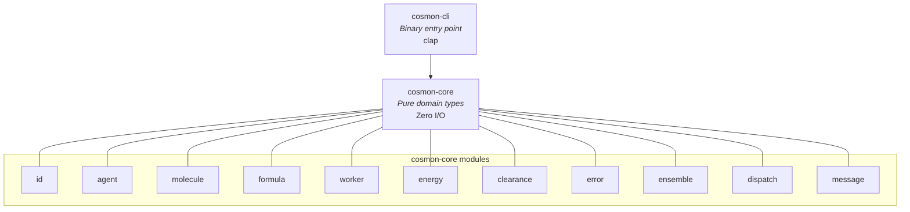
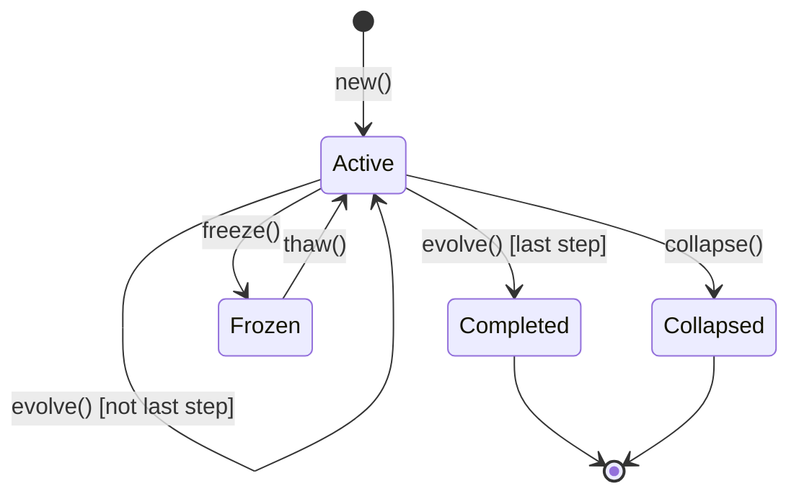
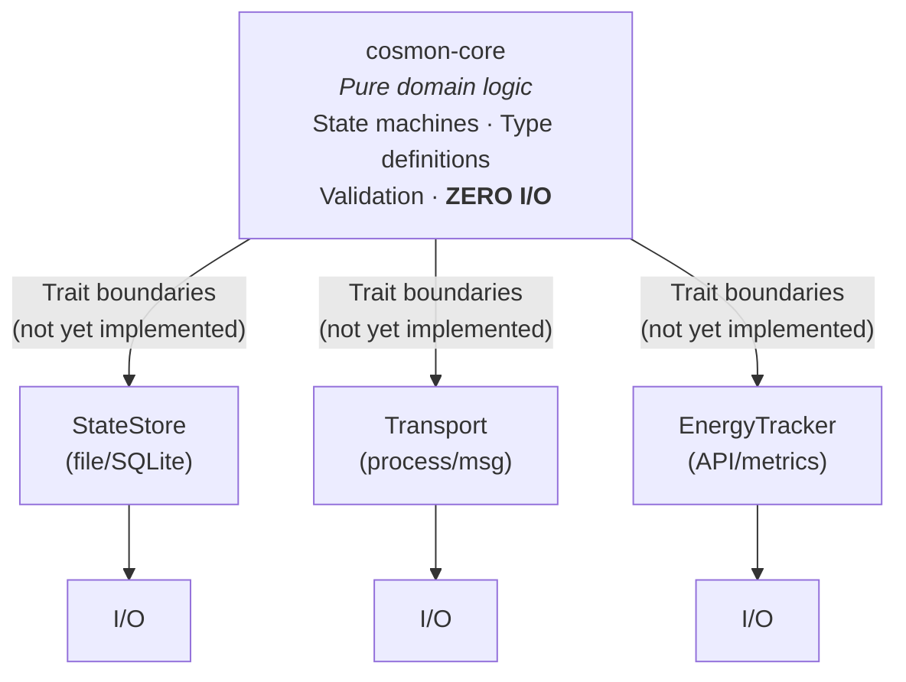

# Architecture

Cosmon is a Rust framework for multi-agent orchestration. It provides the
"laws of physics" for agent systems: typed state machines, lifecycle management,
communication channels, and health monitoring.

This document maps the current implementation: crate structure, module
responsibilities, trait interfaces, key design patterns, and the reasoning
behind each architectural decision.

---

## Crate Map



### cosmon-core

Pure domain types, state machines, and trait definitions. **Zero I/O.** All
external interactions will be injected through traits defined here and
implemented in separate crates.

Dependencies: `chrono`, `serde`, `serde_json`, `thiserror`, `toml`.

### cosmon-cli

Binary entry point using `clap`. Currently a stub (`cs: ready`). Will
provide commands: `ensemble`, `nucleate`, `evolve`, `observe`.

Dependencies: `clap`, `cosmon-core`.

---

## Module Map

### `id` -- Identity newtypes

Type-safe identifiers using the newtype pattern. Every ID wraps a `String`
with validation on construction. A `simple_id!` macro generates the
boilerplate for types that only require non-empty validation.

| Type | Format | Purpose |
|------|--------|---------|
| `AgentId` | Non-empty string | Agent definition (e.g. `"witness"`) |
| `FormulaId` | Non-empty string | Workflow template name |
| `SessionId` | Non-empty string | Running session identifier |
| `StepId` | Non-empty string | Step within a molecule |
| `MoleculeId` | `PREFIX-YYYYMMDD-XXXX` | Molecule instance with structured date |
| `WorkerId` | `{name}` or `ep-{name}` | Worker instance, optionally ensemble-prefixed |

All ID types implement `Display`, `FromStr`, `Serialize/Deserialize`, and
`TryFrom<String>`. The compiler prevents mixing ID types -- passing a
`WorkerId` where an `AgentId` is expected is a compile error.

### `agent` -- Agent roles

Defines `AgentRole` (Orchestration, Research, Implementation, Infrastructure,
Advisory) and the shared `ParseEnumError` type used across enum parsers.

### `molecule` -- Lifecycle state machine (typestate pattern)

The central domain object. A `Molecule<S>` tracks a workflow instance
parameterised by its lifecycle state. See [Typestate Pattern](#typestate-pattern)
below for the full explanation.

States: `Active`, `Frozen`, `Completed`, `Collapsed`.

The `MoleculeStatus` enum mirrors the typestate variants for serialization
and wire format.

### `formula` -- Workflow templates

Parses `.formula.toml` files into the `Formula` domain type. Performs
validation: no duplicate step IDs, all dependency references exist, no
circular dependencies (Kahn's topological sort). A formula defines the
steps a molecule will execute.

Key types: `Formula`, `Step`, `Variable`, `FormulaError`.

### `worker` -- Worker lifecycle

`WorkerStatus` enum: Starting, Active, Paused, Stopping, Stopped,
Error(String), Stale. Display/FromStr roundtrip including the `error:msg`
wire format.

### `energy` -- Token consumption tracking

Models the thermodynamic metaphor from the thesis. Newtypes for
`TokenCount` (u64), `TokenCost` (f64), `Temperature` (clamped 0.0-1.0).
`EnergyBudget` tracks consumption against a budget with alert thresholds.
`EnergyRecord` logs per-step token usage. `EnergyReport` aggregates by
worker and molecule with a free energy ratio metric.

### `clearance` -- Permission levels

`Clearance` enum: Read < Write < Execute. Derives `Ord` from variant order,
enabling `worker.clearance >= required` comparisons.

### `error` -- Error hierarchy

`CosmonError` covers all domain failures: not-found variants for each ID
type, invalid state transitions, clearance violations, formula parse errors,
state store errors, runtime errors, and transparent wrappers for `io::Error`
and `serde_json::Error`. All variants carry context (the offending IDs,
statuses, etc.).

### `ensemble`, `dispatch`, `message` -- Stubs

Placeholder modules for fleet management, dispatch logic, and agent
communication. Currently contain only module-level doc comments.

---

## Typestate Pattern

The molecule lifecycle uses the **typestate pattern**: each state is a
distinct Rust type, and only valid transitions compile.



### How it works

1. Four zero-sized marker types (`Active`, `Frozen`, `Completed`, `Collapsed`)
   implement the sealed `MoleculeState` trait.

2. `Molecule<S: MoleculeState>` carries a `PhantomData<S>` marker.

3. Transition methods are defined only on the appropriate `impl` block:
   - `Molecule<Active>` has `evolve()`, `freeze()`, `collapse()`
   - `Molecule<Frozen>` has `thaw()`
   - `Molecule<Completed>` and `Molecule<Collapsed>` have no transition methods

4. Invalid transitions are **compile errors**, not runtime checks:
   ```rust
   let frozen = mol.freeze();
   frozen.evolve(step);  // ERROR: no method `evolve` on Molecule<Frozen>
   ```

5. The internal `transition<T>()` method transfers common fields into a new
   state, updating the timestamp. Consuming `self` ensures the old state
   cannot be used after transition.

6. `evolve()` returns `EvolveOutcome` (Active | Completed) because the
   caller must handle both possibilities -- the type system forces this.

---

## Pure Core / Impure Shell



`cosmon-core` contains zero `use std::fs`, zero `use std::net`, zero async
runtime. All I/O will be injected through trait implementations in separate
crates. This enables:

- **Testing without mocks**: core logic is pure functions over domain types
- **Backend swapping**: flat files today, SQLite tomorrow, Dolt later
- **Independent evolution**: transport changes don't touch domain logic

### Planned trait interfaces

These traits are described in THESIS.md but not yet implemented in code:

| Trait | Responsibility | Future implementations |
|-------|---------------|----------------------|
| `StateStore` | Persist/load molecules, agents, formulas | Flat file, SQLite, Dolt |
| `TransportBackend` | Spawn workers, route messages, manage sessions | tmux+Claude Code, direct process |
| `EnergyTracker` | Record and query token consumption | In-memory, API-backed |
| `ModelProvider` | Abstract over LLM providers | Claude, GPT, local models |

---

## Design Decisions

### ADR-1: Why Rust?

**Context.** The framework manages agent lifecycles -- spawning, monitoring,
state transitions, message routing. These are transport-layer concerns:
deterministic, testable, and long-running.

**Decision.** Rust.

**Rationale.**
- Types encode invariants at zero runtime cost. `AgentId` is not `String`.
  `MoleculeStatus::Active` is not `MoleculeStatus::Collapsed`.
- The borrow checker prevents aliasing bugs. No two parts of the system can
  hold mutable references to the same state.
- Exhaustive enums: adding a new `MoleculeStatus` variant forces every
  `match` in the codebase to handle it. Forgotten cases are compile errors.
- Physics framing (from thesis): Rust minimises free energy -- the gap
  between what the system claims to do and what it actually does. Every
  invariant encoded in the type system is one fewer runtime surprise.

### ADR-2: Why typestate?

**Context.** Molecules move through a lifecycle: Active -> Frozen/Completed/Collapsed.
Invalid transitions (e.g. completing a frozen molecule) must be prevented.

**Decision.** Typestate pattern with sealed marker traits.

**Rationale.**
- Invalid transitions are compile errors, not runtime checks.
- Each state's API surface is exactly what's available in that state --
  no `if self.status == Active` guards.
- The sealed trait prevents external code from inventing new states.
- Cost: slightly more verbose API (must match on `EvolveOutcome`). This is
  a feature -- the caller is forced to handle both paths.

### ADR-3: Why hexagonal architecture?

**Context.** AI models evolve rapidly. The transport layer (spawning, routing,
persisting) should not change when a new model is released.

**Decision.** Pure core with trait-based ports. All I/O behind traits,
implemented in separate crates.

**Rationale.**
- Backend swappable: flat files today, SQLite tomorrow, Dolt later -- the
  core never knows or cares.
- Testable without mocks: core logic operates on pure domain types.
- Framework longevity: the transport layer can be optimised and hardened
  independently of AI cognition.

### ADR-4: Why no database (yet)?

**Context.** The framework needs state persistence. A database adds
operational complexity.

**Decision.** No database in the initial implementation. State persistence
will be added through the `StateStore` trait. Flat files first, SQLite
upgrade path.

**Rationale.**
- Flat files are debuggable (`cat`, `jq`, `git diff`).
- The `StateStore` trait abstracts storage -- upgrading to SQLite or Dolt
  requires implementing one trait, not rewriting the core.
- Premature database integration would couple the core to a specific backend
  before the access patterns are known.

### ADR-5: Why newtype IDs?

**Context.** The system has many string identifiers: agent names, molecule
IDs, worker names, session IDs.

**Decision.** Newtype wrapper for every ID kind with validation on
construction.

**Rationale.**
- The compiler prevents passing a `WorkerId` where an `AgentId` is expected.
- Validation on `::new()` means invalid IDs cannot exist -- if you have an
  `AgentId`, it is guaranteed non-empty.
- `MoleculeId` enforces the `PREFIX-YYYYMMDD-XXXX` format structurally.
- The `simple_id!` macro eliminates boilerplate while maintaining type safety.

### ADR-11: Why content-identity?

**Context.** Cosmon orchestrates agents that produce, consume, and cache
artifacts. Each artifact needs an identity -- something to look up, compare,
and verify.

**Decision.** Content-Identity Principle: `identity = f(content)`, not
`f(location)`. See [ADR-011](adr/011-content-identity-principle.md) for the
full decision record.

**Rationale.**
- Cache correctness by construction: a cache hit is definitionally correct.
- Natural deduplication: same content = same identity, no coordination needed.
- Three flavors (content hash, computation hash, external reference) cover
  all artifact types in the framework.
- The mtime+size fast-path avoids re-hashing unchanged files.
