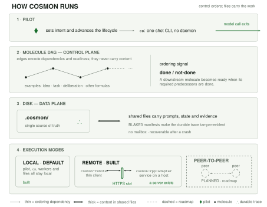
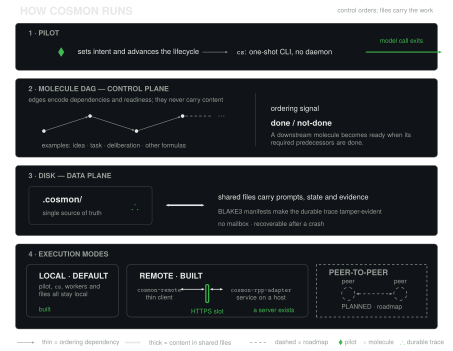
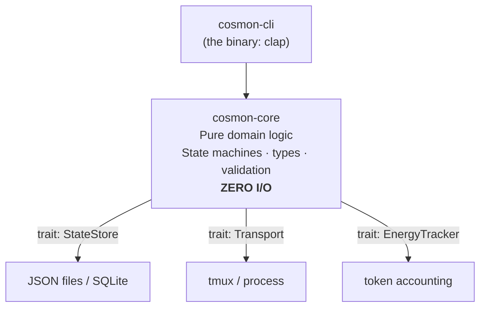

# Architecture: the two layers

> These commands use physics-inspired names (nucleate, evolve, tackle, …). New to
> the vocabulary? See [The physics vocabulary](./physics-vocabulary.md).

<figure>
  
  
  <figcaption>How cosmon runs — pilot, control plane (ordering), disk (content), and execution modes.</figcaption>
</figure>

Cosmon is organized as **two cooperating layers that share one state store.** The
first is everything you can touch today; the second is an optional process that
sits on top without ever becoming load-bearing. Understanding this split explains
most of cosmon's design choices at once.

## Layer A: the Transactional Core (today)

The core is the stateless CLI. Every `cs` command is git-like: read state,
mutate, write, exit. No daemon, no lingering process. State lives on disk as JSON
files in `.cosmon/state/`, and that is the source of truth. Because each command
is a complete one-shot transaction, the core composes with any scheduler: cron,
launchd, a shell loop, a CI job, or a human at a terminal.

This is the load-bearing layer. Every capability cosmon offers is reachable here,
human-driven, with nothing else running.

## Layer B: the Resident Runtime (optional, additive)

The runtime is one long-lived process, `cs run`, with an event loop. It polls
the on-disk state, asks a pluggable **policy** what to do next (a DAG scheduler
today; a decay-aware re-planner or an external LLM-backed planner in the future),
and applies the answer through the very same commands the CLI exposes.

Four rules keep Layer B honest, and they are non-negotiable:

- **It is a client, never a substrate.** The runtime cannot mutate state through
  any channel the CLI does not also expose. A human can `cs observe` or
  `cs freeze` a molecule while the runtime works on it; they are clients of the
  same file-based truth.
- **It owns no state.** JSON on disk stays authoritative. Kill the runtime,
  restart it, and it rebuilds its entire picture from the files. There is no RAM
  it is afraid to lose.
- **It is deletable in one move.** Layer B is a separate build target; removing it
  never touches the core. Layer A does not require the runtime to exist.
- **It is never the only path.** Anything the runtime does, a human can do at the
  CLI. The runtime is pure convenience layered on a system that already works
  without it.

The [three regimes](./regimes.md) formalize when each layer is in charge: Layer A
drives the *inert* and *propelled* regimes; Layer B, when running, drives the
*autonomous* regime, using Layer A's own doorways.

## Inside the core: pure core, impure shell

The code mirrors the two-layer discipline at a smaller scale. `cosmon-core`
contains the domain (the state machines, the identity types, the validation)
and has **zero I/O**: no filesystem, no network, no async runtime. All the
messy outside world (reading files, spawning tmux, tracking tokens) lives behind
traits, implemented in separate crates.

This buys three things: the core is **testable without mocks** (it is pure
functions over domain types), the backends are **swappable** (flat files today,
SQLite tomorrow, without touching the core), and the transport layer can be
**hardened independently** of the AI cognition it carries.

## Two patterns worth knowing

Two Rust patterns do most of the structural work, and both trade a little
verbosity for compile-time safety:

- **Typestate for the molecule lifecycle.** Each lifecycle state (`Active`,
  `Frozen`, `Completed`, `Collapsed`) is a *distinct type*, and transition
  methods exist only on the states that allow them. Trying to `evolve` a frozen
  molecule is not a runtime error checked with an `if`; it simply does not
  compile. The type system makes invalid transitions unrepresentable.

- **Newtype IDs.** Every identifier (`MoleculeId`, `WorkerId`, `AgentId`) is its
  own wrapper type with validation on construction, not a bare `String`. Passing a
  `WorkerId` where an `AgentId` is expected is a compile error, and an ID that
  exists is guaranteed valid because it could not have been built otherwise.

The through-line of every one of these choices is the same physics framing:
minimize the gap between what the system *claims* to do and what it *actually*
does. Every invariant pushed into the type system is one fewer runtime surprise,
and one fewer thing that can drift when an agent crashes.

For the design bet the whole architecture rests on, see
[Why a stateless CLI](./stateless-cli.md); for how it survives failure, see
[Crash recovery](./crash-recovery.md).
