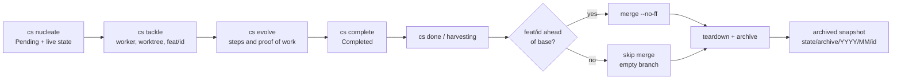

# The life of a molecule: from intent to harvesting

A molecule is a durable unit of work, not merely a prompt sent to an agent.
It has an identity, a live record on disk, a worker when it is being tackled,
and a final harvesting pass that removes the temporary machinery without
discarding the evidence. This page explains that journey; the [lifecycle
reference](../reference/lifecycle.md) describes the commands themselves.

The important distinction is between **completion** and **harvesting**. A
worker can finish its formula and leave a molecule `Completed`. Its worktree,
tmux session, fleet entry, and feature branch can still exist. `cs done` is the
separate harvesting operation that integrates any same-galaxy branch and tears
that apparatus down. Without it, a completed molecule is not yet cleaned up.



## 1. Nucleation gives the work an address

`cs nucleate` creates the live molecule directory:

```text
.cosmon/state/fleets/<fleet>/molecules/<id>/
  state.json
  briefing.md
  prompt.md
```

`state.json` is the authoritative machine-readable record: identity, status,
formula data, links, timestamps, and eventually worker/process information.
`prompt.md` preserves the operator's original intent in a human-readable form.
`briefing.md` renders the formula's steps so a worker and later reviewer share
the same contract. Formula-specific work can add `frame.md`, `synthesis.md`,
`responses/`, and `log.md` in this same molecule directory.

The accompanying event stream records transitions as an append-only history.
Events are evidence of what happened, not a second mutable status store: the
current state remains `state.json`. This split is why an interrupted command or
restarted worker can resume from disk instead of depending on an agent's lost
context.

The entire `.cosmon/state/` tree is gitignored. It is the live source of truth
on that machine, not a Git mirror. Do not infer from the ignore rule that it is
disposable: it is where Cosmon reads and writes the running molecule.

## 2. Tackling creates temporary execution machinery

When an operator runs `cs tackle <id>`, Cosmon turns the pending molecule into
a dispatched worker. In the normal same-galaxy case it creates:

- a Git worktree at `.worktrees/<id>`;
- a branch named `feat/<id>` for that worktree; and
- a tmux session running the selected adapter, plus a worker entry in the
  fleet record.

The adapter is the harness that actually performs the work; Cosmon supplies the
identity, worktree, prompt, and lifecycle around it. The worker reads its
briefing and writes its cognitive artifacts—such as `synthesis.md`, `frame.md`,
and `log.md`—to the molecule directory in `.cosmon/state`, not to the
worktree. That separation matters: `.worktrees/<id>` is temporary and will be
removed by harvesting.

For ordinary code work in this galaxy, the **worker** makes the code commits on
`feat/<id>`. `cs done` later integrates those commits; it is not the author of
the worker's code changes.

### The cross-galaxy case: an intentionally empty feature branch

Some assignments change another galaxy—for example, a Cosmon worker editing a
`knowledge/` repository. The worker commits directly in that target galaxy.
The local Cosmon `feat/<id>` branch therefore has no commits ahead of its base.
This is expected, not a failed task and not a missing commit.

The distinction is decisive at harvesting time:

| Where the worker made the change | Who commits the work | What `cs done` does to local `feat/<id>` |
|---|---|---|
| This galaxy's worktree | The worker, on `feat/<id>` | Merges its commits into the base branch |
| A target galaxy | The worker, directly in that target galaxy | Detects no commits ahead and skips the local merge |

`cs done` never manufactures a cross-galaxy commit. The proof of that work is
the worker's commit in the target galaxy and the Cosmon molecule's artifacts;
the local feature branch is merely an empty execution shell.

## 3. Evolution records progress; completion is terminal but not merged

As the worker satisfies formula steps, `cs evolve` advances the molecule and
updates the briefing seals and event trail. Formula artifacts accumulate in the
molecule directory. A successful worker then uses `cs complete`, which marks
the molecule `Completed`.

`Completed` is a terminal status, but it does **not** mean “merged into the
base branch” and it does not destroy anything. At this point the temporary
tmux session, fleet registration, worktree, and `feat/<id>` may still be
present. This explicit gap is intentional: the worker may declare the work
complete, while only the human/operator-side harvesting boundary is allowed to
merge and self-destruct the worker's environment. ADR-052 calls out completed
but unharvested work as a lifecycle failure to be detected rather than silently
forgotten.

## 4. `cs done` harvests the completed molecule

`cs done <id>` closes the loop. It first checks that the molecule is terminal
and inspects the feature branch against the base branch.

1. If `feat/<id>` contains commits that are not yet reachable from the base,
   it integrates them with `git merge --no-ff` (the default strategy). A merge
   conflict is a loud failure: the branch remains the copy of the work and is
   not deleted.
2. If the branch has no commits ahead of the base—typical for a cross-galaxy
   assignment—Cosmon reports **`skip merge (empty branch — no commits ahead of
   base)`**. It does not commit or merge the target galaxy's work.
3. After a successful merge, or after the valid empty-branch path, Cosmon kills
   the tmux session, purges the worker from the fleet record, removes
   `.worktrees/<id>`, and deletes `feat/<id>` once Git confirms the branch is
   reachable from the base. Guards preserve a branch whose committed work did
   not land.
4. Cosmon then makes a best-effort auto-commit of molecule artifacts when
   there are eligible changes. This is an evidence convenience, not a substitute
   for the worker's code commit—and it does not turn a cross-galaxy empty branch
   into a commit.

The ordering prevents both common misconceptions: a worker's same-galaxy code
is committed before harvesting, and a cross-galaxy worker's code has already
been committed in its target galaxy. Harvesting integrates only the former.

## 5. Archive the terminal evidence before the live apparatus disappears

During `cs done`, Cosmon snapshots the molecule under:

```text
.cosmon/state/archive/YYYY/MM/<id>/
  molecule.json
  edges.json
  manifest.json
  events.jsonl
  synthesis.md                 # when present
  responses/                   # when present
```

`molecule.json` is a canonical terminal-state snapshot; `edges.json` preserves
the molecule's typed links; `manifest.json` records the formula pin and
artifact hashes; and the per-molecule `events.jsonl` is append-only. A
fleet-level monthly event stream is also appended under
`.cosmon/state/archive/events/`. The archive writer marks the live molecule as
archived only after the snapshot succeeds. Its write is best-effort so an
archive I/O failure is surfaced as a warning rather than rewriting history or
pretending the terminal transition did not happen.

This archive is what survives the loss of the worktree and the feature branch.
It is a durable on-disk record beneath the gitignored state tree; its purpose is
to preserve the molecule's causal and narrative trace, not to claim that the
temporary worktree was permanent. The append-only event logs are especially
important: later readers can distinguish a `Completed` transition from the
separate `Done` harvesting transition instead of collapsing them into one
fictional instant.

## One concrete pair of outcomes

For `task-20260715-alpha`, a worker edits Rust in
`.worktrees/task-20260715-alpha`, commits the code to
`feat/task-20260715-alpha`, completes the formula, and `cs done` merges that
branch into the base. The branch and worktree are then removed; the molecule's
state and archive retain the evidence.

For `edit-20260715-beta`, a worker uses its Cosmon worktree as a control point
but edits and commits documentation in a separate `knowledge` galaxy. Its local
`feat/edit-20260715-beta` has no commits ahead. Once completed, `cs done` logs
the empty-branch merge skip, tears down the local worker shell, and archives the
molecule. The documentation commit remains where the worker made it: in
`knowledge`, not in Cosmon's base branch.

## Sources and related reading

- [Archive reference](../reference/tools.md#cs-archive) describes the terminal
  archive and its preservation invariants.
- [`cs done` reference](../reference/execution.md#cs-done) explains the separate
  completion and harvesting boundary.
- [Agent adapters: a harness over harnesses](./adapter.md) explains what is
  launched inside the tmux worker session.
- [Crash recovery: state on disk, not in RAM](./crash-recovery.md) explains why
  the live state directory is authoritative during a run.
