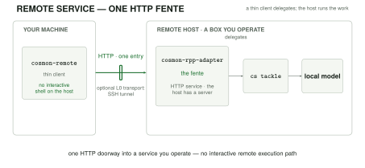
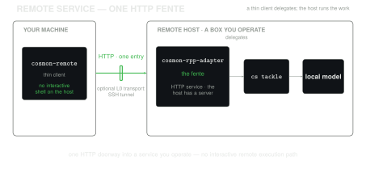

# Run cosmon as a remote service

**Goal:** run a cosmon service on a remote GPU box and drive it from your own
machine with `cosmon-remote`. This is useful for an *invited-guest* host: a
machine you operate but may not own, where you have no root access and cannot
use Docker.

The client never needs an interactive shell on the service host. It talks to
one HTTP entry point (the *fente*); an SSH tunnel is only an L0 transport that
makes that entry point local to the client. Configure `ProxyJump` in your SSH
config if `<remote>` is behind a bastion.

<figure>
  
  
  <figcaption>Remote mode has one HTTP doorway; lifecycle work and the model stay on the host you operate.</figcaption>
</figure>

> This guide uses a demo identity provider so that the complete auth path is
> reproducible. Replace it with your production issuer before exposing the
> service beyond a private tunnel. For how this service surface relates to the
> runtime, see [Control plane vs data plane](../explanation/control-vs-data-plane.md).

## What to deploy

The public `noogram/cosmon` product closure contains both service components:

| Crate | Role | License |
|---|---|---|
| `cosmon-rpp-adapter` | The HTTP fente and `/v1/...` service surface. | AGPL-3.0-only |
| `cosmon-remote` | Thin client that drives the service. | AGPL-3.0-only |

The service delegates work to `cs tackle`; it is not a second scheduler. On
the host, `cs` resolves the selected worker adapter. For this setup it uses the
built-in `local` adapter: an in-process Ollama `/v1` client. No Node.js,
Claude runtime, or tmux session is required for that worker leg.

## Step 1: Build and prepare the remote galaxy

Build a static musl release on your development machine. `cargo-zigbuild` uses
Zig as the cross-linker, so this works without a Linux container. Install its
prerequisites first (Rust's musl target, Zig, and `cargo-zigbuild`).

```sh
cd /path/to/cosmon
cargo zigbuild --release --target x86_64-unknown-linux-musl \
  -p cosmon-rpp-adapter --bin cosmon-rpp-adapter
cargo zigbuild --release --target x86_64-unknown-linux-musl \
  -p cosmon-oidc-testkit --bin cs-oidc-mock
```

Copy the resulting binaries, plus a compatible `cs` binary, to a directory you
control on the remote host. This guide calls it `$COSMON_HOME`.

```sh
ssh <remote> "mkdir -p '$COSMON_HOME/bin' '$COSMON_HOME/state/security' '$COSMON_HOME/galaxies'"
scp target/x86_64-unknown-linux-musl/release/cosmon-rpp-adapter \
    target/x86_64-unknown-linux-musl/release/cs-oidc-mock \
    /path/to/compatible/cs <remote>:$COSMON_HOME/bin/
```

Install or configure Ollama on the remote host and make a model that fits its
VRAM available. Initialise the `demo` galaxy and select the local adapter so
`cs tackle` selects Ollama rather than an external coding-agent adapter:

```sh
ssh <remote> '
  "$COSMON_HOME/bin/cs" init "$COSMON_HOME/galaxies/demo" --tenant demo
  cat >> "$COSMON_HOME/galaxies/demo/.cosmon/config.toml" <<'"'"'EOF'"'"'

[adapters]
default = "local"

[adapters.local]
default_model = "<your-model>"
EOF
'
```

## Step 2: Start the demo identity provider and pin its keys

`cs-oidc-mock` is a small demo IdP. Its defaults are issuer
`https://idp.test.cosmon-oidc-testkit`, audience `cosmon-rpp-test`, a
10-minute token lifetime, and bind address `0.0.0.0:8444`. This guide binds it
to loopback on port `8444`, writes its JWKS, and uses its `POST /issue` route to
mint signed test tokens:

```sh
ssh <remote> '
  $COSMON_HOME/bin/cs-oidc-mock \
    --bind 127.0.0.1:8444 \
    --write-jwks-out $COSMON_HOME/state/security/jwks/idp.json
'
```

In a second remote shell, declare the matching issuer and render the demo
identity's binding. The issuer, audience, and subject must agree with the token
minted below:

```sh
ssh <remote> '
  cat > "$COSMON_HOME/state/security/trusted-issuers.toml" <<'"'"'EOF'"'"'
[[issuer]]
iss = "https://idp.test.cosmon-oidc-testkit"
jwks_uri = "http://127.0.0.1:8444/jwks.json"
audiences = ["cosmon-rpp-test"]
EOF

  mkdir -p "$COSMON_HOME/state/nucleons/demo"
  "$COSMON_HOME/bin/cosmon-rpp-adapter" nucleon render \
    --noyau demo --sub demo-operator \
    --iss https://idp.test.cosmon-oidc-testkit --aud cosmon-rpp-test \
    --scope cosmon:molecule:read --scope cosmon:molecule:write \
    > "$COSMON_HOME/state/nucleons/demo/oidc-identity.toml"
'
```

The pinned JWKS and this nucleon binding are both required: a valid token alone
does not grant access to a tenant.

For a production deployment, replace the mock with your production IdP, pin
its JWKS under `$COSMON_HOME/state/security`, and keep the issuer and binding
rules explicit.

## Step 3: Start the fente on loopback

Start `cosmon-rpp-adapter` with its state directory, tenant configuration, and
the loopback address that the tunnel will reach. Keep this process supervised
by the service manager available to the host.

```sh
ssh <remote> '
  $COSMON_HOME/bin/cosmon-rpp-adapter \
    --bind 127.0.0.1:8443 \
    --config $COSMON_HOME/rpp.toml
'
```

The `rpp.toml` config declares the state directory, the tenant galaxies root, and
the path to the `cs` binary — for example:

```toml
bind_addr = "127.0.0.1:8443"
state_dir = "/opt/cosmon/state"
galaxies_root = "/opt/cosmon/galaxies"
cs_path = "/opt/cosmon/bin/cs"
artifact_root = "/opt/cosmon/artifacts"
```

The service is deliberately loopback-only here. The tunnel is the sole L0 path
to its HTTP surface; the client does not use a direct shell or container-exec
path to create, tackle, or fetch work.

## Step 4: Open the tunnel, mint a demo token, and create a client profile

On the client machine, open a tunnel. It maps the remote service's loopback
port to a local port. The mock remains loopback-only on the remote host, so
mint its short-lived token server-side and pass it to the client; this avoids
needing a second IdP tunnel:

```sh
ssh -f -N -L 127.0.0.1:8443:127.0.0.1:8443 <remote>

TOKEN=$(ssh <remote> '
  curl --fail --silent --show-error -X POST \
    "http://127.0.0.1:8444/issue?sub=demo-operator&aud=cosmon-rpp-test&scopes=cosmon:molecule:read,cosmon:molecule:write" \
    | jq -r .access_token
')
export COSMON_REMOTE_TOKEN="$TOKEN"
```

`cosmon-remote` stores a default profile and one profile file per service.
Resolution is `--profile` first, then
`$COSMON_REMOTE_PROFILE`, then the configured default.

Create the profile manually (or use the service's `install.sh` profile
installer when your deployment provides one). `oidc-url` remains required by a
profile, but the pre-minted token means this client does not need to reach it:

```sh
cosmon-remote config init demo http://127.0.0.1:8443
cosmon-remote config set host http://127.0.0.1:8443
cosmon-remote config set sub demo-operator
cosmon-remote config set aud cosmon-rpp-test
cosmon-remote config set oidc-url http://127.0.0.1:8444
cosmon-remote config set issuer https://idp.test.cosmon-oidc-testkit
cosmon-remote config set client-id cosmon-rpp-test
cosmon-remote config set noyau demo
cosmon-remote config set timeout 30
cosmon-remote config set artifacts-dir ./cosmon-artifacts
cosmon-remote config set phone-home off
```

Verify both liveness and the identity that the service resolved:

```sh
cosmon-remote healthz
cosmon-remote auth me
```

## Step 5: Drive the measured golden path

From the thin client, create a molecule, dispatch it, wait for its detached
worker to finish, and retrieve its artifact:

```sh
cosmon-remote do --yes "write a Rust function that returns the nth Fibonacci number"
cosmon-remote artifact list <molecule-id>
cosmon-remote artifact get <molecule-id> <artifact-token> --out ./result.md
```

The `do` gesture performs nucleate then tackle; `tackle` returns a worker
session promptly while the `local` Ollama worker runs detached on the remote
host. The successful path is:

```text
thin client -> tunnel -> fente -> cs tackle -> local Ollama worker
             <- artifact get <- completed molecule <- detached worker
```

This confirms the full service contract: a profile-authenticated thin client
creates work over the tunnel, the remote service dispatches the local adapter,
the molecule reaches `completed`, and the client receives the resulting
artifact without an interactive remote execution path.

### Addressing artifacts

`artifact list` prints opaque artifact tokens such as `art_...`; use the token,
not a server path, with `artifact get <molecule-id> <artifact-token>`. During
`cs tackle`, the adapter creates `<artifact_root>/<noyau>/<molecule-id>/` and
exports that directory as `$COSMON_ARTIFACT_DIR` to the worker. The client
fetches bytes with `--out`; when omitted, it writes under
`./cosmon-artifacts/<molecule-id>/<artifact-token>`.

### Troubleshooting and security

On a sovereign local-adapter host, a `503 tackle_unavailable` message mentioning
“Claude Code not installed” is an expected default-container diagnostic, not a
requirement for the local Ollama path. An empty `artifact list` normally means
the worker has not written its deliverable or has not completed yet. A `401` or
`403` from `auth me` means to compare the token's issuer, subject, audience, and
scopes with `trusted-issuers.toml` and the rendered nucleon binding.

**Security:** the local worker is sandboxed for untrusted work: it receives a
six-tool, shell-free registry rather than host-shell access; a toolchain
preflight runs before work; and each molecule has a wall-clock limit. It cannot
use that worker interface to scan the host or read outside its worktree.

## See also

- [Agent adapters: a harness over harnesses](../explanation/adapter.md): how
  cosmon selects and runs an adapter.
- [Control plane vs data plane](../explanation/control-vs-data-plane.md): why
  artifact retrieval is separate from lifecycle control.
- [Molecule lifecycle reference](../reference/lifecycle.md): lifecycle terms
  and commands in full.
