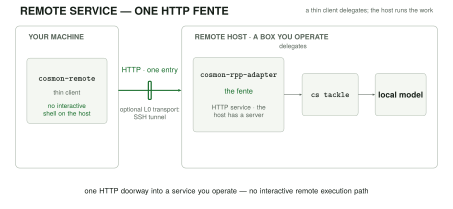
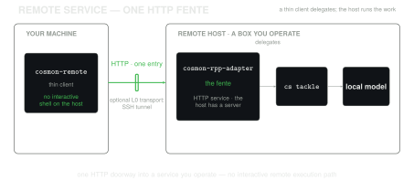

# Run cosmon as a remote service

**Goal:** run a cosmon service on a remote GPU box and drive it from your own
machine with `cosmon-remote`. This is useful for an *invited-guest* host: a
machine you operate but may not own, where you have no root access and cannot
use Docker.

The client never needs an interactive shell on the service host. It talks to
one HTTP entry point (the *fente*); an SSH tunnel is only an L0 transport that
makes that entry point local to the client. Configure `ProxyJump` in your SSH
config if `<remote>` is behind a bastion.

<figure>
  
  
  <figcaption>Remote mode has one HTTP doorway; lifecycle work and the model stay on the host you operate.</figcaption>
</figure>

> This guide uses a demo identity provider so that the complete auth path is
> reproducible. Replace it with your production issuer before exposing the
> service beyond a private tunnel. For how this service surface relates to the
> runtime, see [Control plane vs data plane](../explanation/control-vs-data-plane.md).

## What to deploy

The public `noogram/cosmon` product closure contains both service components:

| Crate | Role | License |
|---|---|---|
| `cosmon-rpp-adapter` | The HTTP fente and `/v1/...` service surface. | AGPL-3.0-only |
| `cosmon-remote` | Thin client that drives the service. | AGPL-3.0-only |

The two host-side binaries — `cosmon-rpp-adapter` (the fente) and `cs-oidc-mock`
(the demo IdP used in Step 2) — ship as a signed `cosmon-service-<version>-<target>.tar.gz`
release asset per target, alongside the `cs` CLI tarball. Step 1 therefore has
two routes: **download the signed release bundle** (no Rust toolchain required),
or **build from source**. Prefer the download route unless you need an unreleased
revision.

The client, `cosmon-remote`, is a laptop tool, so it ships *with* `cs`: the
`cosmon-<version>-<target>.tar.gz` release tarball carries both, and the
[one-liner installer](../getting-started/install.md) (`curl -fsSL https://noogram.org/cosmon/install.sh | sh`)
and the Homebrew formula each place `cs` **and** `cosmon-remote` together. If you
installed `cs`, you already have the connector — there is no separate client
fetch. The steps below cover only the **host**; run the `cosmon-remote` commands
from Step 4 on the machine where you installed `cs`.

The service delegates work to `cs tackle`; it is not a second scheduler. On
the host, `cs` resolves the selected worker adapter. For this setup it uses the
built-in `local` adapter: an in-process Ollama `/v1` client. No Node.js,
Claude runtime, or tmux session is required for that worker leg.

## Step 1: Get the binaries and prepare the remote galaxy

You need three binaries on the host: `cosmon-rpp-adapter`, `cs-oidc-mock`, and a
compatible `cs`. Get them the signed-release way (no toolchain) or build them
from source.

First, make the target directory on the host. This guide calls it `$COSMON_HOME`.

```sh
ssh <remote> "mkdir -p '$COSMON_HOME/bin' '$COSMON_HOME/state/security' '$COSMON_HOME/galaxies'"
```

### Route A — download the signed release bundle (recommended)

Each release ships a `cosmon-service-<version>-<target>.tar.gz` (the fente + demo
IdP) next to the `cs` CLI tarball. Pick the target matching the host — a static
Linux box uses `x86_64-unknown-linux-musl` or `aarch64-unknown-linux-musl`. Both
tarballs are cosign-signed and Rekor-anchored; verify them as in
[Verify the binary's provenance](./verify-the-binary.md).

```sh
ver=0.1.0
target=x86_64-unknown-linux-musl
base="https://github.com/noogram/cosmon/releases/download/v${ver}"
curl -fsSLO "${base}/cosmon-service-${ver}-${target}.tar.gz"   # cosmon-rpp-adapter + cs-oidc-mock
curl -fsSLO "${base}/cosmon-${ver}-${target}.tar.gz"           # cs
tar xzf "cosmon-service-${ver}-${target}.tar.gz"
tar xzf "cosmon-${ver}-${target}.tar.gz"
scp cosmon-rpp-adapter cs-oidc-mock cs <remote>:$COSMON_HOME/bin/
```

### Route B — build from source

Build a static musl release on your development machine. `cargo-zigbuild` uses
Zig as the cross-linker, so this works without a Linux container. Install its
prerequisites first (Rust's musl target, Zig, and `cargo-zigbuild`).

```sh
cd /path/to/cosmon
cargo zigbuild --release --target x86_64-unknown-linux-musl \
  -p cosmon-rpp-adapter --bin cosmon-rpp-adapter
cargo zigbuild --release --target x86_64-unknown-linux-musl \
  -p cosmon-oidc-testkit --bin cs-oidc-mock
```

Copy the resulting binaries, plus a compatible `cs` binary, to `$COSMON_HOME/bin`.

```sh
scp target/x86_64-unknown-linux-musl/release/cosmon-rpp-adapter \
    target/x86_64-unknown-linux-musl/release/cs-oidc-mock \
    /path/to/compatible/cs <remote>:$COSMON_HOME/bin/
```

Install or configure Ollama on the remote host and make a model that fits its
VRAM available. Initialise the `demo` galaxy and select the local adapter so
`cs tackle` selects Ollama rather than an external coding-agent adapter:

```sh
ssh <remote> '
  "$COSMON_HOME/bin/cs" init "$COSMON_HOME/galaxies/demo" --tenant demo
  cat >> "$COSMON_HOME/galaxies/demo/.cosmon/config.toml" <<'"'"'EOF'"'"'

[adapters]
default = "local"

[adapters.local]
default_model = "<your-model>"
EOF
'
```

## Step 2: Start the demo identity provider and pin its keys

`cs-oidc-mock` is a small demo IdP. Its defaults are issuer
`https://idp.test.cosmon-oidc-testkit`, audience `cosmon-rpp-test`, a
10-minute token lifetime, and bind address `0.0.0.0:8444`. This guide binds it
to loopback on port `8444`, writes its JWKS, and uses its `POST /issue` route to
mint signed test tokens:

```sh
ssh <remote> '
  $COSMON_HOME/bin/cs-oidc-mock \
    --bind 127.0.0.1:8444 \
    --write-jwks-out $COSMON_HOME/state/security/jwks/idp.json
'
```

In a second remote shell, declare the matching issuer and render the demo
identity's binding. The issuer, audience, and subject must agree with the token
minted below:

```sh
ssh <remote> '
  cat > "$COSMON_HOME/state/security/trusted-issuers.toml" <<'"'"'EOF'"'"'
[[issuer]]
iss = "https://idp.test.cosmon-oidc-testkit"
jwks_uri = "http://127.0.0.1:8444/jwks.json"
audiences = ["cosmon-rpp-test"]
EOF

  mkdir -p "$COSMON_HOME/state/nucleons/demo"
  "$COSMON_HOME/bin/cosmon-rpp-adapter" nucleon render \
    --noyau demo --sub demo-operator \
    --iss https://idp.test.cosmon-oidc-testkit --aud cosmon-rpp-test \
    --scope cosmon:molecule:read --scope cosmon:molecule:write \
    > "$COSMON_HOME/state/nucleons/demo/oidc-identity.toml"
'
```

The pinned JWKS and this nucleon binding are both required: a valid token alone
does not grant access to a tenant.

For a production deployment, replace the mock with your production IdP, pin
its JWKS under `$COSMON_HOME/state/security`, and keep the issuer and binding
rules explicit.

## Step 3: Start the fente on loopback

Start `cosmon-rpp-adapter` with its state directory, tenant configuration, and
the loopback address that the tunnel will reach. Keep this process supervised
by the service manager available to the host.

```sh
ssh <remote> '
  $COSMON_HOME/bin/cosmon-rpp-adapter \
    --bind 127.0.0.1:8443 \
    --config $COSMON_HOME/rpp.toml
'
```

The `rpp.toml` config declares the state directory, the tenant galaxies root, and
the path to the `cs` binary — for example:

```toml
bind_addr = "127.0.0.1:8443"
state_dir = "/opt/cosmon/state"
galaxies_root = "/opt/cosmon/galaxies"
cs_path = "/opt/cosmon/bin/cs"
artifact_root = "/opt/cosmon/artifacts"
```

The service is deliberately loopback-only here. The tunnel is the sole L0 path
to its HTTP surface; the client does not use a direct shell or container-exec
path to create, tackle, or fetch work.

## Step 4: Open the tunnel, mint a demo token, and create a client profile

On the client machine, open a tunnel. It maps the remote service's loopback
port to a local port. The mock remains loopback-only on the remote host, so
mint its short-lived token server-side and pass it to the client; this avoids
needing a second IdP tunnel:

```sh
ssh -f -N -L 127.0.0.1:8443:127.0.0.1:8443 <remote>

TOKEN=$(ssh <remote> '
  curl --fail --silent --show-error -X POST \
    "http://127.0.0.1:8444/issue?sub=demo-operator&aud=cosmon-rpp-test&scopes=cosmon:molecule:read,cosmon:molecule:write" \
    | jq -r .access_token
')
export COSMON_REMOTE_TOKEN="$TOKEN"
```

`cosmon-remote` stores a default profile and one profile file per service.
Resolution is `--profile` first, then
`$COSMON_REMOTE_PROFILE`, then the configured default.

Create the profile manually (or use the service's `install.sh` profile
installer when your deployment provides one). `oidc-url` remains required by a
profile, but the pre-minted token means this client does not need to reach it:

```sh
cosmon-remote config init demo http://127.0.0.1:8443
cosmon-remote config set host http://127.0.0.1:8443
cosmon-remote config set sub demo-operator
cosmon-remote config set aud cosmon-rpp-test
cosmon-remote config set oidc-url http://127.0.0.1:8444
cosmon-remote config set issuer https://idp.test.cosmon-oidc-testkit
cosmon-remote config set client-id cosmon-rpp-test
cosmon-remote config set noyau demo
cosmon-remote config set timeout 30
cosmon-remote config set artifacts-dir ./cosmon-artifacts
cosmon-remote config set phone-home off
```

Verify both liveness and the identity that the service resolved:

```sh
cosmon-remote healthz
cosmon-remote auth me
```

### Signing in from inside a container

`cosmon-remote login` runs the browser half of the OAuth flow: it opens a
one-shot listener for the redirect, sends you to the identity provider, and
catches the `?code=…` the browser is bounced back with. By default that
listener binds `127.0.0.1:7777`, and the URL registered with the provider —
the one the browser is told to come back to — is `http://127.0.0.1:7777/callback`.
On a laptop the two are the same machine and there is nothing to arrange.

Inside a container or a VM they are not the same machine. The browser is on
your desktop; `cosmon-remote` is in the box. The browser dials *its own*
`127.0.0.1:7777` and the redirect never crosses the boundary. The fix depends
on how the box is reached:

```sh
# SSH into a VM: the tunnel's far end is opened on the VM's OWN loopback, so
# the default bind already answers there — no --bind needed.
ssh -L 7777:localhost:7777 you@the-vm
cosmon-remote login

# A container reached by a PUBLISHED port is different: sshd is not in the
# loop, so the port lands on the container's external interface, not its
# loopback. Publish the port at run time and bind the listener to match:
docker run -p 127.0.0.1:7777:7777 … your-image
cosmon-remote login --bind 0.0.0.0
```

`--bind` moves the **listener** only. The advertised `redirect_uri` stays
`http://127.0.0.1:7777/callback` — it is registered with the provider by exact
match, so changing it would simply be rejected, and it is the address your
browser must dial for the forward to pick the redirect up. The port is not
part of the flag: it stays the redirect port, so the listener and the
advertised URI cannot disagree about it.

A non-loopback bind is announced on stderr, once, before the browser opens. It
widens who can *connect* to the catcher for the length of one login. What
bounds that: only a request echoing this flow's high-entropy `state` can end
the wait — everything else is answered `404` and discarded — and a captured
code is useless without the PKCE verifier, which never leaves the process.
Prefer forwarding from `127.0.0.1` on the desktop side (as above) so the
forwarded port is not itself exposed to the desktop's network.

## Step 5: Drive the measured golden path

From the thin client, create a molecule, dispatch it, wait for its detached
worker to finish, and retrieve its artifact:

```sh
cosmon-remote do --yes "write a Rust function that returns the nth Fibonacci number"
cosmon-remote artifact list <molecule-id>
cosmon-remote artifact get <molecule-id> <artifact-token> --out ./result.md
```

The `do` gesture performs nucleate then tackle; `tackle` returns a worker
session promptly while the `local` Ollama worker runs detached on the remote
host. The successful path is:

```text
thin client -> tunnel -> fente -> cs tackle -> local Ollama worker
             <- artifact get <- completed molecule <- detached worker
```

This confirms the full service contract: a profile-authenticated thin client
creates work over the tunnel, the remote service dispatches the local adapter,
the molecule reaches `completed`, and the client receives the resulting
artifact without an interactive remote execution path.

### Addressing artifacts

`artifact list` prints opaque artifact tokens such as `art_...`; use the token,
not a server path, with `artifact get <molecule-id> <artifact-token>`. During
`cs tackle`, the adapter creates `<artifact_root>/<noyau>/<molecule-id>/` and
exports that directory as `$COSMON_ARTIFACT_DIR` to the worker. The client
fetches bytes with `--out`; when omitted, it writes under
`./cosmon-artifacts/<molecule-id>/<artifact-token>`.

### Troubleshooting and security

A `503 tackle_unavailable` arrives bare: the client prints the status, the
label, and the `request_id`, and no probable cause. That is deliberate. The
label is a catch-all — the adapter collapses every unrecognised `cs tackle`
failure onto it (worker credential absent, local-adapter backend unreachable,
`cs` binary missing, subprocess spawn failure), so a cause printed here would
be a guess, and a guess that names the wrong one sends the investigation the
wrong way. Diagnose it instead with `cosmon-remote doctor`, which *checks* each
of those and reports what it found. On a sovereign local-adapter host in
particular, this 503 does not imply a missing Claude Code install: the local
Ollama path does not require one. An empty `artifact list` normally means
the worker has not written its deliverable or has not completed yet. A `401` or
`403` from `auth me` means to compare the token's issuer, subject, audience, and
scopes with `trusted-issuers.toml` and the rendered nucleon binding.

**Security:** the local worker is sandboxed for untrusted work: it receives a
six-tool, shell-free registry rather than host-shell access; a toolchain
preflight runs before work; and each molecule has a wall-clock limit. It cannot
use that worker interface to scan the host or read outside its worktree.

## Smoke the whole stack locally before you trust it

Everything above is a sequence of gestures you perform once, by hand, and then
have to believe about your next deployment. One command re-performs the whole
thing against real containers and tells you which step broke:

```sh
bash scripts/rpp-remote-e2e.sh
```

It builds both images from `crates/cosmon-rpp-adapter/deploy/docker-compose.yml`,
waits on the two healthchecks that file already declares, and then drives the
stack with the compiled `cosmon-remote` binary over the published loopback
ports — `login` (the real authorization-code + PKCE flow against the mock IdP,
headless), `auth me`, `nucleate`, `observe`, and a `land` that must come back
with its named refusal. Each step is one line of `{step, rc, ms, evidence}` in
`.rpp-remote-e2e/<stamp>/e2e.ndjson`; the first red step ends the run.

Nothing of yours is touched. The tracked `deploy/` tree is copied, not written
to; the nucleon binding is materialised into the copy; the tenant galaxy is a
throwaway tree destroyed with the stack; `$HOME` is redirected so the run reads
neither your `cosmon-remote` profiles nor your OS keychain; the containers carry
a name suffix and non-default ports so a live deployment on 8443/8444 keeps
running beside it. Pass `--keep` to leave the stack up and poke at it.

If `docker` or `jq` is missing the script exits 2 and says so. It has no skip
path on purpose: a smoke that prints green without running is how an absent
prerequisite becomes a passing nightly.

Two legs are deliberately not in it. `tackle` and `land` still shell out to
`cs`, and the adapter image has shipped no `cs` since it went library-direct —
so `tackle` is out of scope here and `land` is asserted on the *name* of the
refusal it does return. Issue #54 owns making those two routes library-direct;
when it does, this script's pinned label goes red, which is the point.

The same script runs nightly in CI as the non-blocking `rpp-remote-e2e` job,
which uploads `e2e.ndjson` as an artifact.

## See also

- [Agent adapters: a harness over harnesses](../explanation/adapter.md): how
  cosmon selects and runs an adapter.
- [Control plane vs data plane](../explanation/control-vs-data-plane.md): why
  artifact retrieval is separate from lifecycle control.
- [Molecule lifecycle reference](../reference/lifecycle.md): lifecycle terms
  and commands in full.
