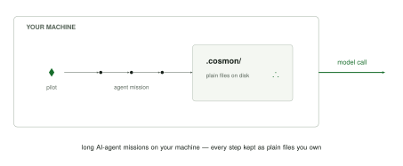
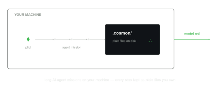

# cosmon

Noogram is an open, federated system for running long AI-agent missions inside
your own perimeter, keeping every step as plain files you own. Its kernel,
**cosmon**, is a stateless CLI that gives each agent an identity, a lifecycle,
and crash-recovery.

Every step, every decision, and every result is written to plain files under
`.cosmon/` on a disk you control. There is no server in the loop, no database,
no account to log into: the files on disk are the whole source of truth, and the
same record lets a fresh worker pick up exactly where a crashed one stopped.

<!-- Four-band illustration (pilot → control plane → disk → federation), pitch
     spec 2026-07-15. The asset lives at docs/book/src/intro-how-cosmon-runs.svg
     so mdBook copies it into the built book alongside this page; the ./ ref
     below resolves against the rendered introduction.html. -->
<figure>
  
  
</figure>

## What you do with it

- **Compose** — break a large mission into steps and hand each to an agent.
- **Pilot** — start, watch, nudge, and stop the agents while they run, all
  inside your own perimeter.
- **Audit** — read back the full record of what every agent did, from your own
  disk, whenever you want. Each step is BLAKE3-sealed, so `cs verify` flags a
  silent edit: tamper-evident, not tamper-proof.
- **Federate** *(under construction)* — let several machines cooperate on one
  mission, with no central owner.

It drives the agents and models you already run: Claude Code, Codex, Aider;
hosted APIs from Anthropic, OpenAI, Google Gemini, Mistral AI, Qwen, DeepSeek,
GLM, or Kimi;
or local models through llama.cpp or Ollama.

## noogram and its cosmon kernel

On a single machine, the tool you run is **cosmon**; its command is `cs`. You
`cs tackle` a piece of work to start an agent on it, and `cs done` to close it
out. Everything the agents do lands in `.cosmon/` files right there on disk.

Noogram's ambition is a **federated agentic system**: many cosmon instances
cooperating, each keeping its own record, with no single owner in the middle.
The first brick is already here: the **remote mode**, where a `cosmon-remote`
client talks to a `cosmon-rpp-adapter` service over HTTP(S) on another host.
Broader peer-to-peer federation between instances is on the roadmap; the shape of
that link is still being explored. That larger, cooperating whole is **noogram**;
**cosmon** is its kernel. Today, run several agents in parallel on one machine and
cosmon does that by itself, complete and standalone. See
[Noogram & the Cosmon kernel](./explanation/cosmon-and-noogram.md) for the
relationship, and [Agent adapters](./explanation/adapter.md) for how a concrete
agent or model plugs in.

## Where to go next

- **Want it running now?** [Install cosmon](./getting-started/install.md), then
  [Ten minutes to cosmon](./getting-started/ten-minutes.md) takes you from an
  empty terminal to one merged piece of agent work.
- **New here?** The [Explanation](./explanation/physics-vocabulary.md) section is
  the conceptual on-ramp: the physics vocabulary, the kernel/distribution split,
  formulas and adapters and fleets, and how cosmon survives crashes. Start there.
- **Learning by doing?** The tutorials walk you from
  [your first molecule](./tutorials/first-molecule.md) to
  [your first fleet](./tutorials/first-fleet.md) to
  [composing a DAG](./tutorials/first-dag.md).
- **Looking up a command?** The [CLI reference](./reference/overview.md) is
  generated from the tool itself, grouped by role. The full
  `nucleate → tackle → wait → done` cycle is covered in
  [The three regimes](./explanation/regimes.md).

> This site is built by mdBook and rendered by the same pipeline that builds
> cosmon's own documentation.
