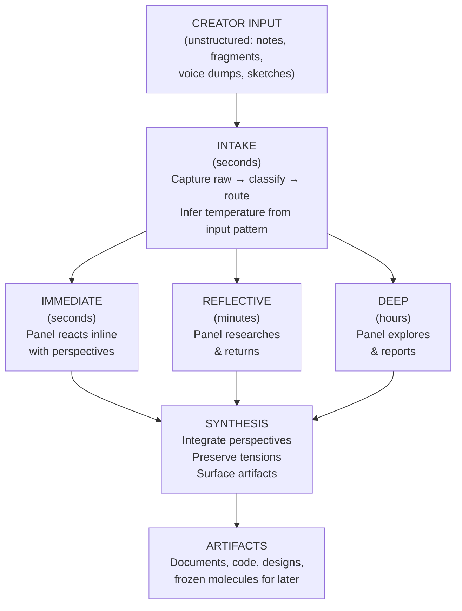
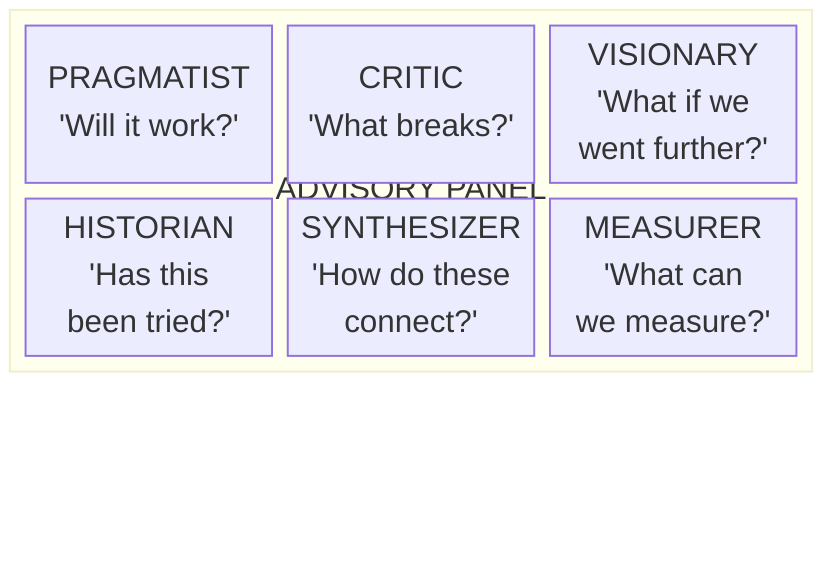

# Design: Creativity Interface Prototype

> **Status:** Draft
> **Bead:** cs-929
> **Source:** THESIS.md Part XV — The Creativity Interface: Advisory Panel as Amplifier
> **Date:** 2026-04-03

---

## One-Sentence Vision

The creativity interface turns a half-formed thought into a structured
conversation with specialized perspectives, returning responses at the speed
the creator actually needs — not the speed the system can produce.

---

## The Core Flow



---

## Interaction Model: Dialogue, Not Dispatch

The creativity interface is a **conversation with a panel**, not a command
that returns results. The distinction matters:

| Task queue (wrong model)          | Advisory panel (right model)          |
|-----------------------------------|---------------------------------------|
| "Create a design for X"           | "What if we tried X?"                 |
| System returns one answer         | Panel returns multiple perspectives   |
| Creator evaluates output          | Creator converses with panel          |
| Done when deliverable produced    | Done when creator has insight         |
| Linear: request → response        | Iterative: question → perspectives → deeper question |

### The Panel Roles

Six concurrent perspectives, each embodied by an agent with a distinct
cognitive function (from THESIS.md Part XV):



**Not all panel members speak on every question.** The system routes input
to the 2-3 most relevant perspectives. The creator can summon any panel
member explicitly: "What does the Critic think?"

---

## Wireframe: CLI Interaction Flow

### 1. Intake — Capturing the Raw Idea

The creator dumps unstructured input. No formatting required. No fields to
fill. One command, one text block.

```
$ cs create "I keep thinking about how agent sessions lose context
at boundaries. What if we had a way to distill the essential state
into something much smaller than the full context window? Like a
hash of understanding — not the data, but the structure of what
the agent learned."
```

**What happens internally:**

1. Input is captured verbatim (no preprocessing, no silent transformation)
2. Temperature is inferred from input characteristics:
   - Short, rapid inputs → high temperature (brainstorming mode)
   - Long, detailed input → low temperature (analysis mode)
   - Single fragment → medium temperature (exploring)
3. Input is routed to the panel

**CLI output (immediate, <2 seconds):**

```
◈ Captured: "context distillation at session boundaries"
  Temperature: ◆◆◇◇◇ (reflective)
  Panel routing: Pragmatist, Historian, Measurer
  ↳ Immediate reactions arriving...
```

### 2. Immediate Response — Panel Reactions (seconds)

The panel members who received the input respond with their first reactions.
These are fast, lightweight, perspective-colored responses — not deep analysis.

```
◈ Panel — immediate reactions

  PRAGMATIST: This maps to the Prime system (Part IV). We already
  compile context at session start. The gap: Prime is compiled by
  the framework, not distilled by the agent. An agent-generated
  "understanding hash" would be a self-authored checkpoint —
  richer than automated prime, cheaper than full context.

  HISTORIAN: Hinton's "dark knowledge" (2015) — distilling a large
  model into a smaller one by transferring soft outputs, not hard
  labels. Same structure: the full context is the large model, the
  distilled state is the student. Also: Turing's "oracle" concept
  — an agent with a distilled understanding is an oracle for its
  own prior session.

  MEASURER: Measurable test: compare token cost of (a) full prime
  injection vs (b) agent-distilled summary at session restart.
  Track "context reconstruction fidelity" — does the distilled
  agent make the same decisions as the pre-death agent on a held-
  out task?

  [2 of 6 panel members silent — not relevant to this input]

◈ What would you like to explore?
  → Go deeper on any perspective
  → Ask the Critic or Visionary to weigh in
  → Refine the idea based on reactions
  → Commission deep research (minutes)
```

### 3. Creator Iterates — The Dialogue

The creator engages with the panel's responses. This is the core loop.

```
$ cs reply "The Pragmatist's point about self-authored checkpoints
is interesting. But how is this different from just asking the
agent to summarize before dying?"

◈ Panel — responding to refinement

  PRAGMATIST: A summary is unstructured text. A distillation would
  be a typed structure — a MoleculeCheckpoint with:
  - decisions_made: Vec<Decision>
  - open_questions: Vec<Question>
  - constraints_discovered: Vec<Constraint>
  - confidence_map: HashMap<Topic, Confidence>
  The difference: a summary is for humans. A distillation is for
  the next agent session. Different audience, different encoding.

  CRITIC: The failure mode is obvious: the dying agent has degraded
  context (that's WHY it's dying). Asking a degraded agent to
  produce a faithful distillation is asking the patient to write
  their own medical chart during a seizure. The distillation must
  happen BEFORE context degradation — as a continuous process, not
  a deathbed confession.

◈ The Critic raised a structural concern.
  → Address the timing problem?
  → Commission deep research on continuous distillation?
```

### 4. Deep Research — Commissioning Exploration (minutes/hours)

When the creator wants depth, they commission it explicitly.

```
$ cs deepen "Map the design space for continuous context
distillation. What are the options, trade-offs, and prior art?"

◈ Deep research commissioned
  Estimated: 15-30 minutes
  Panel: full (all 6 perspectives)
  Temperature: ◆◇◇◇◇ (convergent analysis)

  You'll receive a digest when ready. Continue other work or:
  $ cs check           # Check progress
  $ cs panel           # Return to panel conversation
```

**The digest arrives later (not a stream — a summary):**

```
◈ Deep research complete: "Continuous Context Distillation"

  SYNTHESIS (3 paragraphs):
  [Integrated summary of all perspectives, preserving tensions]

  KEY TENSIONS:
  1. Continuous distillation costs tokens during productive work
     vs. deathbed distillation risks quality. The Carnot bound
     applies: distillation efficiency is bounded by
     1 - T_noise/T_signal.
  2. Typed structure (Pragmatist) vs. natural language (Historian
     notes that dark knowledge works precisely because soft
     outputs preserve information that hard types discard).
  3. The Measurer identified a testable prediction: if continuous
     distillation costs < 5% of session tokens AND reconstruction
     fidelity > 90%, it dominates both full-prime and deathbed
     summary.

  ARTIFACTS PRODUCED:
  → an internal research note on the context-distillation design space
  → 3 frozen molecules for future exploration (cs-xxx, cs-yyy, cs-zzz)

  [Full panel responses available: cs show <research-id>]
```

### 5. Artifact Production — Concrete Outputs

At any point, the creator can request concrete artifacts from the
conversation.

```
$ cs materialize "Turn the continuous distillation idea into an ADR"

◈ Materializing: ADR from panel conversation
  Source: 4 exchanges, 2 deep research results
  Format: ADR (context → decision → consequences)

  → docs/adr/007-continuous-context-distillation.md (draft)

  Review and refine, or:
  $ cs materialize --code "Sketch the MoleculeCheckpoint type"
  $ cs materialize --formula "Create a formula for testing this"
```

---

## Temperature as Creative Control

Temperature is **inferred**, not set. But the creator can override.

### Inference Rules

| Input pattern                        | Inferred temperature | Panel behavior           |
|--------------------------------------|---------------------|--------------------------|
| Rapid short messages (<50 words)     | High (◆◆◆◆◆)       | Divergent, many options  |
| Medium-length, questioning           | Medium (◆◆◆◇◇)     | Balanced exploration     |
| Long, detailed, analytical           | Low (◆◇◇◇◇)        | Convergent, deep         |
| Silence (>30 min since last input)   | Dormant             | Capture as frozen mol    |

### Explicit Override

```
$ cs temperature high
◈ Temperature: ◆◆◆◆◆ (brainstorm mode)
  Panel will: offer many alternatives, suppress "the best option is...",
  capture everything without evaluating

$ cs temperature low
◈ Temperature: ◆◇◇◇◇ (decision mode)
  Panel will: deep analysis on few options, explicit trade-offs,
  quantified evidence, risk highlighting
```

### Visual Indicator

The temperature is always visible in the prompt:

```
◈ [◆◆◇◇◇] $           # Reflective mode
◈ [◆◆◆◆◆] $           # Brainstorm mode
◈ [◆◇◇◇◇] $           # Decision mode
```

---

## Anti-Pattern Guards

The system actively prevents the six anti-patterns identified in THESIS.md
Part XV:

| Anti-pattern             | Guard mechanism                                     |
|--------------------------|-----------------------------------------------------|
| **Yes-Man Panel**        | Critic always gets a turn. If all panelists agree, the system flags it: "Unusual consensus — Critic, stress-test this?" |
| **Firehose**             | Response depth matches question depth. Short question → short reaction. Deep question → deep research (only when commissioned). |
| **Premature Converger**  | System never recommends a single option. Always presents tensions and trade-offs. Convergence is the creator's action, not the system's. |
| **Context Vampire**      | Panel responses are summaries with pointers. Full reasoning available on request (`cs expand <id>`), never injected by default. |
| **Invisible Hand**       | If input is compressed or transformed, the system shows the transformation: "I interpreted this as: [X]. Correct?" |
| **Sycophantic Synth.**   | Synthesis preserves genuine contradictions. "The Pragmatist and Visionary disagree. Here is the tension, not a compromise." |

---

## CLI Command Surface

Minimal command set — the interface should feel like talking, not typing
commands.

| Command                    | Purpose                                    | Speed tier |
|----------------------------|--------------------------------------------|------------|
| `cs create "<idea>"`       | Start a new creative conversation          | Intake     |
| `cs reply "<response>"`    | Continue the conversation                  | Immediate  |
| `cs deepen "<question>"`   | Commission deep panel research             | Deep       |
| `cs materialize "<what>"`  | Produce a concrete artifact                | Artifact   |
| `cs panel`                 | Return to the current panel conversation   | —          |
| `cs check`                 | Check status of deep research              | —          |
| `cs temperature <level>`   | Override inferred temperature               | —          |
| `cs show <id>`             | View full panel response or artifact       | —          |
| `cs freeze`                | Park the current conversation for later    | Dormant    |

**Design decision:** These commands coexist with the existing molecule/fleet
commands. The creativity interface is a layer on top of the orchestration
engine, not a replacement. `cs create` internally nucleates a molecule with
the `mol-creative-session` formula. `cs deepen` spawns worker agents. The
physics machinery runs underneath; the creator never sees it.

---

## The Phase Boundary: How Two Systems Meet

```mermaid
block-beta
    columns 1
    block:creator["CREATOR SIDE
Human cognition: intuition, aesthetics,
serial processing, emotional response,
judgment, ambiguity tolerance"]
    end
    block:interface["CREATIVITY INTERFACE (phase boundary)
cs create / cs reply / cs deepen / cs materialize
Temperature inference · Anti-pattern guards · Panel routing
Digest generation · Artifact materialization"]
    end
    block:agent["AGENT SIDE
Cosmon orchestration: molecules, formulas, workers,
dispatching, entropy tracking, energy budgets
Parallel execution, exhaustive search, quantified analysis"]
    end

    style creator fill:#ffe0e0,stroke:#333
    style interface fill:#fff0c0,stroke:#333
    style agent fill:#e0e0ff,stroke:#333
```

The creativity interface is a **catalyst** — it lowers the activation energy
for creative work by providing perspectives the creator cannot hold
simultaneously. The creator provides the seed; the panel provides the
surrounding analysis. The panel does not do the creative work — it reduces
the barrier to the creator doing the creative work.

---

## Energy Budget for Creative Sessions

Each speed tier has a distinct token cost profile:

| Speed tier   | Token cost per interaction | Frequency  | Budget implication           |
|-------------|---------------------------|------------|------------------------------|
| Immediate   | ~500-2,000 tokens         | High       | Cheap per unit, adds up      |
| Reflective  | ~5,000-20,000 tokens      | Medium     | Moderate, bounded by routing |
| Deep        | ~50,000-200,000 tokens    | Low        | Expensive, explicitly budgeted |
| Dormant     | ~0 (frozen molecule)      | —          | Free until thawed            |

**The molecule budget applies:** The system tracks active creative molecules
and surfaces the count. "You have 4 active creative sessions and 12 frozen
seeds. Energy budget: 67% remaining."

**Collapse moments:** After every 3rd exchange, the system offers: "We have
N threads open. Which ones matter most?" This prevents the amplification trap
without requiring the creator to track state manually.

---

## What This Design Does NOT Include

Stripped deliberately to keep the interface clean:

- **No visual IDE / GUI.** The creativity interface is CLI-first. A GUI can
  be layered on later, but the interaction model must work in text.
- **No voice input (yet).** Voice-to-text can feed into `cs create`, but
  the interface does not handle audio directly.
- **No real-time streaming of agent work.** The creator receives digests, not
  streams. Streams amplify AI psychosis (Part XIV). The deep research tier
  returns a summary, not a play-by-play.
- **No automatic agent spawning from ideas.** "Capture fast, execute slow."
  Ideas are captured as frozen molecules, not immediately dispatched.
- **No collaborative multi-user panel.** One creator, one panel. Multi-user
  creative sessions are a different design problem.
- **No persistent panel "personality."** Panel members are stateless between
  sessions. Alignment comes from the creator's profile, not from panel memory.

---

## Implementation Path (Not Part of This Design)

This design is the wireframe. Implementation would proceed:

1. **mol-creative-session formula** — Define the molecule template for
   creative conversations (steps: intake, panel-routing, response, synthesis)
2. **Panel agent definitions** — Six agent definitions embodying the panel
   roles (Pragmatist, Critic, Visionary, Historian, Synthesizer, Measurer)
3. **Temperature inference** — Input pattern analysis for automatic
   temperature detection
4. **CLI commands** — `cs create`, `cs reply`, `cs deepen`, `cs materialize`
5. **Digest generation** — Summarization layer for deep research results
6. **Artifact materialization** — Template system for converting panel
   conversations into documents, code, formulas

Each step is a separate bead. This document is the design that precedes them.

---

## Relation to Thesis

This design materializes THESIS.md Part XV. Every element traces to a
specific thesis section:

| Design element          | Thesis source                                    |
|-------------------------|--------------------------------------------------|
| Advisory panel model    | Part XV, "The Advisory Panel Model"              |
| Six panel roles         | Part XV, panel role table                        |
| Multi-speed processing  | Part XV, "Multi-Speed Processing"                |
| Anti-pattern guards     | Part XV, "Anti-Patterns"                         |
| Temperature bridge      | Part XV, "The Temperature Bridge"                |
| Alignment principle     | Part XV, "The Alignment Principle"               |
| Phase boundary metaphor | Part XV, "The Physics"                           |
| Digest over stream      | Part XIV, regulation principle 4                 |
| Capture fast execute slow | Part XIV, regulation principle 1               |
| Molecule budget         | Part XIV, regulation principle 3                 |
| Collapse moments        | Part XIV, regulation principle 2                 |
