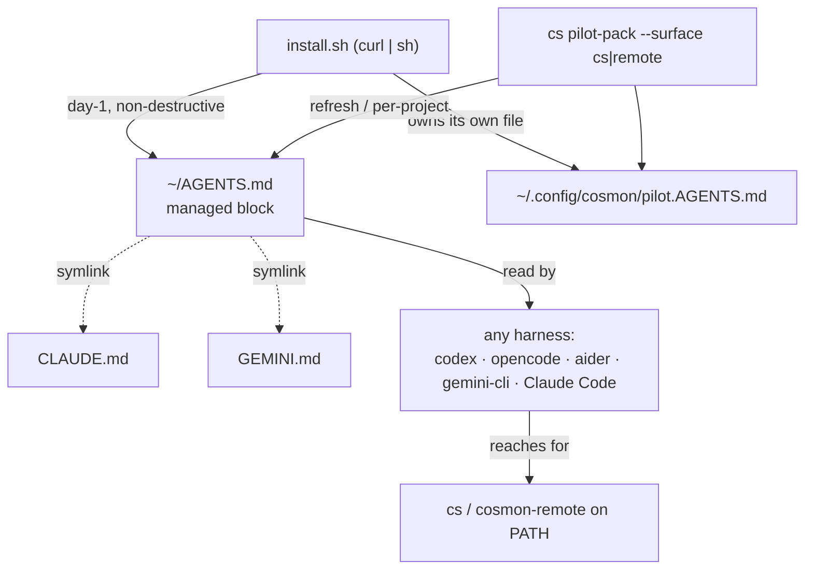

# Piloting cosmon from any harness

> **The one-sentence version.** Cosmon does not care which AI you sit in front
> of. Claude Code, opencode, aider, gemini-cli, codex — every one of them can
> open a terminal, and a terminal is all cosmon needs. The trick is to *tell*
> the harness that the `cs` command exists. This guide is about that trick.

This is a companion to the [Operator Handbook](../handbook.md). The handbook
teaches you the four-verb cycle — `nucleate → tackle → wait → done` — assuming
you are driving cosmon from Claude Code, the way it was born. This guide answers
the next question the operator actually asks:

> *"I have five different coding agents on my laptop. Can any of them drive my
> cosmon fleet — and if so, how do I make each one understand that `cs` is the
> steering wheel?"*

The short answer is **yes, all of them**, and the reason is structural, not
lucky. We'll build the picture in five moves:

1. **Two axes, three surfaces** — the model that makes this possible
   ([ADR-125](../adr/125-valence-and-aperture-two-axes.md)).
2. **The matrix** — every harness × every surface × every verb, and where the
   canonical falsifiable grid already lives.
3. **Recipes** — how to actually launch each harness and make it know `cs`,
   with the invocations that were really run on this machine.
4. **The universal skill** — why `AGENTS.md` solved the "how does an agent learn
   my project" problem, why *skills* are not yet universal, and why for cosmon
   the `cs` CLI *is* the universal skill.
5. **The shell-less corner** — the REST surface for harnesses that can't open a
   terminal, and why the local `cs mcp` stdio server was removed (not the
   remote `/mcp` endpoint, which is a separate live surface).

Then a sixth move the operator asked for explicitly: **how the pilot-pack is
*deployed*** — without ever clobbering your own config file.

---

## 1. Two axes, three surfaces

Two completely separate questions hide inside the phrase "which AI runs my
cosmon work." Confusing them is the single most common mental bug. ADR-125
ratified the separation; here it is in pictures.

**Question A — who does the work?** When a molecule is tackled, *something*
sits inside the worker and writes the code, runs the tests, produces the
synthesis. ADR-125 calls this the **valence** (the chemistry word for the
bonding capacity an atom brings to a molecule). You pick the valence *at
nucleation* — it is baked into the worker — with `--adapter`:

```bash
cs tackle <id> --adapter claude     # the worker is run by Claude
cs tackle <id> --adapter aider      # the worker is run by aider
cs tackle <id> --adapter local      # the floor: a local model, no cloud
```

**Question B — who tells cosmon what to do?** *Someone* (you, or an AI standing
in for you) types `cs nucleate`, watches the fleet, decides what to tackle next.
ADR-125 calls this the **aperture** — the doorway through which your
natural-language intent enters cosmon. You pick the aperture *freely, at any
moment*, by choosing which harness you're sitting in.

The two are **orthogonal**. You can sit in gemini-cli (aperture) and nucleate
work that runs on Claude (valence). You can sit in Claude Code and nucleate work
that runs on a local llama. **The harness you pilot from is never an input to
the adapter that executes** — and this isn't a promise, it's a fact about the
code's shape: the piloting harness is not one of the six inputs to
`resolve_adapter_selection`. There is no wire through which it *could* leak.
(The full proof — behavioral, type-level, and remote — is ADR-125 §3.)

### Why "three surfaces," not "three axes"

The aperture axis bears **three doorways**, and they differ only in *where you
stand*, not in *what is produced*:

| Surface | Transport | Where it lives | What uses it |
|---------|-----------|----------------|--------------|
| **(a) `cs` local CLI** | shell | your machine; files on disk are truth | this very session |
| **(b) `cosmon-remote` CLI** | shell | a thin client over the remote API | piloting a remote *avatar* |
| **(c) rpp-v1 REST** | HTTP, shell-less | the wire contract itself | a harness that speaks HTTP but has no terminal |

The operator sometimes calls the remote surface "axis 3." Wheeler's distinction
in ADR-125: an *axis* is a degree of freedom you move while holding the others
fixed; a *surface* is a doorway onto the same phenomenon. Hold the valence fixed
and switch from `cs` to `cosmon-remote` to REST — you changed *where you stand*,
not *what gets built or who builds it*. So: **two axes (Valence, Aperture); the
Aperture axis bears three surfaces.** The "3" you may have heard is the count of
surfaces, and it is correct in that sense.

> **Try it (the decoupling, in one breath):**
> ```bash
> cs nucleate task-work --kind task --var topic="decoupling probe"
> cs tackle <id> --adapter local     # valence = local, aperture = this shell
> ```
> **Expect:** `events.jsonl` shows `AdapterSelected{name=local}` regardless of
> what AI typed the command. **Falsified if:** the adapter ever changes because
> a *different* harness issued the same command.

---

## 2. The matrix

Strip away the personalities and every harness reduces, *for piloting*, to one
capability: **can it emit a gesture (a shell command or an HTTP request) and
read the result back?** All five can. That is the whole reason this works — and
it is why the matrix is given as **verb × surface**, not harness × surface ×
verb: the gesture string is *identical* across harnesses, so spelling it out
five times would be noise.

> **The canonical, falsifiable grid already exists.** The full
> verb × access-mode matrix — every cell with a one-line gesture and an
> observable pass criterion, including the places where the remote surfaces do
> **not** map 1:1 to the local verbs — is
> [`pilot-portability.md` Part 3](pilot-portability.md#part-3--the-3-access-mode-portability-matrix).
> This guide does not duplicate it. Read that grid when you need the exact
> `curl` for `POST /v1/molecules/{id}/tackle`; read on here for the picture that
> makes the grid make sense.

The picture in one table — the dispatch spine, and how each surface treats it:

| Verb | `cs` local (a) | `cosmon-remote` (b) | rpp-v1 REST (c) |
|------|----------------|---------------------|------------------|
| **nucleate** | `cs nucleate …` | `molecule nucleate` *or* fused into `do` | `POST /v1/molecules` (⚠ does **not** auto-tackle) |
| **tackle** | `cs tackle <id>` `[coûteux]` | `molecule tackle <id>` `[coûteux]` | `POST …/tackle` (⚠ needs `:write`+`:worker:spawn`) |
| *(fused)* | *(none — three verbs stay separate)* | **`do`** = nucleate+tackle+wait (the headline verb) | client composes the POSTs itself |
| **wait** | `cs wait <id> &` | `events` SSE *or* `do`'s blocking follow | `GET /v1/events` SSE (⚠ no replay) |
| **done** | `cs done <id>` (**human-only, mandatory**) | **⚠ none** — teardown is server-side | **⚠ none** — no route (the invariant enforced *by absence*) |
| **observe** | `cs observe <id> --json` | `molecule get` (live) + `molecule result` (terminal) | `GET …/{id}` + `GET …/artifacts` |
| **converse** | — (local has no avatar to talk to) | `cosmon-remote converse` (talk to a bound avatar) | the `converse` route |

Two load-bearing asymmetries to carry in your head:

- **Local owns teardown; remote hides it.** On `cs`, skipping `cs done` is the
  classic bug — the branch never merges, the worktree leaks. On the remote
  surfaces there is simply **no `done` verb**. That is deliberate: `done` is
  human-only, and *the absence of the verb makes the invariant un-violable.* A
  remote pilot cannot forget to do something it has no way to do.
- **`do` is the remote headline.** Locally you keep nucleate/tackle/wait
  separate because you want the fine control. Remotely, the one gesture you
  reach for is `cosmon-remote do <formula> --topic "…"` — it fuses all three
  and follows until the molecule is ready. (It's a client-side composition of
  two POSTs; no new routes on the wire.)

The harness-applicability row collapses to a single sentence: **codex,
opencode, aider, gemini-cli, and Claude Code all emit shell gestures (surfaces
a & b) and HTTP gestures (surface c); all five drive all three surfaces.** The
proof is in [`pilot-portability.md` §3.2](pilot-portability.md#32-harness-applicability-the-four-rows-clear-the-same-bar).

---

## 3. Recipes — launch each harness, make it know `cs`

Now the concrete part. For each harness: how you run it non-interactively, how
you teach it that `cs` exists, and the invocation that was actually exercised on
this machine. Versions are what was installed at write-time (2026-06-15) — newer
is fine; the gestures are stable.

> **Honesty note on "proven."** Where it says *observed live*, the round-trip
> was run on this machine on 2026-06-15. Where a credential or a working binary
> was missing at write-time, it says so plainly — the recipe is still the
> canonical one, you just supply the key. Reporting this faithfully matters more
> than a clean-looking table.

### 3.1 opencode (`opencode run`) — *observed live*

`opencode` 1.1.36. It reads **`AGENTS.md`** from the repo root and parent
directories (nearest file wins). Model is `provider/model`; it auto-detects the
provider's API key from the environment.

```bash
# one-shot, non-interactive, pick the model explicitly:
opencode run -m mistral/mistral-large-latest \
  "Run 'cs ensemble --tag temp:hot --json' and summarise the hot backlog."
```

- **Context mechanism:** `AGENTS.md` (root + ancestors). If both `AGENTS.md` and
  `CLAUDE.md` exist, **only `AGENTS.md` is read**; `~/.config/opencode/AGENTS.md`
  outranks `~/.claude/CLAUDE.md`. The `opencode.json` file declares *tools and
  agents*; `AGENTS.md` declares *behaviour and rules*. ([opencode rules docs](https://opencode.ai/docs/rules/))
- **Make it know `cs`:** drop a cosmon block into the project `AGENTS.md` (see §4
  and §6). opencode then reads it on every run and will reach for `cs` via its
  shell tool.
- **Observed:** an `opencode run` read the live state store and wrote back via
  `cs` on 2026-06-15. The Mistral key (`MISTRAL_API_KEY`) was *unset* at this
  write — set it, or substitute any provider opencode knows (`anthropic/…`,
  `openai/…`).

### 3.2 codex (`codex exec`)

OpenAI's Codex CLI. `codex exec` runs **non-interactively → stdout** (no TUI, no
prompts) — exactly what you want for scripted piloting.

```bash
codex exec "Run 'cs nucleate task-work --kind task --var topic=\"probe\"' and print the molecule id."
```

- **Context mechanism:** Codex checks each directory in order
  **`AGENTS.override.md` → `AGENTS.md` → `TEAM_GUIDE.md` → `.agents.md`**; config
  lives in `~/.codex/config.toml`. ([Codex AGENTS.md guide](https://developers.openai.com/codex/guides/agents-md))
- **Make it know `cs`:** the same `AGENTS.md` block. Codex is the *origin* of the
  `AGENTS.md` convention, so this is its native idiom.
- **Observed:** `OPENAI_API_KEY` is **set** on this machine, but the installed
  `codex` binary's vendored sub-binary was missing (`ENOENT`) at write-time, so
  the round-trip could not be run here. The recipe is the documented one;
  reinstall codex to exercise it.

### 3.3 gemini-cli (`gemini -p`)

`gemini` 0.46.0. `-p` (prompt) runs one-shot.

```bash
gemini -p "Run 'cs observe <id> --json' and tell me the molecule's status and current step."
```

- **Context mechanism:** **`GEMINI.md`** is the default context file (root +
  ancestors). gemini-cli *also* auto-scans for **`AGENTS.md`** in the cwd and
  parents and prepends it as a preamble to every prompt — but if `GEMINI.md` and
  `AGENTS.md` sit in the *same* directory, **`GEMINI.md` wins**. The filename is
  configurable via `context.fileName` in `settings.json`; extensions carry their
  own `contextFileName`. ([GEMINI.md docs](https://geminicli.com/docs/cli/gemini-md/))
- **Make it know `cs`:** either a `GEMINI.md` or an `AGENTS.md` with the cosmon
  block. Because `GEMINI.md` wins in-directory, the symlink trick (§4) keeps one
  content visible to gemini and everyone else.
- **Observed:** `GEMINI_API_KEY` is **set** on this machine.

### 3.4 aider (`--read`)

`aider` 0.86.2. aider is more naturally a *valence* (axis 1 — it edits code
inside a worker) than a pilot, but it can pilot via its `/run` shell command,
and it has a first-class way to ingest a read-only context file.

```bash
# load the cosmon pilot context as read-only (cached if prompt caching is on):
aider --read AGENTS.md
# then inside aider:  /run cs ensemble --tag temp:hot --json
```

- **Context mechanism:** `--read <file>` marks a file read-only and feeds it in;
  `.aider.conf.yml` (searched in `$HOME`, repo root, cwd, last wins) can set
  `read: [AGENTS.md]` to auto-load it every session. The historical filename is
  `CONVENTIONS.md`, but `--read` takes any path. ([aider conventions](https://aider.chat/docs/usage/conventions.html))
- **Make it know `cs`:** `read: AGENTS.md` in `.aider.conf.yml`, then drive `cs`
  through `/run`.
- **Note:** aider's sweet spot is *being tackled* (`--adapter aider`), not
  piloting. Use it as a pilot only when it's the harness already in your hands.

### 3.5 Claude Code (this session)

The native home. Two things make it the richest aperture:

- **`cs` CLI directly** — walk-up discovery from the worktree, always the right
  binary (the CLI-first invariant).
- **Skills** — `/nucleate`, `/done`, and friends are invocable units, not just
  instructions. This is the capability the *other* harnesses don't yet have
  uniformly (§4).

- **Context mechanism:** `CLAUDE.md` (project + global). Symlink it to
  `AGENTS.md` and every other harness reads the same file (§4).

---

## 4. The universal skill — `AGENTS.md`, the symlink, and why `cs` *is* the skill

Here is the deepest point in the guide, and the one worth slowing down for.

### `AGENTS.md` won the "instructions" problem

For a year every coding agent invented its own context file: `CLAUDE.md`,
`GEMINI.md`, `.cursorrules`, `.aider.conf.yml`, and so on. Then OpenAI published
**`AGENTS.md`** (August 2025) — a plain Markdown file at the repo root that tells
*any* agent the build commands, conventions, and constraints it can't infer from
the code. It spread to **60,000+ projects** and, in **December 2025**, the
**Linux Foundation** folded it into the new **Agentic AI Foundation (AAIF)** —
alongside Anthropic's **MCP** and Block's **goose** — with platinum members
AWS, Anthropic, Block, Bloomberg, Cloudflare, Google, Microsoft, and OpenAI.
([AAIF announcement](https://www.linuxfoundation.org/press/linux-foundation-announces-the-formation-of-the-agentic-ai-foundation),
[AGENTS.md @ AAIF](https://aaif.io/projects/agents-md/))

The practical upshot, confirmed across the four harnesses' own docs: **codex,
opencode, and gemini-cli all read `AGENTS.md` natively; aider reads it via
`--read`; Claude Code reads `CLAUDE.md`.** The instruction-passing problem is, as
of 2026, **solved**.

### The symlink trick — one content, every reader

You do not need four copies. Make one file and point the others at it:

```bash
# one source of truth, every harness reads it:
ln -s AGENTS.md CLAUDE.md
ln -s AGENTS.md GEMINI.md
```

Edit `AGENTS.md`; Claude Code (`CLAUDE.md`), gemini-cli (`GEMINI.md`), opencode
and codex (`AGENTS.md` directly) all see the same bytes. (Mind the precedence
rules: opencode ignores `CLAUDE.md` when `AGENTS.md` is present; gemini prefers
`GEMINI.md` in-directory — the symlink makes both moot because the content is
identical.)

### But *instructions* are universal; *skills* are not — yet

Draw the line carefully, because it's where cosmon's insight lives:

- **Instructions** — *"here's how this project works"* — are universal:
  `AGENTS.md`, resolved by the AAIF standard.
- **Skills** — *invocable units of capability* (`/nucleate`, a slash command, a
  callable tool) — are **not** universal. Each harness has its own shape:
  Claude Code has `SKILL.md`; opencode has agents and commands; gemini-cli has
  extensions; codex has subagents and prompts. There is no Linux-Foundation
  standard for "a skill" the way there is for "instructions."

### The cosmon insight: the `cs` CLI *is* the universal skill

Here's the move. You do **not** need a portable *skill* format, because **every
harness can already invoke the one skill that matters: the shell.** `cs` is a
binary on `PATH`. Every harness — codex, opencode, aider, gemini-cli, Claude
Code — can run a shell command. So:

> **The `cs` CLI is the universal skill. `AGENTS.md` is the universal pointer
> to it.** You don't port a skill into five plugin formats; you write one
> Markdown block that says *"to drive this fleet, run `cs nucleate / tackle /
> wait / done`"* — and every harness reads that block and reaches for the shell.

This is exactly the git model. Git has no MCP, no plugin SDK, no per-harness
extension. LLMs drive git by running `git` in a shell, and they learn the
project's git conventions from `AGENTS.md`. Cosmon is the same: the CLI is the
tool, `AGENTS.md` is the teacher.

### The drift-proof upgrade: `cs pilot-pack` (proposed)

Pointing harnesses at the existing artifacts — `man cs`, `man cosmon-remote`,
`openapi/v1.yaml`, plus curated `CLAUDE.md` sections — costs nothing and is the
*starting* recommendation
([`pilot-portability.md` Part 2](pilot-portability.md#part-2--the-context-pack-decision-tension-t2)).
The risk is **drift**: you hand-assemble the same four files into an `AGENTS.md`
block, a verb changes, and the block silently goes stale.

The drift-proof answer is a generator — `cs pilot-pack` — proposed in
delib-20260615-73f9 (architect). It would *project* a canonical cosmon
`AGENTS.md` block from the live sources:

- the **man page** (which is itself rendered from the clap tree, so it can't
  drift from the binary),
- the curated **CLAUDE.md sections** (Pilot patterns, Monitoring, Command
  perimeters),
- worked **examples**.

Same pattern as `cs reconcile`: state is the source of truth, the surface is a
pure projection, regenerating is idempotent. **Build it only when manual
assembly demonstrably drifts** — not as a day-1 requirement. The exception is
the *deployment* drop, which §6 argues *is* needed day-1.

A real, hand-authored example of what such a block looks like ships beside this
guide as
[`piloting-cosmon-AGENTS.example.md`](piloting-cosmon-AGENTS.example.md) — it is
what `cs pilot-pack --surface cs` should eventually generate.

---

## 5. The shell-less corner — REST, and why the local `cs mcp` is gone

What about a harness that has *no* terminal — a pure HTTP client, a webhook, a
serverless function?

**Use the REST surface directly.** The rpp-v1 OpenAPI spec
(`crates/cosmon-rpp-adapter/openapi/v1.yaml`) *is* the context-pack — a
machine-readable, versioned, drift-gated description of every route. Hand it to
the HTTP harness and it has everything: the routes, the request/response
envelopes, the scope table, the SSE wire format, the `bearerAuth` scheme. No
generation, no extra file. The exact `curl` for each verb is the M3 column of
[`pilot-portability.md` Part 3](pilot-portability.md#part-3--the-3-access-mode-portability-matrix).

**The local `cs mcp` stdio server is *not* an option — it no longer exists.**
It was deprecated 2026-04-11 (dead-code-by-construction; see ADR-020's
cwd-per-call bug class) and **removed 2026-07-12** (decision C14). Do not
confuse it with the *remote* `/mcp` endpoint: `cosmon-rpp-adapter` serves a
live remote-tenant MCP surface built on the very same `cosmon-mcp` crate
(`streamable_http_service()`), gated by bearer/OIDC. That remote endpoint is a
deliberate surface for MCP-native clients (Claude Desktop, claude.ai); the
*local* stdio door is the one that is closed. For a shell-less harness talking
to your own cosmon, REST is the answer, not a local MCP server. The reasoning
is decisive (ADR-125 §5):

> Every named harness shells, so the CLI is the tool. For the no-shell case, the
> harness speaks HTTP and hits rpp-v1 directly. **HTTP-capable ⊃ MCP-capable** —
> so the last edge case that ever justified MCP ("no shell, but MCP-capable") is
> *dominated* by "no shell, but HTTP-capable → direct REST." The falsifier *"does
> any harness ever need MCP that the CLI or REST can't give?"* resolves to **no**:
> streaming → `events` SSE; conversation → `converse`; tool discovery / state →
> `--json` and direct REST.

MCP isn't merely deprecated. It is *dominated*. Don't reach for it.

---

## 6. Deploying the pilot-pack — never clobber the user's config

The operator posed a sharp design directive (2026-06-15): the pilot-pack is
**transport the harness consumes**; the user's `AGENTS.md` is the **host**.
Cosmon provides the transport **without owning the host file**. Four rules fall
out of that framing.

### 6.1 Managed block, not the file

Cosmon owns its **own** file — `~/.config/cosmon/pilot.AGENTS.md` — and only
injects a **marker-delimited managed block** (or an `@import` line) into the
user's `AGENTS.md`:

```text
# >>> cosmon pilot-pack (generated) >>>
# To drive a cosmon fleet from this project, use the `cs` CLI:
#   cs nucleate <formula> --kind <k> --var topic="…"   # create
#   cs tackle <id>                                       # spawn one worker
#   cs wait <id> &                                       # block in background
#   cs done <id>                                         # merge + teardown (human-only)
#   cs observe <id> --json                               # read state
# Never poll `cs observe` by hand; never skip `cs done`; never `cs run` in foreground.
# Full reference: `man cs`. Drift-proof source: ~/.config/cosmon/pilot.AGENTS.md
# <<< cosmon pilot-pack <<<
```

Regeneration replaces **only** that block; everything else in the user's
`AGENTS.md` is untouched. Idempotent. If no `AGENTS.md` exists, create it. This
is the exact pattern conda and rbenv use in your `.zshrc` — a fenced region they
own, surrounded by lines they never touch. Pair it with the symlink trick (§4)
so `CLAUDE.md` and `GEMINI.md` resolve to the same content.

### 6.2 A self-contained variant for the remote/avatar user

`cs pilot-pack --surface remote` generates a pack aimed at **`cosmon-remote`**,
not `cs` — because the avatar-user's machine often has *only* `cosmon-remote`
installed, never `cs`. That pack documents `do` / `result` / `converse` /
`events` and pointedly **omits `done`** (teardown is server-side; there is no
client destroy verb). A real example of this remote pack already exists in-tree:
[`crates/cosmon-rpp-adapter/assets/CLAUDE.md`](../../crates/cosmon-rpp-adapter/assets/CLAUDE.md)
— the one-fente avatar brief shipped by `install.sh`.

### 6.3 Gesture *and* install.sh — both, layered (the recommended answer)

The friction question: should the drop be a standalone `cs pilot-pack` gesture,
or baked into `install.sh`? **Both, layered** — because of the Dave case.

When a new avatar user runs `curl -fsSL <host>/install.sh | sh`, they want to be
pilotable **immediately**. They already consented to the install gesture;
requiring a *second*, separate `cs pilot-pack` gesture is friction most people
skip — and a skipped pilot-pack means the harness can't drive cosmon, which is a
bad first run. So:

- **`install.sh` does the first drop**, non-destructively. Constraints:
  - **announced** — print `added cosmon pilot-pack to AGENTS.md` after the fact,
    in green (the same "configure, then tell the user" discipline the existing
    `install.sh` already uses for `PATH`);
  - **opt-out** — `--no-pilot-pack` flag or `COSMON_SKIP_PILOT_PACK=1`;
  - **idempotent** — re-running replaces only the managed block.
  - **Finesse:** `install.sh` doesn't know the user's project directory, so it
    drops a **global** pack — `~/.config/cosmon/pilot.AGENTS.md` plus a managed
    block in `~/AGENTS.md` — and **prints the `@import` line** to paste into any
    project that wants it.
- **The standalone `cs pilot-pack` / `cosmon-remote pilot-pack` command is for
  refresh** — new verbs after an update — and for per-project opt-in. install.sh
  does the day-1 drop; the command keeps it current.

This reconciles the sibling deliverable's conclusion (*"point at existing
artifacts; `cs pilot-pack` only if drift"*) with the day-1 need: the **generator**
is the drift-proof upgrade you build when manual assembly hurts, but the
**non-destructive install.sh drop** is what makes a freshly-installed avatar
pilotable before anyone types a second command.

### 6.4 The deployment, in one diagram



The user's `AGENTS.md` is the host; cosmon owns only the fenced block and its own
`pilot.AGENTS.md`. Every harness reads the host; the host points at the CLI; the
CLI is the universal skill.

---

## Grounding (relative to repo root)

- [`docs/adr/125-valence-and-aperture-two-axes.md`](../adr/125-valence-and-aperture-two-axes.md)
  — the ratified two-axis model; §3 the decoupling proof, §5 MCP-dominated.
- [`docs/guides/pilot-portability.md`](pilot-portability.md) — the **canonical**
  minimal contract, context-pack decision, and the falsifiable
  verb × access-mode matrix (this guide builds on it; do not duplicate).
- [`docs/guides/adapter-parity-bar.md`](adapter-parity-bar.md) — the Valence-axis
  parity checklist (orthogonal to piloting; the other half of ADR-125).
- [`docs/handbook.md`](../handbook.md) — the four-verb cycle and the operator's
  monitoring toolkit.
- `crates/cosmon-rpp-adapter/openapi/v1.yaml` — the rpp-v1 REST surface; *is
  already* the shell-less context-pack.
- `crates/cosmon-rpp-adapter/assets/{install.sh,CLAUDE.md}` — the live `curl | sh`
  installer and the avatar-surface remote pack (the §6.2 example).
- [`piloting-cosmon-AGENTS.example.md`](piloting-cosmon-AGENTS.example.md) — a
  hand-authored example of the generated cosmon `AGENTS.md` block.

### External sources (2026)

- [Linux Foundation — formation of the AAIF (MCP, goose, AGENTS.md)](https://www.linuxfoundation.org/press/linux-foundation-announces-the-formation-of-the-agentic-ai-foundation)
- [AGENTS.md project @ AAIF](https://aaif.io/projects/agents-md/)
- [opencode — Rules / AGENTS.md](https://opencode.ai/docs/rules/)
- [Codex CLI — Custom instructions with AGENTS.md](https://developers.openai.com/codex/guides/agents-md)
- [Gemini CLI — GEMINI.md context files](https://geminicli.com/docs/cli/gemini-md/)
- [aider — Specifying coding conventions (`--read`)](https://aider.chat/docs/usage/conventions.html)
</content>
</invoke>
