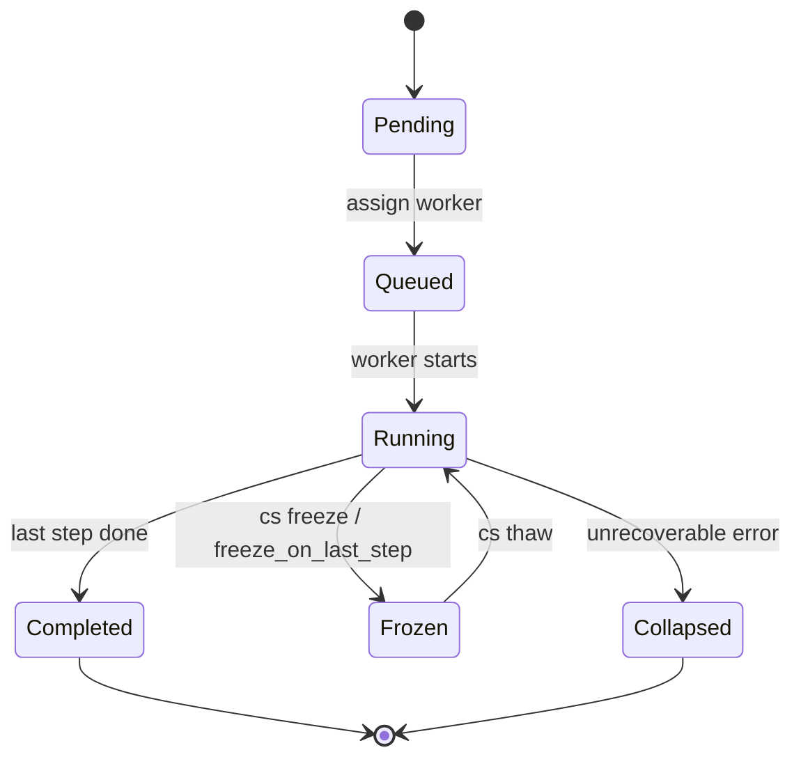
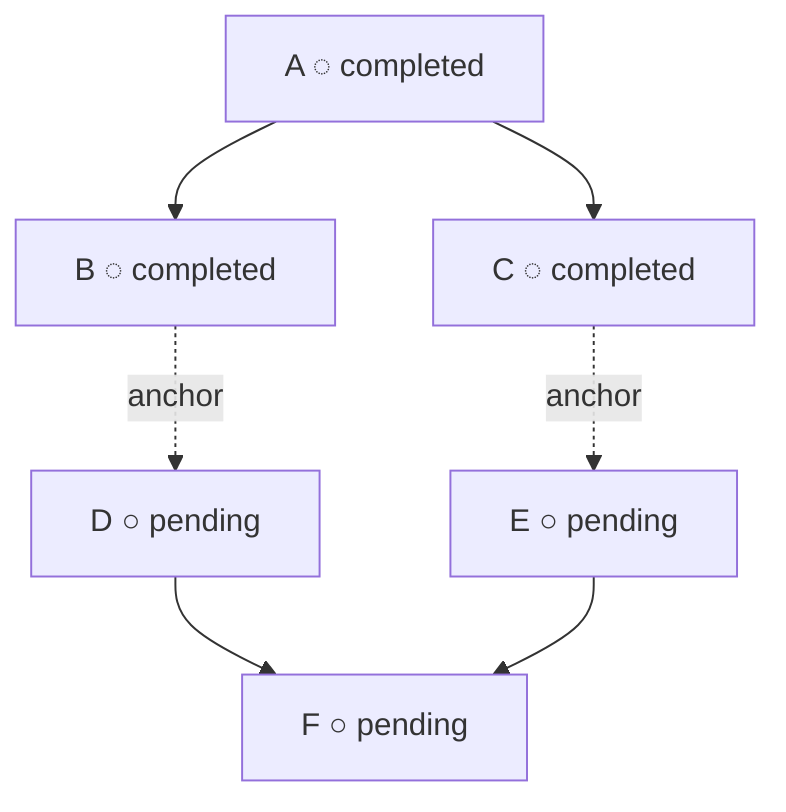

# Cosmon Operator Handbook

> **cosmon is a stateless CLI that gives crash-prone AI agents a persistent identity and a typed lifecycle: you drive every piece of work through `nucleate → tackle → wait → done`, and the filesystem — not memory, not messages — is the source of truth.**

This handbook answers the questions operators actually ask, in the order
they ask them. Every answer ends with a `Try it:` block you can run and
falsify.

## First contact — `cs demo` <a id="first-contact"></a>

Before you learn the four-verb cycle, you can feel it in a single command.
`cs demo` asks for a prompt, classifies it into a formula (deep-think for
questions, task-work for imperatives, idea-to-plan for the rest), runs the
full pipeline, renders the synthesis inline, and tears everything down.

```bash
$ cs demo
▶ cs demo — formula deep-think
❯ Is GPL contamination a viable mechanism for cognitive governance?

  ⏳ nucleated delib-20260415-xyz
  ⏳ tackled delib-20260415-xyz (worker dispatched)
  ⏳ waiting …
  ✅ reached completed in 132s

📂 synthesis.md — .cosmon/state/.../delib-20260415-xyz/synthesis.md
…rendered body…

  ⏳ torn down delib-20260415-xyz (branch merged)
✨ demo finished in 152s
```

Flags: `--prompt` (skip the TTY read), `--formula` (override
classification), `--no-teardown` (keep the worktree for inspection),
`--timeout` (bounded wait, defaults to 600 s), `--json` (NDJSON event
stream for scripts).

`cs demo` is a thin orchestrator — the exact same cycle as below runs
underneath, and the artefacts (`prompt.md`, `briefing.md`,
`synthesis.md`, `events.jsonl`, per-step git commits) persist. Learn the
four verbs next to understand what just happened.

## Bootstrap — `cs init` <a id="cs-init"></a>

`cs init <path>` is the single primitive that turns a directory into a
cosmon galaxy. It is intentionally minimal: it creates the target
directory (if it does not exist), populates `.cosmon/{config.toml,
state/, formulas/, …}`, and stops. It does **not** run `git init` —
that is git's lifecycle, yours to drive. It does **not** write
`CLAUDE.md` — that is the job of the `galaxy-onboarding` formula. It
has **no `--force` flag** and refuses to nest: if any ancestor already
carries a `.cosmon/`, `cs init` exits non-zero, because nested
galaxies silently break walk-up discovery.

```bash
cs init                # here
cs init ./new-galaxy   # create the directory, then populate .cosmon/
cs init --soft         # only CLAUDE.md (no orchestration infra)
cs init --upgrade      # backfill missing canonical formulas in-place
```

Running `cs init` twice on the same path is a strict no-op (exit 0,
no clobber, no mtime churn on already-present files). The symmetric
undo is `rm -rf <path>/.cosmon/` — every artifact the command creates
is deleted by removing that single directory.

When a git repository is detected, `cs init` also writes `.worktrees/`
to `.git/info/exclude` — the per-clone notebook — so the ephemeral
per-molecule working copies are invisible locally without polluting
the shared `.gitignore`. `.worktrees/` is always local by design (no
submodules, no push), so the rule belongs in a per-clone cahier, not
on the bulletin board. `cs init --upgrade` relocates any pre-existing
`.worktrees/` entry from the tracked `.gitignore` into
`.git/info/exclude`.

> **Try it:**
> ```
> cs init ./demo-galaxy
> cs init ./demo-galaxy    # second run is a no-op
> rm -rf ./demo-galaxy/.cosmon && cs init ./demo-galaxy
> ```
> **Expect:** first run prints `Created directory` + `Initialized cosmon project`; second run prints `Already initialized:`; the third run re-creates `.cosmon/` after the undo.
> **Falsified if:** the second run rewrites `config.toml` (check `stat` mtime), or nesting `cs init ./demo-galaxy/sub` succeeds instead of refusing with a walk-up error.

*See also: [ADR-013 — particle convergence](adr/013-particle-convergence.md), [ADR-031 — init template envelope](adr/031-cs-init-template.md), [init.rs](../crates/cosmon-cli/src/cmd/init.rs).*

## The Loop

### How do I actually get work done? <a id="pilot-cycle"></a>

You always run the same four-verb cycle: `nucleate` to create a molecule, `tackle` to spawn a worker in a detached tmux session, `wait` to block (in the background) until it finishes, and `done` to merge the branch and tear the worktree down. Skipping any verb silently breaks the pipeline — most commonly, skipping `done` leaves the branch unmerged and the worktree dangling. Do not poll `cs observe` by hand; `cs wait` is the supported notifier.

> **Try it:**
> ```
> cs nucleate task-work --var topic="hello handbook"
> cs tackle <mol>
> cs wait <mol> &
> cs done <mol>
> ```
> **Expect:** `git log main --oneline` shows the worker's commit merged; `ls .worktrees/` no longer contains `<mol>`.
> **Falsified if:** the molecule is `completed` but `git branch --merged main` does not list its branch.

> **`cs tackle` is always one node; `cs run` walks the DAG.** Picking the verb is the routing decision — there is no auto-detect. A bare `cs tackle <id>` spawns exactly one worker on `<id>` and never inspects `Blocks` edges. To walk a DAG of N≥1 nodes (1 = leaf dispatch, N = full orchestration), use `cs run <root>`. The historical `--leaf` and `--force-runtime` flags are deprecated no-ops since the verb-unification (delib-20260426-1bcd #2 / task-20260426-c33f). Context: [spark-20260423-5e45](../spark-20260423-5e45) named the silent-runtime surprise that motivated the unification, and the chronicle `2026-04-26-verb-unification.md` tells the story.

*See also: [cs help](../crates/cosmon-cli/src/cmd/help.rs), [done](../crates/cosmon-cli/src/cmd/done.rs), [architectural-invariants](architectural-invariants.md).*

### The worker finished but my branch didn't land on main — what happened? <a id="cs-done"></a>

You skipped `cs done`. A worker can `cs complete` its molecule (a pure state transition), but `cs complete` does not merge. Only `cs done` performs the teardown: merge the feature branch back, kill the tmux session, remove the worktree, purge the fleet entry, delete the branch. Workers cannot self-destroy — `cs done` is always a human (or orchestrator) call.

> **Try it:**
> ```
> cs done <mol>
> git log main --oneline | head
> ```
> **Expect:** exit code 0; the worker's commits now appear in `main`.
> **Falsified if:** `cs observe <mol>` says `completed` but `git branch --merged main` omits the worker branch.

*See also: [done.rs](../crates/cosmon-cli/src/cmd/done.rs), [architectural-invariants §merge-before-dispatch](architectural-invariants.md).*

### When should I NOT use cosmon? <a id="non-goals"></a>

Cosmon is for AI agents that crash, lose context, and need a typed lifecycle. If your work is a deterministic shell pipeline, a one-shot script, or a single Python function, use `make` or `just` — the JSON state store is overhead you will not recover. Cosmon also degrades past ~10 concurrent workers per repo: tmux sockets, worktrees, and disk projections become the bottleneck. Non-AI CI jobs belong in GitHub Actions.

> **Try it:**
> ```
> ls .cosmon/state/fleets/default/molecules 2>/dev/null | wc -l
> ```
> **Expect:** a number meaningfully below ~50 active molecules per repo.
> **Falsified if:** you have hundreds of `pending` molecules and no `temp:*` tags — see [#temp-tags](#temp-tags).

*See also: [THESIS.md](../THESIS.md), [architectural-invariants](architectural-invariants.md).*

## The Channels

### What communication channels does cosmon actually use? <a id="channels"></a>

Cosmon has six channels, each with a distinct payload and authority. Most of them are so minimal they barely feel like channels — the DAG carries one bit, propulsion carries zero bytes — and that minimality is load-bearing. When you are tempted to add messaging, RPC, or a mailbox, check the table first: the gap you are feeling is almost always already covered.

| # | Channel | Direction | Payload | Persistence | Authority |
|---|---------|-----------|---------|-------------|-----------|
| 1 | neurion | query (R/W) | structured SQL | durable | registry truth |
| 2 | DAG | inter-molecule | 1 bit (done/not) | durable | authoritative ordering |
| 3 | filesystem | broadcast | files | durable | authoritative content |
| 4 | artifact chain | sequential | markdown files | durable | proof of work |
| 5 | propulsion | pilot→worker | 0 bytes (wake) | ephemeral | no semantic content |
| 6 | **whisper** | **pilot→worker** | **unbounded text** | **reflog (fact) + file (content)** | **advisory only** |

Channels 1–4 are authoritative: what they say is what the system does. Channel 5 (`cs patrol --propel`, tmux Enter) is a wake-up pulse with no semantic content. Channel 6 (`cs whisper`, [ADR-038](adr/038-whisper-perturbation-port.md)) is the newest — a **perturbation port** for pilot→live-worker semantic injection. It is advisory-only, Propelled-regime only, human-pilot only, and forbidden in Autonomous. It does not write to `events.jsonl` and cannot modify `state.json` or the DAG.

> **Try it:**
> ```
> cs whisper <mol> - <<<"consider the 2026-04-14 incident — it may change the conclusion"
> ls .cosmon/state/fleets/default/molecules/<mol>/whispers/
> ```
> **Expect:** a `<ts>-<sha16>.txt` payload file, one line appended to `whispers.jsonl`, nothing in `events.jsonl`.
> **Falsified if:** the whisper appears in `events.jsonl`, or if the worker pane is not running Claude CLI and the command succeeded anyway.

*See also: [ADR-038 whisper-perturbation-port](adr/038-whisper-perturbation-port.md), [ADR-003 multi-channel-nervous-tissue](adr/003-multi-channel-nervous-tissue.md), [ADR-016 autonomy-regimes](adr/016-autonomy-regimes-and-resident-runtime.md), whisper-born chronicle.*

### I run N Claude sessions and I'm the postman — what is the ensemble? <a id="ensemble"></a>

Three cousins on the same street, each cooking a different dish in his own kitchen, each talking to himself about the recipe. For months you were the postman — running door to door with handwritten notes, copy-pasting recaps between sessions, holding the only thread that connected them. The three houses, it turns out, sit on the same plot of land and share a basement. The basement is already there; nobody is using it. Stop being the postman. Put a chalk-line on the wall for each cousin — *"I'm alive, I'm cooking X, last stirred at 14:02"* — and let them read each other's lines when they need to. Go upstairs and watch the street from the roof.

The basement is `.cosmon/state/`. The chalk-lines are **presence** files. The notebook every cousin already writes into is `events.jsonl`. The roof is `cs peek`. The umbrella name for the set of live sessions sharing this substrate is the **ensemble**. Nothing new is built — one hole is drilled between the kitchens and the basement stairs, and the postman can sit down.

The new vocabulary, parsimonious by design:

| Term | What it is | Where it lives | Verb |
|------|------------|----------------|------|
| **ensemble** | The set of live sessions sharing one cosmon substrate. Already cosmon's word (`cs ensemble`); the physics sense (a statistical ensemble of micro-states producing macro-cognition) absorbs the session-coordination meaning. | conceptual | `cs ensemble` (existing) |
| **presence** | A small JSON file per live session: id, galaxy, cwd, pid, headline, current molecule, last-heartbeat. The on-disk chalk-line that says *"I'm alive, here's what I'm cooking."* Written atomically, discovered by directory scan, GC'd by idempotent sweep. | `.cosmon/state/presence/<sid>.json` | `cs presence ping/ls/gc` |
| **drop** | The universal inbox gesture. One keystroke — operator speaks or types — nucleates a `spark` molecule tagged `temp:hot` + `source:drop` in the current galaxy. The gesture that replaces copy-paste as a cosmon bus. | writes a spark molecule | `cs drop` |
| **ensemble-tail** | The act of reading recent `events.jsonl` lines across the ensemble. A typed projection over the filesystem channel — no new primitive, just a read tool. | reads `events.jsonl` | `cs tail`, `cs peek` ensemble tab |
| **directed whisper** | `cs whisper --to-session <sid>` — extends the existing pilot→live-worker advisory semantics (ADR-038) to pilot→live-session. Saturates around N≈10 targets; above that, fall back to ensemble-tail. | appends to `.cosmon/state/presence/<sid>.log` | `cs whisper --to-session` |

**Presence is not a 7th channel.** It is a typed file under `.cosmon/state/` — channel 3 (filesystem) specialised, read by directory scan, written by heartbeat. No broker, no queue, no RPC. The six-channel registry stands unchanged.

**Utterance — primitive or view?** The companion ADR (**ADR-ENSEMBLE-SUBSTRATE**, forthcoming, supersedes the `docs/adr/NNN-ensemble-substrate.md` slot) decides whether `utterance` is a distinct on-disk primitive or a typed projection over `events.jsonl`. Until the ADR lands, treat it as a view — every molecule already writes `events.jsonl`, and `cs tail` reads it. When the ADR lands, this handbook row will be updated with the decision.

**Names that did not win.** The panel auditing this architecture retired — by parsimony — every metaphor that imported a substrate from outside cosmon:

- *session-mesh* — names the implementation, not the problem; abstractions leak that way.
- *cognition fabric* — poetic but directs attention to texture rather than to the bit that matters.
- *swarm*, *hive* — ants and bees have no individual identity; our sessions do (named, worktree'd, lineage'd).
- *fourmillère* / *anthill* — same issue; kept as poetic flavour in chronicles, retired as architectural name.

The winning name (*ensemble*) was already in cosmon's lexicon. **General rule for cosmon's physics-vocabulary discipline:** when naming a new coordination concept, first ask whether an existing term can absorb the new sense; if yes, extend; only import a metaphor when extension is truly impossible. Parsimony over imported taxonomies.

> **The tattoo (jobs):** **"No paste. Drop."**
>
> The measurable version: ~72 operator copy-pastes/day between sessions → ≤ 10/day within week 1, ≤ 2/day within week 2. Zero clipboard-as-cosmon-bus — the residual paste is reserved for out-of-cosmon text (Element quotes, Zotero excerpts).

*See also: [`docs/guides/gardener-not-router.md`](guides/gardener-not-router.md) — the one-page Feynman doc on substrate-first thinking; ADR-ENSEMBLE-SUBSTRATE (forthcoming); `delib-20260424-c96b` (the 7-persona deliberation that produced this architecture); [ADR-038 whisper-perturbation-port](adr/038-whisper-perturbation-port.md).*

## The DAG

### How do I run many molecules with dependencies? <a id="cs-run"></a>

Nucleate each molecule with `--blocked-by <parent>` to build the DAG, then launch the resident runtime with `cs run <root>` in a detached tmux session. `cs run` polls the DAG, calls `cs tackle` on every ready frontier, waits for completion, and calls `cs done` automatically — merge-before-dispatch is enforced so each child sees its parent's committed output in its own worktree. Never run `cs run` in the foreground of your pilot session.

> **Try it:**
> ```
> cs nucleate task-work --var topic=A                          # <root>
> cs nucleate task-work --var topic=B --blocked-by <root>      # <dep>
> tmux new -d -s runtime cs run <root> --poll-interval 5
> cs peek --all
> ```
> **Expect:** `cs peek --all` shows `<root>` then `<dep>` advancing; tmux session `runtime` is alive.
> **Falsified if:** `<dep>` starts before `<root>` is merged — that is a merge-before-dispatch bug.

*See also: [run.rs](../crates/cosmon-cli/src/cmd/run.rs), [DAG-GUIDE.md](DAG-GUIDE.md), [Graft DAG tutorial](tutorials/graft-dag.md).*

### What is a "polymer"? <a id="polymer"></a>

A **polymer** is a chain of molecules linked by `--blocked-by` that evolves as a single logical unit: each molecule is a monomer, each DAG edge is a covalent bond, and `cs run` is the reactor that grows the chain. The unit of work is sometimes one molecule, sometimes a multi-step chain — cosmon treats them the same. Any time you write `--blocked-by`, you are building a polymer.

> **Try it:**
> ```
> cs deps <mol> --depth 3
> ```
> **Expect:** a tree of blockers/blockees — the polymer your molecule sits inside.
> **Falsified if:** `cs deps` returns a flat single node but `cs observe <mol> --json | jq .blocked_by` has entries.

*See also: molecule-polymer-duality, [vocabulary](vocabulary.md).*

### Graph integrity — is the typed-relation subgraph still a DAG? <a id="verify-graph"></a>

Each typed [`MoleculeLink`](../crates/cosmon-core/src/interaction.rs) variant — `Blocks`, `DecayProduct`, `MergedFrom`, `Refines`, … — induces a subgraph on the molecule store. Some of those subgraphs MUST be acyclic (`Blocks`: a cycle is a stuck-forever set of molecules; `DecayProduct`: a molecule cannot be its own ancestor); others may legitimately carry cycles (`Refines`: two constellations can cite each other).

`cs verify-graph` is the read-only primitive that checks this for any registered relation, generalising the `meta_level=1` cap that today's `oversee` formula uses to prevent overseer-of-overseer. The check is **Tarjan SCC** on the canonical-edge projection of the subgraph: every non-trivial SCC is a cycle.

> **Try it:**
> ```
> cs verify-graph --relation blocks       # the runtime's progression DAG
> cs verify-graph --all                   # every registered relation
> cs verify-graph --all --json            # NDJSON, one row per relation
> ```
> **Expect:** exit 0 when every DAG-required relation is acyclic; exit 1 when a `Blocks`/`DecayProduct`/`MergedFrom` cycle is present (the offending SCC is printed). Cycles in `Refines` are reported as `WARN` and never flip the exit code.

The primitive is intentionally narrow: it does not modify any patrol or runtime, it just answers the question. New relations (e.g. an eventual `Oversee` link) inherit the check by adding a [`RelationKind`] variant and declaring `is_dag_required()`.

*See also: delib-20260509-18df §F2 (cosmon-ward feedback), [ADR-016 §autonomy regimes](adr/016-autonomy-regimes-and-resident-runtime.md).*

### My pending molecules keep multiplying — why? <a id="temp-tags"></a>

Because decomposition steps nucleated children without tagging them, and a later `cs run` or `cs patrol --respawn` resurrected the whole pile. Every pending molecule older than ~48h must carry a `temp:*` tag (`hot`/`warm`/`cold`/`frozen`); this is preventive curation, not decoration. Run the `temp-review` formula weekly to sweep. The original incident is the convoy cascade chronicle.

> **Try it:**
> ```
> cs ensemble --tag temp:hot
> cs nucleate temp-review && cs tackle <mol> && cs wait <mol> && cs done <mol>
> ```
> **Expect:** after review, every pending molecule has a `temp:*` tag or has been collapsed.
> **Falsified if:** `cs ensemble --json | jq '.molecules[] | select(.status=="pending" and (.tags|map(startswith("temp:"))|any|not))'` returns entries after the sweep.

*See also: [CLAUDE.md §temperature-tags](../CLAUDE.md), convoy-cascade.*

### How do I get a health check of my galaxy? <a id="fleet-review"></a>

Run the `fleet-review` formula — the galaxy's metabolism scan. It reads `events.jsonl` and molecule state from the last N days, computes five vital-sign metrics (collapse rate, duration/step, energy utilization, backlog pressure, completed ratio), and produces a markdown report with at most 5 observations.

v0 is **observation-only**: zero suggestions, zero fleet.toml changes. The pilot runs it manually when they want a snapshot.

> **Try it:**
> ```
> cs nucleate fleet-review
> cs tackle <mol> && cs wait <mol> && cs done <mol>
> ```
> **Expect:** `MOLECULE_DIR/fleet-review.md` with Vital Signs table, Top Observations, Missing Observables, and Raw Data appendix.

Optional variables: `--var lookback_days=14` (default 7), `--var max_observations=3` (default 5). If fewer than 10 events exist in the lookback window, the report says so and stops — silence is a valid response.

*See also: [THESIS.md §Part XI — Energy Principle](../THESIS.md), delib-20260416-8c50 (metabolism deliberation).*

### Is this substrate admissible as a Nucléon? <a id="nucleon-test"></a>

Run the `nucleon-test` formula. It is a **telescope, not a gate**: three read-only steps (`scan` → `probe` → `report`) walk the candidate's footprint under `.cosmon/`, evaluate the seven behavior tests T1..T7 (ratified in [ADR-066 §(4)](adr/066-ux-v2-substrate.md)) plus Turing's three guarantees G1..G3, and write `MOLECULE_DIR/nucleon-report.md`. The formula never blocks nucleation, never collapses another molecule, and never writes outside its own directory — admission is technical evidence, authorization is the social invitation ceremony.

> **Try it:**
> ```
> cs nucleate nucleon-test --var candidate="you" --var days="30"
> cs tackle <mol> && cs wait <mol> && cs done <mol>
> ```
> **Expect:** `nucleon-report.md` with a `k/7` score, per-test and per-guarantee verdicts, any excluded-substrate flags, and an advisory decision (`ADMITTED` / `DEFERRED` / `REFUSED`). `DEFERRED` reports also carry a `smallest fix` section naming the concrete schema changes that would flip the decision.

Load-bearing subset per ADR-066: {T1, T2, T4, T5, T6} — all must ✓ for `ADMITTED`. T3 and T7 are diagnostic. The excluded-substrate patterns (anonymous LLM, unbounded metacognition, non-append-only memory, swarm-without-speaker, Noogram-self) are flagged for the invitation ceremony but never prevent the run.

*See also: [ADR-066 §(4)](adr/066-ux-v2-substrate.md), delib-20260422-f52c/responses/turing.md §2–§5, `crates/cosmon-core/src/nucleon/test.rs` (pure helpers).*

### How do I read the cluster in the morning? <a id="mur-du-matin"></a>

Run `cs mur`. The **Mur du Matin** is a one-operator morning fresque of
the whole galaxy cluster — not a team dashboard, not a grid of charts.
Four horizontal bands, top to bottom:

```
═══ INFRA ═══════════════════════════════════════════
    cosmon

─── PROJECT ─────────────────────────────────────────
    earshot  sandbox  cadence
    peerco-integration  mailroom  showroom

─── SOCIAL-HUB ─────────  ║  ─── EDITORIAL ──────────
    showroom  demo-squad   ║     chancery
```

The band heights are proportional to cluster reality (1 infra,
7 projects, 2 hubs, 1 editorial — not equal). The empty vertical
margin between social-hub and editorial **is information**: it is
the drift guard-rail — if a hub's color shifts toward ink-on-cream or
its North Star starts tracking publications, the visual adjacency
catches it.

Seven channels encode the data (delib-20260419-5168 §7):

| Channel | Meaning |
|---|---|
| size | `log(activity)` floored so a silent galaxy is never invisible |
| colour | health, **palette per family** (infra blue→red, project green→red, hub saturated red→grey, editorial ink→cream) |
| position | fixed per galaxy — the operator memorises addresses |
| halo | North Star thickness: `══[name]══` high, `──[name]──` medium, `··[name]··` low |
| motion | reserved for drift-alert (last resort) |
| red dot `●` | the ONE galaxy whose North Star moved > weekly variance yesterday — jobs's rule |
| dashed halo `╌[name]╌` | measurement-ceiling per carnot: editorial reach, social-hub authenticity, project principle-value — rendered dashed so the eye reads "this is a proxy, not a measurement" |

Data sources are the ones already in the house — no new pipelines:

- **galaxy taxonomy**: `neurion repos.galaxy_kind` (written by
  `task-20260419-f88a`, see also `cs galaxies list`).
- **activity / delta**: `git log --since=7.days` and `--since=1.day`
  on each galaxy's `local_path`.
- **success (stub)**: log-scaled activity until the §6 metrics
  catalogue is plumbed in (chronicles merged × releases for project,
  external publications for editorial, …).

`cs mur --json` emits the full tile model (including every metric and
the `delta_leader`) for downstream tooling.

*See also: delib-20260419-5168 synthesis §6 (metrics catalogue) & §7
(layout), `cs galaxies list` (taxonomy without the paint).*

## Step kinds

A formula step is one of five things:

1. **Claude worker** (default — no special block). The runtime spawns a
   tmux session, builds a bootstrap prompt from briefing + state, and the
   agent decides when the step is done.
2. **Shell gate** (`command = "…"`). Run a shell command via `sh -c`;
   exit 0 advances, non-zero collapses.
3. **Native step** (`native = "cosmon::…"`). Call a registered Rust
   function in-process — no shell, no tmux.
4. **Typed query** (`[steps.query]`). Evaluate a dot-path expression
   against a JSON source (molecule state, prompt, briefing, events).
5. **Checkpointed LLM call** (`[steps.llm]`). Stream a completion to
   disk with checkpoint flushes and typed timeout events.

The five kinds are mutually exclusive; declaring two on the same step
fails to parse (`MultipleStepKinds`). Validation runs at formula load,
not at execution — typos fail loudly.

### How do I extract a value without shelling out to `jq`? <a id="steps-query"></a>

Replace `command = "cs --json observe ${id} | jq …"` with a typed
query:

```toml
[[steps]]
id = "extract-id"
title = "Extract molecule id"
description = "Bind .id into the my_id variable."

[steps.query]
expr = ".id"
source = "state"
output_var = "my_id"
```

The runtime resolves `source`, evaluates the dot-path `expr` in Rust,
and writes the result back into the molecule's `variables` map under
`output_var`. A typed `QueryStepEvaluated` event records what was
asked and what was bound, so `events.jsonl` is a sufficient statistic
for replay.

**Why not just shell out?** Because zsh's reserved `status` variable
silently shadowed the pipeline exit code (Tenant-Demo v1.2.1 retro,
symptom 4) — a `set -euo pipefail` formula appeared to "succeed" on a
broken extraction. The Rust evaluator has no shell to lie through.
See `delib-20260426-1bcd` §C3.R4.

**Sources:** `state` (alias `molecule:current`), `molecule:<id>`,
`prompt`, `briefing`, `events`. The grammar is intentionally tiny —
extending the surface lands via new schemes, not free-form strings.

**Dot-path grammar:**

| Form | Resolves to |
|------|-------------|
| `.` | The whole document |
| `.id` | Field `id` of the document |
| `.variables.versions` | Chained field access |
| `.steps[0].name` | Array index then field |

A working reference formula lives at
`.cosmon/formulas/query-demo.formula.toml`.

### How do I call an LLM as a step without dropping the response on a timeout? <a id="steps-llm"></a>

Use `[steps.llm]`. The runtime streams the response into
`output_path`, flushing every `checkpoint_every` seconds, and emits a
typed `ExternalChannelTimeout` event on a per-checkpoint stall instead
of letting the curl drop silently.

```toml
[[steps]]
id = "synthesize"
title = "Synthesize panel response"
description = "Stream a completion into synthesis.md."

[steps.llm]
provider = "mock"
model = "claude-opus-4-7"
prompt = "Combine the panel's responses into a single synthesis."
output_path = "synthesis.md"
checkpoint_every = 30        # seconds between flushes (default 30)
timeout_per_checkpoint = 120 # seconds before declaring a stall (default 120)
max_total_minutes = 30       # hard ceiling on wall time (default 30)
max_retries = 3              # resume from on-disk prefix on stall (default 3)
```

**Why this matters.** A 2026-04-24 Tenant-Demo deliberation timed out at
8m42s on a synchronous Anthropic call — no checkpoint, no retry, no
event. The watchdog had nothing to watch (delib-20260426-1bcd §C3.R5).
With `[steps.llm]` the partial bytes survive, the retry resumes from
the on-disk prefix, and `cs notify` consumes the
`ExternalChannelTimeout` event to push a notification when the stream
genuinely cannot recover.

**Today's providers:** `mock` only. The mock provider is
deterministic — it powers an in-tree property test for the
checkpoint-reprise invariant. A real `anthropic` provider lands once
the streaming SDK story is settled. Workflows that need real LLM
output should keep their existing Claude-worker steps until then.

## Concurrency control

### How do I cap the parallelism of a step? <a id="parallel-limit"></a>

By default, the resident runtime (`cs run`) dispatches every ready
molecule — parallelism is a property of the DAG's shape, and cosmon
keeps out of the way. When that's too much (big fan-out on a laptop,
token-budget pressure, a step that contends on a shared resource),
declare a cap **on the step**:

```toml
[[steps]]
id = "decompose"
title = "Decompose into siblings"
description = "Nucleate children and wire dependencies."
parallel_limit = { max = 4, mode = "static" }
```

Semantics:

- **Opt-in.** No `parallel_limit` = unbounded, exactly as before.
- **Per `(formula, step_order)`.** The runtime counts how many molecules
  are currently `Running` at that coordinate and refuses to dispatch
  beyond `max`. Dropped molecules stay in the ready frontier — the next
  tick re-evaluates as slots free up. No backoff, no queue.
- **Honored by `cs run`.** Manual `cs tackle` is not capped: tackle is
  the operator's explicit lever and stays human-paced by construction.
- **`mode = "static"` only today.** `mode = "smart"` is parsed (forward
  compat) but behaves as unbounded — see
  [ADR-044](adr/044-smart-resource-limits-roadmap.md).

Validation is strict: `max = 0` is a parse error (use `1` for serial, or
omit the field), and unknown `mode` values are rejected at parse time so
typos fail loudly.

> **Falsified if:** a step declares `parallel_limit = { max = 2 }` and
> `cs run` ever reports three `Running` molecules sharing that
> `(formula, step)` simultaneously.

*See also: [ADR-043](adr/043-parallel-limit-per-step.md),
[ADR-044](adr/044-smart-resource-limits-roadmap.md) (smart-limit
roadmap).*

## Watching

### How do I watch a worker without breaking it? <a id="cs-peek"></a>

Use `cs peek`. It is a fractal TUI: `j/k` navigates the fleet, `p` captures the worker's tmux pane read-only, `b/l/e/s/r/n/g` open briefing, log, events, synthesis, responses, notes, and git tabs. Never `tmux attach` to a worker — attaching resizes its pane, corrupts rendering, and confuses the agent. `cs peek --all` aggregates every `.cosmon/` on disk for a multi-repo view.

> **Try it:**
> ```
> cs peek --all
> ```
> **Expect:** an interactive TUI; pressing `p` on a live worker shows its current pane.
> **Falsified if:** you find yourself typing `tmux attach -t <worker>` — stop, that is the anti-pattern.

*See also: [peek.rs](../crates/cosmon-cli/src/cmd/peek.rs), observability-insights.*

### A molecule is stuck or stale — what do I do? <a id="cs-resume"></a>

Read the trace before you act. `cs observe <mol>` shows status and history; `cs peek` `e` opens the event log. Then pick: `cs resume <mol>` to nudge a propelled worker that went idle, `cs stuck <mol> --reason ...` to freeze with an external blocker, or `cs collapse <mol> --reason ...` to terminate a dead-end. Do not kill the tmux by hand — use `cs quench` or `cs kill`.

> **Try it:**
> ```
> cs observe <mol>
> cs peek     # press 'e' on the molecule
> cs resume <mol>   # or: cs collapse <mol> --reason "<why>"
> ```
> **Expect:** status advances past `propelled` or transitions to `collapsed` with reason persisted.
> **Falsified if:** `cs observe <mol> --json | jq .status` is unchanged 60s after `cs resume` and the pane shows no activity.

*See also: [resume.rs](../crates/cosmon-cli/src/cmd/resume.rs), [collapse.rs](../crates/cosmon-cli/src/cmd/collapse.rs).*

### The agent claims it did X — did it? <a id="events-jsonl"></a>

No, not until you have read `events.jsonl`. Claude output is prose; the event log is ground truth of what state transitions actually fired. Grep for the molecule id and the verb — `evolve`, `complete`, `done` — and compare timestamps. Agents hallucinate claims about work they did not do; the filesystem does not.

> **Try it:**
> ```
> grep '"molecule_id":"<mol>"' .cosmon/state/fleets/default/events.jsonl | tail -20
> ```
> **Expect:** JSON lines with the transitions the agent claims to have performed.
> **Falsified if:** the agent says "I completed <mol>" but no `completed` event exists for that id.

*See also: ifbdd-methodology.*

## Surfaces & Convention

### Where is the source of truth — and what are STATUS.md and ISSUES.md? <a id="surfaces"></a>

The source of truth is `.cosmon/state/` on disk: JSON files, one molecule per directory, never human-edited. `STATUS.md`, `ISSUES.md`, `docs/adr/INDEX.md`, and GitHub Issues are **surfaces** — derived projections produced by `cs reconcile`. Edit the state, run `cs reconcile`, commit the surface diff. `cs reconcile --check` is the CI gate that fails if the surfaces drift.

> **Try it:**
> ```
> cs reconcile
> git status
> cs reconcile --check && echo CLEAN
> ```
> **Expect:** surfaces regenerated; `--check` exits 0 on a clean tree.
> **Falsified if:** editing `STATUS.md` by hand survives `cs reconcile` — it will not, and should not.

*See also: [surface-sync-protocol](surface-sync-protocol.md), [reconcile.rs](../crates/cosmon-cli/src/cmd/reconcile.rs).*

### Where does my galaxy's memory live — and how do I move it? <a id="residence"></a>

Each galaxy picks one **residence** (ADR-055): `solo` (local, excluded via `.git/info/exclude`), `team` (shared via orphan branch `cosmon/state`), `encrypted` (team + age at rest), or `remote` (cosmon-saas over HTTP). `cs init` produces a `solo` galaxy silently. To move to another mode, run `cs migrate to {solo|team|encrypted|remote}` — seal-manifest + stage-flip + BLAKE3 verify, with `cs migrate rollback` as the symmetric undo. `cs migrate to solo` writes `.cosmon/` to `.git/info/exclude` (per-clone notebook) and sweeps any legacy `.cosmon/` / `.worktrees/` entries that prior installs left behind in the tracked `.gitignore` — solo means zero Cosmon footprint in tracked files. Full copy-pasteable walkthrough, including the known `solo` git-side bug (`task-20260420-e906`), lives in the [per-project migration runbook](guides/residence-migration-per-project.md).

*See also: [ADR-055](adr/055-cosmon-residence.md), [residence-migration-per-project](guides/residence-migration-per-project.md), [migrate.rs](../crates/cosmon-cli/src/cmd/migrate.rs).*

### Do I need the physics vocabulary to use cosmon day-to-day? <a id="vocabulary"></a>

No. The four pilot verbs (`nucleate`, `tackle`, `wait`, `done`) cover 90% of operator work. `evolve`, `collapse`, `freeze`, `thaw`, `entangle`, `ensemble`, `observe` are there when you need them — and once you learn three verbs the others read themselves. Read the glossary when a command surprises you; otherwise, ignore it.

> **Try it:**
> ```
> cs help
> ```
> **Expect:** `cs help` shows the four pilot verbs front and center.
> **Falsified if:** you cannot complete a task-work cycle without reading the glossary — file a usability issue.

*See also: [vocabulary.md](vocabulary.md), [THESIS.md Part V](../THESIS.md).*

### Who is nuclear-ing? The Nucléon and its family <a id="nucleon-family"></a>

The verb `nucleate` has a subject: the **Nucléon**, the continuous pilot-cognition that looks at three molecules, sees a pattern, and decides the fourth is worth nucleating ([ADR-061](adr/061-pilot-session-and-causal-closure.md)). The Nucléon sits at the centre of a four-word atomic family ([ADR-063](adr/063-vocabulary-orbitale-nucleon-noyau-phase.md)):

- **Orbitale** — the trusted devices on which the pilot appears (Tailnet peers).
- **Nucléon** — the pilot-cognition itself (`nucleon_id` persists across sessions).
- **Noyau** — the trusted humans who share a fleet (the Noyau *is* the fleet's Nucléon roster).
- **Phase** — a placeholder label for the cognitive substrate (`Biological`, `LlmFrontier`; more when they exist).

Nesting: **Orbitale ⊂ Nucléon ⊂ Noyau ; Nucléon has Phase.** In prose, *cercle* is allowed as a colloquial synonym for *Noyau* (Godin's veillée ceremony); in code, CLI flags and ADR bodies, only *Noyau* is correct.

*See also: [ADR-061](adr/061-pilot-session-and-causal-closure.md), [ADR-063](adr/063-vocabulary-orbitale-nucleon-noyau-phase.md), [vocabulary.md §Nucléon](vocabulary.md#nucléon--orbitale--noyau--phase--the-atomic-nucleon-family).*

## One Primitive, Three Patterns

### I keep seeing `--blocked-by` used in totally different contexts — what's the pattern? <a id="one-primitive"></a>

The same mechanism — `cs nucleate --blocked-by` — works at three moments, and you already know all of them:

1. **Runtime augmentation.** A formula step nucleates children during a `cs run`. Example: `mission-controller` decomposes a mission into researcher tasks mid-flight. The runtime picks up the new nodes on its next poll cycle.
2. **Post-drain augmentation (graft).** After a DAG completes, an operator grafts new molecules onto it. Example: you add a `review` molecule `--blocked-by` the completed `implement` molecule. The critical part is the anchor edge — without it, `cs run` never discovers the graft.
3. **Observation augmentation.** An observer attaches molecules to completed work to extract insights. Example: a `wiki-distill` molecule `--blocked-by` a completed research molecule, so it can read the output and produce a summary.

The only difference is *when* you nucleate. The DAG does not care — `compile_plan` walks the full connected component via BFS every time `cs run` polls, so late arrivals are first-class citizens.

> **Try it:**
> ```
> cs nucleate task-work --var topic=A                        # <root>
> tmux new -d -s runtime cs run <root> --poll-interval 5
> cs nucleate task-work --var topic=B --blocked-by <root>    # graft while running
> cs peek --all
> ```
> **Expect:** molecule B appears in the DAG and is dispatched after A completes.
> **Falsified if:** `cs peek --all` never shows B — that means `compile_plan` did not pick up the graft.

*See also: [compile_plan](../crates/cosmon-runtime/src/dag_policy.rs), [diamond-graft diagram](#diamond-graft), [Graft DAG tutorial](tutorials/graft-dag.md).*

## Map / Reduce / While

### I need fan-out / fan-in / iteration — do I write a new molecule kind? <a id="map-reduce-while"></a>

No. **Molecules + formulas are the only extension points** (see CLAUDE.md §Composability). Fan-out, fan-in, and iteration are all expressed as pure TOML formulas over the existing dynamic-DAG primitives (`cs nucleate --decayed-from`, `cs wait`, typed links). No new Rust type, no new `Kind`, no new scheduler.

Three canonical formulas ship in `.cosmon/formulas/`:

| Formula | Pattern | Tier | Measure | Role |
|---------|---------|------|---------|------|
| `map`    | Fan-out          | T1 | `items`      | Nucleate one child per item of a collection. |
| `reduce` | Fan-in           | T0 | —            | Consolidate N children's artifacts into one synthesis. |
| `while`  | Bounded iterate  | T1 | `iterations` | Nucleate a body formula repeatedly until a condition flips, up to `max_iterations`. |

**Map.** Required: `collection` (JSON array), `per_item_formula`, `per_item_var`. Each item becomes a child nucleated with `--decayed-from <map_id> --tag temp:warm --tag map-children:<map_id>`. The worker then `cs wait`s every child and writes an index `synthesis.md`. No output interpretation — that's reduce's job.

```
cs nucleate map \
  --var collection='["alpha","beta","gamma"]' \
  --var per_item_formula=task-work \
  --var per_item_var=topic
cs tackle <map_id>
```

**Reduce.** Required: one of `children_ids` or `tag_filter`, plus `strategy` ∈ `concat | summarize-llm | vote`. Reads each child's primary artifact verbatim into `MOLECULE_DIR/inputs/<child_id>.md`, then applies the strategy to produce `synthesis.md`. Reduce is Tier 0 — it nucleates nothing. Typical wiring pairs with a map:

```
cs nucleate reduce \
  --var tag_filter=map-children:<map_id> \
  --var strategy=summarize-llm \
  --blocked-by <map_id>
```

The `--blocked-by <map_id>` ensures reduce only fires once map (and therefore all its children) has completed — this is the merge-before-dispatch contract applied to the fan-in seam.

**While.** Required: `condition_check` (either `shell:<cmd>` or `formula:<name>`) and `body_formula`. Safety bounded by `max_iterations` (default 10, hard ceiling 100). Every iteration nucleates one body child, `cs wait`s it, then re-evaluates the condition. Exhausting `max_iterations` collapses the molecule with a fatal reason — runaway loops are not allowed to silently succeed.

```
cs nucleate while \
  --var condition_check='shell:test -s todo.txt' \
  --var body_formula=task-work \
  --var max_iterations=5
```

**Why TOML, not a new kind?** The DAG already carries ordering (1 bit per edge — done/not-done); the filesystem already carries the payload (branch + molecule_dir). Map/reduce/while are just patterns of `cs nucleate --decayed-from` + `cs wait`. Adding a `MoleculeKind::Map` would centralize behavior that formulas already compose correctly, violating the composability principle. If you find yourself wanting a fourth primitive, write a fourth formula — the substrate is already sufficient.

*See also: `.cosmon/formulas/map.formula.toml`, `.cosmon/formulas/reduce.formula.toml`, `.cosmon/formulas/while.formula.toml`, [One Primitive, Three Patterns](#one-primitive).*

## Lifecycle & Color Legend

### What do the status colors in the cockpit mean? <a id="color-legend"></a>

| Status | Color | Glyph | Meaning |
|--------|-------|-------|---------|
| pending | yellow | `○` | Created, no worker assigned |
| queued | blue | `◐` | Assigned, not yet executing |
| running | green | `●` | Worker is active |
| frozen | purple | `◉` | Paused, waiting for external input |
| completed | gray | `◌` | Done (terminal) |
| collapsed | red | `·` | Terminal failure |

Note: `cs peek` uses a two-axis system (hue = role, stroke = status). The table above is the status axis only.

### Lifecycle state machine <a id="lifecycle"></a>

Six states, two terminal. Verified against the typestate in `cosmon-core`:



There is no direct Frozen→Completed or Frozen→Collapsed — you must thaw first, then complete or collapse from Running.

*See also: [molecule.rs typestate](../crates/cosmon-core/src/molecule.rs), [THESIS.md Part IV](../THESIS.md).*

## Doctor — security probes

`cs doctor` groups read-only diagnostic probes. The sprint 1 batch
(task-20260414-c0d5, parent delib-20260414-7322) focuses on attacker
surface that an operator can close **at commit time**, without a
network. Every probe is idempotent and touches nothing outside its
arguments.

| Subcommand | What it looks for | Blocks CI? |
|-----------|-------------------|------------|
| `cs doctor leaks` | Secrets in git-tracked files (AWS/GitHub/Anthropic/OpenAI/Slack/Google tokens, PEM private keys), `.cosmon/state/**`, `.ssh/**`, `.config/gh/**`, `.env*`, credential-style extensions. | **Yes** — non-zero exit on any hit. |
| `cs doctor worktrees` | `.worktrees/*/` world-writable dirs, outward symlinks, untracked files. | No — warnings only. |
| `cs doctor mcp` | Registered MCP servers in the neurion registry: missing binaries, inline secret patterns in `args[]`, world-readable `config_files`. | **Yes** on inline-token matches; missing registry = warning. |
| `cs doctor deps` | `*` version pins, git deps without `rev = "<sha>"`, path deps escaping the workspace. | No — warnings only. |
| `cs doctor security` | Umbrella — runs all four probes and aggregates findings. | Yes, iff any child probe hit an error. |
| `cs doctor whisper <mol>` | Preexisting: whisper-channel scaffold report per molecule. | No. |

Every probe accepts `--json` (at the top-level `cs --json doctor …`) and
emits a stable payload:

```json
{
  "command": "doctor",
  "reports": [
    {
      "probe": "leaks",
      "scanned": 128,
      "findings": [
        {
          "probe": "leaks",
          "severity": "error",
          "title": "possible GitHub personal access token in config.toml",
          "detail": "line 3: …ghp_ABCDEFGH…",
          "path": "config.toml",
          "remediation": "Rotate the credential NOW, then remove the commit…"
        }
      ]
    }
  ]
}
```

> **Try it:**
> ```
> cs doctor security               # human text
> cs --json doctor security        # machine-parseable
> cs doctor leaks --include-untracked
> ```
> **Expect:** exit 0 on a clean repo; exit 1 plus an ERROR line when
> any blocking finding fires.
> **Falsified if:** a planted `ghp_…` token in a tracked file does not
> cause `cs doctor leaks` to exit non-zero.

### Wiring into CI

Add `cargo run -p cosmon-cli --bin cs -- doctor security --include-untracked`
to the job that guards `main`. The probe exits zero on warnings only,
non-zero on any `error` finding, and takes milliseconds on a workspace
the size of cosmon.

*See also: [`crates/cosmon-cli/src/cmd/doctor/`](../crates/cosmon-cli/src/cmd/doctor/),
[task-20260414-c0d5 briefing](../.cosmon/state/fleets/default/molecules/task-20260414-c0d5/briefing.md).*

## FAQ

### Can the DAG grow while running? <a id="dynamic-dag"></a>

Yes. Workers and formula steps can `cs nucleate --blocked-by` at any time. `cs run` calls `compile_plan` on each poll cycle, which does a BFS over the full connected component from the root — new nodes linked by `--blocked-by` are discovered automatically. This is runtime augmentation (see [one primitive, three patterns](#one-primitive)).

*See also: [dag_policy.rs §compile_plan](../crates/cosmon-runtime/src/dag_policy.rs), [Graft DAG tutorial](tutorials/graft-dag.md).*

### What are anchor edges? <a id="anchor-edges"></a>

The `--blocked-by` edges that connect a graft DAG to its host. Without them, the graft is a disconnected subgraph and `compile_plan` never discovers it — `cs run` scopes to the connected component of its root, not the entire state store. Anchor edges are the critical part of any graft.

*See also: [Graft DAG tutorial §the-correct-diamond-graft](tutorials/graft-dag.md#3--the-correct-diamond-graft).*

### What is a shell gate? <a id="shell-gate"></a>

A formula step with a `command=` field. When `cs evolve` advances past a step and the next step has `command=`, it auto-executes via `sh -c`. Exit 0 = success (molecule advances). Non-zero = collapse. Default timeout 300s. No retry. Example: `cs freeze` as a mechanical gate in `mission-controller`.

> **Try it:** look at any formula with a gate step:
> ```
> grep -l 'command =' .cosmon/formulas/*.toml
> ```
> **Expect:** formula files with `command = "..."` fields in their step definitions.

*See also: [evolve.rs §auto-execute gate](../crates/cosmon-cli/src/cmd/evolve.rs), [formula.rs §gate_timeout_secs](../crates/cosmon-core/src/formula.rs).*

### I nucleated a molecule but nothing happened — why? <a id="forgotten-molecule"></a>

It has no runner. `cs nucleate` creates a pending molecule; someone must `cs tackle` it or `cs run` a root whose connected component includes it. A `temp:warm` tag without a runner means forgotten work. Either promote to `temp:hot` and `cs tackle`, or `cs collapse` if it's no longer needed.

> **Try it:**
> ```
> cs ensemble --json | jq '.molecules[] | select(.status=="pending")'
> ```
> **Expect:** every pending molecule either has a runner coming or a `temp:*` tag explaining why not.
> **Falsified if:** pending molecules sit untagged for >48h — see [#temp-tags](#temp-tags).

### Diamond graft diagram <a id="diamond-graft"></a>

Three completed host molecules (A→B, A→C) with two new graft molecules (D, E) anchored onto B and C:



The dotted lines are anchor edges (`--blocked-by`). Without them, D, E, F are invisible to `cs run <A>`. With them, `compile_plan`'s BFS walks from A through B and C into the graft.

*See also: [one primitive, three patterns](#one-primitive), [Graft DAG tutorial](tutorials/graft-dag.md).*

## When it breaks

### `cs run` seems stuck — nothing is advancing. <a id="cs-run-stuck"></a>

Check three things in order: is the tmux session still alive (`tmux ls | grep runtime`); does the root molecule have ready children (`cs deps <root>`); are any workers propelled but idle (`cs ensemble`). A common cause is a worker whose `cs complete` fired but whose `cs done` hit a merge conflict — read `events.jsonl` for the last `done` attempt. If truly wedged, `cs kill` the worker, `cs collapse` the molecule with reason, and relaunch.

> **Try it:**
> ```
> tmux ls | grep runtime
> cs ensemble --json | jq '.molecules[] | select(.status=="propelled")'
> tail -50 .cosmon/state/fleets/default/events.jsonl
> ```
> **Expect:** you can point at exactly which molecule is blocking and why.
> **Falsified if:** all workers are idle, DAG has ready nodes, and `cs run` is alive — that is an orchestrator bug.

*See also: [run.rs](../crates/cosmon-cli/src/cmd/run.rs), [patrol.rs](../crates/cosmon-cli/src/cmd/patrol.rs).*

### Per-step git commits — reading the diary <a id="per-step-commits"></a>

`cs evolve` auto-commits after every successful step when the working
tree is dirty. The commit subject is
`evolve(<mol_id>): step <N>/<M> — <step_name>` (e.g.
`evolve(task-20260414-786f): step 1/2 — Implement the solution`). Empty
diffs are skipped — a no-op step produces no zero-exergy commit. This
gives every step its own restore anchor; `git log --first-parent
<branch>` reads as a step-by-step diary you can bisect.

> **Try it:**
> ```
> git log --first-parent --oneline <mol-branch>
> ```
> **Expect:** one line per step that produced a diff, in order, with
> the step name legible in the subject.
> **Falsified if:** two consecutive steps share one commit — that's a
> bug in `evolve`'s auto-commit path.

*See also: [evolve.rs](../crates/cosmon-cli/src/cmd/evolve.rs), [CLAUDE.md §Molecule artifacts](../CLAUDE.md).*

### `cs run` drains `Running` molecules too — not just `Pending` <a id="cs-run-running"></a>

A mixed formula (e.g. `claude → native → claude`, or a claude step
followed by a shell gate) can leave a molecule `Running` with no worker
attached at a step boundary. The runtime does **not** wait for a human
to re-tackle — it probes every `Running` molecule's next step on each
tick and drains it: native/gate tails cascade in-process; orphan claude
steps get a fresh `cs tackle`. The scheduling unit is `(molecule,
next step)`, not the molecule alone. See
[architectural-invariants §7g](architectural-invariants.md).

### Wait — cosmon is stateless, but `cs run` polls in a loop? <a id="cs-run-stateless"></a>

`cs run` is a client-side polling loop, not a daemon. It compiles the DAG via `compile_plan` (BFS over the state store), dispatches ready molecules via `cs tackle`, calls `cs done` on completed ones (merge-before-dispatch), and terminates when the DAG drains or the timeout expires. It is optional — you can drive every molecule by hand with `nucleate`/`tackle`/`wait`/`done`. Think of `cs run` as `make`: it runs to completion and exits. The source of truth remains JSON files on disk, not the loop's memory.

*See also: [run.rs §ADR-016 coherence](../crates/cosmon-cli/src/cmd/run.rs).*

### A worker fails to start with `worker not found: <slug>` — is cosmon broken? <a id="cs-doctor"></a>

Almost never. That message is usually cosmon faithfully reporting that a delegated binary (most often `claude`, sometimes `tmux`) crashed *before* the session could register. Run `cs doctor` first — it probes `claude --version`, `tmux -V`, `git --version` and `jq --version` with bounded timeouts and verdicts, so you learn in ~200 ms whether the pile is healthy. Known trap: `claude 2.0.x` silently crashes on recent Node versions (see chronicle `2026-04-14-bug-in-delegated-binary.md`). Use `--via-tmux` to reproduce `cs tackle`'s exact launch path.

> **Try it:**
> ```
> cs doctor
> cs doctor --json | jq '.probes[] | select(.verdict!="PASS")'
> cs doctor --via-tmux
> ```
> **Expect:** every probe PASS, exit 0. If anything is FAIL/UNKNOWN, fix that binary before re-running `cs tackle`.
> **Falsified if:** `cs doctor` is all green and `cs tackle` still errors with `worker not found` — that is a cosmon bug worth a bead.

*See also: [doctor.rs](../crates/cosmon-cli/src/cmd/doctor.rs).*

### How do I start over cleanly on a broken DAG? <a id="reset"></a>

Collapse every molecule in the subtree with an explicit reason, let `cs done` or `cs kill` tear each worktree down, then delete any orphaned tmux sessions. Never `rm -rf .cosmon/` on a repo with live workers — you will leak tmux sessions and worktree locks. If the state store itself is corrupt, open an issue with the offending JSON; recovery is a code change, not a shell hack.

> **Try it:**
> ```
> cs ensemble --json | jq -r '.molecules[].id' | xargs -I{} cs collapse {} --reason "reset"
> cs purge
> tmux ls
> ```
> **Expect:** `cs ensemble` returns an empty list; no stray tmux sessions remain.
> **Falsified if:** `tmux ls` still lists cosmon worker sessions after `cs purge` — that is a teardown bug.

*See also: [purge.rs](../crates/cosmon-cli/src/cmd/purge.rs), [kill.rs](../crates/cosmon-cli/src/cmd/kill.rs).*

## Drift patrols <a id="drift-patrols"></a>

A galaxy's `galaxy_kind` is a promise about which direction the bits flow across its boundary (delib-20260419-5168 §5). A **drift** is that promise broken — the galaxy kept its name but is quietly doing a different job. Drift patrols surface the break as a typed `issue` molecule; the operator decides whether to re-type, collapse, or accept the drift.

Five patrols ship as on-demand formulas under `.cosmon/formulas/`. Each reads `galaxy_kind` from neurion, queries the relevant metric, applies a pure-Rust threshold from `neurion_core::domain::drift::*`, and emits one `issue` per firing galaxy (tagged `drift-detected` + `drift:<kind>` + `temp:warm`).

| Drift | Formula | Threshold | Helper |
|-------|---------|-----------|--------|
| hub → project | `drift-hub-to-project` | `code_commits > conversational_artefacts` over 14d | `hub_to_project_drift` |
| editorial → introspection | `drift-editorial-introspection` | `silence_days ≥ 30` (no outbound artefact) | `editorial_to_introspection_drift` |
| infra → imposition | `drift-infra-imposition` | `1 issue/qtr` = warning, `≥2` = verdict | `infra_to_imposition_drift` |
| vanity family | `drift-vanity-family` | own-metric = 0×3 AND neighbor-metric ≠ 0 | `vanity_family_drift` |
| project → frozen | `drift-project-frozen` | `exergy == 0 && flux == 0 && reads > 0` | `project_to_frozen_drift` |

Each patrol is a three-step formula: `scan` (gather numbers from neurion + git), `detect` (apply the threshold, emit up to 5 issues), `report` (write the triage artefacts). All artefacts live in the MOLECULE_DIR from `cs --json observe <id>`, not the worktree.

> **Try it:**
> ```
> cs nucleate drift-hub-to-project
> cs tackle <id>
> cs wait <id> &
> cs done <id>
> cs ensemble --tag drift-detected --json | jq '.molecules[] | .variables.topic'
> ```
> **Expect:** a `report.md` artefact in `MOLECULE_DIR`; zero or more `issue` molecules tagged `drift-detected` each carrying a topic of the form `drift-detected: <kind> — <galaxy> (<numbers>)`.
> **Falsified if:** a fired galaxy produces no `issue` molecule, or an issue molecule lands without the `drift:<kind>` tag, or the formula auto-applies `status:frozen` / re-types / collapses a galaxy — any of those is a bug (this patrol is pull-only, operator-decides).

### What drift patrols do NOT do

- **No scheduler.** These patrols are on-demand; the LaunchAgent / patrol cadence is a follow-up task.
- **No auto-action.** Drift detection never updates `galaxy_kind`, applies `status:frozen`, collapses a galaxy, or renames a repo. The report is a permission to act, not an action (godin: every drift is an unsubscribe event for a human to read).
- **No flood.** Each patrol caps at 5 fires per run; a 6th triggers an `## Overflow` section. A flood usually means the metric or the classification is broken — better to stop and investigate than bury the backlog.

### Measurement ceilings (carnot)

Some drift numbers are proxies for quantities we cannot directly measure: *reader engagement* (editorial exergy), *authenticity of an exchange* (hub exergy), *value of a principle* (project exergy). The patrol reports the observable proxy and says so in the `report.md`. Do not treat a drift issue as ground truth; treat it as a prompt to look at the galaxy with fresh eyes.

*See also: [drift.rs](../crates/neurion-core/src/domain/drift.rs) (pure threshold helpers + unit tests), [galaxy_kind.rs](../crates/neurion-core/src/domain/galaxy_kind.rs) (the four families), [delib-20260419-5168 synthesis §4 Q8](../.cosmon/state/fleets/default/molecules/delib-20260419-5168/synthesis.md).*

