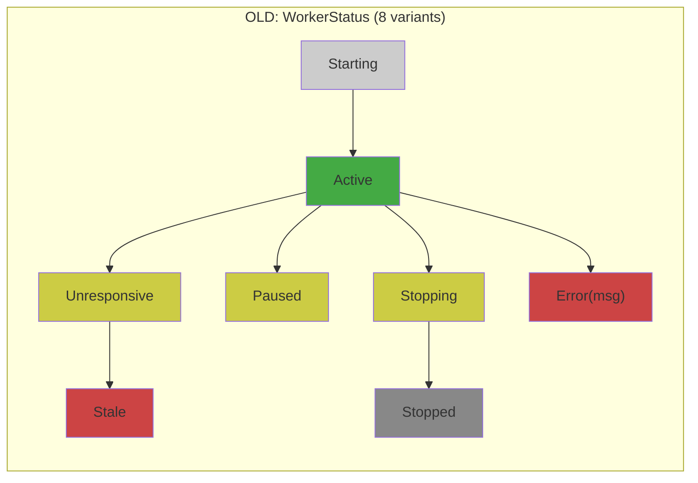
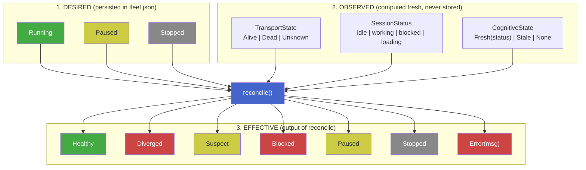
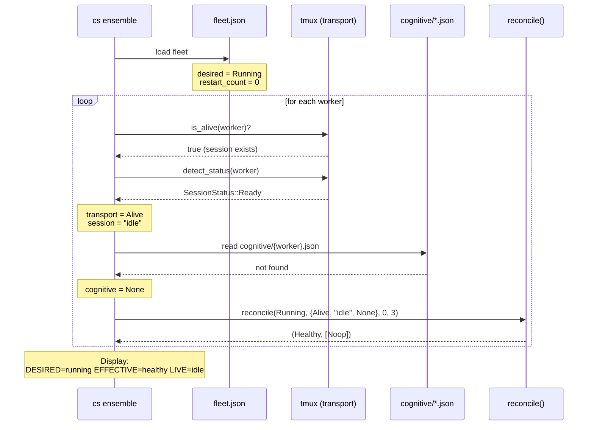
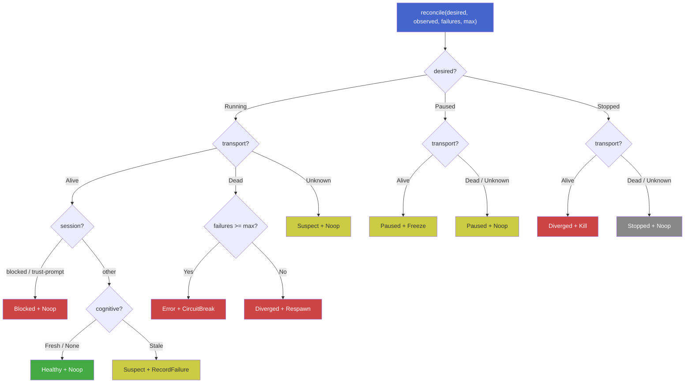
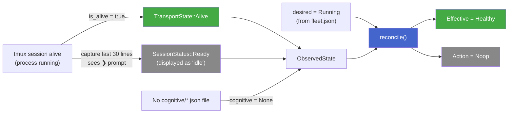

# Reconciliation Model — Desired / Observed / Effective

## The Problem

The old `WorkerStatus` enum mixed three concerns into one value:

Every CLI command had its own ad-hoc reconciliation between this persisted
status and tmux reality. Bugs were inevitable.

## The Solution: Three Orthogonal Axes

| Axis | Source | Persisted? | Purpose |
|------|--------|------------|---------|
| **Desired** | Operator (deploy, kill, freeze) | Yes (fleet.json) | What you *want* |
| **Observed** | Transport + cognitive probes | No (fresh each time) | What *reality* says |
| **Effective** | `reconcile(desired, observed)` | No (computed) | What you *see* |

## How `cs ensemble` Builds Each Column

## The `reconcile()` Decision Matrix

## Why Your Workers Show "idle"

**idle** means the tmux session is alive and showing the input prompt (`❯`).
The agent is ready but has no work assigned. This is normal when:

- No molecule is dispatched to the worker
- The worker finished its previous task
- The fleet was deployed but never given instructions

The effective status is **Healthy** because reality matches intent:
you asked for `Running`, the process is alive, and nothing is wrong.

## Common Scenarios

| Scenario | Desired | Transport | Session | Cognitive | Effective | Live |
|----------|---------|-----------|---------|-----------|-----------|------|
| Agent working normally | Running | Alive | working | Fresh("working") | Healthy | working |
| Agent idle, waiting for work | Running | Alive | idle | None | Healthy | idle |
| Agent crashed | Running | Dead | - | - | Diverged | - |
| Agent frozen by operator | Paused | Dead | - | - | Paused | - |
| Agent killed, session gone | Stopped | Dead | - | - | Stopped | - |
| Zombie (killed but tmux lingers) | Stopped | Alive | idle | - | Diverged | idle |
| Agent stuck on permission prompt | Running | Alive | blocked | - | Blocked | blocked |
| Restart limit hit | Running | Dead | - | - | Error | - |
| Agent alive but stale cognitive | Running | Alive | idle | Stale | Suspect | idle |
