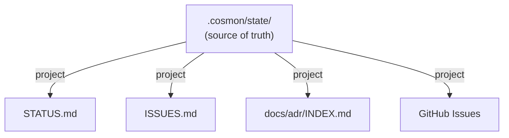
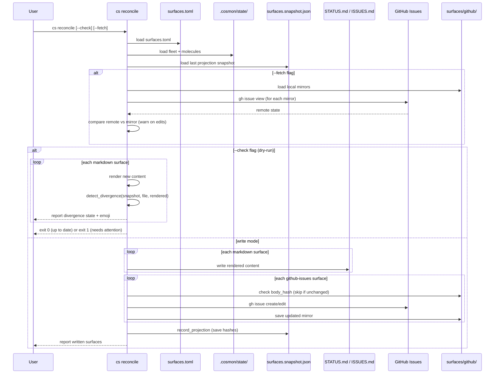

# Surface Synchronization Protocol

> *"Un bit d'information peut avoir plusieurs materialisations."*
> -- Noogram founding principle

This document describes cosmon's surface projection system: how internal
molecule/fleet state is projected onto standard files and external services
that any developer can read without knowing cosmon.

See also: [THESIS.md Part XVI](../THESIS.md) (Surface Observability),
[ADR-013](adr/013-particle-convergence.md) (Particle Convergence).

---

## Architecture

### DAG-star topology

The surface system uses a **one-way, star topology**. The single source of
truth is the internal state stored under `.cosmon/state/`. Every surface is a
derived view projected outward from that center.



**Directionality is strict.** To change what appears on a surface, change the
source (nucleate a molecule, evolve a step, collapse). Do not edit the surface
files directly -- the next reconciliation overwrites manual edits unless you
commit them first and handle the conflict.

### The Bekenstein analogy

Cosmon can have arbitrarily rich internal state (molecules, fleets, energy
budgets, entropy metrics). But the value to non-participants -- developers who
have never used cosmon, CI systems, collaborators -- is determined entirely by
what appears at the projection surfaces. The surface area bounds the external
information, not the internal volume.

---

## Surfaces

### STATUS.md (Markdown)

A human-readable project dashboard. Contains:

- Fleet summary: workers, roles, status
- Molecule summary grouped by fleet: ID, formula, status, step progress, worker

Header: `<!-- Generated by cosmon. Source of truth: .cosmon/ -->`

Referent: `project.status`

### ISSUES.md (Markdown)

Lists all alive (non-frozen, non-terminal) molecules as issues. Each entry
shows the formula, step progress, assigned worker, and context variables.

Header: `<!-- Generated by cosmon. Source of truth: .cosmon/ -->`

Referent: `project.issues`

### docs/adr/INDEX.md (Directory index)

An auto-generated index of Architecture Decision Records found in `docs/adr/`.
Lists each `.md` file (excluding INDEX.md itself) in a table.

Header: `<!-- Generated by cosmon. Source of truth: docs/adr/*.md -->`

Referent: `project.decisions`

### GitHub Issues (API surface)

Projects molecules with projectable kinds onto GitHub Issues using the `gh` CLI.

**Projectable kinds:** Issue, Task, Idea.
**Skipped kinds:** Decision, Signal.

Each GitHub Issue includes:
- A cosmon marker comment (`<!-- cosmon:molecule:{id} -->`) for idempotent lookup
- Molecule metadata: kind, formula, status, step progress, fleet
- Labels: kind-specific (`bug`, `task`, `enhancement`) + `cosmon` + custom labels

**Kind-to-label mapping:**

| MoleculeKind | GitHub label |
|--------------|-------------|
| Idea         | `enhancement` |
| Task         | `task` |
| Issue        | `bug` |

Referent: `project.issues`, kind: `github-issues`

---

## Configuration: surfaces.toml

Surface projections are declared in `.cosmon/surfaces.toml`. Each `[[surface]]`
entry maps a logical referent to a physical output.

### Full example

```toml
# STATUS.md — fleet and molecule dashboard
[[surface]]
referent = "project.status"
kind = "markdown"
path = "STATUS.md"

# ISSUES.md — alive molecules as issues
[[surface]]
referent = "project.issues"
kind = "markdown"
path = "ISSUES.md"

# ADR index — auto-generated from docs/adr/*.md
[[surface]]
referent = "project.decisions"
kind = "directory"
path = "docs/adr/"

# GitHub Issues — projectable molecules synced to GitHub
[[surface]]
referent = "project.issues"
kind = "github-issues"
repo = "owner/repo"
labels = ["sprint-1"]
```

### Field reference

| Field | Required | Description |
|-------|----------|-------------|
| `referent` | yes | Logical referent: `project.status`, `project.issues`, `project.decisions` |
| `kind` | yes | `markdown`, `directory`, or `github-issues` |
| `path` | for markdown/directory | File path relative to project root |
| `template` | no | Template name (reserved for future use — see [ADR-018](adr/018-pluggable-surface-templates.md)) |
| `repo` | for github-issues | GitHub repository in `owner/repo` format |
| `labels` | no | Extra labels to apply to created GitHub Issues |
| `branding` | no | Rendering mode: `host-native` (default), `attributed`, or `none`. See below. |

### Branding modes

Every surface is rendered in one of three branding modes. The mode is
set per-surface in `surfaces.toml`; when the field is absent it
defaults to `host-native`. The full rationale and contract is in
[ADR-017: Host-Native Projection and Surface Rendering Invariants](adr/017-host-native-projection.md).

| Mode | Metadata block | Footer | Header | When to use |
|------|----------------|--------|--------|-------------|
| `host-native` *(default)* | dropped | `<!-- auto-generated from {dir_name}/ — edit the source -->` | neutral `auto-generated` comment | **All shared-repo projections.** The host project owns the surface; cosmon is the tool that produced it, not a co-author. |
| `attributed` | full (Molecule/Kind/Formula/Status/Progress/Fleet) | *Projected by cosmon surface. Source of truth: `.cosmon/`* | `<!-- Generated by cosmon. Source of truth: .cosmon/ -->` | **Cosmon-owned surfaces only** — dashboards under `.cosmon/-internal/`, operator-only cockpit files. Reserved for contexts where the reader already knows what cosmon is. |
| `none` | dropped | *(no footer)* | *(no header)* | Embedded snippets that live inside a larger host document where a generation notice would be redundant. |

**Host-native is the default** because the typical projection target is
a repository the operator shares with people who have never heard of
cosmon. Tools should disappear into the artefacts they produce. If you
want the tool to announce itself, flip to `attributed` explicitly.

The host-native footer must contain (a) the words *"auto-generated"*
so tools detecting generated files can match on it, (b) the source
directory (`{dir_name}` — e.g. `docs/adr/`, not literally `.cosmon/`)
so a reader knows where to make a change, and (c) no cosmon
vocabulary. Anything more is a violation of host-native mode.

**Example — attributed surface on a cosmon-owned path:**

```toml
[[surface]]
referent = "project.status"
kind = "markdown"
path = ".cosmon/-internal/dashboard.md"
branding = "attributed"
```

**Example — explicit host-native (redundant with the default, shown for clarity):**

```toml
[[surface]]
referent = "project.issues"
kind = "github-issues"
repo = "tenant-demo/upstream-project"
branding = "host-native"
```

### Backref marker policy (additive-forever)

Every projected GitHub Issue body carries an invisible HTML comment
marker of the form `<!-- cosmon:molecule:ID -->`. The marker is how
`cs reconcile` finds an existing issue to update instead of creating
a duplicate. Three invariants, frozen by
[ADR-017](adr/017-host-native-projection.md), govern it:

1. **The writer never rewrites an existing marker.** On update, the
   original marker string is preserved byte-for-byte — even if the
   current cosmon default marker format has since changed.
2. **The reader accepts `cosmon:molecule:ID` forever.** The search
   pattern (`gh issue list --search "cosmon:molecule:ID in:body"`)
   is a stable recognition key. No future rename may remove support
   for this form.
3. **New markers may be added; old markers may not be removed.** A
   future cosmon version may append additional markers (e.g. a
   `cosmon:fleet:FID` anchor) alongside the original, but never in
   place of it. The reader takes the union.

This is **additive-forever**: the set of recognised markers only
grows. The rationale is operational — cosmon projects onto long-lived
third-party issue trackers where a single bad reconcile can spawn
hundreds of duplicates and recovery is manual. The marker is
classified as invisible plumbing and is exempt from the "no cosmon
strings in host-native mode" rule, because GitHub never renders HTML
comments in issue bodies.

### Mirror schema versioning

The local GitHub Issues mirror
(`.cosmon/state/surfaces/github/{repo}/{molecule-id}.json`) carries a
`schema_version` field. The current version is **`MIRROR_SCHEMA_VERSION = 2`**.

| Version | Fields | Behaviour |
|---------|--------|-----------|
| v1 (legacy) | `molecule_id`, `issue_number`, `repo`, `title`, `body_hash`, `state`, `kind`, `status`, `projected_at` | Read-only compatibility. Missing fields deserialise to safe defaults (`schema_version = 1`, `branding = attributed`, reconstructed default marker). |
| v2 (current) | v1 fields + `schema_version`, `branding`, `marker` | Written by any fresh projection. Records exactly which branding mode was used and which marker string was embedded. |

**Graceful upgrade rules:**

- **Reading a v1 mirror never fails.** Missing fields deserialise
  into safe defaults.
- **A v1 mirror does not force a reproject.** Skip-if-unchanged
  still works via `body_hash` comparison.
- **The first write after upgrade promotes to v2.** Any reconcile
  that touches a mirror for any reason writes it back in v2 format.
- **Flipping branding invalidates the hash** and triggers a one-time
  reproject. The backref invariant is honoured: the original marker
  from the v1 body is preserved in the new v2 body.
- **Unknown future schema versions** (`schema_version > 2`) cause
  the reconcile to abort with a clear error instead of silently
  downgrading.

---

## Sync protocol: `cs reconcile`

### Basic projection

```bash
cs reconcile
```

Reads `.cosmon/surfaces.toml`, loads fleet and molecule state from `.cosmon/state/`,
and writes all surfaces. After writing, records a projection snapshot in
`.cosmon/state/surfaces.snapshot.json` for future divergence detection.

Output:
```
Projected 3 surfaces:
  STATUS.md
  ISSUES.md
  docs/adr/
```

### Dry-run with divergence detection

```bash
cs reconcile --check
```

Compares current state against the last projection snapshot without writing
anything. Reports the divergence status of each surface. Exits with code 0 if
all surfaces are up to date, or code 1 if any surface needs attention.

This is designed for CI integration:
```yaml
- run: cs reconcile --check  # Fails the build if surfaces are stale
```

### Fetch remote state

```bash
cs reconcile --fetch
```

Before projecting, fetches current GitHub Issue state from the API to detect
remote edits (someone edited an issue body or changed its open/closed state
directly on GitHub).

### Full check with remote state

```bash
cs reconcile --fetch --check
```

The most thorough check: fetches remote GitHub state AND runs divergence
detection, all without writing anything. Shows warnings for any remotely
edited issues.

### JSON output

```bash
cs reconcile --json
```

All `cs` commands support `--json` for machine-readable NDJSON output:
```json
{
  "status": "projected",
  "written": ["STATUS.md", "ISSUES.md", "docs/adr/"],
  "molecules": 9
}
```

---

## 3-way divergence detection

### The snapshot as common ancestor

After every successful projection, cosmon stores a SHA-256 hash of what was
written to each surface in `.cosmon/state/surfaces.snapshot.json`. This
snapshot acts as the **common ancestor** in a 3-way comparison, analogous to
git's merge base:

```
Last projected (snapshot)
       |
       +--- Current file content  --> if different from snapshot: human edited
       |
       +--- Current rendered content --> if different from snapshot: source changed
```

### The five divergence states

| State | Emoji | Meaning | Action |
|-------|-------|---------|--------|
| UpToDate | ✅ | File matches snapshot AND source matches snapshot | Nothing to do |
| SourceChanged | 🔄 | Source changed but file untouched since last projection | Safe to overwrite |
| SurfaceEdited | ✏️ | Human edited the file but source unchanged | Human wins, file preserved |
| Conflict | ⚠️ | Both source AND file changed since last projection | Needs resolution |
| NeverProjected | 📝 | No snapshot exists (first-time projection) | Safe to write |

### Detection logic

```
file_matches_snapshot = hash(current_file) == snapshot_hash
rendered_matches_snapshot = hash(new_rendered) == snapshot_hash

(true,  true)  → UpToDate
(true,  false) → SourceChanged
(false, true)  → SurfaceEdited
(false, false) → Conflict
no snapshot    → NeverProjected
```

### Conflict behavior

When `--check` detects a **Conflict**, it:

1. Prints the conflict warning with the surface path
2. Runs `git diff HEAD -- {surface_path}` to show the human edits
3. Truncates the diff to 20 lines with a "more lines" indicator
4. Advises: "Run `cs reconcile` to overwrite, or commit your edits first."

When `cs reconcile` runs without `--check` (write mode), conflicts are
overwritten. **Source always wins.** If you want to preserve human edits,
commit them before reconciling.

---

## GitHub Issues mirror

### Local mirror files

Each projected GitHub Issue gets a local mirror file at:

```
.cosmon/state/surfaces/github/{owner-repo}/{molecule-id}.json
```

The mirror records:
- `molecule_id`: the cosmon molecule this issue was projected from
- `issue_number`: the GitHub issue number
- `repo`: the `owner/repo` string
- `title`: the projected title
- `body_hash`: SHA-256 hash of the projected body
- `state`: `"open"` or `"closed"`
- `kind`: molecule kind at projection time
- `status`: molecule status at projection time
- `projected_at`: RFC 3339 timestamp

### Skip-if-unchanged

Before making any API call, the projection engine compares the new body hash
and state against the local mirror. If both match, the issue is skipped with
an "unchanged" message. This avoids unnecessary API calls and rate limit
consumption.

### Remote edit detection with --fetch

When `--fetch` is passed, `cs reconcile` calls `gh issue view` for each
mirrored issue and compares:

- **Body hash**: if the remote body hash differs from the mirror, someone
  edited the issue on GitHub
- **State**: if the remote state differs (e.g., someone closed the issue on
  GitHub), the change is flagged

Warnings are printed to stderr:
```
  ⚠️  GitHub #42 (task-20260407-abcd) was edited remotely!
       Body was modified on GitHub.
```

---

## Molecule kind to surface mapping

| Kind | STATUS.md | ISSUES.md | GitHub Issues | docs/adr/INDEX.md |
|------|-----------|-----------|---------------|-------------------|
| Idea | yes | if alive | yes | no |
| Task | yes | if alive | yes | no |
| Issue | yes | if alive | yes | no |
| Decision | yes | if alive | no | index only |
| Signal | yes | if alive | no | no |

**STATUS.md** includes all molecules regardless of kind.
**ISSUES.md** includes all alive, non-frozen molecules.
**GitHub Issues** only projects Idea, Task, and Issue kinds.
**docs/adr/INDEX.md** lists ADR files on disk, not molecule state directly.

---

## Sync flow diagram



---

## Conflict resolution strategy

The surface projection system follows cosmon's founding principle:
**Transport first, Cognition only on ambiguity.**

| Scenario | Resolution | Mode |
|----------|-----------|------|
| Source changed, file untouched | Overwrite file | Mechanical |
| File edited, source unchanged | Preserve human edit | Mechanical |
| Both changed | Source wins (overwrite) | Mechanical (with warning) |
| Remote GitHub edit detected | Warning only | Manual |
| First projection | Write new file | Mechanical |

To preserve human edits in a conflict:
1. Run `cs reconcile --check` to see what changed
2. Commit the human edits to git
3. Then run `cs reconcile` -- the source overwrites, but git history preserves the edits

Future: **cognitive reconciliation** will spawn an ephemeral worker to analyze
divergence and attempt auto-resolution before escalating to a human. See
ADR-013, Decision 4 for the full design.
