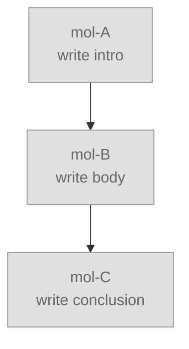
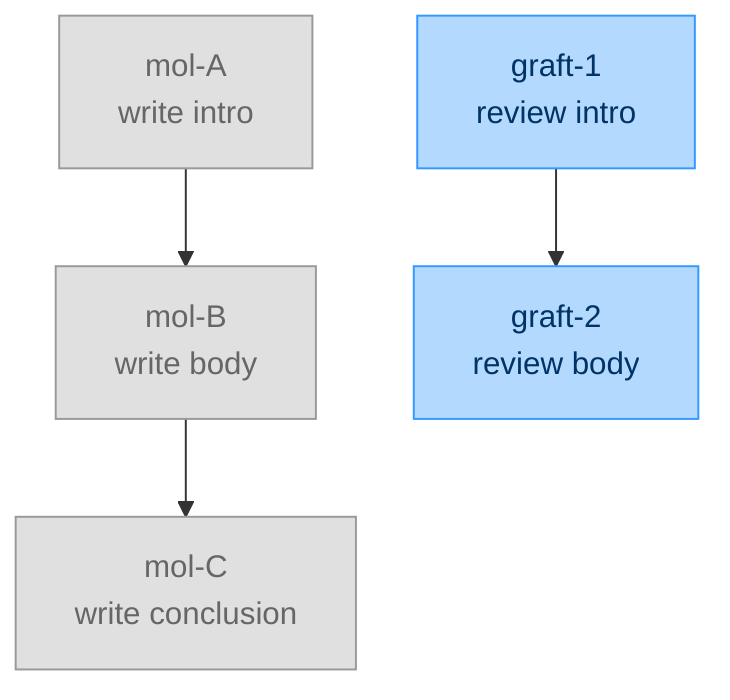
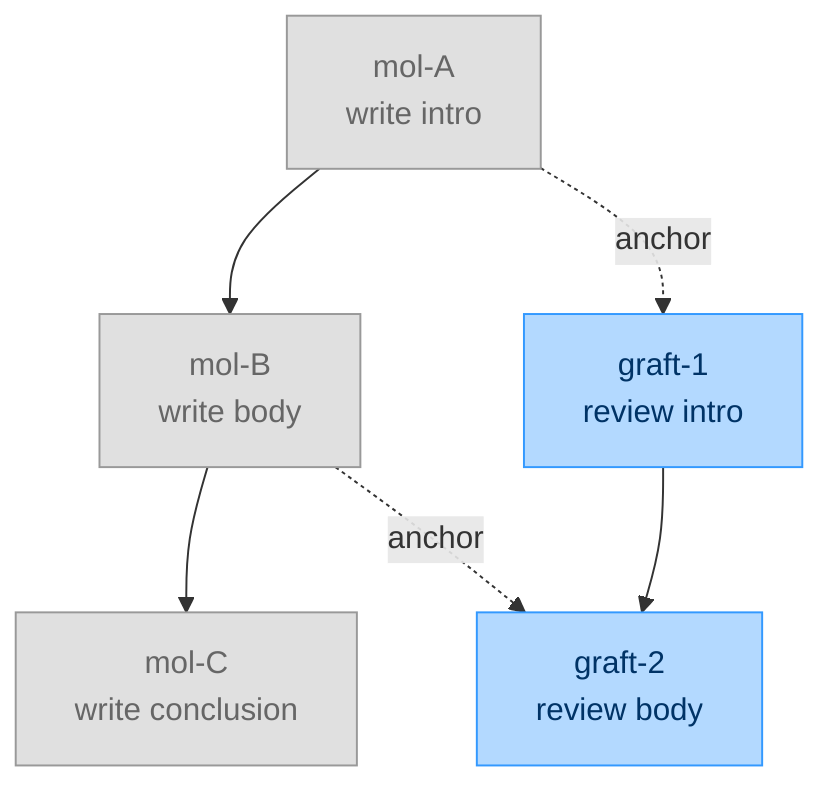
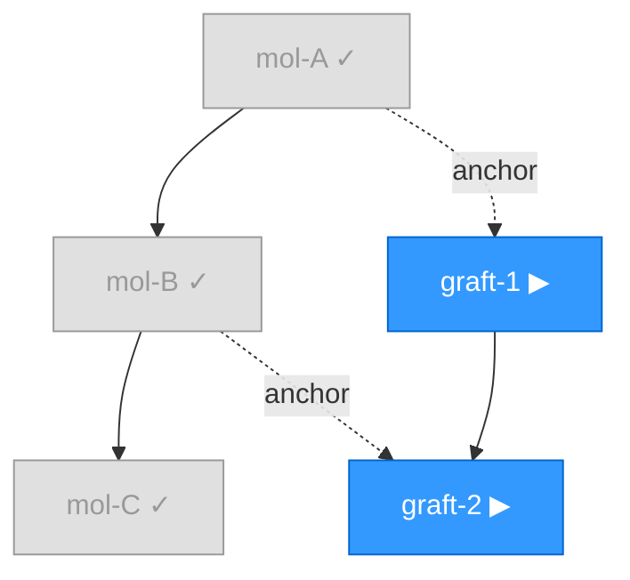

# Graft DAG Tutorial

You finished a 5-molecule research sprint last week. Today you want to audit
the results. You do not start a new project. You graft two review molecules
onto the completed DAG and type the same `cs run` command you used last week.
The system skips everything that already ran and dispatches only the new work.
Your command never changes; the DAG grows, but the entry point stays the same.

This tutorial takes you from "I know `nucleate` / `tackle` / `wait` / `done`"
to "I just grafted molecules onto a completed DAG and watched `cs run` skip
the old work" in under 10 minutes.

**Prerequisites:** cosmon installed (`cs --version`), one completed pilot
cycle under your belt (see [handbook §pilot-cycle](../handbook.md#pilot-cycle)).

---

## 1 — Build and drain a chain

Create three molecules forming a simple chain: A → B → C.

```
cs nucleate task-work --var topic="write intro"                       # mol-A (root)
cs nucleate task-work --var topic="write body" --blocked-by mol-A     # mol-B
cs nucleate task-work --var topic="write conclusion" --blocked-by mol-B  # mol-C
```

Launch the runtime in a detached tmux session and wait:

```
tmux new -d -s runtime cs run mol-A --poll-interval 5
cs wait mol-A &
```

When all three complete, `cs wait` returns. Your DAG is fully drained:



Every molecule is gray — completed, merged, done. The runtime exited cleanly.

---

## 2 — The wrong way to graft

A week later you want to review the intro and body. You nucleate two new
molecules — but forget to connect them to the existing DAG:

```
cs nucleate task-work --var topic="review intro"                       # graft-1
cs nucleate task-work --var topic="review body" --blocked-by graft-1   # graft-2
```



This is the #1 mistake. Without **anchor edges**, the graft floats as a
disconnected subgraph. When you re-run `cs run mol-A`, it walks the connected
component from `mol-A` — and never discovers `graft-1` or `graft-2`. The new
work sits orphaned.

---

## 3 — The correct diamond graft

The fix: add `--blocked-by` edges that connect the graft to the host DAG.
These are **anchor edges** — they tell `cs run` that the graft belongs to the
same connected component as the root.

```
cs nucleate task-work --var topic="review intro" \
    --blocked-by mol-A                                                 # graft-1
cs nucleate task-work --var topic="review body" \
    --blocked-by mol-B --blocked-by graft-1                            # graft-2
```

Two kinds of edges at work:

- `--blocked-by mol-A` on graft-1 = **anchor edge** — connects the graft to the host DAG
- `--blocked-by mol-B` on graft-2 = **anchor edge** — a second connection point on the host
- `--blocked-by graft-1` on graft-2 = **chain edge** — sequences work within the graft itself

The result is a diamond shape:



Gray nodes are the completed host. Blue nodes are the pending graft. Dashed
lines are anchor edges — they carry no content, only a "wait until done" bit.
Since `mol-A` and `mol-B` are already completed, the anchor edges are
immediately satisfied.

---

## 4 — The idempotent re-run

Now re-run the exact same command from Phase 1:

```
tmux new -d -s runtime cs run mol-A --poll-interval 5
cs wait mol-A &
```

Same root. Same command. `cs run` walks the full DAG via BFS from `mol-A`,
discovers all five molecules, and checks each status:



- **Gray (skip):** mol-A, mol-B, mol-C — already completed, nothing to do.
- **Blue (dispatch):** graft-1, graft-2 — pending, blockers satisfied, dispatched.

The runtime tackles graft-1, waits for it to complete and merge
(merge-before-dispatch), then tackles graft-2. When both finish, the DAG is
fully drained again and the runtime exits.

> **Try it:**
> ```
> cs deps mol-A --transitive
> ```
> **Expect:** graft-1 and graft-2 appear in the dependency tree.
> **Falsified if:** graft-1 does not appear in `cs deps mol-A --transitive` —
> that means the anchor edge is missing.

---

> **One primitive, three patterns.** All three patterns — runtime augmentation,
> post-drain augmentation, and observation — use the same command:
> `cs nucleate --blocked-by`. The only difference is *when* you run it. The DAG
> does not care; `compile_plan` walks the full connected component on every poll
> cycle, so late arrivals are first-class citizens.

---

## See also

- [Operator Handbook — one primitive, three patterns](../handbook.md#one-primitive)
- [Operator Handbook — anchor edges](../handbook.md#anchor-edges)
- [THESIS.md — Part V Vocabulary](../THESIS.md)
- [Chronicles](../lore/CHRONICLES.md)
