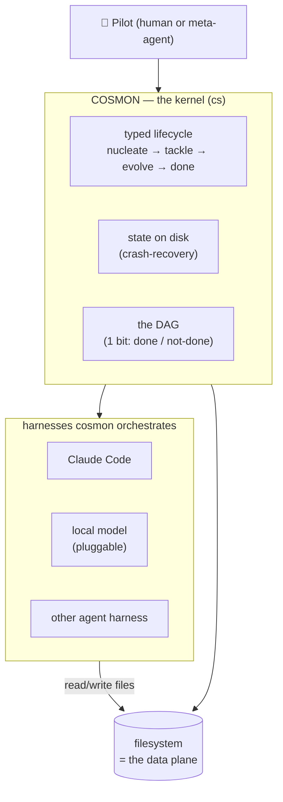
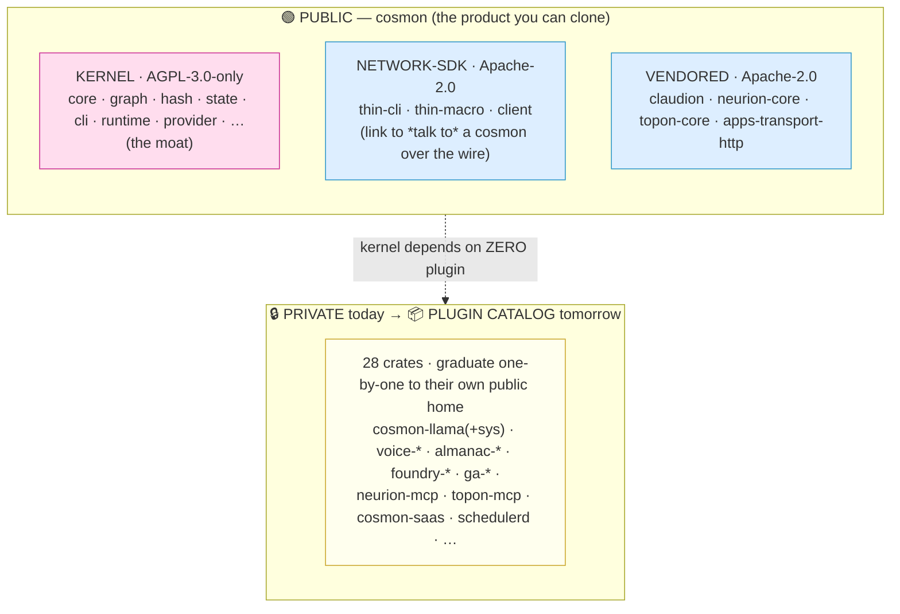
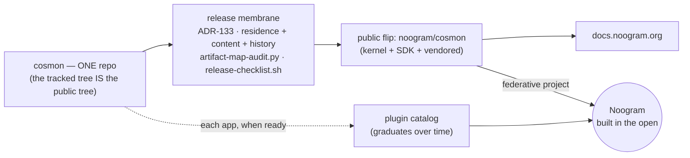
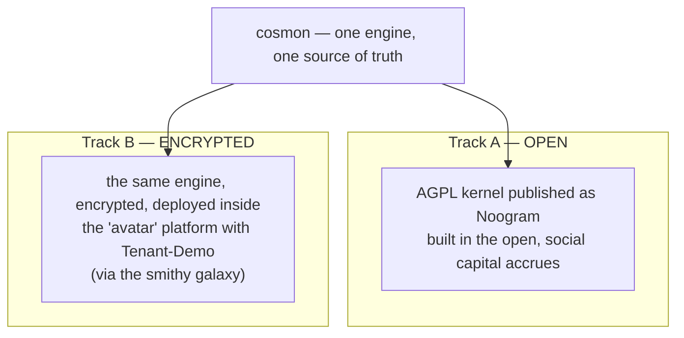

# Cosmon North Star — the AGPL kernel of an agentic OS

> **One sentence.** Cosmon is the *Linux kernel for an agentic operating
> system* — a small, free, copyleft core that gives AI coding agents a
> persistent identity, a typed lifecycle, and crash-recovery; everything else
> is a plugin you install on top.

This document exists so the **whole fleet shares one mental model** of what
cosmon is, where its edges are, and why we are drawing those edges now. It is
the **architectural / technical** north star. It is deliberately *not* the
business or platform story — that lives in mailroom (see
[§7 Division of labor](#7-division-of-labor--where-the-strategic-story-lives)).

Read this first. Then [`THESIS.md`](../../THESIS.md) for the full physics, and
[`docs/release/crate-cartography.md`](../release/crate-cartography.md) for the
crate-by-crate map.

---

## 1. The thesis in a picture

Think of a kitchen.

A **recipe** (Claude Code, Cursor, Aider, a local model behind a harness) knows
how to cook one dish at a time. It is brilliant in the moment and forgets
everything when the timer dings — close the terminal and the context is gone.

Cosmon is not another cook. Cosmon is the **kitchen itself**: the tickets on the
rail, the order in which dishes fire, the rule that the sauce is done before the
plate goes out, and the notebook that remembers what each cook was doing when
the power flickered. Ten cooks can work at once and nobody loses their place.

So cosmon is a **harness over harnesses**. The AI coding agent is *itself* a
harness — it wraps a model, tools, a loop. Cosmon wraps *those*: it spawns them,
watches them, routes work between them, and remembers their state on disk so a
crash is a pause, not a death.

The agent **thinks**; cosmon **transports** (Founding Principle 1). Models will
keep changing every few months. The transport layer — identity, lifecycle,
recovery — is what endures. That is the bet.

---

## 2. Why "kernel" is the right word (not a metaphor we like)

Linux is small. It does processes, memory, the filesystem, scheduling — the
*mechanisms* every program needs and no application logic. The browsers, the
databases, the games are **not** in the kernel. They are packages installed on
top, each with its own license and its own release cadence.

Cosmon takes the same shape, on purpose:

| Linux | Cosmon |
|-------|--------|
| **Kernel** — processes, memory, scheduling | **Kernel** — molecule lifecycle, state-store, DAG, crash-recovery |
| **Syscall ABI** — stable boundary apps link against | **Provider / transport / state-store traits** + the network wire surface |
| **Packages** (`apt`, `dnf`) — installed on top, own licenses | **Plugin catalog** — local-inference, voice, citation, formal-proof… |
| **GPL kernel** (copyleft moat) | **AGPL kernel** (copyleft moat — §13 closes the SaaS loophole) |
| Permissive userland (BSD libc, MIT tools) | **Permissive plugins** (MIT / Apache — the adoption surface) |

The word "kernel" buys us a *discipline*, not just a slogan: **the kernel must
ship zero dependency on any plugin.** A Linux kernel that refused to boot
without Firefox would not be a kernel. Likewise — and this is the load-bearing
rule — **public cosmon pulls in no plugin.** Concretely: `cosmon-provider` is
the seam to a model backend, and it has **no llama.cpp / C++ dependency**. Local
inference is *pluggable*; the default local path is heading toward pure Rust
(see [`spark-20260623-e166`](../../THESIS.md), §6 below). If the kernel ever
grows a hard edge into a plugin, that is a structural breach — file a bead.

---

## 3. The boundary, now physical

For most of cosmon's life the public/private split was *aspirational* — a
comment in a manifest, a denylist taped to the suitcase lid. The adversarial
review [`delib-20260622-187a`](../release/crate-cartography.md) said it plainly:
**the code was more honest than the words around it.** The engineering was good;
the "scope trim" had never actually happened on disk (29 unrelated crates were
still git-tracked). The lesson stuck: *a boundary that lives in prose is not a
boundary.*

So the split is now **physical** (via [`task-20260622-eeb9`](../release/release-membrane.md)),
and it has three rings.

> **On the numbers.** This doc speaks in round figures (~43 public / ~28
> private). The *authoritative* count is the tool-measured table in
> [`crate-cartography.md`](../release/crate-cartography.md) (42 public / 29
> private as of 2026-06-23, `tokei`-measured). When a number here and the table
> disagree, **the table wins** — it regenerates from `crates/*/Cargo.toml`. The
> exact crate count moves as crates graduate; the *shape* (kernel ⊕ SDK ⊕
> vendored ‖ plugin catalog) is what this doc fixes.

**Ring 1 — the AGPL kernel.** The crash-recovery agent runtime `cs` and its
direct organs. Copyleft is the moat: AGPL §13 makes a closed-SaaS reseller and
an honest self-hoster emit *different obligations* even though they emit the
same bytes — that is the whole mechanism (per
[`delib-20260620-ca76`](../release/crate-cartography.md)).

**Ring 2 — the Apache network-SDK + vendored libs.** The three thin-client
crates reach a running cosmon *over the wire*, so they cross the network
boundary and stay permissive — that is the adoption surface, the part a third
party links without copyleft reaching them. (Note the subtlety from the
cartography: `cosmon-api` and `cosmon-remote` *look* like SDK but **code-link**
the AGPL core, so they are AGPL. Only `thin-cli` / `thin-macro` / `client`
qualify. License follows *linkage*, not vibe.)

**Ring 3 — the plugin catalog.** The ~28 currently-private crates are **not
"forever private."** They are an **installable catalog of apps on the kernel**,
exactly like packages on a Linux OS. Each graduates from the private monorepo to
its own public home, **under its own license, when it earns it.** The formal
model for this lives in the plugin-ecosystem ADR
([`task-20260623-4ac2`](../adr/INDEX.md)); this doc is the picture, that ADR is
the contract.

The first worked example: **`cosmon-llama` + `cosmon-llama-sys`** — the
llama.cpp inference path — become an optional **MIT/Apache local-inference
plugin**. Want llama.cpp? Install the plugin. Don't? The kernel still runs,
because the provider seam never required it.

---

## 4. Honest edges (what we do *not* claim)

The pre-publication review earned us a rule: **say only what `ls` and `grep`
will confirm.** Three honesty corrections that this north star inherits, so the
fleet never re-oversells:

- **"Daemonless" is about the *core workflow*, not the whole repo.** The `cs`
  one-shot CLI over JSON-on-disk is the daemonless wedge. But the workspace
  *does* compile optional daemons (`cosmon-daemon`, `schedulerd`, the hosted
  federation server). They are **opt-in, separate binaries** the core `cs`
  loop never spawns — Layer-B, correctly fenced by ADR-016. Say "the core
  workflow needs no daemon," never "there are no daemons."
- **"Zero-I/O core" is the *direction*, not yet the *fact*.** The domain crate
  still has a handful of genuine I/O sites (process spawn, one fs read, clock
  reads). The seams are mostly traited; lifting the last leaks into the shell
  is in flight ([`task-20260622-3144`](../../CLAUDE.md)). Claim the goal, label
  the residue.
- **The "why" must ship with the code.** ~1,760 doc references point at
  gitignored molecule IDs that resolve to nothing in a public clone. A cold
  outsider could not read the repo. Public-facing docs (this one included)
  cross-reference **tracked files**, and treat molecule IDs as *provenance
  footnotes*, never as the only path to a rationale.

These are not architecture defects — they are truth-in-advertising. Cheap to
hold, expensive to lose. Honesty is the brand.

---

## 5. The release sequence — standing up Noogram in the open

The boundary exists so we can **publish**. Cosmon used to publish by
*projection*: a confidential monorepo scrubbed by a copy-chain into a separate
clean public tree — two trees to keep in sync forever, and a sync invariant no
one enforces is a silent-leak generator. That model is **retired** (ADR-133).
Cosmon is now **one repo**: the tracked tree *is* the public tree. There is no
projection, no copy-in, no `cosmon-release-*` scrub chain. Publication is a
**clean release** — a one-way flip of that single tree to public.

The membrane is no longer a copy-in allowlist; it is a **residence audit plus
content and history gates over the repo's own `git ls-files`**, keeping the
deny-by-default polarity at the residence layer. A leak can hide in three
places, so the flip proves three things before the door opens:

- **Residence** — is this whole *file* public-safe? `.cosmon/artifact-map.toml`
  classifies every tracked path; only `public` ships, `solo` never does. A new
  confidential file classifies `solo` (or unmapped) and goes RED *by
  construction* — no list to remember to extend.
- **Content** — does a confidential *string* hide inside a public file? gitleaks
  + the forbid-strings gate, with the denylist sourced externally so the
  detector is never its own leak.
- **History** — is a purged blob still reachable in an *old commit*? A public
  flip ships every past commit, so `clean` means tree-clean **and**
  history-clean — a hard pre-flip history-purge gate (ADR-133 §6a).

The destination is the federative project **Noogram** (noogram.dev) — the open
home on which the work, and the social capital around it, accrues. The technical
ingredients are: the one-repo membrane (ADR-133) — the residence audit, the
content gates, and the pre-flip history purge — the crate frontier (ADR-126),
and the docs surface at `docs.noogram.org`. *How that becomes a
platform and why it matters economically is mailroom's story — see §7.*

**External attribution is `Noogram` (noogram.dev)** in every shipped artifact —
the maker line, the NOTICE, the README. The operator's fund affiliation is
private and never appears.

---

## 6. The parallel reality — open kernel ‖ encrypted avatar

There are **two tracks running at once**, and the fleet must hold both in mind
so they do not drift apart:

- **Track A (open):** the AGPL kernel goes public as Noogram. This is where the
  community and the platform grow.
- **Track B (encrypted):** *the same cosmon solution* is simultaneously deployed,
  encrypted, inside the **avatar** platform with **Tenant-Demo**, plumbed through the
  **smithy** galaxy (the sovereign-git / Forgejo hosting plan). Same engine,
  private skin.

The risk is **drift**: two deployments of one engine slowly diverging until a
fix on one doesn't apply to the other. The discipline that prevents it is the
boundary this whole document draws — **one kernel, many skins.** Track B is a
*deployment* of the kernel (plus private plugins), not a fork of it. If you ever
find yourself patching the avatar in a way that *should* be a kernel change,
that is the cosmon-ward signal: surface it back as a typed molecule, do not
silently fork. (The same rule the CLAUDE.md states for every application-site
galaxy.)

---

## 7. Division of labor — where the strategic story lives

This is an **architectural** north star. It stops at the edge of the machine on
purpose.

The **strategic / business / platform** layer — the Thierry Grace
platform-economics framing, *social capital*, the Noogram federative project as
a market move — **lives in mailroom**, at
`/srv/cosmon/mailroom/docs/consolidation/strategic-view-index.md` (a
cross-galaxy citation, per the syzygie protocol — prose link, not a filesystem
path that resolves inside this repo). This doc **cross-references** that story;
it does not author it.

> **Rule (memory `project_galaxy_division_of_labor`):** mailroom drives the
> strategic vision, cosmon is infra, smithy is the sovereign-git plan. Never
> author strategy inside cosmon — point to mailroom. If the strategic doc
> needs updating because of something decided here, **surface a cosmon-ward note
> to mailroom** rather than writing the strategy in cosmon.

A `temp:warm` cosmon-ward note has been left for mailroom to fold this
kernel/plugin/dual-track framing into the strategic index (see molecule notes).

---

## 8. The one-paragraph version (paste this when someone asks)

> Cosmon is the Linux kernel for an agentic OS: a small AGPL core (`cs`) that
> gives AI coding agents — which are themselves harnesses like Claude Code — a
> persistent identity, a typed lifecycle (nucleate → tackle → evolve → done),
> and crash-recovery, all over plain JSON files on disk. The core workflow runs
> with no daemon and depends on **zero** plugins. Around it sits a permissive
> network-SDK (the adoption surface) and a catalog of installable plugins
> (local inference, voice, citation, formal-proof) that each graduate to their
> own public home under their own license when ready. We are publishing the
> kernel in the open as **Noogram** (noogram.dev) behind a deny-by-default
> release membrane, while the same engine runs encrypted inside the *avatar*
> platform with Tenant-Demo. The business and platform story lives in mailroom,
> not here.

---

## Cross-references

- [`THESIS.md`](../../THESIS.md) — the full physics (typestate, write-read
  asymmetry, energy/temperature, the four founding principles).
- [`docs/release/crate-cartography.md`](../release/crate-cartography.md) —
  every crate, its layer, LOC, license, and public/private status.
- [`docs/release/release-membrane.md`](../release/release-membrane.md) — the
  one-repo membrane (residence + content + history), in one page (ADR-133).
- [`docs/architectural-invariants.md`](../architectural-invariants.md) — the
  two layers, three regimes, command perimeters.
- ADRs: [082](../adr/082-architecture-baseline.md) (architecture baseline /
  substrate tier), [092](../adr/092-license-bascule-mpl-to-agpl.md) (AGPL
  bascule), [126](../adr/126-crate-frontier-two-gates.md) (crate frontier),
  [133](../adr/133-one-repo-artifact-map-membrane.md) (one-repo release
  membrane).
- Deliberations & molecules: `delib-20260620-ca76` (licensing strategy),
  `delib-20260622-187a` (pre-publication architecture review),
  `task-20260623-4ac2` (plugin-ecosystem ADR), `task-20260622-eeb9` (physical
  scope-split), `spark-20260623-e166` (pure-Rust local inference).
- **mailroom** — `/srv/cosmon/mailroom/docs/consolidation/strategic-view-index.md`,
  the strategic / platform-economics layer (authored there, not here;
  cross-galaxy citation).

---

*Maker: Noogram (noogram.dev). This is a living doc — update it when the
boundary moves, and keep it honest: claim only what `ls` and `grep` confirm.*
