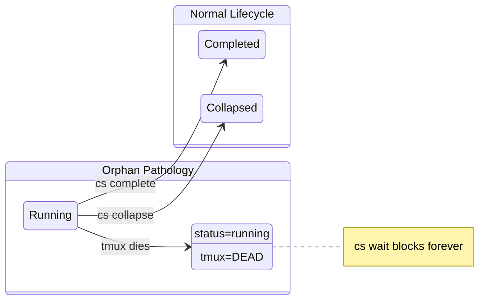
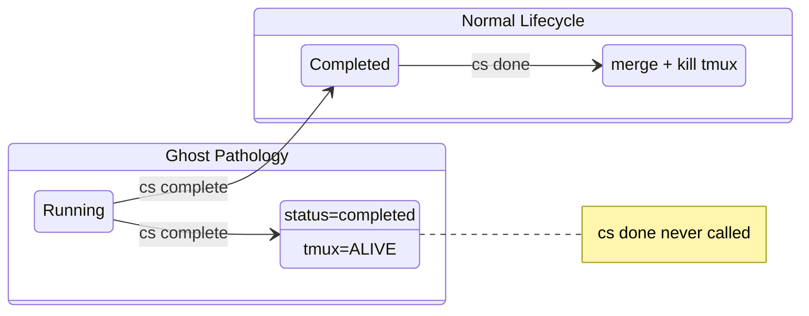
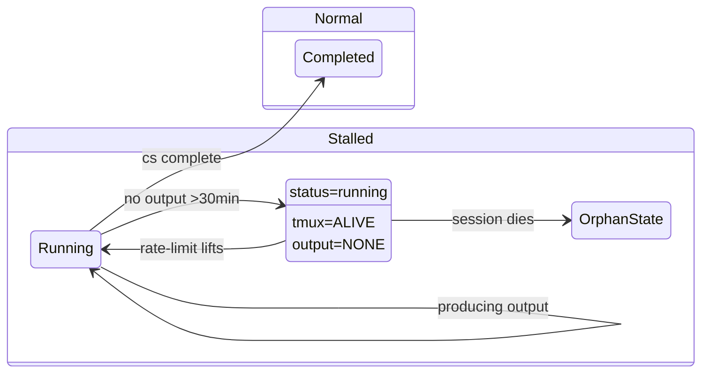
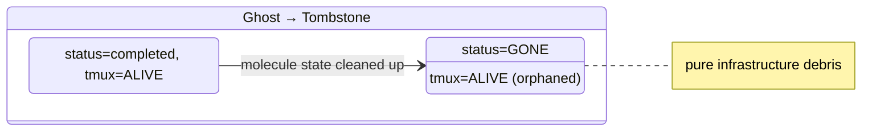
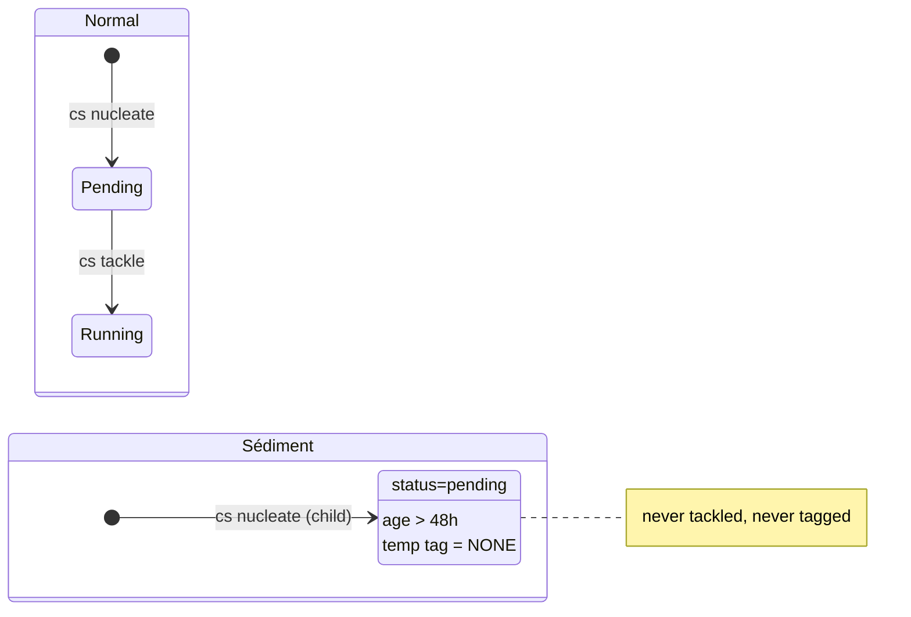
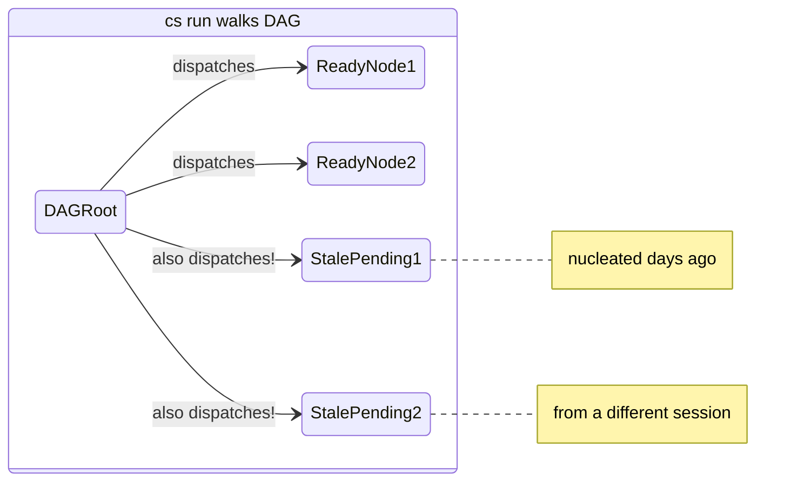

# Cosmon Vocabulary

A complete glossary of Cosmon's physics-inspired terminology, organized by scale.

Cosmon borrows vocabulary from physics — not as decoration, but because each term
carries mathematical intuitions that transfer directly to reasoning about multi-agent
systems. Entropy quantifies coordination cost. Phase transitions describe critical
thresholds. Decoherence describes measurable context loss at session boundaries.

Every term below has three parts:

1. **Physics origin** — what the term means in physics
2. **Cosmon meaning** — what the term means in this framework
3. **Where you see it** — the CLI command, Rust type, or operational context

---

## How to Read This Document

**If you are a developer** using Cosmon, start with the Domain Model section. Those
are the terms you will encounter in code, CLI output, and configuration files. The
physics vocabulary in the subsequent sections provides the conceptual framework —
useful for understanding *why* things are named the way they are, but not required
for using the tool.

**If you are contributing** to Cosmon, read the full document. The physics vocabulary
is the design language used in architecture discussions, issue descriptions, and
code review.

**Two-register vocabulary.** Cosmon's CLI uses two distinct registers
(identified by Wheeler in delib-20260416-745e):

- **Lifecycle verbs** (physics): `nucleate`, `evolve`, `collapse`, `freeze`,
  `thaw`, `entangle`, `ensemble`, `observe`, `decay` — these govern molecule
  state transitions. Each carries mathematical precision from its physics
  origin (see entries below). The polymer-scale verb `germinate`
  (`spore → polymer`, biology register, a future verb per ADR-139) joins this
  family one scale up; see the [Spore](#spore) entry.
- **Operator verbs** (vernacular): `tackle`, `patrol`, `peek`, `done`, `wait`,
  `verify`, `whisper`, `resurrect`, `demo`, `doctor` — these are human tools
  for interacting with the system. They are intentionally plain-language
  because the operator gesture should feel natural, not ceremonial.
  The vernacular register also includes **nouns** like `galaxy` (one cosmon
  project) that resonate with the cosmological theme without carrying a
  formal physics mapping.

The physics register encodes the **domain model** (what happens to
molecules). The vernacular register encodes the **operator experience**
(what the human does). `peek` belongs to the second register: it is the
operator's window into the system, not a physics act on a molecule.

> *"Everything in cosmon is named after physics — except the one command you
> use most. Because looking should be easy."* — Godin, delib-20260416-745e.

The two registers do not mix. A lifecycle verb never describes a human
action; an operator verb never describes a molecule transition. This
discipline makes the vocabulary self-documenting: if the verb is physics,
it touches molecule state; if it's vernacular, it's a human tool.

---

## Two-Register Model

Cosmon's CLI vocabulary uses two distinct registers, not one:

- **Lifecycle verbs** (physics register): `nucleate`, `evolve`, `collapse`,
  `freeze`, `thaw`, `entangle`, `ensemble`, `observe`, `decay`, `complete` —
  these govern molecule state transitions. Each verb maps to a precise physics
  concept and acts *on* a molecule's state.
- **Operator verbs** (vernacular register): `tackle`, `patrol`, `peek`, `done`,
  `wait`, `stuck`, `whisper`, `prime`, `reconcile`, `run` — these are human
  tools for interacting with the system. They encode the operator experience,
  not the domain model.

**Design rationale.** The physics register encodes the domain model — the
"laws" that govern molecule lifecycles. These terms carry mathematical
intuitions that transfer directly (entropy, collapse, decoherence). The
vernacular register encodes the operator experience — the pilot's toolkit for
managing, observing, and steering the fleet. These terms should be immediately
obvious to anyone who has used a CLI.

**Why this matters.** `peek` is intentionally vernacular — the operator's
window into the system, not a physics act on a molecule. It sits alongside
`tackle`, `done`, and `patrol` in the operator register. The register
distinction resolves apparent naming inconsistencies: not every command needs
a physics name, and not every physics term needs a command.

---

## The Metaphorical Stack

Cosmon describes agent systems at three scales, each with its own vocabulary:

```mermaid
block-beta
    columns 1
    block:cosmo["COSMOLOGICAL SCALE\n(months, system evolution)\ncosmic web, dark matter, inflation,\nnucleosynthesis, CMB, accretion, pulsar"]
        columns 1
        space
        block:stat["STATISTICAL SCALE\n(days, fleet)\nensemble, temperature, entropy,\nMaxwell's demon, phase transition"]
            columns 1
            space
            block:quant["QUANTUM SCALE\n(minutes, single action)\noperator, observable, wave function,\ncollapse, decoherence, entanglement"]
            end
        end
    end

    style cosmo fill:#f0f0ff,stroke:#333
    style stat fill:#e0e0ff,stroke:#333
    style quant fill:#d0d0ff,stroke:#333
```

Each scale has its own emergent phenomena. You cannot derive fleet-level entropy from
a single agent's behavior, just as you cannot derive the temperature of a gas by
watching one molecule. The vocabulary at each scale captures what matters at that
level of description.

---

## Domain Model (Ubiquitous Language)

These are the concrete types and concepts in Cosmon's codebase. Every term here
corresponds to a Rust type in `cosmon-core`.

### Agent Definition

A portable specification of an AI agent's identity, capabilities, and constraints.
Pure cognition — describes WHO the agent is and WHAT it can do, independent of
WHERE or HOW it runs.

- **Rust type:** `AgentDefinition`
- **Artefact:** A directory containing `agent.md` (identity), `agent.yaml` (manifest)
- **Key invariant:** Must be deployable to at least two runtime targets. Contains no
  runtime-specific configuration (no process paths, no session IDs)
- **CLI:** `cs spawn <name> --agent <definition>`

### Worker

A running instance of an Agent Definition, bound to a specific runtime. Pure
transport — a process, a session, a container. Workers are ephemeral.

- **Rust type:** `Worker`
- **States:** `Idle`, `Working`, `Stalled`, `Stopping`
- **Key invariant:** Always references exactly one Agent Definition. Multiple Workers
  may instantiate the same definition
- **CLI:** `cs spawn`, `cs stop`, `cs fleet`

### Ensemble (Fleet)

The set of all active Workers. The statistical-mechanical object: individual
trajectories matter less than the distribution of states.

- **Rust type:** `Ensemble`
- **Plain English:** "fleet" (used in CLI: `cs fleet`)
- **Metrics:** `active_count()`, `idle_workers()`, `temperature()`
- **Extended sense (session-ensemble):** the set of live *Claude sessions*
  sharing one cosmon substrate. Same word, same physics meaning (many
  micro-states, one macro-cognition), coordinated via `presence` files
  and the `events.jsonl` stream on disk — not through mailboxes or a
  broker. See [handbook §ensemble](handbook.md#ensemble) and
  ADR-ENSEMBLE-SUBSTRATE (forthcoming).

### Formula

A typed workflow template defining a multi-step process with explicit states,
transitions, and exit criteria. A recipe, not an execution.

- **Rust type:** `Formula`
- **Artefact:** A TOML file defining steps, variables, and dependencies
- **Key invariant:** A template, not an instance. Becomes a Molecule when instantiated
- **CLI:** Referenced when creating molecules

### Molecule

A running instance of a Formula, bound to a specific task. Tracks current step,
bound variables, evidence collected, and execution log. The fundamental unit of
tracked work.

- **Rust type:** `Molecule`
- **States:** `Active`, `Frozen`, `Completed`, `Collapsed`
- **Step states:** `Pending`, `Active`, `Completed { evidence }`, `Collapsed { reason }`, `Skipped { reason }`
- **Key invariant:** References exactly one Formula. State file is the authoritative
  record. Execution log is append-only. Step transitions require evidence
- **Artifacts (on disk, durable):** `state.json` (authoritative state, ephemeral/gitignored),
  `prompt.md` (raw operator intent — proof-of-work for the nucleation step),
  `briefing.md` (formula-rendered step plan), `frame.md` / `synthesis.md` / `responses/`
  (formula-specific cognitive artifacts when applicable), `log.md`, `events.jsonl`.
  The markdown artifacts are git-tracked via the selective gitignore (ADR-030).
- **CLI:** `cs nucleate <formula> <description>`, `cs evolve <id>`, `cs complete <id>`, `cs collapse <id>`, `cs observe <id>`

### Spore

The shareable, parameterizable template of an **entire polymer**. Where a
Formula is the template of ONE molecule, a Spore is the template of the whole
wired DAG: it bundles the per-node formulas, a fleet configuration, a mission
template, a manifest, and an embedded TLA+ specification, so that a recipient
can download it, fill in their own parameters, and grow it into a running
mission. It is the cosmon analogue of a shareable SKILL zip, lifted from one
agent to a whole agent-polymer.

Canonical definition (knuth's sentence, adopted verbatim in
[ADR-139](adr/139-spore-shareable-polymer-template.md)):

> **A *spore* is a shareable, parameterizable template of an entire polymer —
> bundling one or more molecule formulas, a fleet configuration, a mission
> template, a manifest, and an embedded TLA+ specification — that, when
> instantiated with a recipient's parameters, germinates into a polymer of
> molecules which provably terminates, whose gates fail closed, and whose
> parametrization is deterministic.**

The Spore fills the last empty cell of the fractal template/instance table:

|                | template (immutable) | instance (lives / dies)   |
|----------------|----------------------|---------------------------|
| **one unit**   | `formula`            | `molecule`                |
| **whole DAG**  | `spore`              | `polymer` / `mission`     |

The verb for the bottom row is **`germinate`** (`spore ─germinate→ polymer`),
the polymer-scale twin of `nucleate` (`formula ─nucleate→ molecule`). A
*sealed* spore germinates into a *validated* mission: each row is the same
generative relation seen at the next scale up.

Two loads are stated in the definition as **properties**, not folded into the
noun (ADR-139 D2):

- **Seal (a property, not part of the name).** A TLA+-validated spore is a
  *sealed* spore; the embedded `.tla` module is the strongest seal it can
  carry, reusing cosmon's existing BLAKE3 seal vocabulary (`prompt_seal`,
  `briefing_seals`, [`cs verify`](cs-verify.md)). The seal must **gate**
  instantiation: an unproven or proof-failing topology is refused, never
  replayed (ADR-139 D3, fail closed). The reproducibility spectrum this opens
  is its own note, [spore-reproducibility](design/spore-reproducibility.md).
- **Portability (a property, not part of the name).** Sharing a spore is an
  export / import event (biology's *conjugation*); refining one is editing its
  manifest (*recombination*). Three orthogonal states follow: *unsealed*,
  *sealed-but-private*, *sealed-and-shared*.

What is genuinely new is only the **wiring**: the static inter-formula edge set
(`from → to`, typed `Blocks` / `DecayProduct`). The crew already lives in a
Fleet, the per-node recipes in `[Formula]`, the schema in formula variables,
the proof in a BLAKE3 seal; only the work-topology had no home. A Spore is
therefore a projection over existing primitives, **not** a new domain type, no
new lifecycle, no runtime: the germinated thing is an ordinary polymer going
through `nucleate → tackle → wait → done`.

- **Rust type:** none yet. ADR-139 fixes the **ontology and the file format**
  (`.spore` / `spore.toml`); the `cs spore run` / `germinate` verb family and
  the pure `expand(spore, params) -> [cs nucleate … --blocked-by …]` function
  (the twin of `cs fleet resolve`) are **future work** (ADR-139
  §Implémentation, deliberately not built). Today the spore is defined as
  format plus ontology, not a runnable command.
- **Where you see it:** [ADR-139](adr/139-spore-shareable-polymer-template.md)
  (canonical source of truth), the template/instance fractal table, and the
  *germinate* verb in design discussion. There is no `cs spore` command on the
  binary yet, so do not expect one in `cs help` or `man cs`.

### Clearance

The maximum level of action a Worker is authorized to perform.

- **Rust type:** `Clearance`
- **Levels:** `Read` (observe only), `Write` (modify files, commit), `Execute` (run code, call APIs)
- **Key invariant:** No Worker may act above its Clearance level. Declared in the
  Agent Definition, not the fleet registry

### Dispatch

The act of assigning a Molecule to a Worker.

- **Rust type:** `Dispatch`
- **Sources:** `Human`, `Orchestrator`, `AutoDetect`

### Bead

A persistent unit of tracked work. The durable record that survives session death,
agent restarts, and system reboots. While a Molecule tracks *how* work progresses
through a Formula's steps, a Bead tracks *that* work exists, who owns it, what its
status is, and what has been discovered about it.

The Bead/Formula/Molecule stack:
- **Bead** — the persistent *what*. An issue, a task, a piece of mail.
- **Formula** — the reusable *how*. A workflow template defining steps and exit criteria.
- **Molecule** — the live *execution*. A running instance of a Formula, bound to a Bead.

- **Rust type:** `BeadId` (format: `PREFIX-SUFFIX`, e.g. `cs-4tu`, `gt-pvx`),
  `BeadStatus`, `BeadRef`
- **States:** `Open`, `InProgress`, `Closed`, `Blocked`
- **Key invariant:** Beads exist independently of any workflow. A bead may exist
  without a molecule (unworked issue) or with one (active execution)
- **CLI:** `bd show <id>`, `bd list`, `bd create`, `bd close <id>`

### Message

Inter-Worker communication. Two channels:

- **Mail** — persistent, creates a record, delivered to inbox. For formal handoffs
  that must survive agent restarts
- **Nudge** — ephemeral, no record, immediate delivery. For lightweight coordination
  ("check your inbox", "tests passing")
- **Rust type:** `Message` enum with `Mail` and `Nudge` variants
- **CLI:** `cs mail <worker>`, `cs nudge <worker>`, `cs inbox <worker>`

### MessagePriority

Priority level for inter-agent messages. Determines routing through the nervous
tissue — which Channel carries the message.

- **Rust type:** `MessagePriority`
- **Levels:** `Low` (routine, deferrable), `Normal` (default), `High` (time-sensitive),
  `Critical` (lifecycle-critical, never dropped)
- **Ordering:** Descending — `Critical > High > Normal > Low` — so `max()` yields
  the most urgent priority in a collection
- **Key invariant:** Priority maps directly to a Channel via `select_channel()`.
  Critical and High → `DoltBead`. Normal and Low → `JsonlFile`
- **Numeric mapping:** 1 = Critical, 2 = High, 3 = Normal, 4 = Low

### Channel

Transport mechanism for inter-agent communication. Channels exist on a spectrum
from fast-and-ephemeral to slow-and-durable. The orchestrator's job is channel
selection based on message priority, not channel implementation.

- **Rust type:** `Channel`
- **Variants:**
  - `IpcDirect` — Unix socket/pipe. Lowest latency (~0.1ms). No durability.
    Used for critical control signals
  - `JsonlFile` — Append-only JSONL log. Medium latency (~1ms). High durability.
    Used for event logs and heartbeats
  - `DoltBead` — Versioned SQL storage. Highest latency (~50ms). Highest durability
    and observability. Used for beads and audit trail
- **Key invariant:** Channel selection is determined by `MessagePriority` via
  `select_channel()`, not by the sender

### Patrol

A health monitoring cycle. Inspects the ensemble, identifies anomalies, takes
corrective action.

- **Rust type:** `PatrolReport`, `PatrolAction`
- **Actions:** `RestartWorker`, `ReassignMolecule`, `AlertHuman`, `NoAction`
- **CLI:** `cs patrol`, `cs patrol --cognitive`

### Prime

Dynamic context compilation injected at session start. Assembles Agent Definition,
current molecule state, recent messages, and system status into a single document.

- **Rust type:** `Prime`
- **Purpose:** Fights decoherence by giving each new session the full context needed
  to continue work
- **CLI:** `cs prime <worker>`

### Nucléon / Orbitale / Noyau / Phase — the atomic-nucleon family

The pilot-cognition layer, ratified across two ADRs and nesting through the
same atomic metaphor:

```
Orbitale ⊂ Nucléon ⊂ Noyau ;   Nucléon has Phase.
```

- **Nucléon** — the continuous cognitive field that causes molecules to be
  nucleated. Persists across sessions, reboots, and tool switches via a
  stable `nucleon_id` reference. Defined in [ADR-061](adr/061-pilot-session-and-causal-closure.md).
  **Rust type:** `NucleonId` (newtype over `String`). **Field of:**
  `MoleculeData.nucleon_id: Option<NucleonId>` (only set on `PilotSession`
  molecules).
- **Orbitale** — the set of devices on which a Nucléon may manifest
  (MacBook, iPad-Blink, iPhone-Blink, AWS node — Tailnet peers). Property
  *of* a Nucléon, not an independent type; realised today as Tailnet
  membership.
- **Noyau** — the finite set of Nucléons bound by operational trust within
  a fleet. A fleet *belongs to* a Noyau. The Noyau is a list, not a
  hierarchy — admission is the only act; rôle-RBAC is out of scope. Solo
  pilot = Noyau of one.
- **Phase** — placeholder label on Nucléon naming the cognitive substrate
  (`Biological`, `LlmFrontier` today; `Mixed(...)`, `WorldModel`,
  `NoogramSelf` deferred until a referent exists). **Phase characterises;
  it does not imbricate** — a Nucléon *has* a Phase the way an electron
  has a spin.

Both ADRs ([061](adr/061-pilot-session-and-causal-closure.md),
[063](adr/063-vocabulary-orbitale-nucleon-noyau-phase.md)) are vocabulary +
invariant ratifications; code adoption happens gradually through sibling
implementation molecules.

> **Prose discipline.** *Noyau* is the system term (code, CLI, ADR
> bodies). *Cercle* is allowed as colloquial synonym in chronicles and
> narrative docs — never in code or on a CLI flag. Same register rule as
> *noyau* (physics) vs. *atome* (everyday French).

---

## Vernacular Register (Operator-Facing Terms)

Terms in the vernacular register — plain-language words that the operator uses
to interact with the system. These are not physics analogies and carry no
physics mapping. They sit alongside lifecycle verbs (`nucleate`, `evolve`, …)
but belong to a different register: the operator's toolbox.

See also: `tackle`, `patrol`, `peek`, `done`, `wait`, `verify`, `whisper`,
`resurrect`, `demo`, `doctor` — all operator verbs documented in the CLI
help and the [Cross-Reference: CLI Commands](#cross-reference-cli-commands)
table below.

### Galaxy

A single cosmon project: one `.cosmon/` directory, one state store, one fleet,
one molecule-space. The unit of isolation. All `cs` commands without `--all`
operate within the current galaxy.

Molecules, fleets, and DAG edges do not cross galaxy boundaries. The causal
horizon is the `.cosmon/` directory discovered by walk-up search
(`walk_up_find_cosmon_dir_from()`).

- **Where you see it:** `cs peek --all` (multi-galaxy view), `--all` flag on
  ensemble commands, operator speech ("la galaxie cosmon", "la galaxie
  mailroom")
- **Not a physics analogy.** Galaxy is a vernacular term that resonates with
  the cosmological theme but carries no formal mapping to gravitationally
  bound structures. It is not a Rust type and has no corresponding `GalaxyId`.

> **Galaxy vs. Universe.** A galaxy is one project. Universe refers to the
> conceptual frame cosmon provides (type system, state machines, lifecycle) —
> not to a specific project or set of projects. "Mailroom is a galaxy.
> Cosmon provides the universe — the laws of physics — in which galaxies
> exist." See [Universe](#universe--conceptual-frame) below.

### Universe — Conceptual Frame

Universe refers to the conceptual frame cosmon provides: the type system,
state machines, formulas, and lifecycle that govern all galaxies. It is
the "laws of physics" of the system — not a container of projects, not a
synonym for one project, and not the aggregation of all projects.

- **Correct:** "Cosmon is the universe in which agents exist" (meaning: cosmon
  defines the rules)
- **Correct:** "The cosmon universe" (meaning: the conceptual frame)
- **Incorrect:** "The mailroom universe" (mailroom is a galaxy)
- **Incorrect:** "Launch a fleet in the meeting-notes universe" (use galaxy)

The aggregation across projects has no dedicated name — use "all galaxies"
or the `--all` flag.

- **Where you see it:** THESIS.md, narrative documentation, architecture
  discussions
- **Not an operational term.** Universe does not appear in CLI commands,
  Rust types, or state files. It lives in the thesis and design language.

---

## Quantum Scale (Minutes, Single Action)

Terms for reasoning about individual agent actions — the smallest scale of the system.

### Fermion → Worker

**Physics:** A particle obeying the Pauli exclusion principle — no two fermions can
occupy the same quantum state simultaneously.

**Cosmon:** A Worker. No two Workers occupy the same Molecule simultaneously. If two
agents try to work on the same task, the system has a bug.

**Where you see it:** Design discussions about dispatch constraints. The fermion
analogy explains *why* dispatch enforces single-assignment.

### Operator → Skill

**Physics:** A mathematical transformation applied to a quantum state, producing a
new state.

**Cosmon:** A skill — a procedure that transforms a Molecule's state. An agent applies
an operator (runs a skill) to advance a molecule from one step to the next.

**Where you see it:** Agent Definition files (`skills` field). Formula step definitions.
On-disk form: Markdown + YAML-frontmatter files under `.cosmon/skills/` (project)
and `~/.cosmon/skills/` (user-global), scoped via an `applies_to` block and
injected into worker briefings at `cs tackle` time. See
[ADR-042 — Cosmon-Skill extension surface](adr/042-cosmon-skill-extension-surface.md)
for the full contract, and `.cosmon/skills/bug-triage-protocol.md` for a worked
example.

### Observable → Exit Criterion

**Physics:** A property of a quantum system that can be measured, yielding a definite
value.

**Cosmon:** An exit criterion — a condition that can be evaluated to determine whether
a step is complete. "Tests pass" is an observable. "Code feels right" is not.

**Where you see it:** Formula TOML files (`exit_criteria` in step definitions).
`cs advance <id> --evidence "..."`.

### Wave Function → Molecule State

**Physics:** The complete mathematical description of a quantum system's state.

**Cosmon:** The full state vector of a Molecule: status, current step, bound variables,
execution log, collected evidence. Everything needed to describe where the work stands.

**Where you see it:** `cs mol <id>` output. The molecule state file on disk.

### Collapse → Checkpoint

**Physics:** The act of observation forcing a quantum system from superposition into
a definite state.

**Cosmon:** A checkpoint — the act of writing state to disk, resolving uncertainty
about progress. Before the checkpoint, the agent's progress exists only in its
context window (superposition). After, it is recorded (collapsed).

**Where you see it:** `cs advance <id> --evidence "..."`. Molecule state writes.
The instruction to "persist findings early and often."

### Decoherence → Context Loss

**Physics:** The loss of quantum coherence through interaction with the environment.
A quantum system becomes classical (loses its special quantum properties) through
environmental noise.

**Cosmon:** Context loss at session boundaries. When an agent's session ends and a new
one begins, the agent loses its accumulated understanding — its "coherence." This is
the enemy of agent continuity and the reason Prime exists.

**Where you see it:** Every session restart. The operational cost of context loss is
measurable: compare tokens consumed by a fresh session vs. one that resumes from a
checkpoint. This is Landauer's principle applied to agents.

### Entanglement → Cross-Molecule Correlation

**Physics:** Two particles whose states are correlated regardless of distance.
Measuring one instantly constrains the other.

**Cosmon:** Two molecules whose outcomes constrain each other. If molecule A discovers
that the API schema has changed, molecule B (which depends on that API) is immediately
affected, even if no message was sent.

**Where you see it:** Molecule dependency declarations. The reason the dispatch system
must track inter-molecule relationships.

### Tunneling → Unexpected Path

**Physics:** A particle passing through a barrier that classical physics says is
impassable.

**Cosmon:** An agent finding an unexpected path through a blocked task. The task
appeared impossible given the constraints, but the agent found a creative solution
that bypassed the barrier entirely.

**Where you see it:** Retrospective analysis of completed molecules. Not something
the system controls — it is an emergent property of agent creativity.

### Superposition → Multiple Execution Paths

**Physics:** A quantum system existing in multiple states simultaneously until
observed.

**Cosmon:** A task existing in multiple possible execution paths until an agent commits
to one. Before the agent starts, the molecule could go in many directions. Once work
begins, possibilities collapse.

**Where you see it:** The conceptual space before `cs pour`. After instantiation,
the formula constrains the path.

---

## Statistical Scale (Days, Fleet)

Terms for reasoning about fleet-level behavior — where individual trajectories
matter less than distributions.

### Ensemble → Fleet

**Physics:** A collection of systems in statistical mechanics, analyzed as a
population rather than individually.

**Cosmon:** The set of all active Workers. "Ensemble" is the physics term; "fleet" is
the plain-English term used in the CLI.

**Where you see it:** `cs fleet` (CLI), `Ensemble` (Rust type).

### Polymer → Growing DAG of Molecules

**Physics:** A macromolecule built from repeated monomer subunits. Polymers adopt
linear, branched, or cross-linked topologies depending on how monomers bond.

**Cosmon:** A DAG of molecules whose edges grow as its nodes execute. A running
molecule can nucleate children (decay), entangle with siblings, or refine into
successors; the scheduler re-reads the readiness frontier each tick. Unlike a
static DAG compiled up front, a polymer is incrementally assembled — new
monomers can be grafted mid-flight via `cs nucleate --blocked-by <running>`.
See an internal note for the canonical
fractal table (step / molecule / polymer / fleet).

Related: `ensemble` (fleet-scale view across polymers), `decay` (homogeneous
1→N growth), `entangle` / `refine` (cross-linking and successor edges).

**Where you see it:** `cs run <root>` treats `<root>` and its transitive
`Blocks` / `BlockedBy` closure as a polymer, draining the readiness frontier
until the terminal molecule completes. `cs tackle <root>` auto-detects whether
the target has outgoing `Blocks` edges and spawns the resident runtime instead
of a single worker.

### Temperature → Activity Level

**Physics:** Average kinetic energy of a system. Controls which states are accessible.

**Cosmon:** The system's activity level — the ratio of working to idle agents.

- **High temperature:** Agents explore freely. New research directions, experimental
  approaches, speculative work. Expensive in tokens.
- **Low temperature:** Agents converge. Finish existing work, polish outputs,
  consolidate. Cheap in tokens.

**Where you see it:** `Ensemble::temperature()`. Orchestrator decisions about
exploration vs. exploitation. Energy budget discussions.

### Entropy → System Uncertainty

**Physics:** A measure of disorder or missing information in a system.

**Cosmon:** System-level uncertainty — the gap between what is known and what is
happening across the fleet. High entropy means the orchestrator does not know what
agents are doing or whether they are making progress.

Entropy is a computable observable with four channels:

1. **Message entropy** — Shannon entropy of inter-agent message stream, measured
   via compression ratio on the JSONL event log: `H_msg ≈ compressed_bytes / raw_bytes × 8`
2. **Context window entropy** — Signal-to-noise ratio of each agent's context window
3. **Code entropy** — Compression ratio of source files; measures code complexity velocity
4. **State entropy** — Boltzmann entropy of fleet state distribution:
   `S = -k_B Σ p_i ln(p_i)` where `p_i` is the fraction of agents in state `i`

**Where you see it:** Patrol reports. The motivation for checkpoints and molecule
state tracking — every checkpoint reduces entropy. See ADR-COS-002 for the
full computable entropy framework.

### Maxwell's Demon → Orchestrator

**Physics:** A thought experiment: an entity that reduces entropy by sorting fast and
slow molecules, apparently violating the second law of thermodynamics.

**Cosmon:** The orchestrator (human or automated) that reduces system entropy by
assigning the right tasks to the right agents. Unlike the thought experiment, the
orchestrator pays for this reduction in entropy with energy (tokens spent on dispatch
decisions, patrol cycles, and communication).

**Where you see it:** Dispatch logic. The Mayor role in Gas Town.

### Phase Transition → System Milestone

**Physics:** A sudden qualitative change in macroscopic behavior (ice melting to water,
iron losing magnetism above the Curie point).

**Cosmon:** A moment when the system's behavior qualitatively changes. Examples:
going from manual to automated dispatch, from single-agent to multi-agent operation,
from prototype to production. Adding one more agent may produce qualitatively different
system behavior — a phase transition.

**Where you see it:** Project retrospectives. Architecture discussions about scaling
thresholds.

### Relaxation Time → Recovery Time

**Physics:** The time a system takes to return to equilibrium after being perturbed.

**Cosmon:** Fleet recovery time after a disruption — a crash, a deployment, a major
refactor. How long before the fleet is back to productive work after something goes
wrong?

**Where you see it:** Post-incident analysis. Patrol metrics.

### Free Energy → Effective Capacity

**Physics:** The energy available to do useful work, after subtracting entropy costs.
In thermodynamics, Helmholtz free energy: `F = E - TS`.

**Cosmon:** The productive capacity of the fleet, after subtracting coordination
overhead (the entropy tax). Two formulations:

**Simple:** `Free energy = total token budget - entropy tax`

**Helmholtz:** `F = E_remaining - T × S_current` where:
- `E_remaining` = tokens left in the energy budget
- `T` = system temperature (activity level)
- `S_current` = total system entropy across all four channels

A high-entropy system (stale contexts, many open beads, chaotic communication) has
low free energy even with many tokens remaining.

- **Free energy ratio** = productive tokens / total tokens consumed
- A healthy system has a free energy ratio above 0.7 (70%+ of tokens do real work)
- **Rust type:** `EnergyReport::free_energy_ratio()`

**Where you see it:** `EnergyBudget` type. Fleet efficiency reports.

### Boltzmann Distribution → Task Assignment Probability

**Physics:** The probability of a system being in a given state depends on that
state's energy relative to the temperature.

**Cosmon:** Task assignment probability — harder tasks (higher energy) are less likely
to be picked up spontaneously. At high temperature, agents are more willing to attempt
hard tasks. At low temperature, they gravitate toward easy, predictable work.

**Where you see it:** Dispatch heuristics (future). The conceptual basis for
cost-aware dispatch.

---

## Cosmological Scale (Months, System Evolution)

Terms for reasoning about the system's long-term evolution — where the vocabulary
describes structures that emerge over weeks and months.

### Cosmic Web → Knowledge Graph

**Physics:** The large-scale filamentary structure of the universe — galaxies
connected by filaments of dark matter and gas, with voids between them.

**Cosmon:** The network of repositories, agents, and information flowing between them.
Over time, knowledge accumulates into clusters (well-understood domains) connected by
filaments (cross-domain insights) with voids (unexplored areas).

**Where you see it:** Long-term project analysis. The motivation for knowledge-sharing
mechanisms between agents.

### Cosmic Microwave Background (CMB) → Founding Documents

**Physics:** The oldest observable signal in the universe — a snapshot of the cosmos
380,000 years after the Big Bang, still detectable everywhere, encoding the initial
conditions that shaped all subsequent structure.

**Cosmon:** The founding documents (THESIS.md, this vocabulary, the initial type
definitions). The oldest signal in the project, still shaping all structure. Every
architectural decision can be traced back to these initial conditions.

**Where you see it:** THESIS.md. This document. The design rationale in early commits.

### Dark Matter → Tacit Knowledge

**Physics:** Invisible mass that shapes the structure of the universe through gravity
but cannot be directly observed — detected only through its effects.

**Cosmon:** Undocumented conventions, institutional knowledge, and unwritten rules
that shape the system but cannot be directly observed. You know dark matter exists
because the system behaves as if there are constraints you cannot see in the code.

**Where you see it:** Onboarding friction. The gap between what the documentation says
and how the system actually works. The motivation for making tacit knowledge explicit.

### Nucleosynthesis → Domain Type Creation

**Physics:** The formation of the first elements (hydrogen, helium, lithium) from
primordial plasma in the minutes after the Big Bang.

**Cosmon:** The creation of the first domain types — `AgentId`, `MoleculeId`,
`FormulaId`, `WorkerStatus`. These are the "atoms" of the type system, forged in the
framework's earliest moments, from which all subsequent structures are built.

**Where you see it:** `cosmon-core/src/id.rs`. The newtype definitions that form the
foundation of the entire crate graph.

### Inflation → Bootstrapping Phase

**Physics:** A period of rapid exponential expansion in the very early universe,
growing the cosmos by a factor of ~10^26 in a fraction of a second.

**Cosmon:** The bootstrapping phase — rapid growth from nothing to a functioning
system. The period when the framework goes from an empty repository to a working
prototype. Like cosmic inflation, most of the structural decisions are made in this
brief early period.

**Where you see it:** Early git history. The first week of development.

### Accretion Disk → Task Queue

**Physics:** Material spiraling into a massive object (black hole, star), forming a
disk as it loses energy and angular momentum.

**Cosmon:** The task queue — work spiraling toward available agents. Tasks enter the
queue, orbit briefly while awaiting assignment, and are consumed by agents. The disk
metaphor captures the dynamics: tasks do not teleport to agents, they spiral inward
through a dispatch process.

**Where you see it:** The dispatch queue. `bd ready` (in Gas Town). Future: `cs queue`.

### Pulsar → Patrol Service

**Physics:** A rotating neutron star emitting regular, detectable signals — like a
cosmic lighthouse.

**Cosmon:** The patrol service — periodic health checks, reliable and detectable. The
patrol emits regular signals (patrol reports) at a fixed interval. If the signal
stops, something is wrong with the monitoring system itself.

**Where you see it:** `cs patrol`. Cron-scheduled transport patrol. The "heartbeat"
metaphor in health monitoring.

### Hubble Flow → Workstream Divergence

**Physics:** The general expansion of the universe carrying galaxies apart. Galaxies
are not moving *through* space — space itself is expanding.

**Cosmon:** The natural divergence of workstreams as a project grows. Teams and agents
that once worked on related problems gradually drift apart as the project expands,
not because of conflict but because the problem space itself is growing.

**Where you see it:** Long-term project structure. The reason large projects develop
specialized sub-teams.

---

## Energy and Thermodynamics

Terms from Part XI of the thesis — the energy principle that governs resource
allocation across the entire system.

### Tokens → Energy

Every agent action has a cost measured in tokens. Tokens are consumed when an agent
reads context, generates output, invokes skills, or communicates. Tokens are the
conserved quantity that enables all work. They are spent irreversibly.

- **Rust type:** `TokenCount`, `EnergyBudget`

### Entropy Tax → Coordination Overhead

Tokens spent on orchestration rather than productive work: context compilation,
patrol reports, inter-agent communication, prime injection. Necessary but not
directly advancing any molecule.

- **Entropy tax** = tokens spent on coordination
- **Free energy** = total budget - entropy tax

### Landauer's Principle → Cost of Context Loss

In physics, erasing information has an irreducible energy cost. In Cosmon, losing
context at session boundaries costs tokens to reconstruct. Every token invested in a
checkpoint is a token saved at the next session start.

### CompressionRatio

The ratio of compressed size to raw size, clamped to `[0.0, 1.0]`. The bridge
between raw data and entropy measurement.

- High compression ratio (e.g., 0.95) means high information density (low redundancy)
- Low compression ratio (e.g., 0.3) means low information density (high redundancy)
- Converts to entropy via `to_entropy()`: `H = 1.0 - ratio`

**Where you see it:** Entropy computation in patrol reports. Applied to JSONL event
logs (message entropy) and source files (code entropy).

### ThermodynamicState

The "equation of state" for the fleet — a single snapshot combining all four entropy
channels with temperature and free energy. The complete thermodynamic configuration
of the system at a point in time.

- **Fields:** `timestamp`, `message_entropy`, `code_entropy`, `context_entropy`,
  `state_entropy`, `temperature`, `free_energy` (Helmholtz)
- **Key invariant:** All entropy values are non-negative. Temperature is non-negative.
  Free energy may be negative (indicating the system is spending more on coordination
  than it can sustain)

**Where you see it:** Fleet health dashboards. Patrol report summaries. The input
to orchestrator temperature-control decisions.

### CarnotEfficiency

**Physics:** The maximum possible efficiency of a heat engine operating between two
reservoirs: `η_max = 1 - T_C/T_H`.

**Cosmon:** The thermodynamic efficiency bound for an agent:

```
η_agent = W / Q_H = productive_tokens / total_tokens
```

Where:
- `T_H` (hot reservoir) = LLM output stream (high-entropy token source)
- `T_C` (cold reservoir) = Structured artifacts (code, closed beads, vault notes)
- `W` (work) = Transformation from hot to cold
- `Q_waste` = Tokens that do not become artifacts

This is exactly the `free_energy_ratio` with a rigorous foundation: efficiency is
bounded by Carnot's theorem. If the LLM produces 30% noise irreducibly, then
`η_max = 0.70`.

**Where you see it:** `EnergyReport::free_energy_ratio()`. Fleet efficiency analysis.

### The Thermostat → Temperature Control

The orchestrator controls the system's temperature — the trade-off between exploration
(expensive, uncertain) and exploitation (cheap, predictable). Adjusting temperature
is a concrete decision about how to spend the remaining energy budget.

---

## Nervous Tissue (Communication Architecture)

Terms from the multi-channel communication architecture — the nervous system of
the agent fleet. See ADR-COS-003 for the full design.

### NervousTissue → Communication Fabric

**Neuroscience:** The network of neurons, synapses, and neurotransmitters that
carries signals through an organism at different speeds and reliability levels.

**Cosmon:** The multi-channel communication fabric of the agent fleet. Different
message types flow through different physical transports, selected by priority
and latency requirements — just as biological nervous systems route critical
signals through fast myelinated axons and background signals through slow
unmyelinated fibers.

| Neuroscience | Cosmon |
|-------------|--------|
| Neuron | Agent |
| Synapse | Channel between agents |
| Neurotransmitter | Message |
| Myelin sheath | Fast channel selection (IPC for critical path) |
| Synaptic plasticity | Channel adaptation based on observed latency |
| Autonomic nervous system | Patrol and heartbeat (automatic, periodic) |
| Reflex arc | Hook-triggered response (stimulus → action, no deliberation) |
| Somatic nervous system | Explicit dispatch by orchestrator |

**Design principle:** The orchestrator's job is channel selection, not channel
implementation. The nervous tissue provides the transport; the orchestrator
decides which transport to use for each message.

**Where you see it:** `MessagePriority`, `Channel`, `select_channel()`. The
routing logic in inter-agent communication.

---

## Evolutionary Biology

Terms from Part XII — morphological evolution and the open-source multiverse.

### Plasticity Principle

No layer of Cosmon may be designed as permanent. Every layer is subject to
evolutionary pressure. The trait interfaces are the stable skeleton; the
implementations are the muscles that can change.

### Speciation → Fork Divergence

When an open-source fork diverges beyond merge compatibility. Not a failure — a
natural consequence of adaptation to different environments.

### Horizontal Gene Transfer → Cross-Fork Feature Import

Importing a specific feature from another fork without merging the entire codebase.
Enabled by shared trait interfaces: any `StateStore` or `Runtime` implementation can
be transplanted into any compatible fork.

### Absorption → Colony-to-Template Pattern Extraction

**Biology:** Absorption is the uptake of nutrients from the environment into an
organism. In microbiology, horizontal gene transfer includes transformation — the
uptake of free DNA from the environment into a cell's genome.

**Cosmon:** The `absorb` formula extracts reusable patterns from a living colony
(a cosmon project) into `templates/`. The colony is the donor organism; the template
is the gene cassette; a new project that adopts the template is the recipient.

Unlike forking (speciation), absorption is selective: only proven patterns are
extracted, templatized with `<CHANGE_ME_*>` sentinels, and made available for
transplant. The source colony continues to evolve independently.

**Where you see it:** `cs nucleate absorb`, `templates/` directory, `docs/templates/README.md`.

### Colony → Living Cosmon Project

A cosmon-managed project that has developed proven patterns worth absorbing.
Colonies are the evolutionary frontier — they discover what works through use.
Templates are the fossilized record of what survived.

**Where you see it:** The `--var colony=` parameter in the `absorb` formula.

### Sentinel → Template Placeholder

A `<CHANGE_ME_*>` marker in a template file that must be replaced with
project-specific values when the template is deployed. Sentinels are the template's
API — they declare what the adopter must decide.

**Where you see it:** `templates/*/fleet.toml`, `templates/*/README.md.tmpl`.

### Fitness Landscape

The set of all possible Cosmon configurations. Each fork occupies a different point
and climbs toward a local optimum. Cross-fork communication (tunneling) allows
information to flow between peaks.

---

## Observer Regulation

Terms from Part XIII — managing the human-system interaction.

### AI Psychosis → Amplification Overload

The cognitive overload from watching agents produce faster than the human can absorb.
Cosmon must be a regulator, not an amplifier.

### Quantum Zeno Effect → Observation Interference

Rapid repeated human intervention prevents the fleet from doing deep work. The system
needs quiet time between observations to produce coherent results.

### The Observer → The Human

The human interacting with the system is an observer in the physics sense. Each
observation (prompt, directive) collapses possibilities and perturbs the system.
Cosmon manages this perturbation through temperature control, molecule budgets, and
digest-over-stream reporting.

---

## Forensics — Truth from Traces

Forensic science (from Latin *forensis*, "of the forum") is the discipline of
extracting truth from evidence — reconstructing what happened from the marks it
left behind. Cosmon is a forensic system by design: the CMB (tracked artifacts
in git), events.jsonl streams, molecule briefings, chronicles, and git blame
are all traces. Every audit — the Schrödinger DOI hallucination, the convoy
cascade, orphaned running molecules, the DAG resurrection of wiki2 — is a
forensic investigation.

### Forensic Principle

**The informative signal is the trace, not the claim.** When an agent says "I
verified this DOI," the claim is weak evidence. When `events.jsonl` contains
`DoiCheckFailed` followed by `MoleculeEvolved`, the trace is strong evidence.
The trace survives the agent; the claim decays with the session.

### Forensic Commands

Cosmon commands that produce or consume traces for forensic analysis:

| Command | Produces trace | Consumes trace |
|---------|----------------|----------------|
| `cs nucleate` | events.jsonl (Nucleated) | — |
| `cs evolve` | events.jsonl (Evolved) + briefing deltas | previous step outputs |
| `cs done` | git merge (permanent record) | worker artifacts |
| `cs observe` | — | state.json (current truth) |
| `cs peek` (events tab) | — | events.jsonl (temporal truth) |
| `cs peek` (git tab) | — | git log / blame |

### Why Forensics is Fundamental to Cosmon

1. **Agents are unreliable narrators.** An LLM can claim it performed a step
   without performing it. The trace cannot lie about what was actually written.
2. **The CMB outlives the session.** By tracking durable artifacts in git
   (ADR-030), cosmon preserves the evidence even after workers are destroyed.
   Frankenstein resurrection of frozen missions is a forensic act: reading the
   CMB to reconstitute the organism.
3. **Hallucinations escape prose but leave traces.** A hallucinated DOI is
   detectable only by cross-referencing the claim against Crossref or Zotero —
   both of which leave their own traces (API logs, search events). The
   verification plane (see the anti-hallucination deliberation) IS a forensic
   infrastructure.
4. **IFBDD is forensics-first development.** "Observability before feature"
   means: build the trace-capturing machinery before the behavior it should
   capture. You must be able to investigate before you can trust.

### Related Disciplines

- **Archaeology** — reading strata of past activity in a durable substrate (git log, chronicles).
- **Epidemiology** — tracking the propagation of a fault through the system (how did the DOI reach six layers?).
- **Accident investigation** — NTSB / post-mortem methodology applied to fleet failures (convoy cascade chronicle).

### Operational Rule

**Never trust an agent's summary of what it did. Read the trace.** If the trace
doesn't exist, the behavior wasn't observed and cannot be trusted. If the trace
contradicts the summary, the trace wins. This is Wheeler's "it from bit" applied
to verification: the fossilized bit has more authority than the live cognition.

---

## Pathologies — When Things Go Wrong

Operational pathologies that arise in multi-agent fleet management. Each entry
follows the three-part template (origin, cosmon meaning, where you see it) and
adds: symptoms, root cause, fix, and a concrete example from the 2026-04-12
session that first catalogued these failure modes.

### Orphan (Running + Dead tmux)

**Origin:** In distributed systems, an orphan process is one whose parent has
terminated without collecting its exit status. The process continues to exist
in the process table but nobody is waiting for it.

**Cosmon meaning:** A molecule whose `state.json` shows `status: running` but
whose worker tmux session is dead. The molecule thinks it is alive; nobody is
working on it. The control plane (state) and the transport plane (tmux) have
diverged.

**Where you see it:** `cs ensemble` shows the molecule as running.
`cs peek` shows no tmux pane for the worker. `cs patrol` detects the mismatch.

**Symptoms:**
- `state.json` says `running`, but `tmux has-session` fails for the worker socket
- No progress on the molecule for hours
- `cs wait` never returns (waiting for a terminal state that will never arrive)

**Root cause:** Worker crash (rate-limit, context window exhaustion, OOM), tmux
session kill without `cs complete`/`cs collapse`, or network interruption in a
remote session. No heartbeat reconciliation mechanism exists to auto-detect.

**Fix:** `cs collapse <id> --reason "orphan: worker dead"` for manual cleanup,
or `cs patrol --auto-freeze` (pending implementation) for automated detection.
The `temp-review` formula also catches these during periodic sweeps.

**Example (2026-04-12):** 4 cosmon molecules + 1 wiki2 chief-editor + 1 earshot
researcher found orphaned. Workers had hit Claude rate limits and exited silently.

**Cross-references:** Inverse of [Ghost](#ghost-completed--alive-tmux).
Can produce [Sédiment](#sédiment-pending-without-dispatch) if the orphan's
children were nucleated but never dispatched.



### `dead` vs `diverged` (the two directions of mismatch)

**Origin:** Control theory distinguishes the *sign* of an error, not just its
magnitude. A thermostat that reads "temperature is wrong" cannot decide whether
to heat or cool.

**Cosmon meaning:** Two opposite failures of the desired-vs-observed match,
which `EffectiveStatus` used to spell with one word:

| verdict | desired | transport | direction | meaning |
| --- | --- | --- | --- | --- |
| `dead` | Running | **gone** | absence | the worker vanished; nobody is working |
| `diverged` | Stopped | **alive** | surplus | a process outlived its mandate (a zombie) |

**Where you see it:** the `effective` column of `cs ensemble`; the `stalled`
list of `cs patrol`.

**Why the split (task-20260719-fedf):** on 2026-07-19 two workers died before
dawn and `cs ensemble` rendered them `implementation running diverged` for
about 17 hours. The word was not false — the planes really had diverged — but
it reads as a *health nuance* ("working oddly") rather than an *absence*
("died"). A word that covers both directions cannot warn about either. `dead`
now names the absence and nothing else, and it is joined by an explicit banner
under the table, because the failure mode of the incident was **silence**, not
falsehood: a table asks to be read; a banner asks to be answered.

**Related:** the [Orphan](#orphan-running--dead-tmux) pathology is what a
`dead` worker leaves behind on a still-`Running` molecule.

### Ghost (Completed + Alive tmux)

**Origin:** In operating systems, a ghost (or zombie) process has completed
execution but its entry remains in the process table because its parent hasn't
collected the exit status.

**Cosmon meaning:** A molecule that is `completed` or `collapsed` in
`state.json` but whose tmux session still exists. `cs done` was either never
called or failed to kill the session. The inverse of an orphan: the state says
"finished" but the infrastructure lingers.

**Where you see it:** `tmux ls` (on the worker's socket) shows a live session.
`cs observe <id>` shows `completed`. `cs peek` may show the pane but the
molecule is grayed out in the fleet view.

**Symptoms:**
- Tmux sessions accumulate over time, consuming memory and file descriptors
- `cs peek --all` shows sessions with no corresponding running molecule
- Confusion about whether work is still in progress

**Root cause:** `cs done` was skipped (pilot forgot, or used `cs complete`
without the follow-up `cs done`). Or `cs done` ran but the tmux kill step
failed (race condition, wrong socket path). The lifecycle is:
`cs complete` (state transition) → `cs done` (infrastructure teardown).
Skipping the second step creates a ghost.

**Fix:** `cs purge <id>` (removes fleet entry + kills tmux) or manual
`tmux kill-session -t <session>`. Prevention: always follow the full cycle
`nucleate → tackle → wait → done`.

**Example (2026-04-12):** 2 cosmon tmux sessions (0bbf, 5f1c) survived
completion — their molecules were `completed` but `cs done` was never called.

**Cross-references:** Inverse of [Orphan](#orphan-running--dead-tmux).
Produces [Tombstone](#tombstone-dead-tmux-without-cleanup) if the molecule
state is later cleaned up but the session persists.



### Stalled (Alive tmux + No Activity)

**Origin:** In queueing theory, a stalled process is one that holds a resource
but makes no progress — alive but not working, consuming capacity without
producing output.

**Cosmon meaning:** A molecule whose tmux session exists and whose state is
`running`, but which has produced no output for an extended period (>30 minutes).
Not dead, not working. A liminal state between orphan and healthy.

**Where you see it:** `cs peek` + `p` shows the tmux pane content — typically a
rate-limit message, a login prompt, or a hung command. `cs patrol` flags the
molecule as stale.

**Symptoms:**
- `cs peek` + `p` shows the last output was >30 minutes ago
- Worker's tmux pane shows a rate-limit countdown, a login prompt, or a
  cursor blinking at an empty prompt
- `events.jsonl` has no new entries for the molecule

**Root cause:** Claude rate-limit (most common), context window exhaustion
(session hit the token limit and stopped), login/auth prompt blocking the
session, or a hung external command (build, test, network call).

**Fix:** Check the pane via `cs peek` + `p`. If rate-limited, wait for the
cooldown. If context-exhausted, kill and re-tackle (`cs collapse` + fresh
`cs nucleate`/`cs tackle`). If login-blocked, authenticate and resume.

**Example (2026-04-12):** wiki2 workers at 93% weekly API limit — sessions
alive but producing nothing, waiting for rate-limit windows to open.

**Cross-references:** Prolonged stall without recovery becomes an
[Orphan](#orphan-running--dead-tmux) if the session eventually dies.



### Tombstone (Dead tmux Without Cleanup)

**Origin:** In distributed databases, a tombstone is a marker left behind when
a record is deleted — the record is gone but the marker persists, consuming
storage and scan time.

**Cosmon meaning:** Tmux sessions from past workers that were never killed. No
corresponding running molecule — the molecules may be completed, collapsed, or
entirely gone from the state store. Pure ghost infrastructure with no live
purpose.

**Where you see it:** `tmux ls` (on old worker sockets) shows sessions.
`cs ensemble` shows no corresponding running molecules. `cs peek --all` may
aggregate these as dead sessions.

**Symptoms:**
- Tmux session count grows monotonically across sessions
- File descriptors and PTY allocations accumulate
- Socket files in `/tmp/` from long-dead workers
- Confusion about which sessions are current

**Root cause:** Workers completed or collapsed without `cs done` (ghost →
tombstone pipeline). Or `cs done` ran but the tmux socket was on a different
path than expected. Accumulated across multiple work sessions without periodic
cleanup.

**Fix:** `tmux kill-server -S <socket>` for individual sockets, or
`cs purge` for fleet-wide cleanup. Prevention: consistent `cs done` after
every `cs wait` completion.

**Example (2026-04-12):** 7 mailroom tmux sessions found — remnants of
past fleet operations, none with corresponding running molecules.

**Cross-references:** The end state of the [Ghost](#ghost-completed--alive-tmux)
lifecycle. Harmless individually but creates operational noise at scale.



### Sédiment (Pending Without Dispatch)

**Origin:** In geology, sediment is material deposited by water, wind, or ice
that accumulates in layers over time. Each layer records a moment of activity
followed by stillness.

**Cosmon meaning:** Pending molecules that were never tackled and have no
active path to dispatch. Accumulated from past mission decompositions,
deliberation children, or manual nucleation without follow-up. Not an error
— a curation gap. Each untagged pending molecule is a layer of past intention
that was never acted upon.

**Where you see it:** `cs ensemble --status pending` shows a long list of
molecules, many with old `created_at` timestamps. `cs ensemble --tag temp:hot`
is empty or stale. No `temp:*` tags on old pendings.

**Symptoms:**
- `cs ensemble` shows dozens of pending molecules from days or weeks ago
- No `temp:*` tags on molecules older than 48 hours (violates curation discipline)
- `cs run <root>` resurrects old molecules unexpectedly (→ Convoy)
- Cognitive overload when reviewing the backlog

**Root cause:** Formulas that nucleate children without tagging them
(`temp:warm` minimum). Mission decompositions that create task lists without
dispatch plans. Manual `cs nucleate` followed by context switch (the human
forgot). The gap between nucleation rate and tackle rate.

**Fix:** Run the `temp-review` formula to sweep the backlog. Tag with
`temp:hot`/`temp:warm`/`temp:cold` or collapse with reason. Prevention:
decomposition steps must auto-tag children (see CLAUDE.md temperature tag
rules).

**Example (2026-04-12):** 36 wiki2 orphans from mission-20260411 and 13
earshot orphans — children nucleated by mission decomposition formulas but
never tackled or tagged.

**Cross-references:** Sédiment feeds the [Convoy](#convoy-runtime-dispatch-of-stale-molecules)
pathology when `cs run` encounters it. Orphaned children from a crashed
worker's `cs nucleate` calls also produce sédiment.



### Convoy (Runtime Dispatch of Stale Molecules)

**Origin:** In transportation, a convoy effect occurs when a slow-moving
vehicle forces all following traffic to move at its pace, creating a
cascading slowdown that amplifies through the queue.

**Cosmon meaning:** `cs run` walks the DAG and dispatches everything it finds
ready — including old pending molecules from past sessions that shouldn't be
run. The greedy DAG walker has no concept of "this was from a different era"
— it sees a ready frontier and dispatches. The result is a convoy of stale
work mixed with current work, consuming fleet capacity and creating confusion.

**Where you see it:** `cs run <root>` on a root molecule that has old,
unrelated pending descendants. `cs ensemble` suddenly shows many running
molecules from past sessions. `cs peek` shows workers operating on
long-forgotten tasks.

**Symptoms:**
- `cs run` dispatches molecules the operator didn't expect
- Fleet capacity saturated by stale work
- Workers tackled on obsolete branches, producing merge conflicts
- The operator loses track of what is current vs. historical

**Root cause:** `cs run`'s DAG walker is scope-unaware — it dispatches every
ready node in the transitive closure of the root. If old pending molecules
exist in that closure (sédiment), they get resurrected. The DAG is a
persistent structure; it does not distinguish "nucleated today" from
"nucleated last week."

**Fix:** Scope `cs run` to a specific subgraph. Collapse stale pendings before
running (`temp-review` sweep). Use `cs ensemble --tag temp:hot` to verify the
actionable backlog before launching a runtime. Prevention: aggressive curation
via temperature tags ensures the DAG frontier contains only intended work.

**Example (2026-04-12):** Documented in the convoy cascade chronicle. A `cs run` on a mission root
dispatched 12 stale molecules alongside 3 intended ones, saturating the fleet.

**Cross-references:** Convoy is the downstream consequence of
[Sédiment](#sédiment-pending-without-dispatch). The fix for convoy is
preventing sédiment accumulation. See also [architectural-invariants.md §5.11
(Scope-bounded)](/docs/architectural-invariants.md) — convoy is what happens
when scope boundaries are not enforced.



---

## When to Use Physics Terms vs. Plain English

| Context | Use | Example |
|---------|-----|---------|
| CLI commands | Physics terms | `cs ensemble`, `cs nucleate`, `cs evolve`, `cs complete` |
| CLI output | Plain English | "3 workers idle", not "3 fermions in ground state" |
| Rust type names | Domain terms | `Molecule`, `Formula`, `Ensemble` (these ARE the plain terms) |
| Architecture discussion | Physics terms | "The entropy tax is too high — we need to reduce patrol frequency" |
| Issue descriptions | Either, with context | "Decoherence between sessions is causing rework" |
| User-facing docs | Plain English first | Explain the concept, then note the physics analogy |
| This document | Both | Physics origin, then Cosmon meaning |

**Rule of thumb:** If a non-physicist developer would need to look up the term to
understand the sentence, use the plain-English equivalent. If the physics term carries
precision that the plain-English term lacks (entropy, decoherence, phase transition),
use the physics term and define it on first use.

---

## Cross-Reference: CLI Commands

| Command | Domain Concept | Physics Analogy |
|---------|---------------|-----------------|
| `cs spawn` | Create a Worker from an Agent Definition | Particle creation |
| `cs stop` | Terminate a Worker | Particle annihilation |
| `cs fleet` | List the Ensemble | Census of the ensemble |
| `cs ensemble` | Ensemble summary | Thermodynamic state variables |
| `cs nucleate` | Instantiate a Molecule from a Formula | Nucleation from a supersaturated solution |
| `cs evolve` | Move a Molecule to the next step | State transition (operator application) |
| `cs collapse` | Terminate a Molecule with final state | Wave function collapse |
| `cs complete` | Mark a Molecule as done (shortcut) | Spontaneous decay to ground state |
| `cs observe` | Inspect Molecule state | Reading the wave function |
| `cs mail` | Send persistent message | Entanglement (creating correlation) |
| `cs nudge` | Send ephemeral message | Virtual photon (mediates force, leaves no trace) |
| `cs inbox` | Read messages | Measurement |
| `cs patrol` | Run health monitoring | Pulsar signal / observation sweep |
| `cs prime` | Compile and inject context | Anti-decoherence (restoring coherence) |
| `cs up` | Start the ensemble | The Big Bang |
| `cs down` | Graceful shutdown | Heat death |
